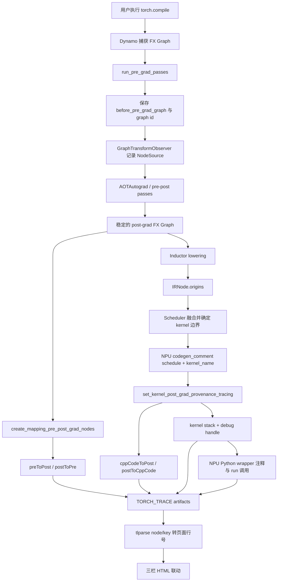
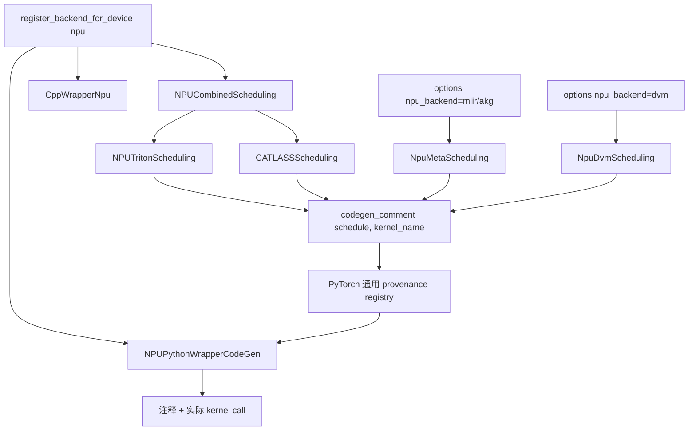
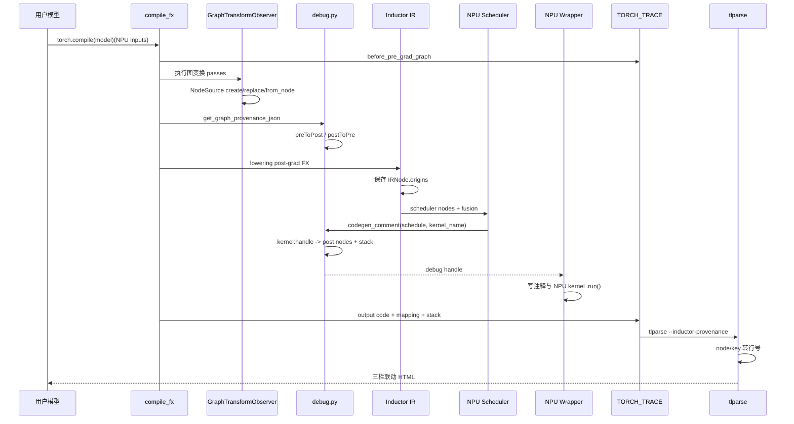

# PyTorch Feature 设计与实现分析

> 主题：TorchInductor Provenance Tracking 的 NPU 适配新手入门
>
> 工作目录：`/home/z50063656/Tracking`
>
> 基线日期：2026-08-20

本文面向第一次接触 `torch.compile`、TorchInductor、FX 图和昇腾 NPU codegen 的开发者。目标不是只教你运行一个命令，而是让你读完后能够回答以下问题：

1. Provenance Tracking 解决什么问题？
2. pre-grad、post-grad、Inductor IR、scheduler 和 kernel 分别是什么？
3. PyTorch 原生 provenance 数据如何一路流到 tlparse 三栏页面？
4. torch_npu 原来缺了什么，本次具体改了哪些源码？
5. 哪些工作已经通过真实 NPU 验证，哪些只是完成实现、仍待专项验证？
6. 如果继续开发，应从哪个文件、哪个函数开始？

## 模块设计目标与背景

### 1. 一句话理解这项工作

Provenance 的中文含义是“来源追踪”。TorchInductor Provenance Tracking 要建立这样一条链：

```text
用户模型源码
  -> 编译前 FX 节点
  -> 编译优化后的 FX 节点
  -> 最终生成的 kernel 调用
```

本项目的目标，是让这条原本在 PyTorch 中已经存在的通用链路也覆盖 torch_npu 自定义的 Triton Ascend、CATLASS、MLIR、DVM 等 codegen 路径。

### 2. 为什么仅看生成代码不够

假设用户模型是：

```python
def forward(self, x, y):
    added = x + y
    activated = torch.relu(added)
    return activated * 2.0
```

在 eager 模式中，可以粗略理解为三个 PyTorch 运算依次执行。但在 `torch.compile` 中，它们可能被捕获为 FX 图，经过多轮变换，再被融合成一个 kernel：

```text
add ──┐
relu ─┼──> triton_poi_fused_add_mul_relu_0
mul ──┘
```

只看 `output_code.py`，你只能看到一个 `triton_poi_fused_add_mul_relu_0.run(...)`，无法可靠回答它来自用户代码的哪几行。Provenance Tracking 保存的正是这层来源关系。

### 3. 新手需要先认识的术语

#### 3.1 `torch.compile`

`torch.compile` 是用户入口。它会让 TorchDynamo 捕获 Python 执行中的 Tensor 运算，形成 FX 图，然后交给 AOTAutograd 和 TorchInductor 编译。

本文不展开 Dynamo 的全部内部机制。对本功能来说，关键是：进入 Inductor 时，输入已经是一个可遍历、可变换的 `GraphModule`。

#### 3.2 FX Graph 与 FX Node

FX Graph 是 PyTorch 对计算过程的中间表示。图中的一条运算通常对应一个 `torch.fx.Node`，例如：

```text
add  = torch.ops.aten.add.Tensor(...)
relu = torch.ops.aten.relu.default(add)
mul  = torch.ops.aten.mul.Tensor(relu, 2.0)
```

节点名 `add`、`relu`、`mul` 会成为 provenance mapping 中的重要 key。

#### 3.3 pre-grad 与 post-grad

可以先用工程化的方式理解：

- pre-grad 图：靠近 Dynamo 捕获结果、也更靠近用户模型结构的图；
- post-grad 图：经过 AOTAutograd、分解和若干优化后，交给 Inductor lowering 的图。

二者不是简单的一一对应。一个 pre-grad 节点可能被拆成多个 post-grad 节点，一个 post-grad 节点也可能来自多轮替换。因此 PyTorch 使用递归来源链，而不是只保存一个字符串。

#### 3.4 Inductor IR、scheduler 与 codegen

post-grad FX 节点继续被 lowering 为 Inductor IR。scheduler 分析这些 IR 节点之间的依赖、融合条件和执行顺序，然后 codegen 生成后端 kernel 与 Python/C++ wrapper。

三者的职责可以这样区分：

| 层次 | 主要职责 | Provenance 关注点 |
| --- | --- | --- |
| FX Graph | 表示 PyTorch 算子图 | 节点经过 pass 后来自哪里 |
| Inductor IR | 表示 lowered 计算与 buffer | 哪些 post-grad FX 节点形成该 IR |
| Scheduler | 决定融合、顺序和 kernel 边界 | 哪些 scheduler nodes 进入同一个 kernel |
| Codegen/Wrapper | 生成 kernel 和调用代码 | 最终 kernel 名、调用位置和 debug handle |

#### 3.5 Triton Ascend 与 NPU kernel

Triton 是一种 kernel 编程和编译体系。`triton-ascend` 提供 Ascend 后端，使 Inductor 生成的 Triton kernel 能在昇腾 NPU 上编译和执行。

本项目使用 `triton-ascend 3.2.2`。普通 NPU demo 最终生成的是 `triton_poi_*` pointwise 融合 kernel。

#### 3.6 JIT、AOTInductor 与 wrapper

- JIT：运行 `torch.compile` 时即时编译，通常生成 Python `output_code.py`；
- AOTInductor：提前编译和打包，可能生成 AOT C++ wrapper，并携带 `kernel_information.json`。

这一区别会影响 tlparse HTML 中使用哪一组行号 mapping，后文会详细解释。

#### 3.7 Provenance 不是什么

Provenance 不是：

- 数值精度检查器；
- kernel 性能分析器；
- NPU 内存 dump；
- profiler 时间线本身；
- kernel 内部每条 Triton/C++ 指令的逐行来源映射。

它回答的是“这个生成物来自哪些图节点”。性能耗时要看 profiler，数值正确性要靠测试或精度工具。

### 4. 四组核心 mapping

PyTorch 原始 provenance artifact 使用四组双向关系：

| 字段 | 方向 | 回答的问题 |
| --- | --- | --- |
| `preToPost` | pre-grad -> post-grad | 用户附近的节点变成了哪些优化后节点？ |
| `postToPre` | post-grad -> pre-grad | 优化后节点来自哪个输入节点？ |
| `cppCodeToPost` | kernel key -> post-grad | 这个 kernel 包含哪些 post-grad 节点？ |
| `postToCppCode` | post-grad -> kernel key | 这个 post-grad 节点进入了哪个 kernel？ |

本轮真实 NPU 结果为：

```json
{
  "preToPost": {
    "added": ["add"],
    "activated": ["relu"],
    "mul": ["mul"]
  },
  "postToPre": {
    "add": ["added"],
    "relu": ["activated"],
    "mul": ["mul"]
  },
  "cppCodeToPost": {
    "triton_poi_fused_add_mul_relu_0:1": ["mul", "relu", "add"]
  },
  "postToCppCode": {
    "add": ["triton_poi_fused_add_mul_relu_0:1"],
    "relu": ["triton_poi_fused_add_mul_relu_0:1"],
    "mul": ["triton_poi_fused_add_mul_relu_0:1"]
  },
  "version": 2.0
}
```

注意：`cppCodeToPost` 是历史字段名，不代表只能保存 C++ kernel。NPU Triton、CATLASS、MLIR 和 DVM 仍使用该字段，不能另造 `npuCodeToPost`，否则会破坏 PyTorch/tlparse 既有协议。

### 5. debug handle 为什么必不可少

kernel key 不是只有 kernel 名，而是：

```text
triton_poi_fused_add_mul_relu_0:1
                                  └─ 唯一 debug handle
```

同一个生成 kernel 可能被调用多次。如果只使用函数名，tlparse 无法区分不同调用。PyTorch 每调用一次 `set_kernel_post_grad_provenance_tracing()` 就递增 handle，并让以下三类产物使用同一个 key：

1. node mapping JSON；
2. kernel stack JSON；
3. wrapper 中的 `[Provenance debug handles]` 注释。

源码证据：`src/pytorch/torch/_inductor/debug.py::set_kernel_post_grad_provenance_tracing()`。

### 6. 静态 provenance 与 profiler timeline 的区别

```text
静态 provenance：这个 kernel 来自哪些节点？
Profiler timeline：这个 kernel 在什么时候运行、耗时多久？
```

静态 mapping 大体与设备无关，因此 NPU 可以复用 PyTorch 原协议。timeline 后处理则依赖 trace schema：上游实现面向 CUDA/Kineto，而 NPU 使用 Ascend/CANN 的 flow、category 和导出格式，所以它是独立的第二阶段工作。

### 7. 当前工作状态总览

#### 7.1 已端到端完成

| 项目 | 状态 | 证据 |
| --- | --- | --- |
| Tracking 隔离环境 | 完成 | PyTorch、torch_npu、Triton Ascend、CANN 可共同工作 |
| CPU Inductor 基线 | 完成 | CPU demo 与 tlparse 三栏通过 |
| NPU Inductor 基线 | 完成 | Ascend 910B2 上真实 kernel 执行成功 |
| 修改前缺口复现 | 完成 | 图级 mapping 非空，kernel mapping 为空 |
| 普通 NPU Triton provenance | 完成 | `triton_*:1` 与 add/relu/mul 双向关联 |
| torch_npu editable 构建 | 完成 | 运行路径指向 `build/packages/torch_npu` |
| 真实 NPU 回归 | 完成 | 最新三组契约共 33 项，全部 `OK` |
| NPU demo | 完成 | checksum `9206.284180` |
| tlparse 0.4.8 | 完成 | `Stats { ok: 139 }`，三栏行号 mapping 非空 |
| NPU FlexAttention forward template | 完成 | 真实 910B2 上 template key 映射到 3 个 post-grad 节点 |
| FlexAttention dK/dV wrapper 契约 | 完成 | 四个运行时候选 handle 均紧邻各自 `.run()` |
| template tlparse 0.4.8 | 完成 | `Stats { ok: 282 }`，`pyCodeToPost={"608":[6,4,5]}` |
| NPU cache miss/hit | 完成 | hit 事件明确；mapping/stack 与 miss 逐字节一致 |
| 调研与演示文档 | 完成 | 本文末尾列出全部入口 |

#### 7.2 已实现代码、但仍待专项实机覆盖

| 路径 | 已完成的代码工作 | 尚缺的验证 |
| --- | --- | --- |
| combo kernel | 使用内部 `snodes` 建立映射 | 多输出 combo E2E |
| FlexAttention dK/dV | 四分支静态契约及默认哨兵限界已通过 | BishengIR 长编译解除后的 backward 数值/provenance E2E |
| CATLASS | 在真实 kernel call 前调用 provenance hook | CATLASS 依赖环境下 E2E |
| Meta/MLIR/AKG | `NpuMetaScheduling` 传真实 kernel 名 | 不同 `npu_backend` 参数化测试 |
| DVM | 普通继承路径和 template 路径接入 | DVM 普通/template E2E |
| multistream extern | 对齐上游函数签名和 timeline wrapper | 多流 extern 执行验证 |

默认 `BlockMask=None` backward 已进入真实设备调查，而非停留在静态计划阶段。反向 FX
图和 dK/dV 候选均已生成；原先进入 MLIR 的 `1073741824`/`8388608` 已被归一化为
真实 tile 范围。剩余阻塞是 `bishengir-compile` 对修复后 dK/dV kernel 的长编译，
11 分 48 秒仍未返回，因此尚无 backward `output_code.py`、mapping 或 tlparse HTML。

#### 7.3 尚待设计或实现完整方案

| 项目 | 当前结论 |
| --- | --- |
| cache hit provenance | 已通过跨进程真实 NPU 回归；hit 从 trace 重放完整 artifact |
| AOTI `kernel_information.json` | 上游机制存在，尚未完成 NPU 打包/加载 E2E |
| Ascend profiler timeline stack 回填 | 不能直接套用 CUDA/Kineto，需要 NPU 专用 adapter |

### 8. 当前 Git 和运行时状态

canonical 源码仓位于：

```text
/home/z50063656/Tracking/src/torch_npu
```

当前 P1 十二文件改动已经安全保存在：

```text
stash@{0}: codex: NPU provenance P1 backward compiler investigation
commit: 39677751f7cf15fce81903a58fc7adafcee81c5e
```

该 P1 stash 已 apply 回工作树，所以九个实现文件和三个测试文件在源码工作树中再次呈
修改/未跟踪状态；stash 本身仍保留。上一默认 BlockMask forward checkpoint 为
`stash@{1}`，combo/cache checkpoint 为 `stash@{2}`，template checkpoint 为
`stash@{3}`，P0 副本当前为 `stash@{4}`。已经验证的 editable
运行副本位于：

```text
/home/z50063656/Tracking/src/torch_npu/build/packages/torch_npu
```

因此：

- 只查看已有报告或重跑外部 demo：无需修改 Git 状态；
- 阅读当前改动：使用 `git diff`，测试文件是 untracked，需单独打开；
- P1 安全副本可用 `git stash show -p --include-untracked 'stash@{0}'` 查看；
- 不要再次直接 apply 同一 stash，以免与当前已恢复修改冲突；
- 不要直接把 `build/packages` 当成 canonical 开发源码。

工作树还有大量构建生成文件和第三方子模块状态。不要执行 `git clean`、`git reset --hard` 或整体回退。

### 9. 为什么本轮不需要重新编译 PyTorch

本轮修改集中在 torch_npu 的 Python codegen 和 wrapper 层，PyTorch 当前精确提交已经具备 provenance 通用框架。因此采用：

```text
保持现有 PyTorch 2.14 editable 构建
       +
重新构建/安装修改后的 torch_npu
```

只有修改 PyTorch C++、生成头文件或 PyTorch 自身代码不在当前运行构建中时，才需要重新构建 PyTorch。建立未修改基线时 wheel 足够；验证本次 torch_npu 修改时必须让运行环境加载修改后的 torch_npu 源码构建。

## 整体设计架构

### 1. 核心组件说明

| 组件 | 职责 | 源码位置 |
| --- | --- | --- |
| 配置入口 | 控制 provenance level 和 timeline 开关 | `src/pytorch/torch/_inductor/config.py::trace.provenance_tracking_level` |
| pre-grad 入口 | 保存输入图、graph id 和节点 stack | `src/pytorch/torch/_inductor/compile_fx.py::run_pre_grad_passes()` |
| FX 来源模型 | 保存节点名、target、graph id、pass、动作和递归来源 | `src/pytorch/torch/fx/traceback.py::NodeSource` |
| Pass observer | 注册 create/erase/replace/deepcopy hook | `src/pytorch/torch/fx/passes/graph_transform_observer.py::GraphTransformObserver` |
| 图级 mapping | 递归展开来源链，生成 pre/post 双向关系 | `src/pytorch/torch/_inductor/debug.py::create_mapping_pre_post_grad_nodes()` |
| IR 来源 | 把当前 FX origins 固化进新 IR 节点 | `src/pytorch/torch/_inductor/ir.py::IRNode.__post_init__()` |
| kernel mapping | 聚合 scheduler/IR origins、stack 和 handle | `src/pytorch/torch/_inductor/debug.py::set_kernel_post_grad_provenance_tracing()` |
| artifact 输出 | 合并 mapping，写入 debug 和 structured trace | `src/pytorch/torch/_inductor/debug.py::dump_inductor_provenance_info()` |
| NPU backend 注册 | 注册 NPU scheduling 与 wrapper | `src/torch_npu/torch_npu/_inductor/__init__.py::_inductor_register_backend_for_device()` |
| NPU 组合调度 | 在 Triton 与 CATLASS 间选择 | `src/torch_npu/torch_npu/_inductor/codegen/npu_combined_scheduling.py::NPUCombinedScheduling` |
| NPU Triton 接入 | 普通/template/combo/Flex kernel hook | `src/torch_npu/torch_npu/_inductor/codegen/scheduling.py::NPUTritonScheduling` |
| NPU wrapper 接入 | 输出分支级 handle，处理 multistream extern | `src/torch_npu/torch_npu/_inductor/codegen/wrapper.py::NPUPythonWrapperCodeGen` |
| tlparse 转换 | 把 node/key 映射转换为页面行号 | Cargo registry `tlparse-0.4.8/src/lib.rs::convert_node_mappings_to_line_numbers()` |
| tlparse 联动 | 根据点击栏和代码类型选择行号映射 | Cargo registry `tlparse-0.4.8/src/provenance.js::findCorrespondingLines()` |

### 2. 整体执行流程



### 3. 为什么设计成“两段来源链”

Provenance 没有从用户源码直接跳到 kernel，而是拆成：

```text
第一段：pre-grad FX <-> post-grad FX
第二段：post-grad FX <-> generated kernel
```

原因是两个阶段掌握的信息不同：

- FX pass 最清楚“一个图节点怎样被创建、替换或删除”；
- scheduler/codegen 最清楚“哪些 lowered 节点被融合进哪个最终 kernel”。

把两段分开后，不同设备后端只需在“最终 kernel 名已确定”的边界调用通用 hook，不必重新实现 FX 来源追踪算法。这也是 NPU 适配的核心设计原则。

### 4. NPU backend 内部架构



默认 NPU backend 通过 `src/torch_npu/torch_npu/_inductor/__init__.py::_inductor_register_backend_for_device()` 注册：

```python
register_backend_for_device(
    "npu", NPUCombinedScheduling, NPUPythonWrapperCodeGen, CppWrapperNpu
)
```

`NPUCombinedScheduling.choose_node_backend()` 再根据节点是否为 CATLASS template，选择 CATLASS 或 NPU Triton。MLIR/AKG/DVM 有各自注册和配置入口，但最终都应遵循相同 provenance hook 契约。

### 5. 核心数据结构

#### 5.1 `NodeSource`

`src/pytorch/torch/fx/traceback.py::NodeSource` 保存：

- `node_info.name`：节点名；
- `node_info.target`：调用目标；
- `node_info.graph_id`：所属 graph 的身份；
- `pass_name`：发生变换的 pass；
- `action`：`CREATE` 或 `REPLACE`；
- `from_node`：递归的上一层来源。

其中 `graph_id` 是找到原始 pre-grad 边界的关键。`create_mapping_pre_post_grad_nodes()` 会递归遍历 `from_node`，只把 graph id 匹配 `_pre_grad_graph_id` 的节点纳入最终 pre/post mapping。

#### 5.2 `IRNode.origins`

`src/pytorch/torch/_inductor/ir.py::IRNode.__post_init__()` 把当前上下文的 FX origins 保存到 IR 节点：

```python
origins = OrderedSet(self._current_origins)
self._post_init_setattr("origins", origins)
```

后续 scheduler 融合多个 IR 节点时，这些 origins 就是 kernel 对应哪些 post-grad FX 节点的证据。

#### 5.3 provenance 全局 registry

`src/pytorch/torch/_inductor/debug.py` 维护本次编译的：

- pre-grad graph id；
- post/pre mapping；
- kernel -> post-grad mapping；
- pre-grad stack；
- kernel stack；
- debug handle 计数；
- extern kernel metadata。

`reset_provenance_globals()` 在编译上下文进入/退出时隔离这些全局状态，避免一次编译的数据泄漏到另一次编译。

### 6. 产物架构

一次启用 provenance 的编译会产生或向 structured trace 发出：

| Artifact | 内容 | tlparse 用途 |
| --- | --- | --- |
| `before_pre_grad_graph` | 输入/pre-grad 图 | 左栏 |
| `inductor_post_grad_graph` | post-grad 图 | 中栏 |
| `inductor_output_code` | JIT Python wrapper | 右栏 Python 部分 |
| `inductor_aot_wrapper_code` | AOT C++ wrapper | 右栏 C++ 部分 |
| `inductor_provenance_tracking_node_mappings` | 四组 node/kernel mapping | 关联依据 |
| `inductor_provenance_tracking_kernel_stack_traces` | kernel -> 用户源码 stack | readable stack 页面 |

PyTorch 发出 artifact 的源码入口是 `src/pytorch/torch/_inductor/compile_fx.py::_compile_fx_inner()`。

## 入口分析

### 1. 环境入口

项目环境通过以下脚本激活：

```bash
source /home/z50063656/Tracking/activate_tracking.sh
```

当前运行路径为：

```text
Python    /home/z50063656/envs/Tracking/bin/python
torch     /home/z50063656/Tracking/src/pytorch/torch/__init__.py
torch_npu /home/z50063656/Tracking/src/torch_npu/build/packages/torch_npu/__init__.py
triton    /home/z50063656/envs/Tracking/lib/python3.11/site-packages/triton/__init__.py
```

所有测试必须从 `/home/z50063656/tmp` 启动。不要在 torch_npu 源码目录内导入 `torch`，否则可能受到源码树级联 import 污染。

### 2. 用户配置入口

源码位置：`src/pytorch/torch/_inductor/config.py::trace.provenance_tracking_level`。

| 环境变量 | 含义 |
| --- | --- |
| `INDUCTOR_PROVENANCE=0` | 关闭，默认 |
| `INDUCTOR_PROVENANCE=1` | normal，完整图变换 observer 与 stack 缓存，主验收模式 |
| `INDUCTOR_PROVENANCE=2` | basic，保留较轻量能力，但不会因 provenance 单独激活全部 graph transform observer |
| `TORCH_COMPILE_DEBUG=1` | 未显式设置 provenance 时，兼容地把 level 至少设为 1 |
| `TORCH_COMPILE_DEBUG_EXTEND=1` | 启用 timeline 方向能力，并把有效 level 至少提升为 1 |
| `TORCH_COMPILE_DEBUG_MAX_EVENTS` | timeline 后处理最大事件数，默认 500000 |

主路径建议使用 `INDUCTOR_PROVENANCE=1`。level 1 与 level 2 并非完全等价：

- `src/pytorch/torch/_inductor/compile_fx.py::run_pre_grad_passes()` 只在 level 1 缓存 pre-grad stack；
- `src/pytorch/torch/fx/passes/graph_transform_observer.py::GraphTransformObserver.__init__()` 只在 level 1 因 provenance 激活 observer。

### 3. 最小 NPU 使用示例

现有脚本：[npu_provenance_demo.py](../examples/npu_provenance_demo.py)。

核心模型：

```python
class ProvenanceDemo(torch.nn.Module):
    def forward(self, x, y):
        added = x + y
        activated = torch.relu(added)
        return activated * 2.0
```

从正确目录运行：

```bash
cd /home/z50063656/tmp
source /home/z50063656/Tracking/activate_tracking.sh

# 先执行 npu-smi info，按当时状态选择空闲物理设备。
# 5 是 2026-08-20 最终验证时的示例，不是永久保留设备。
export ASCEND_RT_VISIBLE_DEVICES=5
export TORCH_DEVICE_BACKEND_AUTOLOAD=0
export INDUCTOR_PROVENANCE=1
export TORCH_COMPILE_DEBUG=1
export TORCHINDUCTOR_UNIQUE_KERNEL_NAMES=1
export TORCHINDUCTOR_FORCE_DISABLE_CACHES=1

RUN_DIR=$(mktemp -d /home/z50063656/tmp/tracking-npu-provenance.XXXXXX)
export TORCH_TRACE="$RUN_DIR/trace"
export TORCH_COMPILE_DEBUG_DIR="$RUN_DIR/debug"
export TORCHINDUCTOR_CACHE_DIR="$RUN_DIR/cache"

python /home/z50063656/Tracking/npu_provenance_demo.py
```

为什么首次验证要禁用 cache：旧 cache 可能来自未适配构建，导致你误以为当前代码没有生成 mapping。等最小 miss 路径确认后，再单独设计 cache hit 回归。

### 4. tlparse 入口

本机已经安装：

```text
cargo 1.97.1
rustc 1.97.1
tlparse 0.4.8
```

使用方式：

```bash
source /home/z50063656/.cargo/env
TRACE_FILE=$(find "$RUN_DIR/trace" -maxdepth 1 -name '*.log' -print -quit)

tlparse "$TRACE_FILE" \
  --inductor-provenance \
  --no-browser \
  -o "$RUN_DIR/tlparse"
```

必须把具体 `.log` 文件传给 tlparse。对本功能而言，只把 trace 目录交给普通 parse 流程可能不会生成 provenance highlighter。

### 5. 如何阅读四个 HTML

一次 trace 可能对应多个 compile id 或占位 compile 目录，因此 tlparse 会生成多个 provenance 页面。最重要的通常是带具体 compile id 的页面，例如：

```text
provenance_tracking_-_0_0_0.html
```

本次可直接打开：

- [tlparse 总入口](./npu_provenance_verified_20260820/tlparse/index.html)
- [NPU 三栏页面](./npu_provenance_verified_20260820/tlparse/provenance_tracking_-_0_0_0.html)
- [kernel stack readable 页面](./npu_provenance_verified_20260820/tlparse/-_0_0_0/inductor_provenance_tracking_kernel_stack_traces_15_readable.html)

三栏含义：

| 栏 | 内容 | 本例 |
| --- | --- | --- |
| 左 | pre-grad FX 图 | `added`、`activated`、`mul` |
| 中 | post-grad FX 图 | `add`、`relu`、`mul` |
| 右 | 生成的 Python/C++ wrapper | NPU Triton `.run()` |

点击右栏第 132 行 `triton_poi_fused_add_mul_relu_0.run(...)`，中栏三个节点应同时高亮。

### 6. 为什么 HTML 的 cpp 行号字段为空仍然正常

这是本项目中最容易误判的点。

PyTorch 原始 artifact 的 `cppCodeToPost` 是历史通用字段，里面确实有 NPU Triton kernel。但 tlparse 将 node/key 转为页面行号后，会按代码载体拆成：

| HTML 行号字段 | 载体 |
| --- | --- |
| `pyCodeToPost` / `postToPyCode` | JIT Python `inductor_output_code` |
| `cppCodeToPost` / `postToCppCode` | AOT C++ `inductor_aot_wrapper_code` |

本轮页面实际是：

```json
{
  "pyCodeToPost": {"132": [10, 7, 4]},
  "postToPyCode": {"10": [132], "7": [132], "4": [132]},
  "cppCodeToPost": {},
  "postToCppCode": {}
}
```

源码证据：

- Cargo registry `tlparse-0.4.8/src/lib.rs::convert_node_mappings_to_line_numbers()` 分别构造 Python 与 C++ kernel 行号表；
- Cargo registry `tlparse-0.4.8/src/provenance.js::findCorrespondingLines()` 在 `codeData` 存在时读取 `pyCodeToPost` 和 `postToPyCode`。

因此当前不需要修改 tlparse，也不需要为了填充 AOT C++ 字段而移动 NPU 注释。

### 7. 回归测试入口

最终测试当前位于工作树，并保存在 P1 `stash@{0}`：

```text
test/_inductor/test_provenance_tracing.py
```

直接回到测试目录运行：

```bash
cd /home/z50063656/tmp
source /home/z50063656/Tracking/activate_tracking.sh
export ASCEND_RT_VISIBLE_DEVICES=5  # 运行前重新确认空闲设备
export TORCH_DEVICE_BACKEND_AUTOLOAD=0

python /home/z50063656/Tracking/src/torch_npu/test/_inductor/test_provenance_tracing.py
```

五个 provenance 用例分别验证：

1. NPU extern wrapper override 与 PyTorch 上游参数签名一致；
2. 带缩进的分支级 debug handle 注释生成正确；
3. FlexAttention dK/dV 四个运行时候选各自获得正确 handle；
4. combo kernel 使用内部 scheduler nodes，并在真实 call 前记录 provenance；
5. 真实 NPU Triton 融合 kernel 与 `add/relu/mul` 双向 mapping 正确，compiled 输出等于 eager 输出。

另外还应执行 `test_lowering_device_dispatch.py` 的 18 项和
`test_scheduling_contract.py` 的 10 项；最新合计为 33 项，全部通过。backward 的真实
探针不是这 33 项契约的一部分，目前仍受 BishengIR 长编译阻塞。

源码证据：`src/torch_npu/test/_inductor/test_provenance_tracing.py::TestNPUInductorProvenance`。

### 8. 何时需要重新构建 torch_npu

如果你只阅读已有 HTML，不需要构建。如果你恢复 stash 后继续修改 canonical source，就应重新执行 editable build，让 `build/packages/torch_npu` 更新。

本项目为构建期包路径冲突准备了 shim：

```text
/home/z50063656/Tracking/build_shims/torch_npu_tools
```

建议从 `/home/z50063656/tmp` 发起构建：

```bash
cd /home/z50063656/tmp
source /home/z50063656/Tracking/activate_tracking.sh

export PYTHONPATH=/home/z50063656/Tracking/build_shims/torch_npu_tools${PYTHONPATH:+:$PYTHONPATH}
export TORCH_NPU_BUILD_SHIM=1
export TORCH_DEVICE_BACKEND_AUTOLOAD=0
export MAX_JOBS=8

python -m pip install -e /home/z50063656/Tracking/src/torch_npu \
  -v --no-build-isolation
```

构建完成后，务必从 `/home/z50063656/tmp` 检查 `torch_npu.__file__` 是否指向 `build/packages/torch_npu/__init__.py`，不要在源码树目录内执行 import 检查。

## 完整调用链分析

### 阶段 0：NPU backend 注册

函数：`_inductor_register_backend_for_device()`

文件：`src/torch_npu/torch_npu/_inductor/__init__.py`

输入：设备名 `npu` 对应的 backend 注册时机。

输出：Inductor 获得 NPU scheduler、Python wrapper 和 C++ wrapper 类型。

关键逻辑：

```python
register_backend_for_device(
    "npu", NPUCombinedScheduling, NPUPythonWrapperCodeGen, CppWrapperNpu
)
```

为什么会走到这里：`import torch_npu` 注册 NPU 设备和 Inductor 后端；后续 `torch.compile` 处理 NPU Tensor 时选择这些类型。

修改行为应看哪里：默认 NPU Triton/CATLASS 选择看 `NPUCombinedScheduling`；wrapper 行为看 `NPUPythonWrapperCodeGen`。

↓

### 阶段 1：用户调用 `torch.compile`

入口示例：

```python
compiled = torch.compile(model, backend="inductor", fullgraph=True)
actual = compiled(x, y)
```

输入：Python module/function 与 NPU Tensor。

输出：Dynamo 捕获的 FX 图进入 Inductor。

状态变化：普通 Python/Tensor 执行被转换为可编译 graph；本文从 Inductor 的 pre-grad 入口继续追踪。

↓

### 阶段 2：保存 pre-grad 图和边界 id

函数：`run_pre_grad_passes()`

文件：`src/pytorch/torch/_inductor/compile_fx.py`

输入：pre-grad `GraphModule` 和 example inputs。

输出：执行完 pre-grad passes 的 `GraphModule`。

关键状态变化：

1. 发出 `before_pre_grad_graph` artifact；
2. 保存 `_pre_grad_graph_id = id(model_.graph)`；
3. level 1 下把节点 stack 保存进 `_inductor_pre_grad_node_stack_trace`；
4. 执行 recursive pre-grad passes；
5. 发出 `after_pre_grad_graph`。

为什么 graph id 重要：后续递归 `NodeSource` 可能跨越多轮复制和变换，只有 graph id 能识别哪一层是本次最初 pre-grad 图。

↓

### 阶段 3：GraphTransformObserver 记录节点来源

类：`GraphTransformObserver`

文件：`src/pytorch/torch/fx/passes/graph_transform_observer.py`

输入：一个 `GraphModule`、pass name 和 subsystem。

输出：pass 执行结果，同时节点 metadata 中增加来源信息。

关键状态变化：`__enter__()` 注册四类 hook：

```text
create node
erase node
replace node
deepcopy graph
```

`src/pytorch/torch/fx/traceback.py::set_current_meta()` 会把当前节点包装为 `NodeSource(..., CREATE)` 并写入新节点的 `meta["from_node"]`。replace hook 则保存替换关系。

为什么这样设计：pass 作者可以继续使用标准 FX `create_node()`、`replace_all_uses_with()` 等操作，不必为每个 NPU pass 手工维护 provenance JSON。

修改行为应看哪里：如果某个自定义 pass 的节点来源丢失，先检查它是否在 observer 上下文中、是否绕开标准 FX hook，而不是直接在最终 JSON 中补字符串。

↓

### 阶段 4：生成 pre-grad/post-grad 双向 mapping

函数：`create_mapping_pre_post_grad_nodes()`

文件：`src/pytorch/torch/_inductor/debug.py`

调用位置：`src/pytorch/torch/_inductor/compile_fx.py::_compile_fx_inner()`。

输入：

- `_pre_grad_graph_id`；
- `torch.fx.traceback.get_graph_provenance_json(gm.graph)` 产生的递归 JSON。

输出：

```json
{
  "preToPost": {...},
  "postToPre": {...}
}
```

核心算法：对每个 post-grad 节点递归遍历 `from_node`，发现 `graph_id == pre_grad_graph_id` 的来源时，同时写入正向和反向 mapping。

状态变化：结果保存到 `_inductor_post_to_pre_grad_nodes`，供后续 stack 回溯和最终 dump 使用。

↓

### 阶段 5：post-grad FX lowering 为 Inductor IR

函数：`IRNode.__post_init__()`

文件：`src/pytorch/torch/_inductor/ir.py`

输入：当前 lowering 上下文中的 FX origins。

输出：带 `origins` 的 IR 节点。

关键状态变化：

```python
origins = OrderedSet(self._current_origins)
self._post_init_setattr("origins", origins)
```

为什么这样设计：scheduler 看到的是 Inductor IR/scheduler node，不再直接处理原始 FX 图；`origins` 是连接两层表示的桥梁。

`IRNode.get_stack_traces()` 先尝试使用 origin 节点自己的 stack；若缺失，则通过 `postToPre` 找到 pre-grad 节点，再查 level 1 缓存的 stack。

↓

### 阶段 6：scheduler 融合并确定最终 kernel 名

默认 NPU 调度类：`NPUTritonScheduling`

文件：`src/torch_npu/torch_npu/_inductor/codegen/scheduling.py`

普通 kernel 路径的关键顺序是：

```python
kernel_name, src_code = self.define_kernel(...)
final_kernel.kernel_name = kernel_name
...
self.codegen_comment(node_schedule, final_kernel.kernel_name)
final_kernel.call_kernel(...)
```

输入：scheduler 选出的 `node_schedule`。

输出：生成 kernel 定义和 wrapper kernel call。

本次修复点：原代码只调用 `self.codegen_comment(node_schedule)`，能写普通 source-node 注释，却因为缺少 `kernel_name` 而不会触发 kernel provenance。现在传入最终真实名称。

源码契约来自 `src/pytorch/torch/_inductor/codegen/triton.py::TritonScheduling.codegen_comment()`：只有 `kernel_name` 为真时才调用通用追踪函数。

↓

### 阶段 7：建立 kernel/post-grad mapping 与 stack

函数：`set_kernel_post_grad_provenance_tracing()`

文件：`src/pytorch/torch/_inductor/debug.py`

输入：

- `node_schedule`：本 kernel 包含的 scheduler nodes；
- `kernel_name`：最终会出现在 wrapper call 中的真实名称；
- `is_extern`：是否为 extern kernel。

输出：唯一整数 debug handle，或在功能关闭时返回 `None`。

关键状态变化：

1. `_inductor_kernel_provenance_debug_handle += 1`；
2. 形成 `<kernel_name>:<handle>`；
3. 从 scheduler node 对应 IR 的 `origins` 聚合 post-grad 节点名；
4. 写入 kernel -> post-grad registry；
5. 收集用户源码 stack；
6. extern 路径额外保存 semantic key、shape、dtype 等 metadata。

为什么要在 kernel 名确定后调用：如果过早调用，可能记录 autotune 候选、临时名或根本不会被执行的 kernel；如果过晚，wrapper 已经错过可放置 handle 注释的位置。

↓

### 阶段 8：wrapper 输出 handle 注释和真实调用

通用函数：`src/pytorch/torch/_inductor/codegen/wrapper.py::PythonWrapperCodegen.write_provenance_debug_handle()`。

输出格式：

```python
# [Provenance debug handles] triton_poi_fused_add_mul_relu_0:1
triton_poi_fused_add_mul_relu_0.run(...)
```

tlparse 先通过精确的 `kernel_name:handle` 找到注释，再定位后续包含纯 kernel 名的调用行。注释与调用必须保持在同一逻辑分支附近。

FlexAttention dK/dV 是特殊情况：运行时会在 legacy、tasklist、tasklist-no-split、reduce 四个候选调用间分派。不能在调度函数末尾连续写四条注释，否则注释与真实分支调用错位。

本次实现：

- `NPUTritonScheduling.codegen_flex_attention_dkdv_template()` 为四个候选分别调用通用追踪函数；
- `NPUPythonWrapperCodeGen.generate_flex_attention_dkdv_dispatch()` 接收 handle 字典；
- `_write_indented_provenance_debug_handle()` 在每个 `.run()` 的实际缩进分支内写注释。

源码位置：

- `src/torch_npu/torch_npu/_inductor/codegen/scheduling.py::NPUTritonScheduling.codegen_flex_attention_dkdv_template()`；
- `src/torch_npu/torch_npu/_inductor/codegen/wrapper.py::NPUPythonWrapperCodeGen.generate_flex_attention_dkdv_dispatch()`。

↓

### 阶段 9：输出 structured trace artifact

函数：`dump_inductor_provenance_info()`

文件：`src/pytorch/torch/_inductor/debug.py`

调用位置：`src/pytorch/torch/_inductor/compile_fx.py::_compile_fx_inner()`。

输入：图级 registry、kernel registry 和 stack registry。

输出：

- `inductor_provenance_tracking_node_mappings`；
- `inductor_provenance_tracking_kernel_stack_traces`；
- debug 模式下对应 JSON 文件。

mapping schema 当前写入 `version: 2.0`。如果未来修改 schema，必须更新版本，让 tlparse 能区分格式。

↓

### 阶段 10：tlparse 转换为三栏行号

函数：`convert_node_mappings_to_line_numbers()`

文件：Cargo registry `tlparse-0.4.8/src/lib.rs`

输入：

- node mapping JSON；
- pre-grad graph 文本；
- post-grad graph 文本；
- JIT Python output code；
- AOT C++ wrapper code。

输出：面向 HTML 的行号 mapping。

核心步骤：

1. `build_node_to_lines_map()` 把 FX 节点名转成图文本行号；
2. `build_python_kernel_to_lines_map()` 在 Python wrapper 中查 handle 和后续 kernel call；
3. `build_cpp_kernel_to_lines_map()` 在 AOT C++ wrapper 中做同类查找；
4. 分别生成 `pyCodeToPost` 和 `cppCodeToPost` 行号关系；
5. JavaScript 根据当前展示的是 Python 还是 C++ 选择对应关系。

本轮真实结果：右栏第 132 行映射到中栏第 10、7、4 行。

### 完整调用链总结



## 扩展点分析

### 1. 原始 provenance 六个目标文件分别改了什么

| 文件 | 主要修改 | 设计理由 |
| --- | --- | --- |
| `torch_npu/_inductor/codegen/scheduling.py` | 普通/template/combo 传真实 kernel 名；Flex 四候选创建 handle | 覆盖 NPU Triton 自定义 codegen 边界 |
| `torch_npu/_inductor/codegen/wrapper.py` | 分支内缩进 handle；extern override 签名与 timeline wrapper 对齐 | 保证注释紧邻真实调用，避免上游签名漂移 |
| `torch_npu/_inductor/codegen/catlass/catlass_scheduling.py` | CATLASS call 前调用 `codegen_comment(..., kernel_name)` | 模仿上游 CUTLASS 契约，避开 benchmark-only 路径 |
| `torch_npu/_inductor/.../meta_kernel.py` | Meta/MLIR/AKG 普通融合传最终 kernel 名 | 基类修复覆盖继承后端 |
| `torch_npu/_inductor/dvm/mlir_fusion.py` | DVM template 传真实 kernel 名 | 补齐未走 Meta 普通路径的 template |
| `test/_inductor/test_provenance_tracing.py` | 签名、缩进注释、真实 NPU mapping 三类测试 | 同时覆盖静态契约与端到端结果 |

在此基础上，默认 `BlockMask=None` 兼容链又修改了 `lowering.py`、
`kernel/flex_attention.py`、`kernel/flexattention_template.py`、
`codegen/npu_combined_scheduling.py`，并增加两个对应契约测试文件。backward 调查又在
FlexAttention lowering/template 与 scheduler 契约中增加稀疏倍数限界。当前 P1 暂存
统计为 12 个文件、457 行新增、23 行删除。源码当前已恢复到工作树，同时保存在
`stash@{0}`。

### 2. 各 codegen 路径的修改要点

#### 2.1 普通 NPU Triton

修改位置：`NPUTritonScheduling.codegen_node_schedule()` 附近。

正确模式：

```python
self.codegen_comment(node_schedule, final_kernel.kernel_name)
final_kernel.call_kernel(...)
```

不要只传 `node_schedule`，否则只能生成普通注释，不能建立 kernel mapping。

#### 2.2 template kernel

修改位置：`NPUTritonScheduling.codegen_template()`。

正确模式是在 `define_kernel()` 得到名称后、`call_kernel()` 前调用 hook。benchmark-only/只生成 source 的路径不能污染最终 provenance registry。

#### 2.3 combo kernel

修改位置：`NPUTritonScheduling.codegen_combo_kernel()`。

应使用：

```python
self.codegen_comment(combo_kernel_node.snodes, kernel_name)
```

原因：combo wrapper node 本身不是完整的真实 scheduler node 集合；`snodes` 才能提供内部 kernel 的 origins。

#### 2.4 FlexAttention dK/dV

这是最复杂的适配点。四个候选 kernel 都可能出现在生成 wrapper 中，但运行时只执行符合条件的分支。正确扩展模式是：

1. 每个候选 kernel 单独建立 mapping/handle；
2. handle 作为数据传给 wrapper；
3. wrapper 在对应 `if/else` 分支内、实际 `.run()` 前写注释；
4. 缩进必须与调用一致。

#### 2.5 CATLASS

修改位置：`CATLASSScheduling.codegen_template()`。

hook 只放在 `not only_src_code` 的最终代码生成路径。autotune benchmark 只需要生成候选 source，不应产生“看起来被执行”的 provenance handle。

#### 2.6 MLIR/AKG/DVM

`NpuMetaScheduling` 是 MLIR/AKG 等后端的共享扩展点。修复基类普通融合可同时覆盖继承者。DVM template 有独立实现，因此仍需单独补 hook。

#### 2.7 multistream extern

PyTorch 上游 `_generate_extern_kernel_out_helper()` 的末参数是 `stack_traces`，旧 NPU override 把它当成 `debug_handle`，存在接口漂移。本次改为：

```python
stack_traces: OrderedSet[str] | None = None
```

非多流路径继续透传给 `super()`；多流 timeline 模式使用 `define_extern_kernel_profile_wrapper()`。测试通过 `inspect.signature()` 防止未来升级再次静默漂移。

### 3. 可扩展点

| 扩展目标 | 修改位置 | 推荐方式 |
| --- | --- | --- |
| 新增 NPU scheduler/codegen 路径 | 对应 scheduling 的最终 call 前 | 调用 `codegen_comment(real_schedule, real_kernel_name)` |
| 新增运行时多分支 kernel | scheduling + wrapper | 分别建立 handle，并传到实际分支内输出 |
| 新增 extern/aclnn provenance | 优先复用 `ExternKernel.codegen_comment()` | 不在 Python 层重复构造 mapping |
| 新增 graph pass 来源追踪 | FX pass/observer 上下文 | 复用标准 create/replace hook |
| 增加 AOTI metadata | PyTorch `create_kernel_information_json()` 与打包测试 | 保持 schema 和 key 一致 |
| 增加 NPU timeline | torch_npu profiler adapter | 解析 Ascend flow，不直接假定 CUDA event |
| 支持新 tlparse 代码载体 | tlparse 行号转换 | 先用真实 log 证明现有 Python/C++ 查找失败 |

### 4. 如何为一个新 NPU codegen 路径接入 provenance

推荐检查清单：

1. 找到最终 kernel 名第一次稳定出现的位置；
2. 找到最终会执行的 scheduler nodes，而不是临时 wrapper node；
3. 在实际 kernel call 前调用统一 hook；
4. 确保 handle 注释和调用处于同一控制流分支；
5. 不在 autotune/benchmark-only 路径记录最终 mapping；
6. 加一个最小模型让该路径真正被选择；
7. 断言 compiled 与 eager 数值一致；
8. 断言 mapping 四组关系双向一致；
9. 断言 mapping key、wrapper 注释和 stack key 完全相同；
10. 用 tlparse 验证 node/key 最终能转换为页面行号。

### 5. 测试矩阵与待完成路线

| 优先级 | 用例 | 核心断言 |
| --- | --- | --- |
| P0 已完成 | 普通 add/relu/mul Triton 融合 | kernel key、双向 mapping、stack、数值、HTML |
| P1 已完成 | FlexAttention forward template | template kernel 对应 flex_attention/score/mask 节点及 HTML 行号 |
| P1 已完成 | 默认 BlockMask FlexAttention | 图内 mask 构造、reduction、template grid、10 节点 mapping、HTML |
| P1 契约已完成 | combo 多输出 | 已验证 `snodes` 与 hook/call 顺序；待真实 combo 执行 |
| P1 调查中 | Flex dK/dV | 四分支 handle 与默认哨兵限界已验证；真实 backward 卡在 BishengIR 编译 |
| P1 | CATLASS matmul | CATLASS key、stack 与真实调用一致 |
| P1 | MLIR/AKG | `options={"npu_backend": "mlir"}` 等参数化验证 |
| P1 | DVM | 普通融合与 template 分别验证 |
| P1 | multistream extern | 不产生集合形式假 handle，缩进和 profile wrapper 正确 |
| P2 已完成 | cache miss/hit | hit 事件明确，mapping/stack 与 miss 逐字节相同 |
| P2 | AOTI | 包内 `kernel_information.json` 完整，加载后结果正确 |
| P2 受阻 | backward | 已有反向 FX/候选；需先解除 dK/dV 长编译，再验证反向 kernel 来源 |
| 独立阶段 | Ascend timeline | CANN kernel event 可回填源码 stack |

### 6. Profiler timeline 为什么必须单独做

上游 CUDA/Kineto 路径的源码假设包括 CUDA runtime/driver category、特定 flow 名称和 Chrome trace 结构。torch_npu profiler 使用 Ascend/CANN 关系，例如 `torch_to_npu`、`async_npu` 和 HostToDevice flow。

因此 NPU timeline adapter 至少需要：

1. 接受 Ascend 导出的顶层 list 或 `traceEvents` 结构；
2. 使用 NPU flow 建立 torch op/ACL/kernel 关系；
3. 处理 CANN 展示名可能不等于 Inductor kernel 名的问题；
4. 必要时通过 CPU wrapper event 间接关联；
5. 写回 stack 后保证 Perfetto 仍可打开；
6. 遇到异常不能影响模型正常执行。

当前源码中没有证据证明仅靠 kernel 字符串就能覆盖所有 CANN timeline 事件，因此不能把这点写成已完成能力。

### 7. 容易踩坑的地方

#### 7.1 把历史字段名当成代码类型

原始 mapping 的 `cppCodeToPost` 是通用 kernel 字段；tlparse HTML 的 `cppCodeToPost` 才专指 AOT C++ 行号表。两者处在不同转换阶段，不能混为一谈。

#### 7.2 只检查 JSON 文件是否存在

文件存在不代表链路正确。至少要检查：

- 四组 mapping 是否符合预期；
- kernel key 是否带 handle；
- wrapper 与 stack 是否使用同一个 key；
- HTML 的 `pyCodeToPost` 或 `cppCodeToPost` 是否存在真实行号；
- compiled 输出是否与 eager 一致。

#### 7.3 在错误目录启动测试

必须从 `/home/z50063656/tmp` 启动测试。源码树 cwd 可能让 Python 优先导入不完整的源码包，造成“明明安装正确却导入失败”的假象。

#### 7.4 使用繁忙 NPU

handoff 中记录的设备号只是当时状态。每次运行前重新执行 `npu-smi info`。`ASCEND_RT_VISIBLE_DEVICES=5` 会把物理设备 5 映射为进程内 `npu:0`。

#### 7.5 旧 Inductor cache 污染结论

首次验证应使用新的 `TORCHINDUCTOR_CACHE_DIR` 并启用 `TORCHINDUCTOR_FORCE_DISABLE_CACHES=1`。最小 miss 路径通过后再单独测试 hit；本项目已经完成跨进程 hit 回归，详见 cache 专项演示。

#### 7.6 把 build/packages 当作开发源

当前运行副本在 `build/packages`，canonical 改动在 stash。继续开发时先恢复 stash，修改 `src/torch_npu/torch_npu/...`，再重新 editable build。

#### 7.7 清理整个脏工作树

构建产生了大量未跟踪代码生成文件和第三方子模块状态。它们不属于十二文件 P1
provenance stash。不要使用宽范围清理命令。

#### 7.8 在 benchmark/autotune 候选阶段记录 handle

候选 kernel 不一定最终执行。如果在 only-source/benchmark 路径调用 hook，会出现 mapping 中有 kernel、实际 wrapper 却没有对应调用的假来源。

#### 7.9 忘记全局状态生命周期

provenance 使用模块级 registry。新增路径必须处在 PyTorch `reset_provenance_globals()` 管理的编译生命周期内，测试还应主动 reset Dynamo 和 debug handle，避免顺序相关失败。

#### 7.10 误把静态三栏通过当成 timeline 已完成

静态 artifact 与 profiler timeline 是两条链。三栏页面成功只能证明编译期来源追踪成功。

### 8. 推荐的后续开发工作流

```text
1. 读本文与最终演示
2. git status 并确认 P1 stash 已经 apply（不要重复 apply）
3. 选择一个待验证后端路径
4. 写最小、可稳定选中该路径的模型
5. 从 /home/z50063656/tmp 启动
6. 先验证 eager == compiled
7. 检查 debug mapping 和 stack
8. 检查 output_code.py 的 handle 与 call
9. 运行 tlparse 并检查页面行号 mapping
10. 只暂存目标文件，不清理整个构建工作树
```

## 总结

### 1. 核心机制

TorchInductor Provenance Tracking 由两段来源关系组成：

```text
NodeSource/from_node
  负责 pre-grad <-> post-grad

IRNode.origins + scheduler/codegen hook
  负责 post-grad <-> kernel
```

NPU 不需要重新发明 mapping 协议。本次适配的本质，是让 torch_npu 自定义 codegen 在正确时机把“真实 scheduler nodes + 最终 kernel 名”交给 PyTorch 通用 hook，并让 wrapper 把返回的 handle 写到真实调用附近。

### 2. 已完成结论

普通 NPU Triton 和 FlexAttention forward template 静态 provenance 已完整跑通：

```text
真实 Ascend 910B2
  + eager/compiled 数值一致
  + kernel/post-grad 双向 mapping
  + 用户源码 stack
  + output_code handle 注释
  + tlparse 三栏联动
```

tlparse 无需为普通 NPU Triton 修改。JIT 页面使用 `pyCodeToPost/postToPyCode`；空的 AOT C++ 行号字段是正常现象。

template 专项得到：

```text
triton_flex_attention_fwd_mask_in:1
  -> flex_attention, sdpa_score0, sdpa_mask0
pyCodeToPost={"608":[6,4,5]}
```

默认 `BlockMask=None` 专项也已完成：

```text
triton_flex_attention_fwd_mask_in:12
  -> flex_attention + 默认 mask 构造的 9 个来源节点
pyCodeToPost={"898":[58,4,27,69,52,49,46,45,55,5]}
```

该用例还验证了 PyTorch 2.14 的 `strict_sum` reduction 签名、scheduler 新 hook，以及
默认 mask 使用 `1 << 30` 稀疏块哨兵时必须按真实 Q 长度生成 template grid。

### 3. 尚待完成结论

FlexAttention forward template 已完成真实路径专项用例。FlexAttention backward dK/dV
已完成四分支 wrapper 契约、默认 BlockMask 探针、反向 FX 捕获和稀疏哨兵限界；修复后
MLIR 不再包含十亿级 block size 或 8388608 倍数，但 `bishengir-compile` 仍长时间不
返回。由于阻塞发生在 backward `output_code.py` 生成前，当前没有反向 provenance
mapping 与 tlparse HTML。这一边界及复现步骤见
[backward 编译调查](./npu_default_block_mask_backward_investigation.md)。

combo 已完成调度契约但仍缺真实执行；CATLASS、MLIR/AKG、DVM 和 multistream extern
仍需真实路径专项用例。cache hit 已完成，AOTI 仍需要扩展覆盖。

Ascend profiler timeline stack 回填是独立第二阶段，当前尚未形成完整实现和 E2E 证据。

### 4. 推荐源码阅读顺序

如果你只有 30～60 分钟，按以下顺序阅读：

1. [最终 NPU 可视化演示](./npu_provenance_visualization_demo.md)：先看普通 Triton 结果；
2. [FlexAttention template 演示](./npu_template_provenance_visualization_demo.md)：再看 template 结果；
3. [默认 BlockMask 演示](./npu_default_block_mask_provenance_demo.md)：理解图内 mask 构造和版本兼容链；
4. [默认 BlockMask backward 编译调查](./npu_default_block_mask_backward_investigation.md)：理解训练图拆分、IR 证据和当前阻塞；
5. `src/pytorch/torch/_inductor/debug.py::set_kernel_post_grad_provenance_tracing()`：理解核心 registry；
6. `src/pytorch/torch/_inductor/codegen/triton.py::TritonScheduling.codegen_comment()`：理解后端契约；
7. `src/torch_npu/torch_npu/_inductor/codegen/scheduling.py::NPUTritonScheduling`：理解 NPU 修复；
8. `src/torch_npu/torch_npu/_inductor/codegen/wrapper.py::NPUPythonWrapperCodeGen`：理解分支 handle 和 multistream；
9. `src/pytorch/torch/fx/traceback.py::NodeSource` 与 `GraphTransformObserver`：理解图变换来源；
10. tlparse `convert_node_mappings_to_line_numbers()` 与 `findCorrespondingLines()`：理解页面为何能联动。

### 5. 项目资料导航

- [当前交接与状态](./MAIN_THREAD_HANDOFF.md)
- [完整源码研究文档](./inductor_provenance_npu_research.md)
- [NPU 最终可视化演示](./npu_provenance_visualization_demo.md)
- [NPU FlexAttention template 可视化演示](./npu_template_provenance_visualization_demo.md)
- [NPU 默认 BlockMask provenance 演示](./npu_default_block_mask_provenance_demo.md)
- [NPU 默认 BlockMask backward 编译调查](./npu_default_block_mask_backward_investigation.md)
- [NPU provenance cache miss/hit 演示](./npu_provenance_cache_hit_demo.md)
- [修改前 NPU provenance 基线](./npu_provenance_baseline_demo.md)
- [CPU provenance 可视化演示](./cpu_provenance_visualization_demo.md)
- [NPU Inductor 环境基线](./npu_inductor_baseline_demo.md)
- [NPU demo 脚本](../examples/npu_provenance_demo.py)
- [最终 tlparse 总入口](./npu_provenance_verified_20260820/tlparse/index.html)
- [最终 NPU 三栏页面](./npu_provenance_verified_20260820/tlparse/provenance_tracking_-_0_0_0.html)

### 6. 开始继续开发前的最短检查表

```bash
# 1. 查看环境和设备
cd /home/z50063656/tmp
source /home/z50063656/Tracking/activate_tracking.sh
npu-smi info

# 2. 查看当前已恢复的实现改动
git -C /home/z50063656/Tracking/src/torch_npu \
  diff -- torch_npu/_inductor test/_inductor/test_provenance_tracing.py

# 3. 确认 P0 安全副本仍存在（不要重复 apply）
git -C /home/z50063656/Tracking/src/torch_npu \
  stash list
```

新增 stash 会改变编号，始终按说明 `codex: NPU Inductor provenance verified final` 定位
P0 副本，不要依赖编号永久不变。
