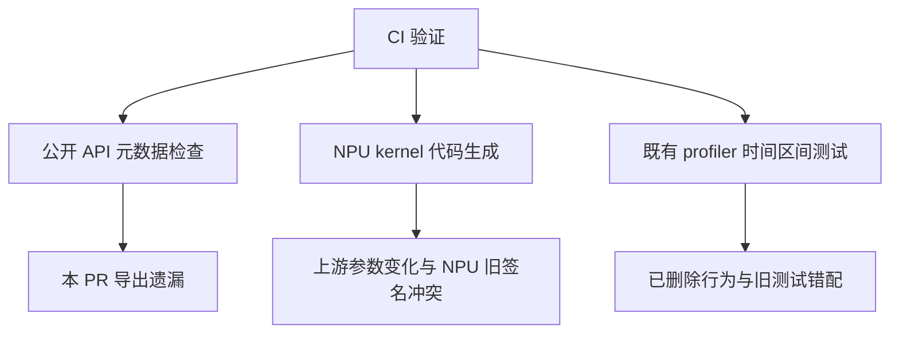
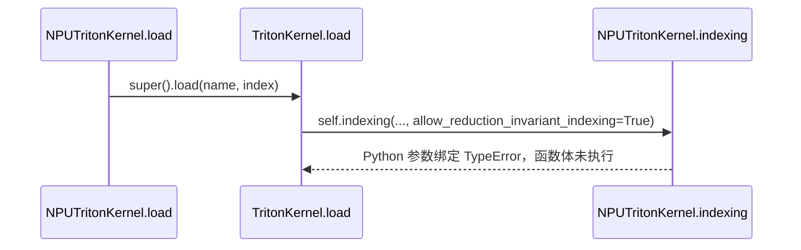

# PyTorch Feature 设计与实现分析

主题：PR !46073 在最新 master 上的失败引入来源。

更新时间：2026-09-16 20:04（CST，UTC+08:00）。

后续进展（21:54）：本 PR 的公开 API 修复已获授权并推送，HEAD `5efe8a254`，
master 基线 `0095e028c`；其他两项未改，新 HEAD CI 尚未确认。
结果见[最小修复记录](./pr_46073_api_fix.md)。下文保留修复前的引入来源分析。

9 月 18 日更新：上游 !46394 / `13570cf9d` 已修复 indexing / expand 参数兼容，
当前 PR `195830924` 已 rebase 包含该提交。归因证据中的“latest_base”只指 9 月 16 日
的 `2a9b559fb`，不是实时 master；[最新状态与归档证据](./work_records/README.md)以日期区分。

## 模块设计目标与背景

本轮只做两件事：**先 rebase，再确认问题是谁引入的**。没有实施功能修复，没有改测试
断言或禁用列表，没有推送，也没有替换共享环境。

结论如下；“源码契约复现”不等同于完整 NPU 模型回归。

| 失败 | 引入来源 | 与本 PR 的关系 |
| --- | --- | --- |
| 公开 API 检查 | 本 PR 的 `00256261d`，本次 rebase 后对应 `52cf72e6c` | 我们新增导出时遗漏了公开模块元数据，属于本 PR 缺陷 |
| 7 项 `indexing` TypeError | 上游 PyTorch `#192410` 新增关键字参数，NPU 覆盖方法保持旧签名 | 基线已有的跨版本兼容缺口，被新增端到端用例暴露；不是 provenance 改了 indexing |
| 2 项 annotation overlap 断言 | 上游 `#193042` 删除时间对齐行为并删除旧测试；CI 仍运行旧测试 | 已确认测试/运行时语义错配，不应归为 provenance 映射错误 |

第三项尚未拿到 **CI 测试准备脚本何时切换 wheel、为何仍保留旧测试** 的提交记录；
不能编造这段 CI 配置历史。下面给出已确认的上游语义变更和实际日志证据。

## 整体设计架构

### 核心组件说明

| 组件 | 职责 / 本次检查点 | 源码位置 |
| --- | --- | --- |
| profiler 公开包 | 导出 `inductor_trace_handler` | `torch_npu/profiler/__init__.py::__all__` |
| provenance 处理器 | 生成回调，导出 trace 后补来源栈 | `torch_npu/profiler/_inductor_profiler.py::inductor_trace_handler` |
| 公开 API 检查 | 检查导出列表和 `__module__` 一致性 | `test/npu/test_public_bindings.py::TestPublicBindings.test_correct_module_names` |
| NPU Triton kernel | 覆盖父类的 load / indexing | `torch_npu/_inductor/triton_experimental/codegen/triton.py::NPUTritonKernel` |
| 社区 Triton kernel | 生成索引与 load，调用子类方法 | `torch/_inductor/codegen/triton.py::TritonKernel.load/indexing` |
| 社区 profiler | 采集事件，旧版会调整 step 的起始时间 | `torch/csrc/profiler/collection.cpp::RecordQueue::getRecords` |



这三条链路的失败不能都概括成“provenance 坏了”。

## 入口分析

### 1. rebase 的实际结果

- 本轮重新 fetch 的官方 master：`2a9b559fb237dde85fce6bb72cba931fd6d38548`。
- 比上一轮 `c01b3d31a` 新增 9 个提交。
- 本地 rebase 后 HEAD：`7b8795bb9045e83ce293cfb682eb98aab1fd3a8f`。
- 功能提交：`52cf72e6c3738d1128be79198e5bcdd8f2a4fa4f`。
- 两个 PR 提交的 range-diff 均为 `=`；无冲突，diff whitespace 检查通过。
- 新备份分支：`codex/provenance-backup-before-rebase-20260916-second`。
- 原有四个子模块的 dirty 状态保留；没有清理用户修改。

### 2. 不按版本号猜测，直接检查 CI wheel

从上一轮 CI 日志给出的公开下载地址获取同一个 wheel，**只提取源码，没有安装**：

```text
torch-2.15.0.dev20260902+cpu-cp310-cp310-manylinux_2_28_aarch64.whl
git_version = 3c73a854d2797ba5d8057db91d52ff836a331790
SHA256 = 241ae9f724120c022627cbc3454e15500895d11a270102bc4477d731566f72c2
```

已拉取该 Git 对象，wheel 中的 `torch/_inductor/codegen/triton.py`、
`torch/autograd/profiler.py`、`torch/profiler/profiler.py` 与该提交源码逐字节一致。

注意：wheel 使用 **nightly 快照历史**，不是普通主线 PR 提交链。因此不能直接宣称
主线 PR 的 SHA 是 wheel SHA 的 Git 祖先。实际对应关系为：

| 语义变更 | 上游主线提交 | CI nightly 首次包含该变更的快照 |
| --- | --- | --- |
| 新增 indexing 参数，`#192410` | `626ea913a1bf400ad1cf329787bbd91cd28c4075` | `461e8d2656f270ab5af65e61fe4c9ca226f4df92`，2026-08-15 UTC |
| 弃用 step 对齐，`#193042` | `4111829138f27e997b04d8fecb6390c9aa52b53d` | `644e799e34e0cc1a844b844beddf9ddd18d184d7`，2026-08-13 UTC |

两个 nightly 快照均确认是 CI wheel 源码提交的祖先，并核对了各自父提交的变化前状态。

更正前次报告：本机 `uname -m` 为 **aarch64**，不是 x86。实际差异包括 Python
3.11/3.10、PyTorch 2.14/2.15、CANN 和设备型号，不能再把架构差异当作理由。

## 完整调用链分析

### 一、公开 API：确实是我们的提交引入

[原始功能提交 `00256261d`](https://gitcode.com/Ascend/pytorch/commit/00256261d8227ea57adf66a9344820d047ea45a2)
新增了这个导出：

```diff
+from ._inductor_profiler import inductor_trace_handler
 ...
+    "inductor_trace_handler",  # 加入 __all__
```

但是函数定义在私有模块，且没有声明公开所属模块：

```python
from torch_npu.profiler import inductor_trace_handler
# 用户公开入口不变；dir_name 是输出目录，worker_name 用于区分进程产物。
handler = inductor_trace_handler("/tmp/my_npu_timeline", worker_name="rank0")

inductor_trace_handler.__module__
# 实际仍为 "torch_npu.profiler._inductor_profiler"
```

调用链是 `TestPublicBindings.test_correct_module_names → test_module →
check_one_element`：先发现它在 `__all__`，再发现 `__module__` 含 `._`，两者不一致。
旧基线和最新 master 都没有这个新增导出，因此此项不能推给基线或上游。

修改点应在公开入口的导出元数据；不应删除公开 API、削弱检查或加入豁免。

### 二、indexing：上游新增参数，NPU 旧签名未跟进

NPU 覆盖签名来自 `8bfbb9ed1ad6157ad52d0352650dd8b7e0a9504e`，
2026-07-23 的 `triton_experimental` 后端引入提交。它当时对齐旧上游签名，不能把
后续才出现的新参数不兼容说成当时已经存在的运行错误。

[上游 `#192410`](https://github.com/pytorch/pytorch/pull/192410) 后来修改了两处契约：

```diff
 # torch/_inductor/codegen/triton.py::TritonKernel.indexing
+    allow_reduction_invariant_indexing=False,

 # torch/_inductor/codegen/triton.py::TritonKernel.load
 indexing = self.indexing(
     index,
     block_ptr=True,
     tma_compatibility_checker=tma_checker,
+    allow_reduction_invariant_indexing=True,
 )
```

这个参数让允许的后端减少归约维度上重复的 load。CI wheel 的真实调用位置是
`torch/_inductor/codegen/triton.py:4942`，与远端错误栈吻合。



这里的 `self` 始终是 NPU 子类实例，父类调用 `self.indexing` 会回到 NPU 覆盖方法。
因此不是“只更新父类就够了”。

有一个容易误判的细节：社区 `_reduction_invariant_indexing_shape` 内部确实限制
`device.type == "cuda"`（包含 ROCm 路径），NPU 不会启用该窄形状优化。
**但传参和 Python 参数绑定发生在这段设备判断之前**，所以设备限制不能避免 TypeError。
这次兼容修复不意味着要顺便为 NPU 开启这项优化。

本轮从三份真实源码提取整个 `indexing` 定义，核对 AST，并执行实际 Python 参数绑定：

| NPU 源码版本 | 方法 AST | 旧调用不传新参数 | 传 CI wheel 中的新参数 |
| --- | --- | --- | --- |
| 原始基线 `f030beadb` | 三份完全相同 | 签名绑定通过 | TypeError |
| 最新 master `2a9b559fb` | 三份完全相同 | 签名绑定通过 | TypeError |
| rebase 后 PR `7b8795bb9` | 三份完全相同 | 签名绑定通过 | TypeError |

本 PR 在该文件只修改 `NPUTritonScheduling` 的 launch 来源记录，没有修改
`NPUTritonKernel.indexing`。因此本次 **unexpected keyword** 的引入来源已确认，
并非 rebase 冲突或 provenance 开关改变了索引语义。

证据边界：这张表是参数契约复现，不是三套完整 wheel 的 NPU 模型 A/B，也不能证明
修好参数以后所有后续编译、精度和 trace 断言都会通过。

### 三、annotation：新运行时已删除旧测试所依赖的行为

[上游 `#193042`](https://github.com/pytorch/pytorch/pull/193042) 做了三件相互对应的事：

1. `torch/autograd/profiler.py::profile.__init__`：对 `adjust_profiler_step=True`
   发出“已弃用、已忽略”的警告。
2. `torch/csrc/profiler/collection.cpp::RecordQueue::getRecords`：移除调整
   ProfilerStep 起始时间的逻辑。
3. `test/profiler/test_profiler.py::TestProfilerDevice`：删除
   `test_cpu_annotation_overlap` 及其辅助函数，改加 `test_adjust_profiler_step_deprecated`。

关键变化不是改了容差，而是取消了这个行为：

```diff
-if (config_.experimental_config.adjust_profiler_step) {
-    // 原来会依据父 Python 事件，调整 step 的开始时间。
-    currStepRes->start_time_ns_ = i->start_time_ns_ + 1;
-    ...
-}
```

CI 的证据链完整对应：

```text
旧 test_cpu_annotation_overlap
  → _ExperimentalConfig(adjust_profiler_step=True)
  → CI wheel 发出 adjust_profiler_step is deprecated and ignored
  → 不再进行旧的时间对齐
  → 旧测试仍断言不能发生 partial overlap
  → CPU / NPU 两个展开用例均 FAIL
```

已验证：nightly 快照 `644e799e34e0` 的父提交仍有旧测试，该快照删除了旧测试；
CI wheel 对应的 `3c73a854` 也只有新弃用测试、没有旧 overlap 测试。
但远端实际日志明确仍在运行旧测试，因此测试文件与运行时的语义版本不一致。

本 PR 不修改社区 profiler 的上述 Python/C++ 实现，也没有修改该旧测试。不能为通过
它而恢复上游已删除行为，更不能把它当作 provenance 应补齐的功能。

仍未确认的是 CI 测试准备脚本为何选用了旧文件，以及哪次 CI 配置变更引入这种组合。
尚未进行同一 ARM/Python 3.10 环境的完整运行时 A/B；不声称做过二分或完整实测。

## 扩展点分析

以下是归因后的处理方向，**本轮未实施**。

| 问题 | 应处理的位置 | 不应做的事 |
| --- | --- | --- |
| 公开导出元数据 | `torch_npu.profiler` 的公开入口声明 | 删除用户入口、加检查豁免 |
| indexing 参数兼容 | `NPUTritonKernel.indexing` 与父类的调用契约 | 无条件向旧 PyTorch 传新参数；绕过设备限制开启新优化 |
| annotation 旧测试 | CI 的社区测试快照 / 版本配套逻辑 | 修改 provenance 来迎合已删除的上游语义；直接加 skip 冒充修复 |

若后续授权修复，第一项属于本 PR 自身修复；第二项应明确标注为独立的后端兼容问题；
第三项应向 CI 用例同步路径核查。不能用一句“都是环境问题”掩盖第一项。

## 总结

**rebase 已完成；一项是我们的代码缺陷，一项是基线后端兼容缺口，一项是 CI 测试与
新 profiler 语义错配。三者有不同的引入来源。**

本轮证据目录：

```text
/home/z50063656/Tracking/triton_experimental_delivery/pr_origin_20260916.7sterg/
```

推荐阅读顺序：

1. `origin_contracts.json`：三版本签名对照、wheel 源码一致性、nightly 祖先关系。
2. `pr_public_export.patch`：我们自己的导出改动。
3. `upstream_indexing_192410.patch`：上游新增参数和实际调用。
4. `upstream_profiler_193042.patch`：删除旧行为、删除旧测试、新增弃用测试。
5. `ci_wheel_manifest.json`、`ci_torch_source/`：CI 原始 wheel 的版本、哈希和提取源码。
6. `rebase_range_diff.txt`：本轮 rebase 补丁不变的证据。

可从 `/home/z50063656/tmp` 重跑 `check_origins.py`；该脚本只检查固定版本源码，不导入
或改写运行环境。上一轮 `de350aa` 的 2.14 wheel 已构建完成，但不是当前 `7b8795bb9`
版本，也不是 CI 2.15 环境，未将其计作本轮 NPU 回归结果。
