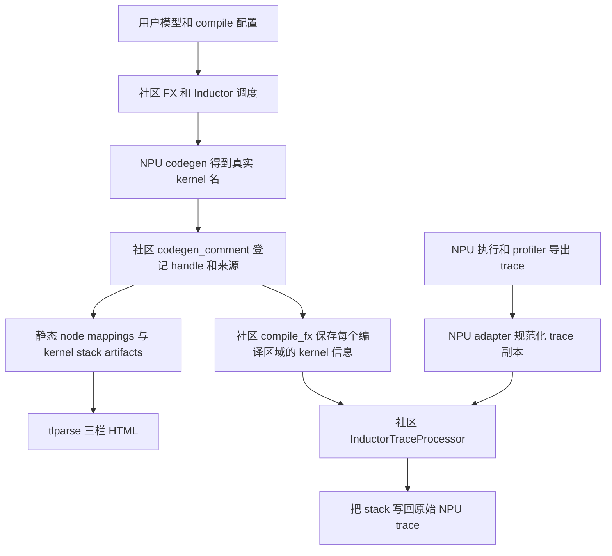
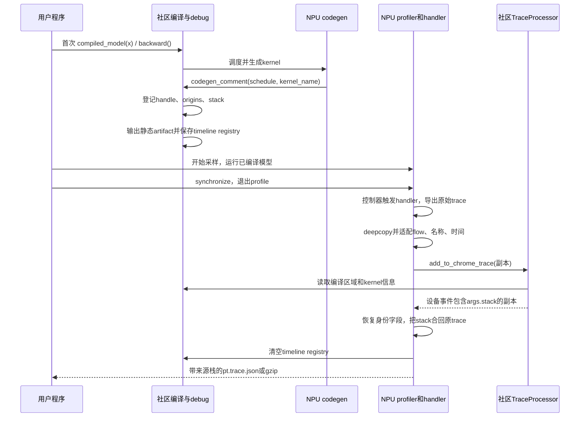

# PyTorch Feature 设计与实现分析

> 主题：`triton_experimental` provenance PR 逐段 diff、代码与调用栈导读
>
> 最后更新：2026-09-11（CST，UTC+08:00）
>
> 阅读对象：想从“会使用”进一步理解“改了什么、为什么有效、如何修改”的开发者。

本文对应 [Ascend/pytorch PR !46073][pr]，以两次提交合起来的**最终功能 diff**为主线。
用户只想运行功能时，先看[仓库 README 使用方法](../README.md#用户使用方法)；
本文解释这些用法背后的代码。整体需求、官网契约和验收矩阵见[主交付文档](./provenance_delivery.md)。

| 对象 | 本文固定版本 / 作用 |
| --- | --- |
| torch_npu 比较基线（BASE） | `f030beadb051d882c0dd697f54f8aeac8c5a5f7d`，2026-09-11 rebase 的官方 master |
| torch_npu 功能提交（HEAD） | `4845c9289d84a8c4b78a147ac502579310235995` |
| HEAD 包含的两个提交 | `45f6f27aa`：核心适配；`4845c9289`：扩展验证与适配完善 |
| 配套社区 PyTorch 源码 | `8e86e0a23e3679c2bf3406cf0837fcb6297a5d9b`，项目使用的 `release/2.14` 源码基线 |
| 官网使用契约 | [PyTorch 2.13 provenance 文档][official]；内部调用细节以以上固定 PyTorch 源码为准 |
| 历史实测产物 | 本仓 `docs/triton_experimental/artifacts/`；保留各自原始版本、时间与设备记录 |

2026-09-11 rebase 后进行了 Python 语法、JSON 格式和 diff 空白检查。
本轮未获得更新后的 NPU 端到端运行结果，历史 HTML/trace **不等于新 HEAD 的重新实测**。
PR 后续若继续更新，阅读当前 diff 时应重新核对 BASE/HEAD。

离线阅读可下载[三份实现文件的原始 unified diff](./diffs/triton_experimental_provenance_f030beadb_4845c9289.patch)。
此补丁只含实现，测试和演示资料通过下文源码链接阅读。它不是整个 PR 的安装包。

在源码仓查看完整差异：

```bash
# 前提：本地已有下列两个 commit；BASE 是对比起点，HEAD 是最终功能版本。
git diff --stat f030beadb051d882c0dd697f54f8aeac8c5a5f7d \
  4845c9289d84a8c4b78a147ac502579310235995
git diff f030beadb051d882c0dd697f54f8aeac8c5a5f7d \
  4845c9289d84a8c4b78a147ac502579310235995 -- \
  torch_npu/_inductor/triton_experimental/codegen/triton.py \
  torch_npu/profiler/__init__.py \
  torch_npu/profiler/_inductor_profiler.py
```

## 模块设计目标与背景

### 1. 为什么需要这次 diff

假设用户模型包含三行计算：

```python
added = x + 1
activated = torch.relu(added)
return activated * 2
```

Inductor 可以把三步融合为一个 Triton kernel。现在有两个具体问题：

1. 看生成代码时，如何确定该 kernel 对应 `add/relu/mul` 哪些图节点？
2. 看 profiler 时，如何把实际执行的设备 kernel 事件定位回上面三行源码？

社区已经有“登记来源→生成 mapping→解析 trace”的主体实现。本次 NPU diff 接上两个位置：
`NPUTritonScheduling` 的真实 kernel 发射位置，以及 Ascend profiler trace 的导出后处理位置。

### 2. 先分清三种“栈”和两种时间

| 名称 | 具体内容 | 如何得到 / 如何阅读 |
| --- | --- | --- |
| 框架函数调用链 | `codegen_node_schedule → codegen_comment → set_kernel_post_grad_provenance_tracing` | 本文按源码整理；用来找修改位置 |
| kernel 对应的模型源码栈 | `File ...static_probe.py, line 20, in forward` 等字符串 | 编译期从 FX/IR 来源提取，保存在 `stack_traces` |
| profiler 中的 `args.stack` | 某个设备 kernel 事件携带的上述模型源码栈 | 运行后把编译期信息关联到 trace 事件 |

本文标为“调用链”的代码框是静态源码导读，不是某次运行采集的 Python traceback。
`args.stack` 是来源信息回填，也不是在 NPU kernel 执行现场逐层采集的 Python 调用栈。

`codegen_comment()` 发生在**编译时**；生成的 `.run()` 才在模型执行时发射 kernel。
每次编译期登记分配的 debug handle（例如 `:1`）标识生成代码里的调用位置，
不表示“只执行过一次”，也不会在每次模型迭代时自动递增。
依据：[PyTorch `debug.py::set_kernel_post_grad_provenance_tracing`][pt-debug]、
[`ir.py::IRNode.get_stack_traces`][pt-ir]。

## 整体设计架构

### 1. PR 文件分工

最终差异共 22 个文件。行数大的主要部分是测试和静态演示证据，核心实现集中于三个文件：

| 文件 | 改动性质 | 需要审查的问题 |
| --- | --- | --- |
| [`torch_npu/_inductor/triton_experimental/codegen/triton.py`][npu-triton] | 修改：7 行增加、3 行删除 | 何时拿到真实 kernel 名？普通、partial、combine 是否分别登记？ |
| [`torch_npu/profiler/__init__.py`][npu-init] | 修改：导出 handler，兼有 import / `__all__` 排版调整 | 用户能否从公共 namespace 导入？ |
| [`torch_npu/profiler/_inductor_profiler.py`][npu-profiler] | 新增 363 行 | Ascend schema、名字、flow、时间值如何适配并恢复？ |
| [`test/_inductor/test_triton_experimental_provenance.py`][test-static] | 新增专项测试文件 | level 0/1/2、rsplit 登记、动态重编译 |
| [`test/profiler/test_inductor_profiler.py`][test-profiler] | 新增 | trace 适配边界与前反向运行验证 |
| [`test/profiler/test_inductor_provenance_models.py`][test-models] | 新增 | Llama / ConvNeXt / Transformer 模块级验证 |
| `docs/inductor_provenance_demo/triton_experimental/` | 16 份说明、脚本、HTML / JSON | 证据的版本、覆盖范围与限制 |

PyTorch 的 `debug.py`、`compile_fx.py`、`profiler.py` 和 tlparse 均为本文引用的配套实现，
**不是这份 torch_npu PR 新增的修改**。例如 backward graph key 的匹配规则属于配套 PyTorch
处理器，不能误读为本 PR 又实现了一套自动求导机制。

### 2. 组件如何协作



这里有两条数据关系：静态 HTML 使用“图节点↔kernel 调用”的 mapping；运行时使用
“编译区域 + kernel 名 + flow / 事件范围”把执行事件关联到编译期源码信息。
两者复用来源数据，但不是同一个输出文件，也不能仅凭 HTML 正常就断言 timeline 正常。

## 入口分析

### 1. 用户代码入口与 diff 的关系

下面展示的是可加入用户程序的核心片段；`model`、`make_input()` 由用户程序提供，
输入需适合该模型且能参与求导。完整独立用法见[README](../README.md#用户使用方法)。

```python
import torch
import torch_npu
from torch._inductor import config
from torch_npu.profiler import inductor_trace_handler

with config.patch({
    "trace.provenance_tracking_level": 1,
    "trace.provenance_tracking_to_timeline": True,
    "triton.unique_kernel_names": True,
}):
    compiled_model = torch.compile(
        model, backend="inductor",
        options={"npu_backend": "triton_experimental"},
    )
    warmup_x = make_input()
    compiled_model(warmup_x).sum().backward()
    torch.npu.synchronize()

    handler = inductor_trace_handler("/tmp/my_npu_timeline", worker_name="rank0")
    profile_x = make_input()
    with torch_npu.profiler.profile(on_trace_ready=handler):
        compiled_model(profile_x).sum().backward()
        torch.npu.synchronize()
```

`torch.compile` 返回可调用对象；通常首次实际调用才执行编译，首次 backward 也可能触发
反向编译。因此 `config.patch` 覆盖预热、采样和 handler 执行全过程。
这里 `.sum()` 将输出归约成可直接 `.backward()` 的标量；它本身不说明 reduction 必然在
模型的已编译图内部。预热还会累加参数梯度，真实训练程序应按自己的梯度累积策略清理。

| 开关 / 参数 | 读取方 | 对本次 diff 的影响 |
| --- | --- | --- |
| `options={"npu_backend": "triton_experimental"}` | torch_npu 编译后端配置 | 进入本次修改的 NPU 调度实现 |
| `trace.provenance_tracking_level` | 社区 `config.effective_provenance_tracking_level()` | 控制登记来源及其详细程度 |
| `trace.provenance_tracking_to_timeline` | 社区 `compile_fx_inner` 和 NPU `handler_fn` | 编译期保存 registry，导出时启用回填 |
| `triton.unique_kernel_names` | 社区 codegen / profiler | 使生成 kernel 名具有足够的区分度 |
| `dir_name` / `worker_name` | NPU `inductor_trace_handler` | 输出目录和文件名前缀；省略 worker 名时用主机名与 PID |
| `use_gzip` | NPU `inductor_trace_handler` | 先处理临时 JSON，再压缩成 `.pt.trace.json.gz` |

环境变量在导入配置前设置：`INDUCTOR_PROVENANCE` 对应 level，
`TORCH_COMPILE_DEBUG_EXTEND=1` 对应 timeline 开关，
`TORCHINDUCTOR_UNIQUE_KERNEL_NAMES=1` 对应 unique kernel names。
`TORCH_TRACE` 指定静态结构化日志目录。有效 level 还受 timeline / debug 设置影响，
所以 level 0 关闭测试必须确保没有其他开关把有效 level 提升到 1。
依据：[PyTorch `config.py::trace` / `effective_provenance_tracking_level`][pt-config]。

### 2. 公共 API diff

`torch_npu/profiler/__init__.py` 的功能性变化可概括为：

```diff
+from ._inductor_profiler import inductor_trace_handler
 ...
 __all__ = [
     ...
+    "inductor_trace_handler",
 ]
```

这是省略无关上下文的 diff；其余多行 import 和列表变化主要是排版。
作用是让用户可以直接 `from torch_npu.profiler import inductor_trace_handler`。
这一步提供导出回调，不会仅因 import 就自动启用 profiler 或修改已有 trace。
依据：[`torch_npu/profiler/__init__.py`][npu-init]。

## 完整调用链分析

### 阶段 1：普通 kernel 的一行参数为什么决定映射是否存在

位置：[`NPUTritonScheduling.codegen_node_schedule`][npu-triton]，HEAD 约 5516 行。
下面是本 PR 的实际 diff hunk（省略行号头）：

```diff
-        self.codegen_comment(node_schedule)
         if rsplit_kernel is not None and combine_info is not None:
-            self._npu_call_rsplit_kernels(rsplit_kernel, combine_info)
+            self._npu_call_rsplit_kernels(
+                rsplit_kernel, combine_info, node_schedule
+            )
         else:
+            self.codegen_comment(node_schedule, final_kernel.kernel_name)
             final_kernel.call_kernel(final_kernel.kernel_name)
```

关键在社区父类 [`TritonScheduling.codegen_comment`][pt-triton]，约 8107 行。
下列是原样摘取的关键分支：

```python
        if kernel_name:
            debug_handle = set_kernel_post_grad_provenance_tracing(
                node_schedule,  # type: ignore[arg-type]
                kernel_name,
            )
            wrapper.write_provenance_debug_handle(kernel_name, debug_handle)
```

修改前没有传 `kernel_name`，默认值为 `None`；函数前半段仍可写普通来源注释，
但不会进入上述登记分支。于是“看得到注释”不意味着已有 kernel mapping。
修改后，在 `define_kernel` 得到最终名称、scheduler node 被标记运行之后，
把 `final_kernel.kernel_name` 和对应 `node_schedule` 一起传入，社区登记中心就能关联两者。

这不是以字符串解析 kernel 名来推断算子。真正的节点来源来自 scheduler node 所持 IR 的
`origins`；kernel 名作为关联 key。`node_schedule` 里还可能有 reduction 控制标记，
社区登记函数会跳过 `EnableReduction` / `DisableReduction`。
依据：[`debug.py::set_kernel_post_grad_provenance_tracing`][pt-debug]。

框架调用链（聚焦普通 SIMD/Triton 分支；图捕获与 lowering 在到达调度器前已经发生）：

```text
社区 Scheduler 调度该融合节点
  → get_backend(device).codegen_node(node)
  → 社区 SIMDScheduling.codegen_node(...)
    → SIMDScheduling._codegen_nodes(...)
      → generate_node_schedule(...) → SIMDKernelFeatures(...)
      → NPUTritonScheduling.codegen_node_schedule(kernel_features)
        → create_kernel_choices(...) / codegen_node_schedule_with_kernel(...)
        → kernel.codegen_kernel() / self.define_kernel(...)
        → 得到 final_kernel.kernel_name
        → 社区 TritonScheduling.codegen_comment(node_schedule, kernel_name)
          → debug.set_kernel_post_grad_provenance_tracing(...)
            → 遍历 snode.node.origins，收集 post-grad 节点名
            → snode.node.get_stack_traces()，收集模型源码栈
            → 分配 debug handle，更新编译期映射和 stack 字典
          → WrapperCodeGen.write_provenance_debug_handle(...)
        → final_kernel.call_kernel(...) 生成调用代码
```

源码导航：[`scheduler.py`][pt-scheduler]、[`codegen/simd.py::SIMDScheduling`][pt-simd]、
[`codegen/triton.py::TritonScheduling.codegen_comment`][pt-triton]、
[`codegen/wrapper.py::WrapperCodeGen.write_provenance_debug_handle`][pt-wrapper]。

### 阶段 2：登记的数据是什么，为什么有 `:1`

社区登记函数在有效 level 非零时，先递增计数器，再生成带 handle 的 key：

```python
        _inductor_kernel_provenance_debug_handle += 1
        stack_traces: list[str] = []
        kernel_name = f"{kernel_name}:{_inductor_kernel_provenance_debug_handle}"
```

这个 key 同时进入两个字典：

| 数据结构（`torch/_inductor/debug.py`） | 内容 | 后续用途 |
| --- | --- | --- |
| `_inductor_triton_kernel_to_post_grad_node_info` | `kernel:handle → [post 节点名]` | 构造 `cppCodeToPost`，再反转生成 `postToCppCode` |
| `_inductor_kernel_stack_trace` | `kernel:handle → [源码栈字符串]` | 静态 stack artifact，以及 timeline 编译信息 |
| `get_kernel_information_jsons()` 返回的 registry | `编译区域 key → kernel 信息字典` | 区分前向、反向、不同重编译图，并供 trace 处理器查询 |

注意第三项由后面的 `compile_fx_inner` 填充；不是在每次 `codegen_comment` 中立即写入。
静态 key 中的 handle 能区分同名 kernel 的生成调用位置，但不代表 NPU profiler 会原样输出
带 `:handle` 的事件名。timeline 处理器还要结合编译区域和 kernel 名前缀查找。

下面是本仓[真实静态 mapping](./triton_experimental/artifacts/static_smoke/node_mappings.json)
中的内容，仅做格式化，未更换节点名：

```json
{
  "preToPost": {"added": ["add"], "activated": ["relu"], "mul": ["mul"]},
  "postToPre": {"add": ["added"], "relu": ["activated"], "mul": ["mul"]},
  "cppCodeToPost": {"triton_unk_fused_add_mul_relu_0:1": ["mul", "relu", "add"]},
  "postToCppCode": {
    "mul": ["triton_unk_fused_add_mul_relu_0:1"],
    "relu": ["triton_unk_fused_add_mul_relu_0:1"],
    "add": ["triton_unk_fused_add_mul_relu_0:1"]
  }
}
```

逐项理解：左栏 `activated` 对应中栏 `relu`；中栏 `relu` 再对应右栏
`triton_unk_fused_add_mul_relu_0:1`。多个中栏节点指向一个 key，正是多算子融合。
这里 `cppCodeToPost` 是社区 schema 的字段名，不代表这个 kernel 用 C++ 编写。

对应的[真实 stack artifact](./triton_experimental/artifacts/static_smoke/kernel_stack_traces.json)
包含下面一条来源（路径为当时实际生成时记录的路径）：

```text
  File "/home/z50063656/Tracking/worktrees/torch_npu_triton_provenance_delivery/docs/inductor_provenance_demo/triton_experimental/static_probe.py", line 20, in forward
    activated = torch.relu(added)
                ^^^^^^^^^^^^^^^^^
```

同一个 key 还包含 `added = x + 1`、`return activated * 2` 的栈。
这三条栈描述该融合 kernel 的来源集合；顺序不应解释成 kernel 内部执行这些 Python 行的顺序。

### 阶段 3：为什么 rsplit 必须登记两次

位置：[`NPUTritonScheduling._npu_call_rsplit_kernels`][npu-triton]，约 5710 行。
rsplit 把一次归约拆成 partial 和 combine 两个 kernel：前者写中间 workspace，
后者合并局部结果。原函数直接使用 wrapper 发射它们，因此需要在每次发射前提供各自名称。

```diff
-    def _npu_call_rsplit_kernels(self, partial, combine_info):
+    def _npu_call_rsplit_kernels(self, partial, combine_info, node_schedule):
 ...
+        self.codegen_comment(node_schedule, partial.kernel_name)
         wrapper.generate_kernel_call(
             partial.kernel_name,
 ...
+        self.codegen_comment(node_schedule, combine_info["kernel_name"])
         wrapper.generate_kernel_call(
             combine_info["kernel_name"],
```

这是省略 workspace / 参数构建上下文的 diff。完整补丁保留了它们。
传入 `node_schedule` 的目的，是让两次登记都能读取这次归约的来源节点；
不是给第二个 kernel 重新构造一份假的 FX 图。

```text
NPUTritonScheduling.codegen_node_schedule
  → 生成 partial / combine，并确定各自 kernel_name
  → _npu_call_rsplit_kernels(partial, combine_info, node_schedule)
    → write_triton_header_once()
    → 构建 partial 参数并分配 workspace
    → codegen_comment(node_schedule, partial.kernel_name)    # 第一次登记
    → wrapper.generate_kernel_call(partial.kernel_name, ...)
    → 构建 combine 参数
    → codegen_comment(node_schedule, combine_info["kernel_name"])  # 第二次登记
    → wrapper.generate_kernel_call(combine_info["kernel_name"], ...)
    → 按逆序释放 workspace
```

生成代码的关系可以用以下**示意代码**理解；名称、参数和 handle 为示例：

```python
# [Provenance debug handles] triton_partial:1
triton_partial.run(...)
# [Provenance debug handles] triton_combine:2
triton_combine.run(...)
```

两次登记可以拥有相同 post-grad 来源集合，但 key 不同；因此它们在 timeline 上都能获得
来源栈。这里的来源粒度是共享的归约调度，不承诺为 combine 创建一个独立用户源码行。

这也解释了为什么“双 launch 验证”不能作为社区 `ComboKernel` 的通过证据：
本路径是两个有先后依赖的 kernel 调用；社区 combo codegen 有自己的组合与调度机制。
本 PR 的两次 `generate_kernel_call` 没有自动赋予该后端 ComboKernel 支持。

### 阶段 4：静态 HTML 如何消费新增映射

在当前 PyTorch 源码中，`_compile_fx_inner` 编译生成模块之后调用
`debug.dump_inductor_provenance_info()`，并把结果通过 `trace_structured("artifact", ...)`
输出到结构化编译日志。
依据：[`compile_fx.py::_compile_fx_inner`][pt-compile]，约 1755 行。

```text
_compile_fx_inner
  → graph.compile_to_module()，内部完成 codegen 和 provenance 登记
  → debug.dump_inductor_provenance_info()
    → create_node_mapping_kernel_to_post_grad(...)
    → 合并 preToPost/postToPre 和 cppCodeToPost/postToCppCode
    → trace.enabled 时另外写本地 mapping JSON
  → trace_structured：inductor_provenance_tracking_node_mappings
  → trace_structured：inductor_provenance_tracking_kernel_stack_traces
  → TORCH_TRACE 日志文件

另一个进程：tlparse <具体日志文件> --inductor-provenance
  → 读取图、生成代码与 mapping artifacts
  → 把节点名 / kernel handle 关联到页面行号
  → 三栏高亮
```

`trace.enabled` 的本地 debug 文件与 `TORCH_TRACE` 的结构化日志是两个输出通道。
静态单测为了直接读取临时目录下的 JSON，显式开启前者；用户生成 HTML 按官网使用
`TORCH_TRACE` 即可。具体 artifacts 和三栏语义见[官网文档][official]及
[该版本官方文档源文件][pt-doc]。

### 阶段 5：编译期 registry 为什么要在 profiler 之前准备好

位置：[`compile_fx.py::compile_fx_inner`][pt-compile]，约 927 行，社区已有逻辑：

```python
        if config.trace.provenance_tracking_to_timeline:
            compile_id = torch._guards.CompileContext.current_compile_id()
            kernel_information_jsons = get_kernel_information_jsons()
            key = str((f"Torch-Compiled Region: {compile_id}", kwargs["is_backward"]))
            if key not in kernel_information_jsons:
                kernel_information_jsons[key] = create_kernel_information_json()
```

输入是刚完成的图编译与 provenance 全局数据；输出是一个按编译区域分组的 registry。
`create_kernel_information_json()` 将 stack、post 节点、可追溯的 pre 节点等整理成 kernel 信息。
其结构可用以下**示意 JSON**表示：

```json
{
  "('Torch-Compiled Region: 0/0', False)": {
    "triton_unk_fused_add_mul_relu_0:1": {
      "stack_traces": ["File ...model.py, line 20, in forward ..."],
      "post_grad_nodes": ["add", "relu", "mul"],
      "pre_grad_nodes": ["added", "activated", "mul"],
      "extern_semantic_key": null
    }
  }
}
```

`False` 表示前向图，反向图用 `True`；编译区域名还含 compile ID。
同名 kernel 可能出现在不同图内，不能把所有图的 stack 按 kernel 名粗暴合并。
先预热 forward/backward，是为了让采样时的执行有相应编译信息，并减少首次编译活动对
timeline 的干扰。registry 是否齐全还依赖实际编译、cache 与采样窗口生命周期；
本 PR 未新增持久化 registry 或保证任意多窗口复用。

### 阶段 6：退出 profiler 到 NPU handler 的真实调用路径

位置：[`profiler.py::profile.__exit__ / stop`][npu-profile-entry]、
[`_profiler_action_controller.py::ProfActionController`][npu-controller]。

```text
with torch_npu.profiler.profile(on_trace_ready=handler) 退出
  → profile.__exit__()
  → profile.stop()
  → action_controller.transit_action(current_action, None)
  → 按当前 action 执行 stop_trace / finalize_trace / _trace_ready
  → ProfActionController._trace_ready()
  → self.on_trace_ready(self.prof)
  → _inductor_profiler.inductor_trace_handler 返回的 handler_fn(prof)
    → prof.export_chrome_trace(output_path)
      → _KinetoProfile.export_chrome_trace
      → prof_if.analyse(EXPORT_CHROME_TRACE, output_path)
    → timeline 开关打开时，_add_inductor_provenance(output_path)
```

上面对应结束时有可导出采样的路径；如果当前 action 只有 warmup，控制器不会把它当作
完整 trace 导出。使用 profiler schedule 时，`step()` 的状态切换也可触发回调。

NPU handler 中普通 JSON 分支为：

```python
        else:
            prof.export_chrome_trace(output_path)
            if provenance_enabled:
                _add_inductor_provenance(output_path)
```

`inductor_trace_handler(...)` 本身只是创建闭包；真正的导出与回填在 profiler 调用该闭包时
发生。gzip 分支则使用临时 JSON 完成同样的处理，最后压缩输出。
依据：[`_inductor_profiler.py::inductor_trace_handler`][npu-profiler]，327–363 行。

### 阶段 7：为什么必须做 Ascend trace 适配

新增文件不是重新实现整个 profiler；其主要工作是让社区
[`_InductorTraceProcessor`][pt-profiler]读懂 NPU trace。

| Ascend trace 中的问题 / 差异 | NPU 适配位置 | 临时处理 |
| --- | --- | --- |
| 根节点可能是列表，而社区处理器读 `traceEvents` | `_trace_events` / `_normalize_trace_for_inductor` | 包装成 `{"traceEvents": [...]}` |
| host→device flow 名为 `torch_to_npu` | `_normalize_trace_for_inductor` | 已匹配的 flow 改为社区可识别的 `ac2g` |
| flow 端点可集中在 trace 尾部 | 同上 | 用 `(pid, tid, ts)` 找关联事件，把端点放到该事件之后 |
| 设备事件分类不一定是 `kernel` | 同上 | 对匹配的 device 事件临时设 `cat="kernel"` |
| profiler 名与编译期逻辑 kernel 名不同 | `_experimental_kernel_name` | 根据编译 registry 恢复可确认的逻辑名 |
| `ts` / `dur` 是字符串 | `_coerce_event_times` | 尝试转 float，使区间比较可以执行，之后恢复 |
| 社区处理器会加入 uid 等临时字段 | `_copy_stacks_to_origin` | 最终只把 stack 合回原始 trace |

社区 `_build_flow_mapping` 依赖当前 flow 端点的**前一个事件**建立连接，
因此只改 flow 名是不够的。下面展示适配前后的**示意事件顺序**：

```text
原始 Ascend 顺序：
  host X 事件(pid=1, tid=10, ts=100)
  device X 事件(pid=2, tid=20, ts=200)
  ...其他事件...
  torch_to_npu s 端点(id=7, pid=1, tid=10, ts=100)
  torch_to_npu f 端点(id=7, pid=2, tid=20, ts=200)

供社区处理器消费的副本：
  host X 事件
  ac2g s 端点(id=7)
  device X 事件(cat=kernel)
  ac2g f 端点(id=7)
```

这里 `X` 是完整时长事件，`s/f` 是 flow 开始/结束；它们不是 forward/backward 的缩写。
CPU/NPU 时间值不同是正常的：端点分别以自己的坐标对应各自事件，不能要求 host 与 device
时间戳相等。缺失配对或找不到事件的 flow 会被放到 unmatched 列表，不合成不存在的关联。

还要知道当前实现的边界：同一坐标出现多个完整事件时选第一个，同一 `(flow 名, id)`
以一个 `s` 和一个 `f` 保存。代码没有证明这种策略能唯一消解任意重复坐标、重复 flow ID
或任意厂商格式，因此未来扩展 schema 时应重点看这些选择条件。

### 阶段 8：`k_` 前缀、长名字与歧义保护

位置：[`_inductor_profiler.py::_experimental_kernel_name` / `_truncated_kernel_name_map`][npu-profiler]。
名字恢复有三层判断：

1. 若以 `k_` 开头，尝试 `triton_unk_ + 剩余名称`，只有编译 registry 中存在才采用。
2. 若原名已经在 registry 中，保持原名。
3. 对长度恰为 49 的名字，尝试匹配完整 Triton 名的后 49 个字符；只有候选唯一才恢复。

截断候选表中的关键保护为：

```python
            previous_name = truncated_kernel_names.get(profile_name)
            if previous_name is None and profile_name not in truncated_kernel_names:
                truncated_kernel_names[profile_name] = kernel_name
            elif previous_name != kernel_name:
                truncated_kernel_names[profile_name] = None
```

如果两个不同完整名拥有相同后缀，映射值变成 `None`，调用方保持原名。
这里的 49 字符规则来自当前实现和对应测试覆盖，不能泛化为所有未来 CANN 版本的公开承诺。

恢复逻辑名时，会在副本 `args` 中保存 `_npu_inductor_original_kernel_name`。
处理完成后 `_restore_device_kernel_names` 恢复原名并移除此临时字段，
以便后续按原始事件身份把 stack 放回正确位置。
这项逻辑同时作用于匹配的 host 和 device 事件，函数名称中的 device 不表示只遍历设备事件。

### 阶段 9：社区处理器如何把 forward / backward 的栈给设备事件

调用方是 NPU 的 `_add_inductor_provenance`；处理主体是配套 PyTorch 的
[`profiler.py::_InductorTraceProcessor.add_to_chrome_trace`][pt-profiler]。
下面展开该函数内部的主要查找路径，局部函数名保持源码拼写：

```text
add_to_chrome_trace(trace)
  → get_kernel_information_jsons()
  → _assign_uniq_id_to_event(trace)
  → 收集 Torch-Compiled Region / CompiledFunctionBackward 等事件
  → _find_events_covered_in(...) 找编译区域内部的 host 操作
  → _build_flow_mapping(...) 生成 src2dst / dst2src
  → 遍历编译区域及其 host 操作
    → backward 时通过 _related_compile_region 找关联的前向区域
    → 构造 fw_graph_key，并用 _backward_graph_keys 找可能的反向 key
    → _kernel_events_for_op：通过 flow；无 flow 时可尝试 External id
    → 区分 Triton / extern 等路径
    → _assign_stack → _stack_for_kernel → _stack_from_kernel_info
    → kernel_event["args"]["stack"] = 编译期源码栈
```

因此，一个 backward 设备 kernel 可以带有用户 `forward` 中某行的源码：自动求导产生的
反向运算本来就来源于那条前向运算。`IRNode.get_stack_traces()` 优先使用节点已有
`stack_trace`，否则尝试 `postToPre` 和 pre-grad 栈表。

同理，HTML 中反向 FX GraphModule 也叫 `def forward`，因为 FX 把图执行入口统一命名为
`forward`。需要结合编译图角色、节点运算、`CompiledFunctionBackward` 和 registry 的
`is_backward=True` 来识别反向，而不是只看 Python 函数名。

有 backward stack 也不保证 pre→post→kernel 三段关系全部齐全：
有些反向节点有 `stack_trace`，但缺少完整 `from_node` 链。
本 PR 沿用社区来源，不补造缺失的 pre-grad 映射。

可以直接在本仓[真实前反向 trace](./triton_experimental/artifacts/timeline/forward_backward_trace.json)
里看到这个关系。以下摘取一个 backward 设备事件的部分字段，`stack` 只展示原数组的
第二条，字段值未改写：

```json
{
  "name": "k_fused_add_cos_mul_relu_sin_threshold_backward_0",
  "ph": "X",
  "ts": "1787762954028828.570",
  "dur": 3.66,
  "args": {
    "Task Type": "KERNEL_AIVEC",
    "stack": [
      "  File \"/home/z50063656/Tracking/worktrees/torch_npu_triton_provenance_delivery/docs/inductor_provenance_demo/triton_experimental/timeline_probe.py\", line 19, in forward\n    return activated * x\n           ^^^^^^^^^^^^^\n"
    ]
  }
}
```

这里设备事件保留 `k_` 原名，但它已经携带 `forward` 第 19 行的来源栈。
这正好对应“先还原逻辑名以便匹配→取回栈→恢复原事件名”的路径。
`dur` 是本次采样中该设备事件的持续时间，不是那一行 Python 单独执行的耗时。
完整字段、其他栈和前反向事件统计见[对应结果 JSON](./triton_experimental/artifacts/timeline/forward_backward_result.json)。

### 阶段 10：为什么要对副本处理，再只合回 stack

位置：[`_inductor_profiler.py::_add_inductor_provenance`][npu-profiler]，267–324 行。
核心代码分两段原样摘录：

```python
        compile_info = get_kernel_information_jsons()
        trace, _ = _normalize_trace_for_inductor(
            copy.deepcopy(raw_trace), compile_info
        )
```

```python
        original_times = _coerce_event_times(trace)
        try:
            processed_trace = _InductorTraceProcessor().add_to_chrome_trace(
                trace
            )
        finally:
            _restore_event_times(original_times)
        _restore_device_kernel_names(processed_trace)
        _copy_stacks_to_origin(processed_trace, raw_trace)
        with open(path, "w") as trace_file:
            json.dump(raw_trace, trace_file, indent=1)
```

这里有个容易误读的细节：`_normalize_trace_for_inductor` 本身会修改传入事件对象，
复制保护发生在调用方的 `copy.deepcopy(raw_trace)`，不能只凭该函数的 docstring
就认为传任意原对象进去都不会被修改。

`_copy_stacks_to_origin` 用 `(name, ph, pid, tid, ts)` 定位原始事件，然后只赋值
`args["stack"]`。因此先恢复名字与时间值，是为恢复后的 identity 能匹配到原始对象。
若只按名字匹配，同名 kernel 多次执行或跨图执行时就会丢失区分。
完全相同 identity 的多条原事件会都收到同一 stack，这也是代码的当前粒度边界。

最终输出仍是原来的 list/dict 根结构、原 event 顺序、原名字、原 flow 和时间值；
JSON 文本缩进可能改变，所以这里说的是字段语义保留，不是字节级不变。
副本中的 `ac2g`、`uid` 和归一化临时名字不会因直接导出副本而泄漏到结果中。

异常与生命周期也在这段代码里：

| 条件 | 代码行为 | 使用者应如何理解 |
| --- | --- | --- |
| event 数超过 `provenance_tracking_max_events` 且上限大于 0 | 告警、跳过处理 | 原 trace 仍可读，但没有新增 stack；上限 0 表示不限制 |
| `triton.unique_kernel_names=False` | 告警，仍继续处理 | 不保证 Triton 名称能可靠匹配；并非立刻 return |
| `cpp_wrapper=True` | 告警并 return | 该 NPU 回填路径不覆盖 C++ wrapper |
| 一般异常 | 记录异常日志 | 回填可能不完整，不能仅凭文件存在判断成功 |
| `MemoryError` | 记录并重新抛出 | `_add_inductor_provenance` 本身不吞掉该错误；外层 profiler 还有自己的异常包装 |
| try 块正常结束、提前 return 或异常退出 | `finally` 清空 registry | 当前数据被消费；连续窗口复用需要单独验证 |

其中事件数上限在 deepcopy 前检查，可减少超大 trace 的复制成本。实现仍使用完整 JSON
读入和 deepcopy，不是流式处理器；数值化为 float 也有精度边界。
写回使用普通 `open(path, "w")`，源码未实现原子替换；不能据此承诺磁盘写入失败时文件完全不变。

### 阶段 11：用时序图连起整条路径



### 阶段 12：每项 diff 由什么测试看护

以下描述的是 HEAD 中**测试的断言目标**。是否在某环境通过，需结合该次运行结果，
不能把“代码里有测试”写成“最新 HEAD 已全量通过”。

| 测试文件 / 方法 | 直接验证的契约 | 不能单独证明的事 |
| --- | --- | --- |
| [静态测试][test-static] `test_rsplit_maps_each_runtime_kernel` | 用替身 wrapper 检查 partial / combine 各有一次登记且先于调用 | 真实 rsplit 数值或编译成功 |
| 同上 `test_kernel_maps_to_post_grad_nodes`，level 1/2 | 数值正确，映射覆盖 add/relu/mul，handle 出现在生成代码里 | 任意模型、所有节点全覆盖 |
| 同上 `test_provenance_disabled_omits_kernel_mapping` | 关闭时无 provenance handle / mapping 产物 | 在 timeline 等其他开关强制启用时仍关闭 |
| 同上 `test_dynamic_shape_recompile_keeps_mappings_isolated` | sin/cos 两种分支的重编译图分别保存来源 | 全部 cache、多线程、多进程情况 |
| [profiler 测试][test-profiler] `test_normalize_dict_root_and_tail_flows` | dict 根、尾部 flow 的规范化结果 | 任意重复坐标 / flow ID 的消歧 |
| 同上 `test_truncated_kernel_name_requires_unique_suffix` | 唯一后缀可恢复、歧义后缀不猜测 | 所有 CANN 版本都按 49 字符截断 |
| 同上 `test_truncated_kernel_name_stack_is_copied_to_original_trace` | 临时名字恢复后，stack 能回到原事件 | 静态图已完整 |
| 同上 `test_same_kernel_name_in_two_regions_keeps_distinct_stacks` | 不同编译区域中的同名 kernel 保持不同栈 | 同图同名多 handle 的所有匹配歧义 |
| 同上 `test_event_limit_preserves_trace_and_clears_compile_info` | 上限跳过与 registry 清理 | 跳过后仍有 stack |
| 同上 `test_inductor_trace_handler_gzip` | handler 压缩导出 | 所有多窗口 schedule 行为 |
| 同上 `test_timeline_forward_backward_e2e` | 实际前反向数值与梯度、设备栈、原始 trace 语义 | 缺失 from_node 的 backward 左栏全覆盖 |
| 同上 `test_timeline_rsplit_two_runtime_kernels_e2e` | 真实两 kernel 都得到栈且数值正确 | 社区 ComboKernel 支持 |
| [模型测试][test-models] 三个模块方法 | 各方法约定的动态形状、前反向范围、映射与 timeline | 未纳入方法的模型/形状/反向路径 |

迁移后的专项静态测试中，level 1/2 是参数化方法；只记住未展开的方法名可能无法直接选择
实际生成的测试名。源码开发者可以从测试根目录之外运行整个专项文件（安装含对应实现的 wheel）：

```bash
# Tracking 项目约定：所有测试从此目录启动，不能在 torch_npu 源码根目录 import torch。
cd /home/z50063656/tmp
python /home/z50063656/Tracking/worktrees/torch_npu_triton_provenance_delivery/test/_inductor/test_triton_experimental_provenance.py -v
```

2026-09-11 的冲突为何只影响测试组织：上游 `1b7e628bb` 删除旧
`test_triton_experimental_enable.py` 并收束 `_inductor` 测试集。rebase 保留该删除，
把本 PR 的四个 provenance 测试方法（level 参数展开后共五个用例）迁入现在的专项文件。
原 enable / isolation 测试未恢复；本 PR provenance 用例保留。
源码仓 README 两处测试文件引用也同步更新。

## 扩展点分析

### 1. 需要修改行为时，应从哪里开始

| 目标 | 首先查看 | 需要维持的关系 |
| --- | --- | --- |
| 新增一种 NPU kernel 发射路径 | 实际发射处，再看 `codegen_comment` | 确认最终 runtime kernel 名和真实来源；调用前登记 |
| 新增多阶段 kernel | `_npu_call_rsplit_kernels` 的组织方式 | 每个实际 launch 都有登记；workspace 生命周期正确 |
| 新版 profiler 名称变化 | `_experimental_kernel_name` / `_truncated_kernel_name_map` | 只做有证据的名字还原，歧义时不猜 |
| flow 缺失或格式改变 | `_normalize_trace_for_inductor` | 明确 host/device 关系后再适配，新增 schema 测试 |
| 多采样窗口复用 | `compile_fx_inner` registry 与 `_add_inductor_provenance` 的 finally | 编译数据何时创建、消费、清空必须一致 |
| 新增 trace 输出格式 | `inductor_trace_handler` | 导出、回填、压缩顺序与原始字段保留 |
| 三栏缺高亮但设备有 stack | `postToPre` / FX `from_node` 和 `IRNode.get_stack_traces` | 分开判断图关系缺失和源码栈可用 |

这些是扩展导航，不是本轮新增后端的承诺。正式范围仍是 `triton_experimental`。

### 2. 排查时按产物查哪一段

1. **没有 kernel→post 映射**：先确认有效 level 非零，再看实际发射路径有没有传最终名给
   `codegen_comment`，最后检查 `origins` 是否有内容。
2. **mapping 正常，但 HTML 不亮**：检查当前日志、图、生成代码和 mapping 是否同一编译产物；
   再看 handle 与三栏行号的关联。左栏缺失也可能是社区 `from_node` 边界。
3. **静态正常，但 timeline 没有 stack**：检查编译期 timeline 开关、registry、采样区域、
   flow 和 profiler kernel 名，按阶段 5–10 顺序追踪。
4. **同名事件拿到错栈**：核对编译区域 key、名字恢复是否唯一和原始事件 identity，
   不要先把所有 stack 合成一个列表掩盖问题。
5. **kernel 编译本身失败**：provenance 需要编译流程能产生相应来源信息；用关闭/开启的
   同基线对照判断因果，不能直接归因为回填逻辑。

依据分别为前面链接的 `set_kernel_post_grad_provenance_tracing`、
`dump_inductor_provenance_info`、`compile_fx_inner`、NPU adapter 和社区 trace processor。

## 总结

推荐对照源码按这个顺序阅读：

1. [原始实现 diff](./diffs/triton_experimental_provenance_f030beadb_4845c9289.patch)和
   [`NPUTritonScheduling.codegen_node_schedule`][npu-triton]：先找到改动的发射边界。
2. [`TritonScheduling.codegen_comment`][pt-triton] →
   [`set_kernel_post_grad_provenance_tracing`][pt-debug]：理解参数如何变成来源数据。
3. [`compile_fx_inner` / `_compile_fx_inner`][pt-compile]：理解静态 artifact 与 timeline registry。
4. [`inductor_trace_handler` → `_add_inductor_provenance`][npu-profiler] →
   [`_InductorTraceProcessor.add_to_chrome_trace`][pt-profiler]：理解实际事件如何得到栈。
5. 对照[静态 HTML](./triton_experimental/artifacts/static_smoke/provenance_tracking.html)、
   [timeline 产物索引](./triton_experimental/artifacts/README.md)与[测试代码][test-profiler]，
   区分实现逻辑、测试契约和已经产生的实测证据。

[pr]: https://gitcode.com/Ascend/pytorch/merge_requests/46073
[official]: https://docs.pytorch.org/docs/2.13/user_guide/torch_compiler/torch.compiler_inductor_provenance.html
[npu-triton]: https://gitcode.com/gcw_3ffySSwy/pytorch/blob/4845c9289d84a8c4b78a147ac502579310235995/torch_npu/_inductor/triton_experimental/codegen/triton.py
[npu-init]: https://gitcode.com/gcw_3ffySSwy/pytorch/blob/4845c9289d84a8c4b78a147ac502579310235995/torch_npu/profiler/__init__.py
[npu-profiler]: https://gitcode.com/gcw_3ffySSwy/pytorch/blob/4845c9289d84a8c4b78a147ac502579310235995/torch_npu/profiler/_inductor_profiler.py
[npu-profile-entry]: https://gitcode.com/gcw_3ffySSwy/pytorch/blob/4845c9289d84a8c4b78a147ac502579310235995/torch_npu/profiler/profiler.py
[npu-controller]: https://gitcode.com/gcw_3ffySSwy/pytorch/blob/4845c9289d84a8c4b78a147ac502579310235995/torch_npu/profiler/_profiler_action_controller.py
[test-static]: https://gitcode.com/gcw_3ffySSwy/pytorch/blob/4845c9289d84a8c4b78a147ac502579310235995/test/_inductor/test_triton_experimental_provenance.py
[test-profiler]: https://gitcode.com/gcw_3ffySSwy/pytorch/blob/4845c9289d84a8c4b78a147ac502579310235995/test/profiler/test_inductor_profiler.py
[test-models]: https://gitcode.com/gcw_3ffySSwy/pytorch/blob/4845c9289d84a8c4b78a147ac502579310235995/test/profiler/test_inductor_provenance_models.py
[pt-triton]: https://github.com/pytorch/pytorch/blob/8e86e0a23e3679c2bf3406cf0837fcb6297a5d9b/torch/_inductor/codegen/triton.py
[pt-debug]: https://github.com/pytorch/pytorch/blob/8e86e0a23e3679c2bf3406cf0837fcb6297a5d9b/torch/_inductor/debug.py
[pt-ir]: https://github.com/pytorch/pytorch/blob/8e86e0a23e3679c2bf3406cf0837fcb6297a5d9b/torch/_inductor/ir.py
[pt-compile]: https://github.com/pytorch/pytorch/blob/8e86e0a23e3679c2bf3406cf0837fcb6297a5d9b/torch/_inductor/compile_fx.py
[pt-profiler]: https://github.com/pytorch/pytorch/blob/8e86e0a23e3679c2bf3406cf0837fcb6297a5d9b/torch/_inductor/profiler.py
[pt-simd]: https://github.com/pytorch/pytorch/blob/8e86e0a23e3679c2bf3406cf0837fcb6297a5d9b/torch/_inductor/codegen/simd.py
[pt-scheduler]: https://github.com/pytorch/pytorch/blob/8e86e0a23e3679c2bf3406cf0837fcb6297a5d9b/torch/_inductor/scheduler.py
[pt-wrapper]: https://github.com/pytorch/pytorch/blob/8e86e0a23e3679c2bf3406cf0837fcb6297a5d9b/torch/_inductor/codegen/wrapper.py
[pt-config]: https://github.com/pytorch/pytorch/blob/8e86e0a23e3679c2bf3406cf0837fcb6297a5d9b/torch/_inductor/config.py
[pt-doc]: https://github.com/pytorch/pytorch/blob/8e86e0a23e3679c2bf3406cf0837fcb6297a5d9b/docs/source/user_guide/torch_compiler/torch.compiler_inductor_provenance.md
