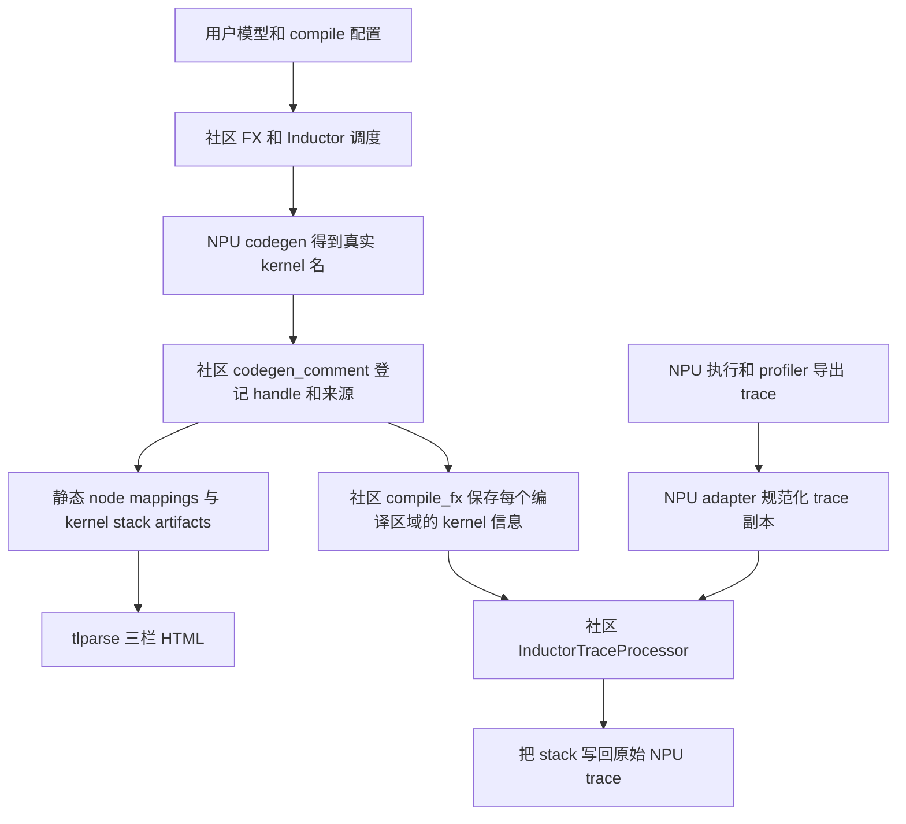
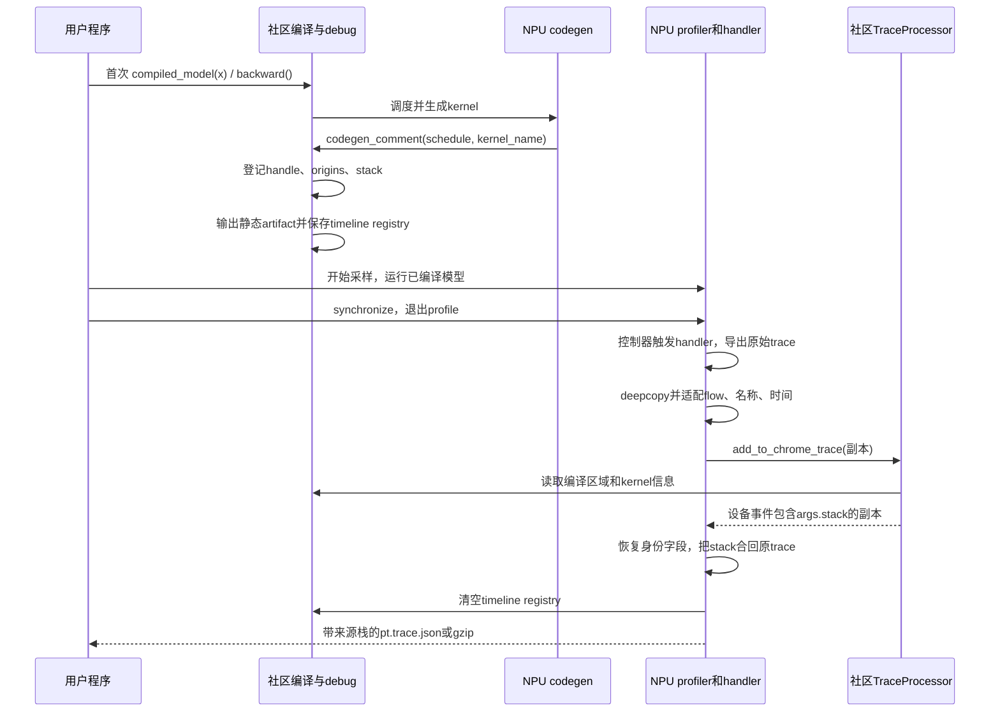

# PyTorch Feature 设计与实现分析

> 主题：`triton_experimental` provenance PR 逐段 diff、代码与调用栈导读
>
> 最后更新：2026-09-18（CST，UTC+08:00）
>
> 阅读对象：想从“会使用”进一步理解“改了什么、为什么有效、如何修改”的开发者。

## 9 月 18 日补充：当前 PR 与历史讲解的区别

当前 PR 为 `ec693356f → 195830924`，关联需求 [#4909](https://gitcode.com/Ascend/pytorch/issues/4909)。
可下载[当前完整非测试补丁](./diffs/triton_experimental_provenance_ec693356f_195830924_non_tests.patch)，
仍完整覆盖 21 个非测试文件，包含图片二进制内容。下文逐段讲解仍固定在原历史快照，
避免把原始代码框、产物版本和后续 rebase 混在一起。

相较原讲解，新增产品修改只有公开导出层的模块元数据修复：

```diff
 from ._inductor_profiler import inductor_trace_handler

+inductor_trace_handler.__module__ = __name__
+
 __all__ = [
```

该修复让用户入口声明属于 `torch_npu.profiler`，不改变函数身份、签名或 trace 算法。
新增回归检查导出列表、模块名和 pickle 往返；测试代码仍按要求不在这里展开。
详见[API 修复与验证](./pr_46073_api_fix.md)。
新基线中的 `indexing` / `npu_expand` 参数兼容来自上游 `13570cf9d`，不是本 PR 新增修改，
不能算进本 PR 的功能 diff。版本、CI 和推送记录见[工作记录](./work_records/README.md)。

## 历史完整逐段讲解（固定 BASE / HEAD）

以下对应 [Ascend/pytorch PR !46073][pr] 的固定交付快照，以 **BASE→HEAD 的完整非测试 diff** 为主线。
按本次要求排除 `test/**`：正文和附带补丁均完整覆盖其余 **21 个文件，3890 行新增、9 行删除（行数不含两张 PNG 的二进制内容）**。
用户只想运行功能时，先看[仓库 README 使用方法](../README.md#用户使用方法)；
本文解释这些用法背后的代码。整体需求、官网契约和验收矩阵见[主交付文档](./provenance_delivery.md)。

| 对象 | 本文固定版本 / 作用 |
| --- | --- |
| torch_npu 比较基线（BASE） | `f030beadb051d882c0dd697f54f8aeac8c5a5f7d`，2026-09-11 rebase 的官方 master |
| torch_npu 功能提交（HEAD） | `dbc0db52fa3384575fd83cc4db23c15a298f802d` |
| 提交组织 | 功能实现已 squash 为 `00256261d`；HEAD 另包含 `dbc0db52f` 的 README 截图补充；演示目录已迁入实验后端 |
| 配套社区 PyTorch 源码 | `8e86e0a23e3679c2bf3406cf0837fcb6297a5d9b`，项目使用的 `release/2.14` 源码基线 |
| 官网使用契约 | [PyTorch 2.13 provenance 文档][official]；内部调用细节以以上固定 PyTorch 源码为准 |
| 历史实测产物 | 本仓 `docs/triton_experimental/artifacts/`；保留各自原始版本、时间与设备记录 |

2026-09-11 rebase 后进行了 Python 语法、JSON 格式和 diff 空白检查，之后完成 squash、
README 调整与资料目录迁移。本次补全文档没有重新执行 NPU 验证；历史 HTML/trace
**不等于当前 HEAD 的重新实测**，本页也不代表实时查询后的 PR/CI 状态。

旧版讲解仅附带三个实现文件的补丁。本版改为：三个实现文件的完整 diff 直接展开；
16 个文档、脚本、HTML/JSON 文本文件的完整 diff 放在可展开代码框中，每个文件均有用途说明。
两张新增 PNG 另列原图链接、校验值和用途，完整可还原的二进制内容收录在下载补丁中。
折叠仅影响显示，不删行；需要离线逐字审阅时，下载[完整非测试 unified diff](./diffs/triton_experimental_provenance_f030beadb_dbc0db52f_non_tests.patch)。
测试的原有覆盖说明保留作为导航，但不展开测试源码或测试 diff。

版本说明：从旧讲解的 `4845c9289` 到本页 HEAD，三个实现文件和三个测试文件的内容未变；
变化在 README、资料位置和两张截图。本页检查期间出现截图提交，因此固定 HEAD 更新为 `dbc0db52f`；
此后分支再变化，也应重新核对版本，而不是把后续变化自动视为本页已覆盖。
原始 HTML/JSON 中记载的旧路径、日期、版本是历史证据，保持原样。

在源码仓复核本页覆盖范围（前提是本地已有两个 commit）：

```bash
git diff --stat f030beadb051d882c0dd697f54f8aeac8c5a5f7d \
  dbc0db52fa3384575fd83cc4db23c15a298f802d -- . ':(exclude)test/**'
git diff --no-ext-diff --no-color --full-index --binary \
  f030beadb051d882c0dd697f54f8aeac8c5a5f7d \
  dbc0db52fa3384575fd83cc4db23c15a298f802d -- . ':(exclude)test/**'
```

补丁是固定版本的源码差异，不是安装包，也不包含测试文件。所有下文标为“完整 diff”的代码框
均来自上述命令；PNG 的 Git binary patch 也包含在下载文件内，不是只有“Binary files differ”的占位。
正文不展开不可读的二进制编码；后续用于讲解的 Python/JSON 摘录和示意调用链会另行标明。

完整性校验记录（2026-09-15）：下载补丁与固定 BASE→HEAD 的 Git 输出逐字节一致，
正文的 19 个文本 diff 与补丁对应段逐字一致，两个 PNG 的 SHA-256 已按提交内容核对；
对固定 HEAD 执行 `git apply --reverse --check` 通过（只检查，不应用）。
Markdown 渲染确认 19 个完整文件 diff 代码框和 16 个可展开资料块；本地链接及固定提交中的源码路径已核对。
2026-09-16 为 schema 转换的七个步骤补充就近 diff 片段；这些重复展示的讲解片段不计为新的文件变更。
保留 unified diff 中五个仅含一个空格的上下文行，因此 `git diff --check` 会对这五行提示
trailing whitespace；它们不是正文排版空格，也不在此手工删除以破坏原始 diff 一致性。

```text
完整非测试补丁 SHA-256:
8d9295f581aa0bd4584f85cce3e29d853608d2f403cc16ca0feada403848ae3e
```

## 模块设计目标与背景

### 1. 为什么需要这次 diff

假设用户模型包含三行计算：

```python
added = x + 1
activated = torch.relu(added)
return activated * 2
```

Inductor 可以把三步融合为一个 Triton kernel。现在有两个具体问题：

1. 看生成代码时，如何确定该 kernel 对应 `add/relu/mul` 哪些图节点？
2. 看 profiler 时，如何把实际执行的设备 kernel 事件定位回上面三行源码？

社区已经有“登记来源→生成 mapping→解析 trace”的主体实现。本次 NPU diff 接上两个位置：
`NPUTritonScheduling` 的真实 kernel 发射位置，以及 Ascend profiler trace 的导出后处理位置。

### 2. 先分清三种“栈”和两种时间

| 名称 | 具体内容 | 如何得到 / 如何阅读 |
| --- | --- | --- |
| 框架函数调用链 | `codegen_node_schedule → codegen_comment → set_kernel_post_grad_provenance_tracing` | 本文按源码整理；用来找修改位置 |
| kernel 对应的模型源码栈 | `File ...static_probe.py, line 20, in forward` 等字符串 | 编译期从 FX/IR 来源提取，保存在 `stack_traces` |
| profiler 中的 `args.stack` | 某个设备 kernel 事件携带的上述模型源码栈 | 运行后把编译期信息关联到 trace 事件 |

本文标为“调用链”的代码框是静态源码导读，不是某次运行采集的 Python traceback。
`args.stack` 是来源信息回填，也不是在 NPU kernel 执行现场逐层采集的 Python 调用栈。

`codegen_comment()` 发生在**编译时**；生成的 `.run()` 才在模型执行时发射 kernel。
每次编译期登记分配的 debug handle（例如 `:1`）标识生成代码里的调用位置，
不表示“只执行过一次”，也不会在每次模型迭代时自动递增。
依据：[PyTorch `debug.py::set_kernel_post_grad_provenance_tracing`][pt-debug]、
[`ir.py::IRNode.get_stack_traces`][pt-ir]。

## 整体设计架构

### 1. PR 文件分工

整个 PR 共 24 个变更文件；本页覆盖其中 21 个非测试文件：19 个文本完整 diff 和 2 张图片的完整二进制补丁入口。核心实现集中于三个文件：

| 文件 | 改动性质 | 需要审查的问题 |
| --- | --- | --- |
| [`torch_npu/_inductor/triton_experimental/codegen/triton.py`][npu-triton] | 修改：7 行增加、3 行删除 | 何时拿到真实 kernel 名？普通、partial、combine 是否分别登记？ |
| [`torch_npu/profiler/__init__.py`][npu-init] | 修改：导出 handler，兼有 import / `__all__` 排版调整 | 用户能否从公共 namespace 导入？ |
| [`torch_npu/profiler/_inductor_profiler.py`][npu-profiler] | 新增 363 行 | Ascend schema、名字、flow、时间值如何适配并恢复？ |
| [`test/_inductor/test_triton_experimental_provenance.py`][test-static] | 新增专项测试文件 | level 0/1/2、rsplit 登记、动态重编译 |
| [`test/profiler/test_inductor_profiler.py`][test-profiler] | 新增 | trace 适配边界与前反向运行验证 |
| [`test/profiler/test_inductor_provenance_models.py`][test-models] | 新增 | Llama / ConvNeXt / Transformer 模块级验证 |
| `torch_npu/_inductor/triton_experimental/docs/inductor_provenance_demo/triton_experimental/` | 16 份文本说明、脚本、HTML / JSON，加 2 张 PNG；逐文件讲解并提供完整差异 | 证据的版本、覆盖范围与限制 |


#### 非测试完整 diff 定位表（21/21）

| 文件 | 完整 diff 与讲解位置 |
| --- | --- |
| `torch_npu/profiler/__init__.py` | [公共 API 导出](#diff-profiler-init) |
| `torch_npu/_inductor/triton_experimental/codegen/triton.py` | [全部四个 codegen hunk](#diff-npu-codegen) |
| `torch_npu/profiler/_inductor_profiler.py` | [全部 363 行新增实现与逐函数索引](#diff-npu-profiler) |
| 演示目录 / `README.md` | [用户用法与社区对齐矩阵](#diff-demo-readme) |
| 演示目录 / `static_probe.py` | [静态映射探针](#diff-demo-static-probe) |
| 演示目录 / `timeline_probe.py` | [普通前向和反向 timeline 探针](#diff-demo-timeline-probe) |
| 演示目录 / `rsplit_timeline_probe.py` | [rsplit 双 launch timeline 探针](#diff-demo-rsplit-probe) |
| 演示目录 / `provenance_ab_probe.py` | [关闭和开启 provenance 的因果排查探针](#diff-demo-ab-probe) |
| 演示目录 / `node_mappings.json` | [静态节点映射证据](#diff-demo-node-mappings) |
| 演示目录 / `kernel_stack_traces.json` | [编译期 kernel 源码栈证据](#diff-demo-kernel-stacks) |
| 演示目录 / `static_result.json` | [level 1 静态结果](#diff-demo-static-result) |
| 演示目录 / `static_level2_result.json` | [level 2 静态结果](#diff-demo-static-level2-result) |
| 演示目录 / `timeline_forward_backward_result.json` | [前向和反向 timeline 摘要](#diff-demo-forward-backward-result) |
| 演示目录 / `timeline_forward_backward_trace.json` | [前向和反向完整 timeline](#diff-demo-forward-backward-trace) |
| 演示目录 / `timeline_rsplit_result.json` | [rsplit timeline 摘要](#diff-demo-rsplit-result) |
| 演示目录 / `timeline_rsplit_trace.json` | [rsplit 完整 timeline](#diff-demo-rsplit-trace) |
| 演示目录 / `model_validation_result.json` | [模型验证范围记录](#diff-demo-model-result) |
| 演示目录 / `provenance_ab_result.json` | [后端失败的 A/B 对照记录](#diff-demo-ab-result) |
| 演示目录 / `provenance_tracking.html` | [完整三栏可视化证据](#diff-demo-html) |
| 演示目录 / `images/tlparse_three_panel.png` | [三栏截图及完整二进制补丁](#diff-demo-image-three-panel) |
| 演示目录 / `images/timeline_stack.png` | [timeline 截图及完整二进制补丁](#diff-demo-image-timeline) |

“演示目录”指上表的实验后端 docs 目录；每个文件的完整路径也保留在对应 diff 的文件头中。

PyTorch 的 `debug.py`、`compile_fx.py`、`profiler.py` 和 tlparse 均为本文引用的配套实现，
**不是这份 torch_npu PR 新增的修改**。例如 backward graph key 的匹配规则属于配套 PyTorch
处理器，不能误读为本 PR 又实现了一套自动求导机制。

### 2. 组件如何协作



这里有两条数据关系：静态 HTML 使用“图节点↔kernel 调用”的 mapping；运行时使用
“编译区域 + kernel 名 + flow / 事件范围”把执行事件关联到编译期源码信息。
两者复用来源数据，但不是同一个输出文件，也不能仅凭 HTML 正常就断言 timeline 正常。

## 入口分析

### 1. 用户代码入口与 diff 的关系

下面展示的是可加入用户程序的核心片段；`model`、`make_input()` 由用户程序提供，
输入需适合该模型且能参与求导。完整独立用法见[README](../README.md#用户使用方法)。

```python
import torch
import torch_npu
from torch._inductor import config
from torch_npu.profiler import inductor_trace_handler

with config.patch({
    "trace.provenance_tracking_level": 1,
    "trace.provenance_tracking_to_timeline": True,
    "triton.unique_kernel_names": True,
}):
    compiled_model = torch.compile(
        model, backend="inductor",
        options={"npu_backend": "triton_experimental"},
    )
    warmup_x = make_input()
    compiled_model(warmup_x).sum().backward()
    torch.npu.synchronize()

    handler = inductor_trace_handler("/tmp/my_npu_timeline", worker_name="rank0")
    profile_x = make_input()
    with torch_npu.profiler.profile(on_trace_ready=handler):
        compiled_model(profile_x).sum().backward()
        torch.npu.synchronize()
```

`torch.compile` 返回可调用对象；通常首次实际调用才执行编译，首次 backward 也可能触发
反向编译。因此 `config.patch` 覆盖预热、采样和 handler 执行全过程。
这里 `.sum()` 将输出归约成可直接 `.backward()` 的标量；它本身不说明 reduction 必然在
模型的已编译图内部。预热还会累加参数梯度，真实训练程序应按自己的梯度累积策略清理。

| 开关 / 参数 | 读取方 | 对本次 diff 的影响 |
| --- | --- | --- |
| `options={"npu_backend": "triton_experimental"}` | torch_npu 编译后端配置 | 进入本次修改的 NPU 调度实现 |
| `trace.provenance_tracking_level` | 社区 `config.effective_provenance_tracking_level()` | 控制登记来源及其详细程度 |
| `trace.provenance_tracking_to_timeline` | 社区 `compile_fx_inner` 和 NPU `handler_fn` | 编译期保存 registry，导出时启用回填 |
| `triton.unique_kernel_names` | 社区 codegen / profiler | 使生成 kernel 名具有足够的区分度 |
| `dir_name` / `worker_name` | NPU `inductor_trace_handler` | 输出目录和文件名前缀；省略 worker 名时用主机名与 PID |
| `use_gzip` | NPU `inductor_trace_handler` | 先处理临时 JSON，再压缩成 `.pt.trace.json.gz` |

环境变量在导入配置前设置：`INDUCTOR_PROVENANCE` 对应 level，
`TORCH_COMPILE_DEBUG_EXTEND=1` 对应 timeline 开关，
`TORCHINDUCTOR_UNIQUE_KERNEL_NAMES=1` 对应 unique kernel names。
`TORCH_TRACE` 指定静态结构化日志目录。有效 level 还受 timeline / debug 设置影响，
所以 level 0 关闭测试必须确保没有其他开关把有效 level 提升到 1。
依据：[PyTorch `config.py::trace` / `effective_provenance_tracking_level`][pt-config]。

<a id="diff-profiler-init"></a>

### 2. 公共 API 完整 diff

文件：`torch_npu/profiler/__init__.py`，公共 namespace：`torch_npu.profiler`。
下面保留全部改动，包括 import 和 `__all__` 的排版变化：

```diff
diff --git a/torch_npu/profiler/__init__.py b/torch_npu/profiler/__init__.py
index 12396b49bf5ba26538a465e8b8fdb2d85f96cdb3..87a64c34bd917fdd44154c1055c6e2a8b43063e0 100644
--- a/torch_npu/profiler/__init__.py
+++ b/torch_npu/profiler/__init__.py
@@ -3,14 +3,38 @@ from torch_npu._C._profiler import ProfilerActivity
 from .profiler import (
     profile,
     _KinetoProfile,
-    tensorboard_trace_handler)
+    tensorboard_trace_handler,
+)
 from .profiler_interface import supported_activities
 from .scheduler import Schedule as schedule
 from .scheduler import ProfilerAction
-from .experimental_config import _ExperimentalConfig, supported_profiler_level, supported_ai_core_metrics, \
-    supported_export_type, ProfilerLevel, AiCMetrics, ExportType, HostSystem
+from .experimental_config import (
+    _ExperimentalConfig,
+    supported_profiler_level,
+    supported_ai_core_metrics,
+    supported_export_type,
+    ProfilerLevel,
+    AiCMetrics,
+    ExportType,
+    HostSystem,
+)
 from ._non_intrusive_profile import _NonIntrusiveProfile
+from ._inductor_profiler import inductor_trace_handler
 
-__all__ = ["profile", "ProfilerActivity", "supported_activities", "tensorboard_trace_handler", "schedule",
-           "ProfilerAction", "_ExperimentalConfig", "supported_profiler_level", "supported_ai_core_metrics",
-           "supported_export_type", "ProfilerLevel", "AiCMetrics", "ExportType", "HostSystem"]
+__all__ = [
+    "profile",
+    "ProfilerActivity",
+    "supported_activities",
+    "tensorboard_trace_handler",
+    "schedule",
+    "ProfilerAction",
+    "_ExperimentalConfig",
+    "supported_profiler_level",
+    "supported_ai_core_metrics",
+    "supported_export_type",
+    "ProfilerLevel",
+    "AiCMetrics",
+    "ExportType",
+    "HostSystem",
+    "inductor_trace_handler",
+]
```

功能性新增是导入并导出 `inductor_trace_handler`；其余已有导出项没有删除，只改为多行排版。
调用流程仍是 `inductor_trace_handler(...) → handler_fn → profiler 的 on_trace_ready`。
准确说，这是本次新增的 **NPU timeline 可选导出回调入口**，不是整个 provenance 的唯一入口：
静态 HTML 使用配置、`TORCH_TRACE` 和 tlparse，不需要这个 handler。

仅 import 不会开始采样；仅打开 timeline 开关，也不会让现有普通导出回调自动执行这段 NPU
后处理。用户要同时在编译前开启配置，并将返回的回调传给 `profile(on_trace_ready=...)`。
这个接口需要安装包含本 PR 实现的 torch_npu，不能泛化为所有已发布版本均可导入。
依据：[`torch_npu/profiler/__init__.py`][npu-init]、
[`_inductor_profiler.py::inductor_trace_handler`][npu-profiler]。

## 完整调用链分析

<a id="diff-npu-codegen"></a>

### 阶段 1：普通 kernel 的一行参数为什么决定映射是否存在

位置：[`NPUTritonScheduling.codegen_node_schedule`][npu-triton]，HEAD 约 5516 行。
下面是 `torch_npu/_inductor/triton_experimental/codegen/triton.py` 的**完整 diff**，
共四个 hunk；普通路径和 rsplit 的全部修改均在这里，不省略 diff 头或变更行：

```diff
diff --git a/torch_npu/_inductor/triton_experimental/codegen/triton.py b/torch_npu/_inductor/triton_experimental/codegen/triton.py
index 1a6a23d083ba8fc68d17d675473f1046adf69f01..8d603a4535631a098de8f2f4d412121c9035ae6a 100644
--- a/torch_npu/_inductor/triton_experimental/codegen/triton.py
+++ b/torch_npu/_inductor/triton_experimental/codegen/triton.py
@@ -5513,10 +5513,12 @@ class NPUTritonScheduling(TritonScheduling):
             for node in kernel_features.scheduler_nodes():
                 node.mark_run()
 
-        self.codegen_comment(node_schedule)
         if rsplit_kernel is not None and combine_info is not None:
-            self._npu_call_rsplit_kernels(rsplit_kernel, combine_info)
+            self._npu_call_rsplit_kernels(
+                rsplit_kernel, combine_info, node_schedule
+            )
         else:
+            self.codegen_comment(node_schedule, final_kernel.kernel_name)
             final_kernel.call_kernel(final_kernel.kernel_name)
 
         if config.nan_asserts:
@@ -5705,7 +5707,7 @@ def {combine_name}(in_ptr0, out_ptr0, xnumel, r0_numel, XBLOCK : tl.constexpr, R
             "triton_meta": triton_meta,
         }
 
-    def _npu_call_rsplit_kernels(self, partial, combine_info):
+    def _npu_call_rsplit_kernels(self, partial, combine_info, node_schedule):
         """Emit the two-stage launch into the wrapper:
             alloc workspace
             partial(... , ws)        # writes per-core partials
@@ -5726,6 +5728,7 @@ def {combine_name}(in_ptr0, out_ptr0, xnumel, r0_numel, XBLOCK : tl.constexpr, R
         for wsarg in partial.args.workspace_args:
             wrapper.generate_workspace_allocation(wsarg)
 
+        self.codegen_comment(node_schedule, partial.kernel_name)
         wrapper.generate_kernel_call(
             partial.kernel_name,
             p_call_args,
@@ -5754,6 +5757,7 @@ def {combine_name}(in_ptr0, out_ptr0, xnumel, r0_numel, XBLOCK : tl.constexpr, R
             int,
             int,
         ]
+        self.codegen_comment(node_schedule, combine_info["kernel_name"])
         wrapper.generate_kernel_call(
             combine_info["kernel_name"],
             c_call_args,
```

第一个 hunk 把统一的无名称登记改为按发射路径登记，并把 `node_schedule` 传入 rsplit。
第二个 hunk 扩充 rsplit 方法签名；第三、第四个 hunk 分别在 partial/combine 发射前登记。
普通路径在本阶段解释，rsplit 的 workspace 与调用顺序见阶段 3。

关键在社区父类 [`TritonScheduling.codegen_comment`][pt-triton]，约 8107 行。
下列是原样摘取的关键分支：

```python
        if kernel_name:
            debug_handle = set_kernel_post_grad_provenance_tracing(
                node_schedule,  # type: ignore[arg-type]
                kernel_name,
            )
            wrapper.write_provenance_debug_handle(kernel_name, debug_handle)
```

修改前没有传 `kernel_name`，默认值为 `None`；函数前半段仍可写普通来源注释，
但不会进入上述登记分支。于是“看得到注释”不意味着已有 kernel mapping。
修改后，在 `define_kernel` 得到最终名称、scheduler node 被标记运行之后，
把 `final_kernel.kernel_name` 和对应 `node_schedule` 一起传入，社区登记中心就能关联两者。

这不是以字符串解析 kernel 名来推断算子。真正的节点来源来自 scheduler node 所持 IR 的
`origins`；kernel 名作为关联 key。`node_schedule` 里还可能有 reduction 控制标记，
社区登记函数会跳过 `EnableReduction` / `DisableReduction`。
依据：[`debug.py::set_kernel_post_grad_provenance_tracing`][pt-debug]。

框架调用链（聚焦普通 SIMD/Triton 分支；图捕获与 lowering 在到达调度器前已经发生）：

```text
社区 Scheduler 调度该融合节点
  → get_backend(device).codegen_node(node)
  → 社区 SIMDScheduling.codegen_node(...)
    → SIMDScheduling._codegen_nodes(...)
      → generate_node_schedule(...) → SIMDKernelFeatures(...)
      → NPUTritonScheduling.codegen_node_schedule(kernel_features)
        → create_kernel_choices(...) / codegen_node_schedule_with_kernel(...)
        → kernel.codegen_kernel() / self.define_kernel(...)
        → 得到 final_kernel.kernel_name
        → 社区 TritonScheduling.codegen_comment(node_schedule, kernel_name)
          → debug.set_kernel_post_grad_provenance_tracing(...)
            → 遍历 snode.node.origins，收集 post-grad 节点名
            → snode.node.get_stack_traces()，收集模型源码栈
            → 分配 debug handle，更新编译期映射和 stack 字典
          → WrapperCodeGen.write_provenance_debug_handle(...)
        → final_kernel.call_kernel(...) 生成调用代码
```

源码导航：[`scheduler.py`][pt-scheduler]、[`codegen/simd.py::SIMDScheduling`][pt-simd]、
[`codegen/triton.py::TritonScheduling.codegen_comment`][pt-triton]、
[`codegen/wrapper.py::WrapperCodeGen.write_provenance_debug_handle`][pt-wrapper]。

### 阶段 2：登记的数据是什么，为什么有 `:1`

社区登记函数在有效 level 非零时，先递增计数器，再生成带 handle 的 key：

```python
        _inductor_kernel_provenance_debug_handle += 1
        stack_traces: list[str] = []
        kernel_name = f"{kernel_name}:{_inductor_kernel_provenance_debug_handle}"
```

这个 key 同时进入两个字典：

| 数据结构（`torch/_inductor/debug.py`） | 内容 | 后续用途 |
| --- | --- | --- |
| `_inductor_triton_kernel_to_post_grad_node_info` | `kernel:handle → [post 节点名]` | 构造 `cppCodeToPost`，再反转生成 `postToCppCode` |
| `_inductor_kernel_stack_trace` | `kernel:handle → [源码栈字符串]` | 静态 stack artifact，以及 timeline 编译信息 |
| `get_kernel_information_jsons()` 返回的 registry | `编译区域 key → kernel 信息字典` | 区分前向、反向、不同重编译图，并供 trace 处理器查询 |

注意第三项由后面的 `compile_fx_inner` 填充；不是在每次 `codegen_comment` 中立即写入。
静态 key 中的 handle 能区分同名 kernel 的生成调用位置，但不代表 NPU profiler 会原样输出
带 `:handle` 的事件名。timeline 处理器还要结合编译区域和 kernel 名前缀查找。

下面是本仓[真实静态 mapping](./triton_experimental/artifacts/static_smoke/node_mappings.json)
中的内容，仅做格式化，未更换节点名：

```json
{
  "preToPost": {"added": ["add"], "activated": ["relu"], "mul": ["mul"]},
  "postToPre": {"add": ["added"], "relu": ["activated"], "mul": ["mul"]},
  "cppCodeToPost": {"triton_unk_fused_add_mul_relu_0:1": ["mul", "relu", "add"]},
  "postToCppCode": {
    "mul": ["triton_unk_fused_add_mul_relu_0:1"],
    "relu": ["triton_unk_fused_add_mul_relu_0:1"],
    "add": ["triton_unk_fused_add_mul_relu_0:1"]
  }
}
```

逐项理解：左栏 `activated` 对应中栏 `relu`；中栏 `relu` 再对应右栏
`triton_unk_fused_add_mul_relu_0:1`。多个中栏节点指向一个 key，正是多算子融合。
这里 `cppCodeToPost` 是社区 schema 的字段名，不代表这个 kernel 用 C++ 编写。

对应的[真实 stack artifact](./triton_experimental/artifacts/static_smoke/kernel_stack_traces.json)
包含下面一条来源（路径为当时实际生成时记录的路径）：

```text
  File "/home/z50063656/Tracking/worktrees/torch_npu_triton_provenance_delivery/docs/inductor_provenance_demo/triton_experimental/static_probe.py", line 20, in forward
    activated = torch.relu(added)
                ^^^^^^^^^^^^^^^^^
```

同一个 key 还包含 `added = x + 1`、`return activated * 2` 的栈。
这三条栈描述该融合 kernel 的来源集合；顺序不应解释成 kernel 内部执行这些 Python 行的顺序。

### 阶段 3：为什么 rsplit 必须登记两次

位置：[`NPUTritonScheduling._npu_call_rsplit_kernels`][npu-triton]，约 5710 行。
rsplit 把一次归约拆成 partial 和 combine 两个 kernel：前者写中间 workspace，
后者合并局部结果。原函数直接使用 wrapper 发射它们，因此需要在每次发射前提供各自名称。

完整修改已在[阶段 1 的四个 hunk](#diff-npu-codegen)中逐行保留；这里解释后三个 hunk 的调用关系。
传入 `node_schedule` 的目的，是让两次登记都能读取这次归约的来源节点；
不是给第二个 kernel 重新构造一份假的 FX 图。

```text
NPUTritonScheduling.codegen_node_schedule
  → 生成 partial / combine，并确定各自 kernel_name
  → _npu_call_rsplit_kernels(partial, combine_info, node_schedule)
    → write_triton_header_once()
    → 构建 partial 参数并分配 workspace
    → codegen_comment(node_schedule, partial.kernel_name)    # 第一次登记
    → wrapper.generate_kernel_call(partial.kernel_name, ...)
    → 构建 combine 参数
    → codegen_comment(node_schedule, combine_info["kernel_name"])  # 第二次登记
    → wrapper.generate_kernel_call(combine_info["kernel_name"], ...)
    → 按逆序释放 workspace
```

生成代码的关系可以用以下**示意代码**理解；名称、参数和 handle 为示例：

```python
# [Provenance debug handles] triton_partial:1
triton_partial.run(...)
# [Provenance debug handles] triton_combine:2
triton_combine.run(...)
```

两次登记可以拥有相同 post-grad 来源集合，但 key 不同；因此它们在 timeline 上都能获得
来源栈。这里的来源粒度是共享的归约调度，不承诺为 combine 创建一个独立用户源码行。

这也解释了为什么“双 launch 验证”不能作为社区 `ComboKernel` 的通过证据：
本路径是两个有先后依赖的 kernel 调用；社区 combo codegen 有自己的组合与调度机制。
本 PR 的两次 `generate_kernel_call` 没有自动赋予该后端 ComboKernel 支持。

### 阶段 4：静态 HTML 如何消费新增映射

在当前 PyTorch 源码中，`_compile_fx_inner` 编译生成模块之后调用
`debug.dump_inductor_provenance_info()`，并把结果通过 `trace_structured("artifact", ...)`
输出到结构化编译日志。
依据：[`compile_fx.py::_compile_fx_inner`][pt-compile]，约 1755 行。

```text
_compile_fx_inner
  → graph.compile_to_module()，内部完成 codegen 和 provenance 登记
  → debug.dump_inductor_provenance_info()
    → create_node_mapping_kernel_to_post_grad(...)
    → 合并 preToPost/postToPre 和 cppCodeToPost/postToCppCode
    → trace.enabled 时另外写本地 mapping JSON
  → trace_structured：inductor_provenance_tracking_node_mappings
  → trace_structured：inductor_provenance_tracking_kernel_stack_traces
  → TORCH_TRACE 日志文件

另一个进程：tlparse <具体日志文件> --inductor-provenance
  → 读取图、生成代码与 mapping artifacts
  → 把节点名 / kernel handle 关联到页面行号
  → 三栏高亮
```

`trace.enabled` 的本地 debug 文件与 `TORCH_TRACE` 的结构化日志是两个输出通道。
静态单测为了直接读取临时目录下的 JSON，显式开启前者；用户生成 HTML 按官网使用
`TORCH_TRACE` 即可。具体 artifacts 和三栏语义见[官网文档][official]及
[该版本官方文档源文件][pt-doc]。

### 阶段 5：编译期 registry 为什么要在 profiler 之前准备好

位置：[`compile_fx.py::compile_fx_inner`][pt-compile]，约 927 行，社区已有逻辑：

```python
        if config.trace.provenance_tracking_to_timeline:
            compile_id = torch._guards.CompileContext.current_compile_id()
            kernel_information_jsons = get_kernel_information_jsons()
            key = str((f"Torch-Compiled Region: {compile_id}", kwargs["is_backward"]))
            if key not in kernel_information_jsons:
                kernel_information_jsons[key] = create_kernel_information_json()
```

输入是刚完成的图编译与 provenance 全局数据；输出是一个按编译区域分组的 registry。
`create_kernel_information_json()` 将 stack、post 节点、可追溯的 pre 节点等整理成 kernel 信息。
其结构可用以下**示意 JSON**表示：

```json
{
  "('Torch-Compiled Region: 0/0', False)": {
    "triton_unk_fused_add_mul_relu_0:1": {
      "stack_traces": ["File ...model.py, line 20, in forward ..."],
      "post_grad_nodes": ["add", "relu", "mul"],
      "pre_grad_nodes": ["added", "activated", "mul"],
      "extern_semantic_key": null
    }
  }
}
```

`False` 表示前向图，反向图用 `True`；编译区域名还含 compile ID。
同名 kernel 可能出现在不同图内，不能把所有图的 stack 按 kernel 名粗暴合并。
先预热 forward/backward，是为了让采样时的执行有相应编译信息，并减少首次编译活动对
timeline 的干扰。registry 是否齐全还依赖实际编译、cache 与采样窗口生命周期；
本 PR 未新增持久化 registry 或保证任意多窗口复用。

### 阶段 6：退出 profiler 到 NPU handler 的真实调用路径

位置：[`profiler.py::profile.__exit__ / stop`][npu-profile-entry]、
[`_profiler_action_controller.py::ProfActionController`][npu-controller]。

```text
with torch_npu.profiler.profile(on_trace_ready=handler) 退出
  → profile.__exit__()
  → profile.stop()
  → action_controller.transit_action(current_action, None)
  → 按当前 action 执行 stop_trace / finalize_trace / _trace_ready
  → ProfActionController._trace_ready()
  → self.on_trace_ready(self.prof)
  → _inductor_profiler.inductor_trace_handler 返回的 handler_fn(prof)
    → prof.export_chrome_trace(output_path)
      → _KinetoProfile.export_chrome_trace
      → prof_if.analyse(EXPORT_CHROME_TRACE, output_path)
    → timeline 开关打开时，_add_inductor_provenance(output_path)
```

上面对应结束时有可导出采样的路径；如果当前 action 只有 warmup，控制器不会把它当作
完整 trace 导出。使用 profiler schedule 时，`step()` 的状态切换也可触发回调。

NPU handler 中普通 JSON 分支为：

```python
        else:
            prof.export_chrome_trace(output_path)
            if provenance_enabled:
                _add_inductor_provenance(output_path)
```

`inductor_trace_handler(...)` 本身只是创建闭包；真正的导出与回填在 profiler 调用该闭包时
发生。gzip 分支则使用临时 JSON 完成同样的处理，最后压缩输出。
依据：[`_inductor_profiler.py::inductor_trace_handler`][npu-profiler]，327–363 行。

<a id="diff-npu-profiler"></a>

### 阶段 7：新增 NPU profiler 文件的完整 diff 与适配逻辑

文件：`torch_npu/profiler/_inductor_profiler.py`，属于 `torch_npu.profiler` 模块。
这是新增文件，因此下面 **363 行源码全部为新增行**；保留文件头、import、常量、所有辅助函数、
异常分支及公共 handler，没有使用省略号替代代码。

```diff
diff --git a/torch_npu/profiler/_inductor_profiler.py b/torch_npu/profiler/_inductor_profiler.py
new file mode 100644
index 0000000000000000000000000000000000000000..f344ed0be7d52c5ec6c71578cf5693abc7882124
--- /dev/null
+++ b/torch_npu/profiler/_inductor_profiler.py
@@ -0,0 +1,363 @@
+import copy
+import gzip
+import json
+import logging
+import os
+import socket
+import tempfile
+import time
+from collections import defaultdict
+from typing import Any
+
+import torch._inductor.config as inductor_config
+
+
+__all__ = ["inductor_trace_handler"]
+
+log = logging.getLogger(__name__)
+
+_FLOW_NAMES = {"fwdbwd", "torch_to_npu"}
+_ORIGINAL_KERNEL_NAME_ARG = "_npu_inductor_original_kernel_name"
+# Ascend profiler keeps the trailing 49 characters of long kernel names.
+_PROFILER_KERNEL_NAME_MAX_LENGTH = 49
+
+
+def _event_coordinate(event: dict[str, Any]) -> tuple[str, str, str]:
+    return str(event.get("pid")), str(event.get("tid")), str(event.get("ts"))
+
+
+def _trace_events(trace: object) -> tuple[list[dict[str, Any]], bool]:
+    if isinstance(trace, list):
+        return [event for event in trace if isinstance(event, dict)], True
+    if isinstance(trace, dict) and isinstance(trace.get("traceEvents"), list):
+        return [
+            event for event in trace["traceEvents"] if isinstance(event, dict)
+        ], False
+    raise TypeError(
+        f"Unsupported NPU profiler trace root: {type(trace).__name__}"
+    )
+
+
+def _has_kernel_info(
+    compile_info: dict[str, dict[str, Any]], kernel_name: str
+) -> bool:
+    kernel_prefix = kernel_name + ":"
+    return any(
+        kernel_name in graph_info
+        or any(name.startswith(kernel_prefix) for name in graph_info)
+        for graph_info in compile_info.values()
+    )
+
+
+def _experimental_kernel_name(
+    compile_info: dict[str, dict[str, Any]],
+    profile_name: str,
+    truncated_kernel_names: dict[str, str | None] | None = None,
+) -> str:
+    if profile_name.startswith("k_"):
+        logical_name = "triton_unk_" + profile_name.removeprefix("k_")
+        if _has_kernel_info(compile_info, logical_name):
+            return logical_name
+
+    if _has_kernel_info(compile_info, profile_name):
+        return profile_name
+
+    if len(profile_name) != _PROFILER_KERNEL_NAME_MAX_LENGTH:
+        return profile_name
+
+    if truncated_kernel_names is None:
+        truncated_kernel_names = _truncated_kernel_name_map(compile_info)
+    return truncated_kernel_names.get(profile_name) or profile_name
+
+
+def _truncated_kernel_name_map(
+    compile_info: dict[str, dict[str, Any]],
+) -> dict[str, str | None]:
+    truncated_kernel_names: dict[str, str | None] = {}
+    for graph_info in compile_info.values():
+        for name in graph_info:
+            kernel_name, separator, handle = name.rpartition(":")
+            if not separator or not handle.isdecimal():
+                kernel_name = name
+            if not kernel_name.startswith("triton_"):
+                continue
+            if len(kernel_name) <= _PROFILER_KERNEL_NAME_MAX_LENGTH:
+                continue
+            profile_name = kernel_name[-_PROFILER_KERNEL_NAME_MAX_LENGTH:]
+            previous_name = truncated_kernel_names.get(profile_name)
+            if previous_name is None and profile_name not in truncated_kernel_names:
+                truncated_kernel_names[profile_name] = kernel_name
+            elif previous_name != kernel_name:
+                truncated_kernel_names[profile_name] = None
+    return truncated_kernel_names
+
+
+def _normalize_kernel_event_name(
+    event: dict[str, Any],
+    compile_info: dict[str, dict[str, Any]],
+    truncated_kernel_names: dict[str, str | None],
+) -> None:
+    profile_name = str(event.get("name", ""))
+    logical_name = _experimental_kernel_name(
+        compile_info, profile_name, truncated_kernel_names
+    )
+    if logical_name == profile_name:
+        return
+    args = event.get("args")
+    if not isinstance(args, dict):
+        args = {}
+        event["args"] = args
+    args[_ORIGINAL_KERNEL_NAME_ARG] = profile_name
+    event["name"] = logical_name
+
+
+def _normalize_trace_for_inductor(
+    trace: object, compile_info: dict[str, dict[str, Any]]
+) -> tuple[dict[str, Any], bool]:
+    """Translate Ascend flow events to the schema used by Inductor.
+
+    Ascend writes flow endpoints at the end of the trace and calls the
+    host-to-device flow ``torch_to_npu``.  Inductor expects each endpoint to
+    immediately follow its related event and calls that flow ``ac2g``.
+    Normalization is performed on a copy of the trace so these temporary
+    changes never leak into the exported NPU trace.
+    """
+    events, list_root = _trace_events(trace)
+    endpoint_flows = [
+        event
+        for event in events
+        if event.get("name") in _FLOW_NAMES and event.get("ph") in ("s", "f")
+    ]
+    endpoint_flow_ids = {id(event) for event in endpoint_flows}
+    real_events = [
+        event for event in events if id(event) not in endpoint_flow_ids
+    ]
+
+    events_by_coordinate: dict[tuple[str, str, str], list[dict[str, Any]]] = (
+        defaultdict(list)
+    )
+    for event in real_events:
+        if event.get("ph") == "X":
+            events_by_coordinate[_event_coordinate(event)].append(event)
+
+    flow_pairs: dict[tuple[str, str], dict[str, dict[str, Any]]] = (
+        defaultdict(dict)
+    )
+    for flow in endpoint_flows:
+        flow_pairs[(str(flow.get("name")), str(flow.get("id")))][
+            str(flow["ph"])
+        ] = flow
+
+    truncated_kernel_names = _truncated_kernel_name_map(compile_info)
+    flows_after_event: dict[int, list[dict[str, Any]]] = defaultdict(list)
+    unmatched_flows: list[dict[str, Any]] = []
+    for (name, _), pair in flow_pairs.items():
+        start_flow = pair.get("s")
+        finish_flow = pair.get("f")
+        if start_flow is None or finish_flow is None:
+            unmatched_flows.extend(pair.values())
+            continue
+
+        start_events = events_by_coordinate.get(
+            _event_coordinate(start_flow), []
+        )
+        finish_events = events_by_coordinate.get(
+            _event_coordinate(finish_flow), []
+        )
+        if not start_events or not finish_events:
+            unmatched_flows.extend((start_flow, finish_flow))
+            continue
+
+        normalized_start = dict(start_flow)
+        normalized_finish = dict(finish_flow)
+        if name == "torch_to_npu":
+            normalized_start.update({"name": "ac2g", "cat": "ac2g"})
+            normalized_finish.update({"name": "ac2g", "cat": "ac2g"})
+            start_event = start_events[0]
+            finish_event = finish_events[0]
+            finish_event["cat"] = "kernel"
+            _normalize_kernel_event_name(
+                start_event, compile_info, truncated_kernel_names
+            )
+            _normalize_kernel_event_name(
+                finish_event, compile_info, truncated_kernel_names
+            )
+
+        flows_after_event[id(start_events[0])].append(normalized_start)
+        flows_after_event[id(finish_events[0])].append(normalized_finish)
+
+    normalized_events = []
+    for event in real_events:
+        normalized_events.append(event)
+        normalized_events.extend(flows_after_event.get(id(event), ()))
+    normalized_events.extend(unmatched_flows)
+
+    if list_root:
+        normalized_trace: dict[str, Any] = {"traceEvents": normalized_events}
+    else:
+        normalized_trace = dict(trace)
+        normalized_trace["traceEvents"] = normalized_events
+    return normalized_trace, list_root
+
+
+def _coerce_event_times(
+    trace: dict[str, Any],
+) -> list[tuple[dict[str, Any], str, str]]:
+    original_values = []
+    for event in trace["traceEvents"]:
+        for field in ("ts", "dur"):
+            value = event.get(field)
+            if not isinstance(value, str):
+                continue
+            try:
+                event[field] = float(value)
+            except ValueError:
+                continue
+            original_values.append((event, field, value))
+    return original_values
+
+
+def _restore_event_times(
+    original_values: list[tuple[dict[str, Any], str, str]],
+) -> None:
+    for event, field, value in original_values:
+        event[field] = value
+
+
+def _restore_device_kernel_names(trace: dict[str, Any]) -> None:
+    for event in trace["traceEvents"]:
+        args = event.get("args")
+        if not isinstance(args, dict) or _ORIGINAL_KERNEL_NAME_ARG not in args:
+            continue
+        event["name"] = args.pop(_ORIGINAL_KERNEL_NAME_ARG)
+
+
+def _copy_stacks_to_origin(
+    processed_trace: dict[str, Any], origin_trace: object
+) -> None:
+    origin_events, _ = _trace_events(origin_trace)
+    origin_by_identity: dict[
+        tuple[str, str, str, str, str], list[dict[str, Any]]
+    ] = defaultdict(list)
+    for event in origin_events:
+        identity = (
+            str(event.get("name")),
+            str(event.get("ph")),
+            *_event_coordinate(event),
+        )
+        origin_by_identity[identity].append(event)
+
+    for event in processed_trace["traceEvents"]:
+        stack = (event.get("args") or {}).get("stack")
+        if not stack:
+            continue
+        identity = (
+            str(event.get("name")),
+            str(event.get("ph")),
+            *_event_coordinate(event),
+        )
+        for origin_event in origin_by_identity.get(identity, ()):
+            args = origin_event.get("args")
+            if not isinstance(args, dict):
+                args = {}
+                origin_event["args"] = args
+            args["stack"] = stack
+
+
+def _add_inductor_provenance(path: str) -> None:
+    from torch._inductor.debug import get_kernel_information_jsons
+    from torch._inductor.profiler import _InductorTraceProcessor
+
+    try:
+        with open(path) as trace_file:
+            raw_trace = json.load(trace_file)
+
+        raw_events, _ = _trace_events(raw_trace)
+        num_events = len(raw_events)
+        max_events = inductor_config.trace.provenance_tracking_max_events
+        if max_events > 0 and num_events > max_events:
+            log.warning(
+                "Skipping NPU provenance tracking: trace has %d events "
+                "(exceeds limit of %d).",
+                num_events,
+                max_events,
+            )
+            return
+
+        compile_info = get_kernel_information_jsons()
+        trace, _ = _normalize_trace_for_inductor(
+            copy.deepcopy(raw_trace), compile_info
+        )
+        if not inductor_config.triton.unique_kernel_names:
+            log.warning(
+                "NPU profiling trace does not contain Triton kernel stack "
+                "traces "
+                "because TORCHINDUCTOR_UNIQUE_KERNEL_NAMES=0."
+            )
+        if inductor_config.cpp_wrapper:
+            log.warning(
+                "NPU profiling trace does not contain compiled kernel stack "
+                "traces "
+                "because cpp_wrapper is enabled."
+            )
+            return
+
+        original_times = _coerce_event_times(trace)
+        try:
+            processed_trace = _InductorTraceProcessor().add_to_chrome_trace(
+                trace
+            )
+        finally:
+            _restore_event_times(original_times)
+        _restore_device_kernel_names(processed_trace)
+        _copy_stacks_to_origin(processed_trace, raw_trace)
+        with open(path, "w") as trace_file:
+            json.dump(raw_trace, trace_file, indent=1)
+    except MemoryError:
+        log.exception(
+            "MemoryError while adding Inductor provenance to NPU trace"
+        )
+        raise
+    except Exception:
+        log.exception("Failed to add Inductor provenance to NPU trace")
+    finally:
+        get_kernel_information_jsons().clear()
+
+
+def inductor_trace_handler(
+    dir_name: str,
+    worker_name: str | None = None,
+    use_gzip: bool = False,
+):
+    """Export an Ascend trace and add Inductor kernel provenance stacks."""
+
+    def handler_fn(prof) -> None:
+        nonlocal worker_name
+        os.makedirs(dir_name, exist_ok=True)
+        if not worker_name:
+            worker_name = f"{socket.gethostname()}_{os.getpid()}"
+        file_name = f"{worker_name}.{time.time_ns()}.pt.trace.json"
+        if use_gzip:
+            file_name += ".gz"
+        output_path = os.path.join(dir_name, file_name)
+        provenance_enabled = (
+            inductor_config.trace.provenance_tracking_to_timeline
+        )
+
+        if use_gzip:
+            with tempfile.NamedTemporaryFile(
+                "w+b", suffix=".json"
+            ) as trace_file:
+                prof.export_chrome_trace(trace_file.name)
+                if provenance_enabled:
+                    _add_inductor_provenance(trace_file.name)
+                with open(trace_file.name, "rb") as source, gzip.open(
+                    output_path, "wb"
+                ) as target:
+                    target.writelines(source)
+        else:
+            prof.export_chrome_trace(output_path)
+            if provenance_enabled:
+                _add_inductor_provenance(output_path)
+
+    return handler_fn
```

#### 全文件逐段阅读索引

下表行号是固定 HEAD 的源文件行号，不是本文行号。阶段 8–10 会继续展开名字匹配、社区处理器和写回流程。

| 源码范围 / 函数 | 输入、输出与状态变化 | 修改时应保持的契约 |
| --- | --- | --- |
| 1–22：import / 常量 / `__all__` | 导入配置、准备日志；定义 flow 名、临时原名字段和截断长度 | import 不启动采样；49 字符只代表当前适配规则 |
| 25–26：`_event_coordinate` | 事件 → 字符串化的 `(pid, tid, ts)` | flow 与完整事件使用同一坐标形式 |
| 29–37：`_trace_events` | list/dict trace → 字典事件列表与根类型标记 | 不支持的根类型抛错；最终输出仍保留原始根结构 |
| 41–49：`_has_kernel_info` | registry + 名字 → 是否存在裸名或 `kernel:handle` | 接受精确名或带冒号的前缀，不能任意子串匹配 |
| 52–70：`_experimental_kernel_name` | profiler 名 → 已确认的逻辑名或原名 | 依次检查 `k_`、原名、唯一截断后缀 |
| 73–92：`_truncated_kernel_name_map` | registry → 后缀到完整名的候选表 | 数字 handle 先剥离；冲突记为 None，不选一个猜测 |
| 95–111：`_normalize_kernel_event_name` | 修改副本事件的 name/args | 先存原名，供处理后恢复 |
| 114–200：`_normalize_trace_for_inductor` | trace 副本 + registry → 社区可消费的 dict trace | flow 配对、端点重排、类别与名字临时适配；不修改磁盘原 trace |
| 203–217：`_coerce_event_times` | 把可转换的字符串时间临时变为 float，返回恢复记录 | 不把转换后的时间类型泄漏到最终导出 |
| 220–224：`_restore_event_times` | 按恢复记录写回原时间值 | 必须在按身份匹配回原事件前执行 |
| 227–232：`_restore_device_kernel_names` | 恢复副本的原始名字并删除临时字段 | 实际遍历所有事件，也包括 host 事件 |
| 235–264：`_copy_stacks_to_origin` | 按 `(name, ph, pid, tid, ts)` 将 stack 写入原 trace | 不直接导出社区处理后的副本；相同 identity 的多条事件会一起更新 |
| 267–324：`_add_inductor_provenance` | 读 JSON → 上限检查 → 副本处理 → 写回 JSON → 清理 registry | `cpp_wrapper` 跳过、一般异常记录、MemoryError 重抛；finally 清理不能遗漏 |
| 327–363：`inductor_trace_handler / handler_fn` | 参数 → 导出闭包；回调时产生 JSON 或 gzip | 开关在回调执行时读取；先补 stack，再压缩；文件名包含 worker 和时间戳 |

源码依据：[`torch_npu/profiler/_inductor_profiler.py`][npu-profiler] 中上表列出的各函数。

<a id="schema-conversion"></a>

#### Ascend schema 到社区 schema 的实际转换

这一节把“schema 差异 → 对应新增 diff → 输入输出与调用关系”放在一起，避免只看转换表却找不到
实现。以下片段均直接取自固定 HEAD 的 [`torch_npu/profiler/_inductor_profiler.py`][npu-profiler]，
标注的是源文件行号；上方仍保留[整个新增文件的完整 diff](#diff-npu-profiler)。
因为 BASE 中没有该文件，所以实际 diff 全是 `+`；不是把旧的 NPU 实现改成了这些行。
这些是**按连续源码行摘取的讲解片段**，片段内部没有省略行，但不应拼接当作另一份可应用补丁。

| Ascend trace 中的问题 / 差异 | 对应 diff 框 | 临时处理 |
| --- | --- | --- |
| 根节点可能是列表，而社区处理器读 `traceEvents` | [7.1：根结构](#schema-root) | 提取事件，返回时包装成 `{"traceEvents": [...]}` |
| host→device flow 名为 `torch_to_npu` | [7.3：flow 名和设备类别](#schema-flow-name) | 已匹配 flow 改为 `ac2g` |
| flow 端点可集中在 trace 尾部 | [7.2：配对](#schema-flow-match)、[7.4：重排](#schema-flow-order) | 用 `(pid, tid, ts)` 找事件，把端点放到关联事件之后 |
| 设备事件分类不一定是 `kernel` | [7.3：flow 名和设备类别](#schema-flow-name) | 对已匹配 device 事件临时设 `cat="kernel"` |
| profiler 名与编译期逻辑 kernel 名不同 | [7.5：名字匹配](#schema-kernel-name) | 恢复 registry 中可确认的逻辑名，并记录原名 |
| `ts` / `dur` 是字符串 | [7.6：时间字段](#schema-time) | 尝试转 float，处理后恢复 |
| 社区处理器会加入 uid 等临时字段 | [7.7：副本与写回](#schema-copy-back) | 最终仅将 stack 合回原始 trace |

<a id="schema-root"></a>

##### 7.1 根节点：读取 list/dict，返回社区需要的 traceEvents

对应函数：`torch_npu/profiler/_inductor_profiler.py::_trace_events`，29–37 行。
输入是刚从 JSON 读取的对象；输出为字典事件列表和“原始根是否为 list”的布尔值。
列表中的非字典项不参与后处理；未支持的根类型直接抛错，不猜测字段结构。

<!-- schema-diff-source: torch_npu/profiler/_inductor_profiler.py:29-37 -->
```diff
+def _trace_events(trace: object) -> tuple[list[dict[str, Any]], bool]:
+    if isinstance(trace, list):
+        return [event for event in trace if isinstance(event, dict)], True
+    if isinstance(trace, dict) and isinstance(trace.get("traceEvents"), list):
+        return [
+            event for event in trace["traceEvents"] if isinstance(event, dict)
+        ], False
+    raise TypeError(
+        f"Unsupported NPU profiler trace root: {type(trace).__name__}"
```

真正包装成社区根结构的位置在 `_normalize_trace_for_inductor` 的末尾，195–200 行；
此时 `normalized_events` 已完成下文的 flow 重排。原本为 dict 时先复制顶层字段，再替换
`traceEvents`；原本为 list 时创建字典包装。这一包装只供社区处理器消费，不决定最终导出的根类型。

<!-- schema-diff-source: torch_npu/profiler/_inductor_profiler.py:195-200 -->
```diff
+    if list_root:
+        normalized_trace: dict[str, Any] = {"traceEvents": normalized_events}
+    else:
+        normalized_trace = dict(trace)
+        normalized_trace["traceEvents"] = normalized_events
+    return normalized_trace, list_root
```

调用关系：`_add_inductor_provenance → _normalize_trace_for_inductor → _trace_events →
返回 normalized_trace`。若要新增一种根结构，应先修改 `_trace_events` 并确认最终写回仍保留原始格式。

<a id="schema-flow-match"></a>

##### 7.2 尾部 flow：按坐标找到事件，按名字和 id 配对端点

对应函数：`torch_npu/profiler/_inductor_profiler.py::_event_coordinate`，25–26 行；
`_normalize_trace_for_inductor`，125–169 行。
坐标由 `pid/tid/ts` 字符串组成，匹配同一个端点与它所属的完整时长事件；不是要求 host 与 device
两端的时间戳相等，也没有实现近似时间匹配。

<!-- schema-diff-source: torch_npu/profiler/_inductor_profiler.py:25-26 -->
```diff
+def _event_coordinate(event: dict[str, Any]) -> tuple[str, str, str]:
+    return str(event.get("pid")), str(event.get("tid")), str(event.get("ts"))
```

以下先提取 `_FLOW_NAMES={"fwdbwd", "torch_to_npu"}` 中的 `s/f` 端点，将它们暂时移出事件序列，
再为 `ph="X"` 的完整事件建坐标索引。flow 以 `(name, id)` 配对；缺端点或找不到坐标时记入
`unmatched_flows`，不为它合成关联事件。

<!-- schema-diff-source: torch_npu/profiler/_inductor_profiler.py:125-169 -->
```diff
+    events, list_root = _trace_events(trace)
+    endpoint_flows = [
+        event
+        for event in events
+        if event.get("name") in _FLOW_NAMES and event.get("ph") in ("s", "f")
+    ]
+    endpoint_flow_ids = {id(event) for event in endpoint_flows}
+    real_events = [
+        event for event in events if id(event) not in endpoint_flow_ids
+    ]
+
+    events_by_coordinate: dict[tuple[str, str, str], list[dict[str, Any]]] = (
+        defaultdict(list)
+    )
+    for event in real_events:
+        if event.get("ph") == "X":
+            events_by_coordinate[_event_coordinate(event)].append(event)
+
+    flow_pairs: dict[tuple[str, str], dict[str, dict[str, Any]]] = (
+        defaultdict(dict)
+    )
+    for flow in endpoint_flows:
+        flow_pairs[(str(flow.get("name")), str(flow.get("id")))][
+            str(flow["ph"])
+        ] = flow
+
+    truncated_kernel_names = _truncated_kernel_name_map(compile_info)
+    flows_after_event: dict[int, list[dict[str, Any]]] = defaultdict(list)
+    unmatched_flows: list[dict[str, Any]] = []
+    for (name, _), pair in flow_pairs.items():
+        start_flow = pair.get("s")
+        finish_flow = pair.get("f")
+        if start_flow is None or finish_flow is None:
+            unmatched_flows.extend(pair.values())
+            continue
+
+        start_events = events_by_coordinate.get(
+            _event_coordinate(start_flow), []
+        )
+        finish_events = events_by_coordinate.get(
+            _event_coordinate(finish_flow), []
+        )
+        if not start_events or not finish_events:
+            unmatched_flows.extend((start_flow, finish_flow))
+            continue
```

输入是 NPU trace 的事件列表，产物是 `start_events / finish_events`、待插入端点表与未匹配列表。
为什么还要下一步重排：仅找到配对还不够，社区处理器不是按 NPU 端点坐标直接查事件。

<a id="schema-flow-name"></a>

##### 7.3 host/device flow：torch_to_npu 改为 ac2g，device 类别改为 kernel

对应函数：`torch_npu/profiler/_inductor_profiler.py::_normalize_trace_for_inductor`，171–184 行。
这个分支只在上一步已找到两端事件后执行；不是把整个 trace 所有同名字段全局替换。
先复制 flow 端点，再把 NPU 的 host→device 名字与类别转成社区可识别的形式：

<!-- schema-diff-source: torch_npu/profiler/_inductor_profiler.py:171-184 -->
```diff
+        normalized_start = dict(start_flow)
+        normalized_finish = dict(finish_flow)
+        if name == "torch_to_npu":
+            normalized_start.update({"name": "ac2g", "cat": "ac2g"})
+            normalized_finish.update({"name": "ac2g", "cat": "ac2g"})
+            start_event = start_events[0]
+            finish_event = finish_events[0]
+            finish_event["cat"] = "kernel"
+            _normalize_kernel_event_name(
+                start_event, compile_info, truncated_kernel_names
+            )
+            _normalize_kernel_event_name(
+                finish_event, compile_info, truncated_kernel_names
+            )
```

这里同时完成三个动作：端点的 `name/cat` 变为 `ac2g`；关联的 device 完整事件设为
`cat="kernel"`；host/device 两端的 kernel 名送入 7.5 的名称适配。
`fwdbwd` 不进入这个改名分支，但仍参与下一步端点重排。
这些改动都发生在 trace 副本里，不能把临时 `ac2g` 导出后宣称是原生 NPU flow。

<a id="schema-flow-order"></a>

##### 7.4 事件顺序：把 flow 端点插到对应完整事件后面

对应函数：`torch_npu/profiler/_inductor_profiler.py::_normalize_trace_for_inductor`，186–193 行。
前一步创建的 `normalized_start / normalized_finish` 先挂到匹配事件上；再遍历原来的非端点事件，
先追加事件本身，再追加它的端点。未匹配端点最后保留。

<!-- schema-diff-source: torch_npu/profiler/_inductor_profiler.py:186-193 -->
```diff
+        flows_after_event[id(start_events[0])].append(normalized_start)
+        flows_after_event[id(finish_events[0])].append(normalized_finish)
+
+    normalized_events = []
+    for event in real_events:
+        normalized_events.append(event)
+        normalized_events.extend(flows_after_event.get(id(event), ()))
+    normalized_events.extend(unmatched_flows)
```

对应社区消费函数是 `torch/_inductor/profiler.py::_InductorTraceProcessor._build_flow_mapping`：
它遍历 `traceEvents`，用 `prev_event["uid"]` 填 flow 的 src/dst。因此，单改 flow 名不重排，
不能保证得到正确的 host/device 连接。这里引用的是[社区已有实现][pt-profiler]，不是本 PR 修改它。
重排后再执行 7.1 展示的根结构包装，得到传入社区处理器的 trace。

<a id="schema-kernel-name"></a>

##### 7.5 kernel 名：别名与截断名匹配，保存并恢复原名

对应函数：`torch_npu/profiler/_inductor_profiler.py::_has_kernel_info / _experimental_kernel_name /
_truncated_kernel_name_map / _normalize_kernel_event_name`，41–111 行。
下面四个函数的连续新增代码覆盖查询、候选表、消歧和事件改名，不只给一行函数调用：

<!-- schema-diff-source: torch_npu/profiler/_inductor_profiler.py:41-111 -->
```diff
+def _has_kernel_info(
+    compile_info: dict[str, dict[str, Any]], kernel_name: str
+) -> bool:
+    kernel_prefix = kernel_name + ":"
+    return any(
+        kernel_name in graph_info
+        or any(name.startswith(kernel_prefix) for name in graph_info)
+        for graph_info in compile_info.values()
+    )
+
+
+def _experimental_kernel_name(
+    compile_info: dict[str, dict[str, Any]],
+    profile_name: str,
+    truncated_kernel_names: dict[str, str | None] | None = None,
+) -> str:
+    if profile_name.startswith("k_"):
+        logical_name = "triton_unk_" + profile_name.removeprefix("k_")
+        if _has_kernel_info(compile_info, logical_name):
+            return logical_name
+
+    if _has_kernel_info(compile_info, profile_name):
+        return profile_name
+
+    if len(profile_name) != _PROFILER_KERNEL_NAME_MAX_LENGTH:
+        return profile_name
+
+    if truncated_kernel_names is None:
+        truncated_kernel_names = _truncated_kernel_name_map(compile_info)
+    return truncated_kernel_names.get(profile_name) or profile_name
+
+
+def _truncated_kernel_name_map(
+    compile_info: dict[str, dict[str, Any]],
+) -> dict[str, str | None]:
+    truncated_kernel_names: dict[str, str | None] = {}
+    for graph_info in compile_info.values():
+        for name in graph_info:
+            kernel_name, separator, handle = name.rpartition(":")
+            if not separator or not handle.isdecimal():
+                kernel_name = name
+            if not kernel_name.startswith("triton_"):
+                continue
+            if len(kernel_name) <= _PROFILER_KERNEL_NAME_MAX_LENGTH:
+                continue
+            profile_name = kernel_name[-_PROFILER_KERNEL_NAME_MAX_LENGTH:]
+            previous_name = truncated_kernel_names.get(profile_name)
+            if previous_name is None and profile_name not in truncated_kernel_names:
+                truncated_kernel_names[profile_name] = kernel_name
+            elif previous_name != kernel_name:
+                truncated_kernel_names[profile_name] = None
+    return truncated_kernel_names
+
+
+def _normalize_kernel_event_name(
+    event: dict[str, Any],
+    compile_info: dict[str, dict[str, Any]],
+    truncated_kernel_names: dict[str, str | None],
+) -> None:
+    profile_name = str(event.get("name", ""))
+    logical_name = _experimental_kernel_name(
+        compile_info, profile_name, truncated_kernel_names
+    )
+    if logical_name == profile_name:
+        return
+    args = event.get("args")
+    if not isinstance(args, dict):
+        args = {}
+        event["args"] = args
+    args[_ORIGINAL_KERNEL_NAME_ARG] = profile_name
+    event["name"] = logical_name
```

输入是编译 registry 和 profiler 事件名。只有 registry 有对应逻辑名时才把 `k_*` 转成
`triton_unk_*`；恰为 49 字符的名字尝试唯一后缀匹配。多个不同完整名共享后缀时，候选表保存
None，返回原名，不强行选一个。匹配只决定可用的逻辑名字；具体编译区域和栈仍由社区处理器确定。

恢复原名的函数是 `_restore_device_kernel_names`，227–232 行，发生在社区处理之后、按身份写回之前：

<!-- schema-diff-source: torch_npu/profiler/_inductor_profiler.py:227-232 -->
```diff
+def _restore_device_kernel_names(trace: dict[str, Any]) -> None:
+    for event in trace["traceEvents"]:
+        args = event.get("args")
+        if not isinstance(args, dict) or _ORIGINAL_KERNEL_NAME_ARG not in args:
+            continue
+        event["name"] = args.pop(_ORIGINAL_KERNEL_NAME_ARG)
```

临时字段保存的是原事件名，恢复后移除；此函数虽然带有 device 字样，实际遍历包括 host 在内的所有事件。
阶段 8 继续解释名字与 debug handle 的关系；若将来 profiler 改了截断规则，应修改这里而不是伪造 mapping。

<a id="schema-time"></a>

##### 7.6 时间字段：临时数值化，finally 恢复原值

对应函数：`torch_npu/profiler/_inductor_profiler.py::_coerce_event_times / _restore_event_times`，203–224 行。
输入中的字符串 `ts/dur` 会尝试转成 float，供区间包含关系等数值比较使用；同时保留
“事件对象、字段名、原字符串”三元组。不能转换的字符串跳过，不能据此承诺任意异常时间值都能解析。

<!-- schema-diff-source: torch_npu/profiler/_inductor_profiler.py:203-224 -->
```diff
+def _coerce_event_times(
+    trace: dict[str, Any],
+) -> list[tuple[dict[str, Any], str, str]]:
+    original_values = []
+    for event in trace["traceEvents"]:
+        for field in ("ts", "dur"):
+            value = event.get(field)
+            if not isinstance(value, str):
+                continue
+            try:
+                event[field] = float(value)
+            except ValueError:
+                continue
+            original_values.append((event, field, value))
+    return original_values
+
+
+def _restore_event_times(
+    original_values: list[tuple[dict[str, Any], str, str]],
+) -> None:
+    for event, field, value in original_values:
+        event[field] = value
```

实际调用位置是 `_add_inductor_provenance` 的 305–311 行。恢复放在 `finally` 中，
因此即使社区处理器抛错，也会恢复副本中已转换的时间字段：

<!-- schema-diff-source: torch_npu/profiler/_inductor_profiler.py:305-311 -->
```diff
+        original_times = _coerce_event_times(trace)
+        try:
+            processed_trace = _InductorTraceProcessor().add_to_chrome_trace(
+                trace
+            )
+        finally:
+            _restore_event_times(original_times)
```

最终导出依然使用原始时间字段，float 只服务于中间处理；它本身存在精度边界，不能把这种转换解释为重新校准时间戳。

<a id="schema-copy-back"></a>

##### 7.7 写回边界：在副本上适配，只把 stack 合回原 trace

入口位置：`torch_npu/profiler/_inductor_profiler.py::_add_inductor_provenance`，287–290 行。
`deepcopy` 是关键边界：上面各步虽然会修改事件对象，接收到的却是原 trace 的副本。

<!-- schema-diff-source: torch_npu/profiler/_inductor_profiler.py:287-290 -->
```diff
+        compile_info = get_kernel_information_jsons()
+        trace, _ = _normalize_trace_for_inductor(
+            copy.deepcopy(raw_trace), compile_info
+        )
```

写回辅助函数：`_copy_stacks_to_origin`，235–264 行。
它用 `(name, ph, pid, tid, ts)` 找原始事件，只更新 `args.stack`，不把社区处理器添加的
uid、临时名字、类别或 flow 顺序整体拷回。

<!-- schema-diff-source: torch_npu/profiler/_inductor_profiler.py:235-264 -->
```diff
+def _copy_stacks_to_origin(
+    processed_trace: dict[str, Any], origin_trace: object
+) -> None:
+    origin_events, _ = _trace_events(origin_trace)
+    origin_by_identity: dict[
+        tuple[str, str, str, str, str], list[dict[str, Any]]
+    ] = defaultdict(list)
+    for event in origin_events:
+        identity = (
+            str(event.get("name")),
+            str(event.get("ph")),
+            *_event_coordinate(event),
+        )
+        origin_by_identity[identity].append(event)
+
+    for event in processed_trace["traceEvents"]:
+        stack = (event.get("args") or {}).get("stack")
+        if not stack:
+            continue
+        identity = (
+            str(event.get("name")),
+            str(event.get("ph")),
+            *_event_coordinate(event),
+        )
+        for origin_event in origin_by_identity.get(identity, ()):
+            args = origin_event.get("args")
+            if not isinstance(args, dict):
+                args = {}
+                origin_event["args"] = args
+            args["stack"] = stack
```

入口的最后几行是 312–315 行；在 7.6 的时间恢复后，先恢复名字，再写回 stack，最后序列化原始 trace：

<!-- schema-diff-source: torch_npu/profiler/_inductor_profiler.py:312-315 -->
```diff
+        _restore_device_kernel_names(processed_trace)
+        _copy_stacks_to_origin(processed_trace, raw_trace)
+        with open(path, "w") as trace_file:
+            json.dump(raw_trace, trace_file, indent=1)
```

因此，调用链是 `deepcopy → normalize → coerce → 社区 add_to_chrome_trace → restore times →
restore names → copy stacks → dump raw_trace`。7.1 的根包装、7.3 的 flow/category 改动和
7.4 的端点顺序都不会通过直接导出副本而泄漏出去。重复 identity 的原事件会都收到同一个 stack，
这也是当前匹配粒度的边界；完整异常与 registry 清理逻辑见阶段 10。

##### 用一组示意事件连起这些 diff

社区 `_build_flow_mapping` 依赖当前 flow 端点的**前一个事件**建立连接，
因此只改 flow 名是不够的。下面展示适配前后的**示意事件顺序**：

```text
原始 Ascend 顺序：
  host X 事件(pid=1, tid=10, ts=100)
  device X 事件(pid=2, tid=20, ts=200)
  ...其他事件...
  torch_to_npu s 端点(id=7, pid=1, tid=10, ts=100)
  torch_to_npu f 端点(id=7, pid=2, tid=20, ts=200)

供社区处理器消费的副本：
  host X 事件
  ac2g s 端点(id=7)
  device X 事件(cat=kernel)
  ac2g f 端点(id=7)
```

这里 `X` 是完整时长事件，`s/f` 是 flow 开始/结束；它们不是 forward/backward 的缩写。
CPU/NPU 时间值不同是正常的：端点分别以自己的坐标对应各自事件，不能要求 host 与 device
时间戳相等。缺失配对或找不到事件的 flow 会被放到 unmatched 列表，不合成不存在的关联。

还要知道当前实现的边界：同一坐标出现多个完整事件时选第一个，同一 `(flow 名, id)`
以一个 `s` 和一个 `f` 保存。代码没有证明这种策略能唯一消解任意重复坐标、重复 flow ID
或任意厂商格式，因此未来扩展 schema 时应重点看这些选择条件。

### 阶段 8：`k_` 前缀、长名字与歧义保护

位置：[`_inductor_profiler.py::_experimental_kernel_name` / `_truncated_kernel_name_map`][npu-profiler]。
名字恢复有三层判断：

1. 若以 `k_` 开头，尝试 `triton_unk_ + 剩余名称`，只有编译 registry 中存在才采用。
2. 若原名已经在 registry 中，保持原名。
3. 对长度恰为 49 的名字，尝试匹配完整 Triton 名的后 49 个字符；只有候选唯一才恢复。

截断候选表中的关键保护为：

```python
            previous_name = truncated_kernel_names.get(profile_name)
            if previous_name is None and profile_name not in truncated_kernel_names:
                truncated_kernel_names[profile_name] = kernel_name
            elif previous_name != kernel_name:
                truncated_kernel_names[profile_name] = None
```

如果两个不同完整名拥有相同后缀，映射值变成 `None`，调用方保持原名。
这里的 49 字符规则来自当前实现和对应测试覆盖，不能泛化为所有未来 CANN 版本的公开承诺。

恢复逻辑名时，会在副本 `args` 中保存 `_npu_inductor_original_kernel_name`。
处理完成后 `_restore_device_kernel_names` 恢复原名并移除此临时字段，
以便后续按原始事件身份把 stack 放回正确位置。
这项逻辑同时作用于匹配的 host 和 device 事件，函数名称中的 device 不表示只遍历设备事件。

### 阶段 9：社区处理器如何把 forward / backward 的栈给设备事件

调用方是 NPU 的 `_add_inductor_provenance`；处理主体是配套 PyTorch 的
[`profiler.py::_InductorTraceProcessor.add_to_chrome_trace`][pt-profiler]。
下面展开该函数内部的主要查找路径，局部函数名保持源码拼写：

```text
add_to_chrome_trace(trace)
  → get_kernel_information_jsons()
  → _assign_uniq_id_to_event(trace)
  → 收集 Torch-Compiled Region / CompiledFunctionBackward 等事件
  → _find_events_covered_in(...) 找编译区域内部的 host 操作
  → _build_flow_mapping(...) 生成 src2dst / dst2src
  → 遍历编译区域及其 host 操作
    → backward 时通过 _related_compile_region 找关联的前向区域
    → 构造 fw_graph_key，并用 _backward_graph_keys 找可能的反向 key
    → _kernel_events_for_op：通过 flow；无 flow 时可尝试 External id
    → 区分 Triton / extern 等路径
    → _assign_stack → _stack_for_kernel → _stack_from_kernel_info
    → kernel_event["args"]["stack"] = 编译期源码栈
```

因此，一个 backward 设备 kernel 可以带有用户 `forward` 中某行的源码：自动求导产生的
反向运算本来就来源于那条前向运算。`IRNode.get_stack_traces()` 优先使用节点已有
`stack_trace`，否则尝试 `postToPre` 和 pre-grad 栈表。

同理，HTML 中反向 FX GraphModule 也叫 `def forward`，因为 FX 把图执行入口统一命名为
`forward`。需要结合编译图角色、节点运算、`CompiledFunctionBackward` 和 registry 的
`is_backward=True` 来识别反向，而不是只看 Python 函数名。

有 backward stack 也不保证 pre→post→kernel 三段关系全部齐全：
有些反向节点有 `stack_trace`，但缺少完整 `from_node` 链。
本 PR 沿用社区来源，不补造缺失的 pre-grad 映射。

可以直接在本仓[真实前反向 trace](./triton_experimental/artifacts/timeline/forward_backward_trace.json)
里看到这个关系。以下摘取一个 backward 设备事件的部分字段，`stack` 只展示原数组的
第二条，字段值未改写：

```json
{
  "name": "k_fused_add_cos_mul_relu_sin_threshold_backward_0",
  "ph": "X",
  "ts": "1787762954028828.570",
  "dur": 3.66,
  "args": {
    "Task Type": "KERNEL_AIVEC",
    "stack": [
      "  File \"/home/z50063656/Tracking/worktrees/torch_npu_triton_provenance_delivery/docs/inductor_provenance_demo/triton_experimental/timeline_probe.py\", line 19, in forward\n    return activated * x\n           ^^^^^^^^^^^^^\n"
    ]
  }
}
```

这里设备事件保留 `k_` 原名，但它已经携带 `forward` 第 19 行的来源栈。
这正好对应“先还原逻辑名以便匹配→取回栈→恢复原事件名”的路径。
`dur` 是本次采样中该设备事件的持续时间，不是那一行 Python 单独执行的耗时。
完整字段、其他栈和前反向事件统计见[对应结果 JSON](./triton_experimental/artifacts/timeline/forward_backward_result.json)。

### 阶段 10：为什么要对副本处理，再只合回 stack

位置：[`_inductor_profiler.py::_add_inductor_provenance`][npu-profiler]，267–324 行。
核心代码分两段原样摘录：

```python
        compile_info = get_kernel_information_jsons()
        trace, _ = _normalize_trace_for_inductor(
            copy.deepcopy(raw_trace), compile_info
        )
```

```python
        original_times = _coerce_event_times(trace)
        try:
            processed_trace = _InductorTraceProcessor().add_to_chrome_trace(
                trace
            )
        finally:
            _restore_event_times(original_times)
        _restore_device_kernel_names(processed_trace)
        _copy_stacks_to_origin(processed_trace, raw_trace)
        with open(path, "w") as trace_file:
            json.dump(raw_trace, trace_file, indent=1)
```

这里有个容易误读的细节：`_normalize_trace_for_inductor` 本身会修改传入事件对象，
复制保护发生在调用方的 `copy.deepcopy(raw_trace)`，不能只凭该函数的 docstring
就认为传任意原对象进去都不会被修改。

`_copy_stacks_to_origin` 用 `(name, ph, pid, tid, ts)` 定位原始事件，然后只赋值
`args["stack"]`。因此先恢复名字与时间值，是为恢复后的 identity 能匹配到原始对象。
若只按名字匹配，同名 kernel 多次执行或跨图执行时就会丢失区分。
完全相同 identity 的多条原事件会都收到同一 stack，这也是代码的当前粒度边界。

最终输出仍是原来的 list/dict 根结构、原 event 顺序、原名字、原 flow 和时间值；
JSON 文本缩进可能改变，所以这里说的是字段语义保留，不是字节级不变。
副本中的 `ac2g`、`uid` 和归一化临时名字不会因直接导出副本而泄漏到结果中。

异常与生命周期也在这段代码里：

| 条件 | 代码行为 | 使用者应如何理解 |
| --- | --- | --- |
| event 数超过 `provenance_tracking_max_events` 且上限大于 0 | 告警、跳过处理 | 原 trace 仍可读，但没有新增 stack；上限 0 表示不限制 |
| `triton.unique_kernel_names=False` | 告警，仍继续处理 | 不保证 Triton 名称能可靠匹配；并非立刻 return |
| `cpp_wrapper=True` | 告警并 return | 该 NPU 回填路径不覆盖 C++ wrapper |
| 一般异常 | 记录异常日志 | 回填可能不完整，不能仅凭文件存在判断成功 |
| `MemoryError` | 记录并重新抛出 | `_add_inductor_provenance` 本身不吞掉该错误；外层 profiler 还有自己的异常包装 |
| try 块正常结束、提前 return 或异常退出 | `finally` 清空 registry | 当前数据被消费；连续窗口复用需要单独验证 |

其中事件数上限在 deepcopy 前检查，可减少超大 trace 的复制成本。实现仍使用完整 JSON
读入和 deepcopy，不是流式处理器；数值化为 float 也有精度边界。
写回使用普通 `open(path, "w")`，源码未实现原子替换；不能据此承诺磁盘写入失败时文件完全不变。

### 阶段 11：用时序图连起整条路径



### 阶段 12：原有测试覆盖导航（不展开测试 diff）

本次按要求不补录 `test/**` 的源码或 diff；下表保留已有的测试覆盖导航。
以下描述的是 HEAD 中**测试的断言目标**。是否在某环境通过，需结合该次运行结果，
不能把“代码里有测试”写成“最新 HEAD 已全量通过”。

| 测试文件 / 方法 | 直接验证的契约 | 不能单独证明的事 |
| --- | --- | --- |
| [静态测试][test-static] `test_rsplit_maps_each_runtime_kernel` | 用替身 wrapper 检查 partial / combine 各有一次登记且先于调用 | 真实 rsplit 数值或编译成功 |
| 同上 `test_kernel_maps_to_post_grad_nodes`，level 1/2 | 数值正确，映射覆盖 add/relu/mul，handle 出现在生成代码里 | 任意模型、所有节点全覆盖 |
| 同上 `test_provenance_disabled_omits_kernel_mapping` | 关闭时无 provenance handle / mapping 产物 | 在 timeline 等其他开关强制启用时仍关闭 |
| 同上 `test_dynamic_shape_recompile_keeps_mappings_isolated` | sin/cos 两种分支的重编译图分别保存来源 | 全部 cache、多线程、多进程情况 |
| [profiler 测试][test-profiler] `test_normalize_dict_root_and_tail_flows` | dict 根、尾部 flow 的规范化结果 | 任意重复坐标 / flow ID 的消歧 |
| 同上 `test_truncated_kernel_name_requires_unique_suffix` | 唯一后缀可恢复、歧义后缀不猜测 | 所有 CANN 版本都按 49 字符截断 |
| 同上 `test_truncated_kernel_name_stack_is_copied_to_original_trace` | 临时名字恢复后，stack 能回到原事件 | 静态图已完整 |
| 同上 `test_same_kernel_name_in_two_regions_keeps_distinct_stacks` | 不同编译区域中的同名 kernel 保持不同栈 | 同图同名多 handle 的所有匹配歧义 |
| 同上 `test_event_limit_preserves_trace_and_clears_compile_info` | 上限跳过与 registry 清理 | 跳过后仍有 stack |
| 同上 `test_inductor_trace_handler_gzip` | handler 压缩导出 | 所有多窗口 schedule 行为 |
| 同上 `test_timeline_forward_backward_e2e` | 实际前反向数值与梯度、设备栈、原始 trace 语义 | 缺失 from_node 的 backward 左栏全覆盖 |
| 同上 `test_timeline_rsplit_two_runtime_kernels_e2e` | 真实两 kernel 都得到栈且数值正确 | 社区 ComboKernel 支持 |
| [模型测试][test-models] 三个模块方法 | 各方法约定的动态形状、前反向范围、映射与 timeline | 未纳入方法的模型/形状/反向路径 |

迁移后的专项静态测试中，level 1/2 是参数化方法；只记住未展开的方法名可能无法直接选择
实际生成的测试名。源码开发者可以从测试根目录之外运行整个专项文件（安装含对应实现的 wheel）：

```bash
# Tracking 项目约定：所有测试从此目录启动，不能在 torch_npu 源码根目录 import torch。
cd /home/z50063656/tmp
python /home/z50063656/Tracking/worktrees/torch_npu_triton_provenance_delivery/test/_inductor/test_triton_experimental_provenance.py -v
```

2026-09-11 的冲突为何只影响测试组织：上游 `1b7e628bb` 删除旧
`test_triton_experimental_enable.py` 并收束 `_inductor` 测试集。rebase 保留该删除，
把本 PR 的四个 provenance 测试方法（level 参数展开后共五个用例）迁入现在的专项文件。
原 enable / isolation 测试未恢复；本 PR provenance 用例保留。
源码仓 README 两处测试文件引用也同步更新。

<a id="diff-demo-files"></a>

### 阶段 13：文档、演示脚本与原始产物的完整 diff

以下 16 个文本文件及 `images/` 下的两张图片均位于源码仓的同一目录：

```text
torch_npu/_inductor/triton_experimental/docs/inductor_provenance_demo/triton_experimental/
```

它们在本次 BASE→HEAD 比较中均为新增文件。19 个文本变更（含前文三个实现文件）全部逐行保留，
PNG 以原图链接、用途说明和下载补丁中的 Git binary patch 完整交付。正文中的说明是中文；完整 diff 中的英文代码、
字段名和历史路径按源文件原样保留。四个 `*_probe.py` 是演示/排查脚本，不在本次排除的
`test/**` 目录内，因此也完整收录。

脚本运行约定：使用含功能的匹配环境，从 `/home/z50063656/tmp` 启动，不能在 torch_npu
源码树内 import torch。每次为 `--output-dir` 选择一个尚不存在的目录。示例仅说明调用方式，
本次补全文档没有执行这些脚本：

```bash
cd /home/z50063656/tmp
# 替换 /path/to/demo 为上述源码目录的实际绝对路径。
python /path/to/demo/static_probe.py --level 1 --expect-mapped --output-dir /tmp/provenance_static_new
python /path/to/demo/timeline_probe.py --output-dir /tmp/provenance_timeline_new
python /path/to/demo/rsplit_timeline_probe.py --output-dir /tmp/provenance_rsplit_new
# A/B 分别使用新进程；日志/结果不同目录，不把捕获异常后的退出码当作 PASS。
TORCH_COMPILE_DEBUG=1 python /path/to/demo/provenance_ab_probe.py --case convnext --level 0 --output-dir /tmp/provenance_ab_off_new
TORCH_COMPILE_DEBUG=1 python /path/to/demo/provenance_ab_probe.py --case convnext --level 2 --timeline --output-dir /tmp/provenance_ab_on_new
```

<a id="diff-demo-readme"></a>

#### 13.1 README.md：用户用法与社区对齐矩阵

源码：[`torch_npu/_inductor/triton_experimental/docs/inductor_provenance_demo/triton_experimental/README.md`](https://gitcode.com/gcw_3ffySSwy/pytorch/blob/dbc0db52fa3384575fd83cc4db23c15a298f802d/torch_npu/_inductor/triton_experimental/docs/inductor_provenance_demo/triton_experimental/README.md)。

该文件在 BASE 中不存在，所以完整 diff 是新增 308 行，而不是旧讲解版本的 README 到新版 README 的差异。旧版到新版的收束、迁移是版本历史，不能替换本页的 BASE→HEAD 比较口径。

阅读顺序是：环境要求 → 用户自己的模型 → 静态日志与 tlparse → kernel 源码定位 → timeline 回调 → 环境变量 → 社区对齐矩阵 → 演示资料。接口调用点为 `torch.compile`、`torch_npu.profiler.inductor_trace_handler` 和 `profile(on_trace_ready=...)`；它是使用文档，不是新增第三套来源追踪实现。最新截图提交补上 Llama/SwiGLU 三栏和 timeline 图片及其说明，
明确截图不代表本次重新完成 NPU 实测。矩阵明确区分已验证、社区边界、ComboKernel 未对齐和 AOT 未验收。

<details>
<summary>展开 README.md 的完整 diff（不省略任何变更行）</summary>

```diff
diff --git a/torch_npu/_inductor/triton_experimental/docs/inductor_provenance_demo/triton_experimental/README.md b/torch_npu/_inductor/triton_experimental/docs/inductor_provenance_demo/triton_experimental/README.md
new file mode 100644
index 0000000000000000000000000000000000000000..8138ea13f2d0297cfa7969a680b049d6c4e6b7ba
--- /dev/null
+++ b/torch_npu/_inductor/triton_experimental/docs/inductor_provenance_demo/triton_experimental/README.md
@@ -0,0 +1,308 @@
+# triton_experimental Inductor 来源追踪
+
+> 最后更新：2026-09-15（CST，UTC+08:00）
+
+Provenance Tracking（来源追踪）帮助你查看模型中的操作在编译后对应哪些图节点和 kernel。
+本文参照 [PyTorch 2.13 官方 provenance 文档][official]，介绍
+`torch.compile` 使用 `triton_experimental` NPU 后端时的操作方法与社区功能对齐情况。
+
+`tlparse` 将来源关系显示为三栏：
+
+```text
+输入 GraphModule / pre-grad 图  ↔  post-grad 图  ↔  Inductor 生成代码
+```
+
+页面中的**粗体行**表示工具覆盖的节点或 kernel；黄色高亮显示当前选择的来源关系。
+一个 kernel 可以对应多个图节点，例如 `add → relu → mul` 融合后只生成一次 kernel 调用。
+先看效果可下载[最小三栏演示 HTML](./provenance_tracking.html)，在浏览器打开。
+
+下面是已有 Llama/SwiGLU 演示的三栏截图，非下文最小模型的输出。
+本页两张截图用于说明阅读方式，不代表当前提交重新完成了 NPU 实测。
+
+
+
+图中选中 `triton_unk_fused_mul_silu_view_1` 对应的生成代码后，左栏和中栏显示相关来源节点。
+黄色表示来源关联，不代表左栏所有高亮操作都在同一个 kernel 中执行；
+例如线性层的矩阵乘法仍可通过右栏单独的 `extern_kernels` 调用执行。
+点击图片可查看原尺寸。
+
+以下用法适用于用户自己的模型，不依赖本目录的演示脚本。当前适配范围为
+`torch_npu/_inductor/triton_experimental`；其他 NPU 后端不在本页验证范围内。
+
+## 用户使用方法
+
+### 1. 准备包含该功能的环境
+
+需要 PyTorch、torch_npu 和 Triton Ascend。已安装的 PyTorch 必须包含社区 provenance
+能力，torch_npu 必须包含 `triton_experimental` 来源登记与 NPU timeline handler。
+如果所用 wheel 缺少这些实现，应先安装包含该适配的匹配版本。
+
+项目的历史验证环境是 PyTorch `release/2.14`、匹配的 torch_npu wheel、
+Triton Ascend `release/3.2.2`、CANN 9.0.1 和 Ascend 910B2。
+环境检查示例：
+
+```bash
+python -c '
+from torch._inductor import config
+from torch_npu.profiler import inductor_trace_handler
+print("provenance level:", config.trace.provenance_tracking_level)
+print("NPU timeline handler: OK")
+'
+```
+
+该检查确认配置和 timeline 入口存在；实际编译后的 mapping / trace 才能确认链路可用。
+
+### 2. 安装 tlparse
+
+按照官网流程，先安装 [Cargo](https://doc.rust-lang.org/cargo/getting-started/installation.html)，
+再执行：
+
+```bash
+cargo install tlparse
+```
+
+本项目历史实测使用 `tlparse 0.4.8`。
+
+### 3. 为自己的程序启用来源追踪
+
+在现有程序中选择 NPU Inductor 后端：
+
+```python
+compiled_model = torch.compile(
+    model,
+    backend="inductor",
+    options={"npu_backend": "triton_experimental"},
+)
+```
+
+如果没有现成程序，可保存以下完整示例为 `your_program.py`：
+
+```python
+import torch
+import torch_npu
+
+
+class Model(torch.nn.Module):
+    def forward(self, x):
+        return torch.relu(torch.sin(x)) * x
+
+
+model = Model().npu().train()
+x = torch.randn(64, 128, device="npu", requires_grad=True)
+compiled_model = torch.compile(
+    model,
+    backend="inductor",
+    options={"npu_backend": "triton_experimental"},
+    fullgraph=True,
+)
+compiled_model(x).sum().backward()
+torch.npu.synchronize()
+```
+
+在启动 Python 前设置社区环境变量，生成结构化编译日志：
+
+```bash
+TORCH_TRACE=/tmp/my_inductor_trace INDUCTOR_PROVENANCE=1 python your_program.py
+```
+
+`TORCH_TRACE` 指定日志目录，建议每次实验使用新的目录。`INDUCTOR_PROVENANCE=1`
+开启 normal 来源追踪。首次前向和首次 `.backward()` 可能分别触发编译，反向图也可产生
+来源记录；无需为反向再单独调用一次 `torch.compile`。
+
+### 4. 生成并阅读三栏高亮页面
+
+选择日志目录中一个具体的 `.log` 文件，替换下面的 `your_log.log`：
+
+```bash
+tlparse /tmp/my_inductor_trace/your_log.log \
+  --inductor-provenance \
+  -o /tmp/my_tlparse_output \
+  --no-browser
+```
+
+打开输出目录的 `index.html`，点击 **Provenance Tracking** 链接。
+点击粗体节点或 kernel，观察另外两栏中对应的黄色高亮。
+
+- 将具体日志文件交给 `tlparse`；官网提示 `tlparse parse <目录>` 可能无法生成高亮页面。
+- 多个日志文件分别解析。一个日志里也可能包含多个编译图，因此可以出现多个 HTML 页面。
+- 不加 `--inductor-provenance` 时，仍可在索引中读取 mapping JSON；该参数用于生成高亮页面。
+- 反向图的 FX 入口也可能叫 `def forward`，这是 GraphModule 的统一命名，不代表它是模型前向。
+
+三栏页面使用的主要编译产物与官网一致：
+
+| 产物 | 用途 |
+| --- | --- |
+| `before_pre_grad_graph.txt` | 输入 / pre-grad 图 |
+| `after_post_grad_graph.txt` | post-grad 图 |
+| `inductor_output_code.txt` | JIT Inductor 生成代码 |
+| `inductor_aot_wrapper_code.txt` | 社区 AOTInductor wrapper；本轮 NPU AOTI 未验收 |
+| `inductor_provenance_tracking_node_mappings.json` | 图节点与 kernel 的双向关系 |
+
+文件名可能带有 tlparse 添加的编号；JIT 和 AOT 产物不必同时出现。
+
+## 查看每个 kernel 对应的源码
+
+启用 `INDUCTOR_PROVENANCE=1` 后，在 tlparse 索引中找到
+`inductor_provenance_tracking_kernel_stack_traces.json`，点击旁边的 **readable_html**，
+即可查看 kernel 对应的模型源码栈。这与官网的 kernel 源码查看方式一致。
+
+例如下面的 key（来自[配套静态演示](./kernel_stack_traces.json)）：
+
+```text
+triton_unk_fused_add_mul_relu_0:1
+```
+
+`:1` 是 debug handle，用来区分生成代码中的 kernel 调用位置；它不是耗时或执行次数。
+生成代码的注释中也能找到相同 handle，从而与 mapping、源码栈对应。
+一个融合 kernel 可以对应多条源码栈。
+
+## NPU 扩展：在 profiler timeline 中查看源码栈
+
+三栏 HTML 描述编译期来源关系。timeline 则在实际执行的设备 kernel 事件上回填来源栈，
+便于结合耗时定位模型代码。该能力基于本项目配套的 PyTorch 2.14 处理器与 torch_npu
+adapter，属于官网 2.13 静态页面用法之外的补充。
+
+要运行完整示例，保留上面 `your_program.py` 的 import 和 `Model` 定义，
+将 `model = ...` 及之后的代码替换为下列内容，保存为 `your_profile_program.py`：
+
+```python
+from torch_npu.profiler import inductor_trace_handler
+
+
+model = Model().npu().train()
+compiled_model = torch.compile(
+    model,
+    backend="inductor",
+    options={"npu_backend": "triton_experimental"},
+    fullgraph=True,
+)
+
+
+def make_input():
+    return torch.randn(64, 128, device="npu", requires_grad=True)
+
+
+# 在 profiler 外完成首次前向和反向编译。
+warmup_x = make_input()
+compiled_model(warmup_x).sum().backward()
+torch.npu.synchronize()
+model.zero_grad(set_to_none=True)
+
+handler = inductor_trace_handler("/tmp/my_npu_timeline", worker_name="rank0")
+profile_x = make_input()
+with torch_npu.profiler.profile(on_trace_ready=handler):
+    compiled_model(profile_x).sum().backward()
+    torch.npu.synchronize()
+```
+
+在编译和采样前开启 timeline 配置：
+
+```bash
+TORCH_COMPILE_DEBUG_EXTEND=1 TORCHINDUCTOR_UNIQUE_KERNEL_NAMES=1 \
+  python your_profile_program.py
+```
+
+将 `/tmp/my_npu_timeline/*.pt.trace.json` 中的具体文件载入 [Perfetto](https://ui.perfetto.dev/)，
+选择 NPU device kernel 事件，查看 `args.stack`。这是编译期模型源码栈的回填，
+不是在设备执行现场采集 Python 栈。
+如需同时生成静态 HTML 所需日志，在上述启动命令中再设置 `TORCH_TRACE` 和
+`INDUCTOR_PROVENANCE=1`，然后按前面的步骤运行 tlparse。
+
+
+
+图中选中的设备 kernel 为 `triton_unk_fused_mul_silu_view_1`，展开 `stack` 后可看到
+`llama_swiglu_demo.py` 的 `forward` 第 43 行：
+
+```python
+gated = F.silu(self.gate_proj(normalized)) * self.up_proj(normalized)
+```
+
+这说明实际执行事件已关联到模型的门控计算源码。多条 stack 可以指向同一行的不同表达式；
+它们不是多次 kernel 执行记录。截图中的绝对路径保留原始演示环境信息。
+
+## 环境变量与 Python 配置
+
+以下配置已按本项目配套的 [PyTorch 源码][config-source]核对，均应在 `import torch`
+之前设置。它们不保证在所有旧版 PyTorch wheel 中存在。
+
+| 环境变量 | 默认值 | 对应作用 |
+| --- | --- | --- |
+| `INDUCTOR_PROVENANCE=0/1/2` | `0` | `trace.provenance_tracking_level`：关闭 / normal / basic |
+| `TORCH_TRACE=/path/to/logs` | 未设置 | 结构化编译日志目录，供 tlparse 使用 |
+| `TORCH_COMPILE_DEBUG_EXTEND=1` | `0` | `trace.provenance_tracking_to_timeline=True` |
+| `TORCHINDUCTOR_UNIQUE_KERNEL_NAMES=1` | `1` | `triton.unique_kernel_names=True`，辅助关联编译信息与 profiler 事件 |
+| `TORCH_COMPILE_DEBUG_MAX_EVENTS=<N>` | `500000` | timeline 后处理的最大事件数；`0` 表示不限制 |
+| `TORCH_COMPILE_DEBUG=1` | `0` | 综合编译调试；未设置 `INDUCTOR_PROVENANCE` 时，level 回退为 1 |
+
+timeline 开启时，有效 provenance level 至少为 1，因此仅做 timeline 可以不单独设置
+`INDUCTOR_PROVENANCE`。环境变量启用回填能力，实际 NPU trace 导出仍需
+`inductor_trace_handler`。它也支持 `use_gzip=True` 输出压缩 trace。
+
+也可以用 Python 设置配置，作用域须覆盖编译、预热、采样和导出回调：
+
+```python
+from torch._inductor import config
+
+with config.patch({
+    "trace.provenance_tracking_level": 1,
+    "trace.provenance_tracking_to_timeline": True,
+    "triton.unique_kernel_names": True,
+}):
+    # 在这里执行上面的模型编译、预热与 profiler 代码。
+    ...
+```
+
+## 与社区功能的对齐矩阵
+
+社区公开用法以 [PyTorch 2.13 官网文档][official]为基线；level 2、timeline 和部分内部
+行为按本项目配套的 PyTorch `release/2.14` 源码说明。
+“已验证”指本目录提供的原始实测记录，不能视为后续 rebase 提交或最新 PR CI 的通过证明。
+2026-09-11 rebase 后已完成静态检查，完整 NPU 端到端复测仍待补充。
+
+| 功能 | 社区能力 / 依据 | NPU `triton_experimental` 状态 | 证据或限制 |
+| --- | --- | --- | --- |
+| 三栏节点与代码高亮 | 官网输入图、post-grad 图、生成代码三栏 | 已对齐、已验证 | [演示 HTML](./provenance_tracking.html) |
+| `INDUCTOR_PROVENANCE=1` + `TORCH_TRACE` | 官网标准启用方式 | 已对齐、已验证 | [静态结果](./static_result.json) |
+| `tlparse --inductor-provenance` 与 mapping JSON | 官网可视化及机器可读产物 | 已对齐、已验证；复用社区工具和 schema | [mapping JSON](./node_mappings.json) |
+| Triton kernel 来源 | 官网覆盖 Triton kernel | 已对齐、已验证 | [节点映射](./node_mappings.json) |
+| kernel 源码栈与 debug handle | 官网 `readable_html`、`kernel:handle` | 已对齐、已验证 | [kernel stacks](./kernel_stack_traces.json) |
+| level 1 / 2 | 配套 PyTorch 2.14 的 normal / basic 配置 | 已对齐、已验证 | [level 1](./static_result.json) / [level 2](./static_level2_result.json) |
+| backward 来源关系 | 社区实现不保证每个节点都有完整 `from_node` | post-grad→kernel 已验证；左栏缺失遵循社区边界 | [模块验证结果](./model_validation_result.json)；不合成缺失的 pre-grad 映射 |
+| profiler timeline 源码栈 | 配套 PyTorch 2.14 处理器，作为官网静态用法的补充 | 已适配、已验证前向和反向 | [结果](./timeline_forward_backward_result.json) / [trace](./timeline_forward_backward_trace.json) |
+| rsplit partial / combine | NPU 两次 launch，复用社区来源登记 | 两个 kernel 均已验证；不等于 ComboKernel | [结果](./timeline_rsplit_result.json) / [trace](./timeline_rsplit_trace.json) |
+| ComboKernel | 官网明确覆盖社区 combo kernel | 未对齐；历史测试被 NPU codegen 错误阻断 | [补充 A/B 证据][combo-evidence]：level 0/1 均缺少 `x0/x0mask` 定义 |
+| C++ kernel 来源 | 官网覆盖社区 C++ kernel | 不适用本轮 NPU Triton 后端 | 社区 C++ 支持不能计作 NPU 已验证 |
+| AOTInductor provenance | 官网展示 AOT 三栏；社区另有 `kernel_information.json` | 未验收 | 实验后端的 C++ wrapper / 打包与 NPU AOTI 设备、lazy 初始化、ABI 前提尚未满足 |
+
+JIT 静态 mapping 成功不能代替 AOTInductor 的编译、打包、加载和运行验收。
+extern 专项与 cache 一致性也未作为本轮独立通过项。
+配套的 [A/B 结果](./provenance_ab_result.json)还记录了 ConvNeXt backward 和
+Transformer 第二形状 backward 的后端边界；对应受限范围不计为通过。
+详细模型范围见[模块验证结果](./model_validation_result.json)。
+
+## 演示与验证资料
+
+本目录的脚本用于复现开发验证；普通用户按上面的独立示例即可使用功能。
+原始 wheel / trace 中的版本、日期和设备信息保留原记录。
+
+| 场景 | 复现脚本 | 已保存的演示或结果 |
+| --- | --- | --- |
+| 最小静态映射，level 1/2 | [static_probe.py](./static_probe.py) | [HTML](./provenance_tracking.html)、[mapping](./node_mappings.json)、[源码栈](./kernel_stack_traces.json)、[level 1](./static_result.json)、[level 2](./static_level2_result.json) |
+| 普通前向 / backward timeline | [timeline_probe.py](./timeline_probe.py) | [trace](./timeline_forward_backward_trace.json)、[结果](./timeline_forward_backward_result.json) |
+| rsplit 双 kernel timeline | [rsplit_timeline_probe.py](./rsplit_timeline_probe.py) | [trace](./timeline_rsplit_trace.json)、[结果](./timeline_rsplit_result.json) |
+| 模块级数值、梯度与 provenance | [模块测试](../../../../../../test/profiler/test_inductor_provenance_models.py) | [模型验证矩阵](./model_validation_result.json) |
+| ConvNeXt / Transformer backward 开关对照 | [provenance_ab_probe.py](./provenance_ab_probe.py) | [A/B 结果](./provenance_ab_result.json) |
+
+## 进一步阅读
+
+- [PyTorch 官方 provenance 文档][official]、[tlparse 社区仓](https://github.com/pytorch/tlparse)。
+- [NPU kernel 来源登记](../../../codegen/triton.py)与
+  [NPU profiler adapter](../../../../../profiler/_inductor_profiler.py)。
+- [静态专项测试](../../../../../../test/_inductor/test_triton_experimental_provenance.py)与
+  [profiler 专项测试](../../../../../../test/profiler/test_inductor_profiler.py)。
+- [PR diff 逐段讲解][diff-guide]：补充文档，包含代码框、调用栈与历史证据说明。
+
+[official]: https://docs.pytorch.org/docs/2.13/user_guide/torch_compiler/torch.compiler_inductor_provenance.html
+[config-source]: https://github.com/pytorch/pytorch/blob/8e86e0a23e3679c2bf3406cf0837fcb6297a5d9b/torch/_inductor/config.py
+[combo-evidence]: https://github.com/Beaver2323/TorchNpu-Inductor-Provenance/blob/main/docs/triton_experimental/artifacts/README.md#combokernel-边界证据
+[diff-guide]: https://github.com/Beaver2323/TorchNpu-Inductor-Provenance/blob/main/docs/pr_diff_walkthrough.md
```

</details>

<a id="diff-demo-static-probe"></a>

#### 13.2 static_probe.py：静态映射探针

源码：[`torch_npu/_inductor/triton_experimental/docs/inductor_provenance_demo/triton_experimental/static_probe.py`](https://gitcode.com/gcw_3ffySSwy/pytorch/blob/dbc0db52fa3384575fd83cc4db23c15a298f802d/torch_npu/_inductor/triton_experimental/docs/inductor_provenance_demo/triton_experimental/static_probe.py)。

`ProvenanceModel.forward` 定义 add/relu/mul 融合场景；`parse_args` 接收 `--output-dir`、`--level`（1/2，默认 1）、`--expect-mapped` 和 `--expect-cache-hit`。输出目录必须尚不存在。

`main → model(x)` 取得 eager 结果，再在配置作用域内 `torch.compile → compiled(x) → synchronize`；随后断言数值，读取 mapping、stack 和 output_code，记录实际版本、后端标记和 cache 计数。`--expect-mapped` 检查节点集合与 wrapper handle；`--expect-cache-hit` 要求真实命中，不能把仅提供该参数理解为缓存已经验收。它生成调试文件和 result.json，不直接生成 HTML。

<details>
<summary>展开 static_probe.py 的完整 diff（不省略任何变更行）</summary>

```diff
diff --git a/torch_npu/_inductor/triton_experimental/docs/inductor_provenance_demo/triton_experimental/static_probe.py b/torch_npu/_inductor/triton_experimental/docs/inductor_provenance_demo/triton_experimental/static_probe.py
new file mode 100755
index 0000000000000000000000000000000000000000..5ca15ed8119b982ab923207bee7c568cadb60d89
--- /dev/null
+++ b/torch_npu/_inductor/triton_experimental/docs/inductor_provenance_demo/triton_experimental/static_probe.py
@@ -0,0 +1,160 @@
+#!/usr/bin/env python3
+"""Validate static provenance for the in-tree triton_experimental backend."""
+
+import argparse
+import json
+from pathlib import Path
+
+import torch
+import torch_npu
+from torch._inductor import config
+from torch._inductor.debug import (
+    reset_inductor_kernel_provenance_debug_handle,
+)
+from torch._dynamo.utils import counters
+
+
+class ProvenanceModel(torch.nn.Module):
+    def forward(self, x: torch.Tensor) -> torch.Tensor:
+        added = x + 1
+        activated = torch.relu(added)
+        return activated * 2
+
+
+def parse_args() -> argparse.Namespace:
+    parser = argparse.ArgumentParser()
+    parser.add_argument("--output-dir", type=Path, required=True)
+    parser.add_argument(
+        "--level",
+        type=int,
+        choices=(1, 2),
+        default=1,
+        help="Inductor provenance tracking level",
+    )
+    parser.add_argument(
+        "--expect-mapped",
+        action="store_true",
+        help="require one triton kernel to map to add/relu/mul",
+    )
+    parser.add_argument(
+        "--expect-cache-hit",
+        action="store_true",
+        help="require an Inductor FX graph cache hit",
+    )
+    return parser.parse_args()
+
+
+def main() -> None:
+    args = parse_args()
+    output_dir = args.output_dir.resolve()
+    output_dir.mkdir(parents=True, exist_ok=False)
+    debug_dir = output_dir / "compile_debug"
+
+    if not torch.npu.is_available():
+        raise RuntimeError("NPU is not available")
+
+    torch.manual_seed(20260827)
+    model = ProvenanceModel().npu().eval()
+    x = torch.randn(4096, device="npu")
+    expected = model(x)
+
+    reset_inductor_kernel_provenance_debug_handle()
+    torch._dynamo.reset()
+    counters["inductor"].clear()
+    with config.patch(
+        {
+            "trace.enabled": True,
+            "trace.debug_dir": str(debug_dir),
+            "trace.provenance_tracking_level": args.level,
+            "triton.unique_kernel_names": True,
+        }
+    ):
+        compiled = torch.compile(
+            model,
+            backend="inductor",
+            options={"npu_backend": "triton_experimental"},
+            fullgraph=True,
+        )
+        actual = compiled(x)
+        torch.npu.synchronize()
+
+    torch.testing.assert_close(actual, expected)
+    mapping_paths = sorted(
+        debug_dir.rglob("inductor_provenance_tracking_node_mappings.json")
+    )
+    stack_paths = sorted(
+        debug_dir.rglob(
+            "inductor_provenance_tracking_kernel_stack_traces.json"
+        )
+    )
+    output_code_paths = sorted(debug_dir.rglob("output_code.py"))
+    if len(mapping_paths) != 1:
+        raise AssertionError(
+            f"expected one mapping artifact, got {mapping_paths}"
+        )
+    if len(stack_paths) > 1:
+        raise AssertionError(
+            f"expected at most one stack artifact, got {stack_paths}"
+        )
+    if len(output_code_paths) != 1:
+        raise AssertionError(
+            f"expected one output_code.py, got {output_code_paths}"
+        )
+
+    mapping = json.loads(mapping_paths[0].read_text())
+    stacks = json.loads(stack_paths[0].read_text()) if stack_paths else {}
+    output_code = output_code_paths[0].read_text()
+    kernel_to_post = mapping.get("cppCodeToPost", {})
+    kernel_keys = sorted(kernel_to_post)
+    result = {
+        "torch": torch.__version__,
+        "torch_npu": torch_npu.__version__,
+        "torch_npu_module": str(Path(torch_npu.__file__).resolve()),
+        "device": torch.npu.get_device_name(0),
+        "provenance_level": args.level,
+        "max_abs_diff": float((actual - expected).abs().max().cpu()),
+        "experimental_marker": (
+            "triton_experimental import npu_triton_heuristics" in output_code
+        ),
+        "mapping_path": str(mapping_paths[0]),
+        "stack_path": str(stack_paths[0]) if stack_paths else None,
+        "output_code_path": str(output_code_paths[0]),
+        "kernel_keys": kernel_keys,
+        "kernel_to_post": kernel_to_post,
+        "post_to_kernel": mapping.get("postToCppCode", {}),
+        "stack_keys": sorted(stacks),
+        "fxgraph_cache_hit": counters["inductor"]["fxgraph_cache_hit"],
+        "inductor_counters": dict(counters["inductor"]),
+    }
+
+    if not result["experimental_marker"]:
+        raise AssertionError("generated code did not use triton_experimental")
+    if args.expect_mapped:
+        if len(kernel_keys) != 1:
+            raise AssertionError(
+                f"expected one mapped kernel, got {kernel_keys}"
+            )
+        post_nodes = set(kernel_to_post[kernel_keys[0]])
+        if post_nodes != {"add", "relu", "mul"}:
+            raise AssertionError(f"unexpected post-grad nodes: {post_nodes}")
+        if (
+            not kernel_keys[0].startswith("triton_")
+            or ":" not in kernel_keys[0]
+        ):
+            raise AssertionError(f"unexpected kernel key: {kernel_keys[0]}")
+        if f"[Provenance debug handles] {kernel_keys[0]}" not in output_code:
+            raise AssertionError(
+                f"wrapper debug handle is missing: {kernel_keys[0]}"
+            )
+    if args.expect_cache_hit and result["fxgraph_cache_hit"] < 1:
+        raise AssertionError(f"expected an FX graph cache hit: {result}")
+
+    result_path = output_dir / "result.json"
+    result_path.write_text(
+        json.dumps(result, ensure_ascii=False, indent=2) + "\n"
+    )
+    print(json.dumps(result, ensure_ascii=False, indent=2), flush=True)
+
+
+if __name__ == "__main__":
+    main()
```

</details>

<a id="diff-demo-timeline-probe"></a>

#### 13.3 timeline_probe.py：普通前向和反向 timeline 探针

源码：[`torch_npu/_inductor/triton_experimental/docs/inductor_provenance_demo/triton_experimental/timeline_probe.py`](https://gitcode.com/gcw_3ffySSwy/pytorch/blob/dbc0db52fa3384575fd83cc4db23c15a298f802d/torch_npu/_inductor/triton_experimental/docs/inductor_provenance_demo/triton_experimental/timeline_probe.py)。

`TimelineDemo.forward` 计算 `relu(sin(x)) * x`。`main` 接收 `--output-dir`，关闭编译缓存、先在 profiler 外预热 forward/backward，再用新输入与梯度进行采样。

`main → inductor_trace_handler → profile(on_trace_ready=handler) → compiled / backward → 导出回调 → summarize_trace → validate_trace → result.json`。`summarize_trace` 用 host 事件与 CompiledFunction/CompiledFunctionBackward 的包含关系区分前反向 launch；`validate_trace` 检查设备栈完整、原始 flow 保留和临时 schema 未泄漏。脚本只保存 output/grad checksum，没有 eager 梯度对照断言；不能把 checksum 当作独立的数值正确性证明。

<details>
<summary>展开 timeline_probe.py 的完整 diff（不省略任何变更行）</summary>

```diff
diff --git a/torch_npu/_inductor/triton_experimental/docs/inductor_provenance_demo/triton_experimental/timeline_probe.py b/torch_npu/_inductor/triton_experimental/docs/inductor_provenance_demo/triton_experimental/timeline_probe.py
new file mode 100755
index 0000000000000000000000000000000000000000..122d47db2bb79906ce61b27f526ff64ffda2d36d
--- /dev/null
+++ b/torch_npu/_inductor/triton_experimental/docs/inductor_provenance_demo/triton_experimental/timeline_probe.py
@@ -0,0 +1,205 @@
+#!/usr/bin/env python3
+"""Capture a triton_experimental forward/backward NPU profiler timeline."""
+
+import argparse
+import json
+from collections import Counter
+from pathlib import Path
+
+import torch
+import torch_npu
+from torch._inductor import config
+from torch._inductor.debug import reset_inductor_kernel_provenance_debug_handle
+from torch_npu.profiler import inductor_trace_handler
+
+
+class TimelineDemo(torch.nn.Module):
+    def forward(self, x: torch.Tensor) -> torch.Tensor:
+        activated = torch.relu(torch.sin(x))
+        return activated * x
+
+
+def trace_events(trace: object) -> list[dict[str, object]]:
+    if isinstance(trace, list):
+        return [event for event in trace if isinstance(event, dict)]
+    if isinstance(trace, dict):
+        events = trace.get("traceEvents", [])
+        if isinstance(events, list):
+            return [event for event in events if isinstance(event, dict)]
+    raise TypeError(f"unsupported trace root: {type(trace).__name__}")
+
+
+def summarize_trace(path: Path) -> dict[str, object]:
+    trace = json.loads(path.read_text())
+    events = trace_events(trace)
+    flows = [event for event in events if event.get("ph") in ("s", "f")]
+    device_triton = [
+        event
+        for event in events
+        if str(event.get("name", "")).startswith(("triton_", "k_"))
+        and str((event.get("args") or {}).get("Task Type", "")).startswith(
+            "KERNEL_"
+        )
+    ]
+    stack_events = [
+        event for event in events if (event.get("args") or {}).get("stack")
+    ]
+    cpu_triton = [
+        event
+        for event in events
+        if event.get("cat") == "cpu_op"
+        and str(event.get("name", "")).startswith(("triton_", "k_"))
+    ]
+    compiled_forward = [
+        event for event in events if event.get("name") == "CompiledFunction"
+    ]
+    compiled_backward = [
+        event
+        for event in events
+        if event.get("name") == "CompiledFunctionBackward"
+    ]
+
+    def contained(event: dict[str, object], region: dict[str, object]) -> bool:
+        if event.get("tid") != region.get("tid"):
+            return False
+        event_start = float(event["ts"])
+        event_end = event_start + float(event.get("dur", 0))
+        region_start = float(region["ts"])
+        region_end = region_start + float(region.get("dur", 0))
+        return region_start <= event_start and event_end <= region_end
+
+    forward_launches = [
+        event["name"]
+        for event in cpu_triton
+        if any(contained(event, region) for region in compiled_forward)
+    ]
+    backward_launches = [
+        event["name"]
+        for event in cpu_triton
+        if any(contained(event, region) for region in compiled_backward)
+    ]
+    return {
+        "trace_root": type(trace).__name__,
+        "event_count": len(events),
+        "flow_names": Counter(
+            str(event.get("name", "")) for event in flows
+        ).most_common(),
+        "device_triton_names": [event["name"] for event in device_triton],
+        "device_triton_stack_names": [
+            event["name"]
+            for event in device_triton
+            if (event.get("args") or {}).get("stack")
+        ],
+        "device_triton_stacks": {
+            event["name"]: (event.get("args") or {}).get("stack")
+            for event in device_triton
+        },
+        "forward_cpu_triton_launches": forward_launches,
+        "backward_cpu_triton_launches": backward_launches,
+        "stack_event_count": len(stack_events),
+        "torch_to_npu_flow_count": sum(
+            event.get("name") == "torch_to_npu" for event in flows
+        ),
+        "ac2g_flow_count": sum(event.get("name") == "ac2g" for event in flows),
+        "uid_event_count": sum("uid" in event for event in events),
+        "temporary_kernel_category_count": sum(
+            event.get("cat") == "kernel" for event in events
+        ),
+    }
+
+
+def validate_trace(summary: dict[str, object]) -> None:
+    device_names = summary["device_triton_names"]
+    stack_names = summary["device_triton_stack_names"]
+    if len(device_names) < 2:
+        raise AssertionError(
+            f"expected forward/backward Triton kernels: {summary}"
+        )
+    if stack_names != device_names:
+        raise AssertionError(f"device Triton stacks are incomplete: {summary}")
+    if not summary["forward_cpu_triton_launches"]:
+        raise AssertionError(f"forward Triton launch is missing: {summary}")
+    if not summary["backward_cpu_triton_launches"]:
+        raise AssertionError(f"backward Triton launch is missing: {summary}")
+    if summary["torch_to_npu_flow_count"] == 0:
+        raise AssertionError(f"torch_to_npu flows are missing: {summary}")
+    if (
+        summary["ac2g_flow_count"] != 0
+        or summary["uid_event_count"] != 0
+        or summary["temporary_kernel_category_count"] != 0
+    ):
+        raise AssertionError(
+            f"internal normalized schema leaked to output: {summary}"
+        )
+
+
+def main() -> None:
+    parser = argparse.ArgumentParser()
+    parser.add_argument("--output-dir", type=Path, required=True)
+    args = parser.parse_args()
+    output_dir = args.output_dir.resolve()
+    output_dir.mkdir(parents=True, exist_ok=False)
+
+    if not torch.npu.is_available():
+        raise RuntimeError("NPU is not available")
+
+    torch.manual_seed(20260827)
+    device = torch.device("npu:0")
+    model = TimelineDemo().to(device).train()
+    base = torch.randn(64, 128, device=device)
+    reset_inductor_kernel_provenance_debug_handle()
+    torch._dynamo.reset()
+
+    with config.patch(
+        {
+            "trace.provenance_tracking_level": 1,
+            "trace.provenance_tracking_to_timeline": True,
+            "triton.unique_kernel_names": True,
+            "force_disable_caches": True,
+        }
+    ):
+        compiled = torch.compile(
+            model,
+            backend="inductor",
+            options={"npu_backend": "triton_experimental"},
+            fullgraph=True,
+        )
+
+        warmup_input = base.detach().clone().requires_grad_(True)
+        warmup_grad = torch.randn_like(warmup_input)
+        compiled(warmup_input).backward(warmup_grad)
+        torch.npu.synchronize()
+
+        handler = inductor_trace_handler(
+            str(output_dir), worker_name="triton_experimental"
+        )
+        prof_input = base.detach().clone().requires_grad_(True)
+        prof_grad = torch.randn_like(prof_input)
+        with torch_npu.profiler.profile(on_trace_ready=handler):
+            output = compiled(prof_input)
+            output.backward(prof_grad)
+            torch.npu.synchronize()
+
+    exported = sorted(output_dir.glob("*.pt.trace.json"))
+    if len(exported) != 1:
+        raise AssertionError(f"expected one trace, got {exported}")
+    trace_summary = summarize_trace(exported[0])
+    validate_trace(trace_summary)
+    result = {
+        "torch": torch.__version__,
+        "torch_npu": torch_npu.__version__,
+        "device": torch.npu.get_device_name(0),
+        "backend": "triton_experimental",
+        "output_checksum": float(output.detach().float().sum().cpu()),
+        "grad_checksum": float(prof_input.grad.float().sum().cpu()),
+        "trace": str(exported[0]),
+        "summary": trace_summary,
+    }
+    (output_dir / "result.json").write_text(
+        json.dumps(result, ensure_ascii=False, indent=2) + "\n"
+    )
+    print(json.dumps(result, ensure_ascii=False, indent=2), flush=True)
+
+
+if __name__ == "__main__":
+    main()
```

</details>

<a id="diff-demo-rsplit-probe"></a>

#### 13.4 rsplit_timeline_probe.py：rsplit 双 launch timeline 探针

源码：[`torch_npu/_inductor/triton_experimental/docs/inductor_provenance_demo/triton_experimental/rsplit_timeline_probe.py`](https://gitcode.com/gcw_3ffySSwy/pytorch/blob/dbc0db52fa3384575fd83cc4db23c15a298f802d/torch_npu/_inductor/triton_experimental/docs/inductor_provenance_demo/triton_experimental/rsplit_timeline_probe.py)。

`RsplitDemo.forward` 在逐点表达式后做 sum。`main` 接收 `--output-dir`，以 64×128 输入获得 eager 参考，预热后采样编译结果，并执行 `torch.testing.assert_close`。

`main → compiled(x) → handler → summarize_trace → validate_trace`；摘要区分 host launch 和设备 kernel，校验恰有两个 kernel、两者均有 stack、host/device 名称一致，并检查没有临时 ac2g/uid/category 泄漏。这里不执行 backward，也不是 ComboKernel 的验收脚本。

<details>
<summary>展开 rsplit_timeline_probe.py 的完整 diff（不省略任何变更行）</summary>

```diff
diff --git a/torch_npu/_inductor/triton_experimental/docs/inductor_provenance_demo/triton_experimental/rsplit_timeline_probe.py b/torch_npu/_inductor/triton_experimental/docs/inductor_provenance_demo/triton_experimental/rsplit_timeline_probe.py
new file mode 100755
index 0000000000000000000000000000000000000000..00428ba5dde40b816e2446a76fb7508d79e02e92
--- /dev/null
+++ b/torch_npu/_inductor/triton_experimental/docs/inductor_provenance_demo/triton_experimental/rsplit_timeline_probe.py
@@ -0,0 +1,158 @@
+#!/usr/bin/env python3
+"""Capture provenance for the two kernels emitted by an NPU rsplit sum."""
+
+import argparse
+import json
+from pathlib import Path
+
+import torch
+import torch_npu
+from torch._inductor import config
+from torch._inductor.debug import reset_inductor_kernel_provenance_debug_handle
+from torch_npu.profiler import inductor_trace_handler
+
+
+class RsplitDemo(torch.nn.Module):
+    def forward(self, x: torch.Tensor) -> torch.Tensor:
+        activated = torch.relu(torch.sin(x))
+        return (activated * x).sum()
+
+
+def trace_events(trace: object) -> list[dict[str, object]]:
+    if isinstance(trace, list):
+        return [event for event in trace if isinstance(event, dict)]
+    if isinstance(trace, dict):
+        events = trace.get("traceEvents", [])
+        if isinstance(events, list):
+            return [event for event in events if isinstance(event, dict)]
+    raise TypeError(f"unsupported trace root: {type(trace).__name__}")
+
+
+def summarize_trace(path: Path) -> dict[str, object]:
+    trace = json.loads(path.read_text())
+    events = trace_events(trace)
+    device_kernels = [
+        event
+        for event in events
+        if str(event.get("name", "")).startswith(("triton_", "k_"))
+        and str((event.get("args") or {}).get("Task Type", "")).startswith(
+            "KERNEL_"
+        )
+    ]
+    cpu_launches = [
+        event
+        for event in events
+        if event.get("cat") == "cpu_op"
+        and str(event.get("name", "")).startswith(("triton_", "k_"))
+    ]
+    flows = [event for event in events if event.get("ph") in ("s", "f")]
+    return {
+        "trace_root": type(trace).__name__,
+        "event_count": len(events),
+        "device_kernel_names": [event["name"] for event in device_kernels],
+        "device_kernel_stack_names": [
+            event["name"]
+            for event in device_kernels
+            if (event.get("args") or {}).get("stack")
+        ],
+        "device_kernel_stacks": {
+            event["name"]: (event.get("args") or {}).get("stack")
+            for event in device_kernels
+        },
+        "cpu_launch_names": [event["name"] for event in cpu_launches],
+        "torch_to_npu_flow_count": sum(
+            event.get("name") == "torch_to_npu" for event in flows
+        ),
+        "ac2g_flow_count": sum(event.get("name") == "ac2g" for event in flows),
+        "uid_event_count": sum("uid" in event for event in events),
+        "temporary_kernel_category_count": sum(
+            event.get("cat") == "kernel" for event in events
+        ),
+    }
+
+
+def validate_trace(summary: dict[str, object]) -> None:
+    device_names = summary["device_kernel_names"]
+    if len(device_names) != 2:
+        raise AssertionError(f"expected two rsplit device kernels: {summary}")
+    if summary["device_kernel_stack_names"] != device_names:
+        raise AssertionError(f"rsplit device stacks are incomplete: {summary}")
+    if summary["cpu_launch_names"] != device_names:
+        raise AssertionError(f"rsplit CPU launches do not match: {summary}")
+    if summary["torch_to_npu_flow_count"] == 0:
+        raise AssertionError(f"torch_to_npu flows are missing: {summary}")
+    if (
+        summary["ac2g_flow_count"] != 0
+        or summary["uid_event_count"] != 0
+        or summary["temporary_kernel_category_count"] != 0
+    ):
+        raise AssertionError(
+            f"internal normalized schema leaked to output: {summary}"
+        )
+
+
+def main() -> None:
+    parser = argparse.ArgumentParser()
+    parser.add_argument("--output-dir", type=Path, required=True)
+    args = parser.parse_args()
+    output_dir = args.output_dir.resolve()
+    output_dir.mkdir(parents=True, exist_ok=False)
+
+    if not torch.npu.is_available():
+        raise RuntimeError("NPU is not available")
+
+    torch.manual_seed(20260828)
+    device = torch.device("npu:0")
+    model = RsplitDemo().to(device).eval()
+    x = torch.randn(64, 128, device=device)
+    expected = model(x)
+    reset_inductor_kernel_provenance_debug_handle()
+    torch._dynamo.reset()
+
+    with config.patch(
+        {
+            "trace.provenance_tracking_level": 1,
+            "trace.provenance_tracking_to_timeline": True,
+            "triton.unique_kernel_names": True,
+            "force_disable_caches": True,
+        }
+    ):
+        compiled = torch.compile(
+            model,
+            backend="inductor",
+            options={"npu_backend": "triton_experimental"},
+            fullgraph=True,
+        )
+        compiled(x)
+        torch.npu.synchronize()
+
+        handler = inductor_trace_handler(
+            str(output_dir), worker_name="triton_experimental_rsplit"
+        )
+        with torch_npu.profiler.profile(on_trace_ready=handler):
+            output = compiled(x)
+            torch.npu.synchronize()
+
+    torch.testing.assert_close(output, expected)
+    exported = sorted(output_dir.glob("*.pt.trace.json"))
+    if len(exported) != 1:
+        raise AssertionError(f"expected one trace, got {exported}")
+    trace_summary = summarize_trace(exported[0])
+    validate_trace(trace_summary)
+    result = {
+        "torch": torch.__version__,
+        "torch_npu": torch_npu.__version__,
+        "device": torch.npu.get_device_name(0),
+        "backend": "triton_experimental",
+        "output": float(output.detach().cpu()),
+        "trace": str(exported[0]),
+        "summary": trace_summary,
+    }
+    (output_dir / "result.json").write_text(
+        json.dumps(result, ensure_ascii=False, indent=2) + "\n"
+    )
+    print(json.dumps(result, ensure_ascii=False, indent=2), flush=True)
+
+
+if __name__ == "__main__":
+    main()
```

</details>

<a id="diff-demo-ab-probe"></a>

#### 13.5 provenance_ab_probe.py：关闭和开启 provenance 的因果排查探针

源码：[`torch_npu/_inductor/triton_experimental/docs/inductor_provenance_demo/triton_experimental/provenance_ab_probe.py`](https://gitcode.com/gcw_3ffySSwy/pytorch/blob/dbc0db52fa3384575fd83cc4db23c15a298f802d/torch_npu/_inductor/triton_experimental/docs/inductor_provenance_demo/triton_experimental/provenance_ab_probe.py)。

`ConvNeXtBlock.forward` 和 `TransformerEncoderBlock.forward` 提供两类模型；`_compiled` 固定实验后端、fullgraph 和 dynamic。`_run_convnext` 执行反向，`_run_transformer` 先运行基准形状反向，再运行替代形状反向。

`main` 接收 `--case convnext/transformer`、`--level 0/2`、`--timeline`、`--output-dir`；要求 `TORCH_COMPILE_DEBUG=1`，并约束 level 0 配 timeline off、level 2 配 timeline on。每个进程只运行一个变体，记录 effective level、异常、kernel 名与 traceback。异常被捕获后仍写 result.json，进程正常退出不能当作 PASS，必须读取 `outcome`。源码没有在本脚本内部自动运行双变体或完成两份结果的 SHA 对比。

<details>
<summary>展开 provenance_ab_probe.py 的完整 diff（不省略任何变更行）</summary>

```diff
diff --git a/torch_npu/_inductor/triton_experimental/docs/inductor_provenance_demo/triton_experimental/provenance_ab_probe.py b/torch_npu/_inductor/triton_experimental/docs/inductor_provenance_demo/triton_experimental/provenance_ab_probe.py
new file mode 100644
index 0000000000000000000000000000000000000000..b91cc2105c8b3043b35bee34aabd0315c613c603
--- /dev/null
+++ b/torch_npu/_inductor/triton_experimental/docs/inductor_provenance_demo/triton_experimental/provenance_ab_probe.py
@@ -0,0 +1,187 @@
+import argparse
+import json
+import os
+import re
+import traceback
+from pathlib import Path
+
+import torch
+import torch.nn.functional as F
+import torch_npu  # noqa: F401
+from torch._inductor import config
+from torch._inductor.debug import (
+    reset_inductor_kernel_provenance_debug_handle,
+)
+
+
+class ConvNeXtBlock(torch.nn.Module):
+    def __init__(self):
+        super().__init__()
+        self.depthwise = torch.nn.Conv2d(
+            64, 64, kernel_size=7, padding=3, groups=64
+        )
+        self.norm = torch.nn.LayerNorm(64)
+        self.pointwise1 = torch.nn.Linear(64, 256)
+        self.pointwise2 = torch.nn.Linear(256, 64)
+        self.layer_scale = torch.nn.Parameter(torch.full((64,), 1e-6))
+
+    def forward(self, x):
+        residual = x
+        hidden = self.depthwise(x)
+        hidden = hidden.permute(0, 2, 3, 1)
+        hidden = self.norm(hidden)
+        hidden = F.gelu(self.pointwise1(hidden))
+        hidden = self.pointwise2(hidden) * self.layer_scale
+        hidden = hidden.permute(0, 3, 1, 2)
+        return hidden + residual
+
+
+class TransformerEncoderBlock(torch.nn.Module):
+    def __init__(self):
+        super().__init__()
+        self.layer = torch.nn.TransformerEncoderLayer(
+            d_model=256,
+            nhead=4,
+            dim_feedforward=512,
+            dropout=0.0,
+            activation="gelu",
+            batch_first=True,
+            norm_first=True,
+        )
+
+    def forward(self, x):
+        return self.layer(x)
+
+
+def _compiled(model):
+    return torch.compile(
+        model,
+        backend="inductor",
+        options={"npu_backend": "triton_experimental"},
+        fullgraph=True,
+        dynamic=True,
+    )
+
+
+def _run_convnext():
+    torch.manual_seed(20260901)
+    model = ConvNeXtBlock().npu().train()
+    value = torch.randn(2, 64, 16, 16, device="npu", requires_grad=True)
+    grad = torch.randn_like(value)
+    output = _compiled(model)(value)
+    output.backward(grad)
+    torch.npu.synchronize()
+
+
+def _run_transformer():
+    torch.manual_seed(20260902)
+    model = TransformerEncoderBlock().npu().train()
+    compiled = _compiled(model)
+
+    base = torch.randn(2, 32, 256, device="npu", requires_grad=True)
+    base_output = compiled(base)
+    base_output.backward(torch.randn_like(base_output))
+    torch.npu.synchronize()
+    model.zero_grad(set_to_none=True)
+
+    alternate = torch.randn(3, 24, 256, device="npu", requires_grad=True)
+    alternate_output = compiled(alternate)
+    alternate_output.backward(torch.randn_like(alternate_output))
+    torch.npu.synchronize()
+
+
+def _kernel_names(text):
+    return sorted(
+        set(
+            re.findall(
+                r"(?:Name=)?((?:triton|k)_[A-Za-z0-9_]+)",
+                text,
+            )
+        )
+    )
+
+
+def main():
+    parser = argparse.ArgumentParser()
+    parser.add_argument("--case", choices=("convnext", "transformer"), required=True)
+    parser.add_argument("--level", type=int, choices=(0, 2), required=True)
+    parser.add_argument("--timeline", action="store_true")
+    parser.add_argument("--output-dir", type=Path, required=True)
+    args = parser.parse_args()
+
+    if os.environ.get("TORCH_COMPILE_DEBUG") != "1":
+        raise RuntimeError("TORCH_COMPILE_DEBUG=1 is required")
+    if args.timeline != (args.level == 2):
+        raise ValueError("use timeline off for level 0 and on for level 2")
+
+    args.output_dir.mkdir(parents=True, exist_ok=False)
+    compile_debug = args.output_dir / "compile_debug"
+    reset_inductor_kernel_provenance_debug_handle()
+    torch._dynamo.reset()
+
+    result = {
+        "case": args.case,
+        "configured_provenance_level": args.level,
+        "timeline_provenance": args.timeline,
+        "torch_compile_debug": True,
+        "device": "npu",
+    }
+    try:
+        with config.patch(
+            {
+                "trace.enabled": True,
+                "trace.debug_dir": str(compile_debug),
+                "trace.provenance_tracking_level": args.level,
+                "trace.provenance_tracking_to_timeline": args.timeline,
+                "triton.unique_kernel_names": True,
+                "force_disable_caches": True,
+            }
+        ):
+            result["effective_provenance_level"] = (
+                config.effective_provenance_tracking_level()
+            )
+            if args.case == "convnext":
+                _run_convnext()
+            else:
+                _run_transformer()
+    except Exception as error:
+        formatted_traceback = traceback.format_exc()
+        result.update(
+            {
+                "outcome": "FAIL",
+                "exception_type": (
+                    f"{type(error).__module__}.{type(error).__qualname__}"
+                ),
+                "exception_message": str(error),
+                "kernel_names_in_exception": _kernel_names(
+                    formatted_traceback
+                ),
+                "traceback": formatted_traceback,
+            }
+        )
+    else:
+        result["outcome"] = "PASS"
+
+    result_path = args.output_dir / "result.json"
+    result_path.write_text(json.dumps(result, indent=2) + "\n")
+    print(
+        json.dumps(
+            {
+                key: result.get(key)
+                for key in (
+                    "case",
+                    "configured_provenance_level",
+                    "effective_provenance_level",
+                    "timeline_provenance",
+                    "outcome",
+                    "exception_type",
+                    "kernel_names_in_exception",
+                )
+            },
+            indent=2,
+        )
+    )
+
+
+if __name__ == "__main__":
+    main()
```

</details>

<a id="diff-demo-node-mappings"></a>

#### 13.6 node_mappings.json：静态节点映射证据

源码：[`torch_npu/_inductor/triton_experimental/docs/inductor_provenance_demo/triton_experimental/node_mappings.json`](https://gitcode.com/gcw_3ffySSwy/pytorch/blob/dbc0db52fa3384575fd83cc4db23c15a298f802d/torch_npu/_inductor/triton_experimental/docs/inductor_provenance_demo/triton_experimental/node_mappings.json)。

文件本身是一行 JSON，完整 diff 保留其原始排版。字段是 `preToPost`、`postToPre`、`cppCodeToPost`、`postToCppCode`；key 是图节点名或带 debug handle 的 kernel 名。

对应生成链是社区 `debug.py::dump_inductor_provenance_info / create_node_mapping_kernel_to_post_grad`，消费链是结构化 artifact → tlparse → 页面行号映射。它证明该记录中的 add/relu/mul 共享 kernel 来源，不是设备执行次数或耗时记录。

<details>
<summary>展开 node_mappings.json 的完整 diff（不省略任何变更行）</summary>

```diff
diff --git a/torch_npu/_inductor/triton_experimental/docs/inductor_provenance_demo/triton_experimental/node_mappings.json b/torch_npu/_inductor/triton_experimental/docs/inductor_provenance_demo/triton_experimental/node_mappings.json
new file mode 100644
index 0000000000000000000000000000000000000000..2137f9f0006fdce6b5319e23b65cb0cf6c2eaae2
--- /dev/null
+++ b/torch_npu/_inductor/triton_experimental/docs/inductor_provenance_demo/triton_experimental/node_mappings.json
@@ -0,0 +1 @@
+{"preToPost": {"added": ["add"], "activated": ["relu"], "mul": ["mul"]}, "postToPre": {"add": ["added"], "relu": ["activated"], "mul": ["mul"]}, "cppCodeToPost": {"triton_unk_fused_add_mul_relu_0:1": ["mul", "relu", "add"]}, "postToCppCode": {"mul": ["triton_unk_fused_add_mul_relu_0:1"], "relu": ["triton_unk_fused_add_mul_relu_0:1"], "add": ["triton_unk_fused_add_mul_relu_0:1"]}}
\ No newline at end of file
```

</details>

<a id="diff-demo-kernel-stacks"></a>

#### 13.7 kernel_stack_traces.json：编译期 kernel 源码栈证据

源码：[`torch_npu/_inductor/triton_experimental/docs/inductor_provenance_demo/triton_experimental/kernel_stack_traces.json`](https://gitcode.com/gcw_3ffySSwy/pytorch/blob/dbc0db52fa3384575fd83cc4db23c15a298f802d/torch_npu/_inductor/triton_experimental/docs/inductor_provenance_demo/triton_experimental/kernel_stack_traces.json)。

以 `kernel:handle` 为 key 保存模型源码栈字符串数组。对应来源登记为社区 `debug.py::set_kernel_post_grad_provenance_tracing`，栈来自 `ir.py::IRNode.get_stack_traces`。

它和节点映射解决的问题不同：映射回答对应哪些节点，栈回答来自哪些源码位置。保留字符串中的历史绝对路径，不把独立产物擅自合并成一次新实验；不能据此声称正在 NPU 上采集 Python 栈。

<details>
<summary>展开 kernel_stack_traces.json 的完整 diff（不省略任何变更行）</summary>

```diff
diff --git a/torch_npu/_inductor/triton_experimental/docs/inductor_provenance_demo/triton_experimental/kernel_stack_traces.json b/torch_npu/_inductor/triton_experimental/docs/inductor_provenance_demo/triton_experimental/kernel_stack_traces.json
new file mode 100644
index 0000000000000000000000000000000000000000..20efbc96108da25b20348f6bd01b6a8899ce7af8
--- /dev/null
+++ b/torch_npu/_inductor/triton_experimental/docs/inductor_provenance_demo/triton_experimental/kernel_stack_traces.json
@@ -0,0 +1,7 @@
+{
+  "triton_unk_fused_add_mul_relu_0:1": [
+    "  File \"/home/z50063656/Tracking/worktrees/torch_npu_triton_provenance_delivery/docs/inductor_provenance_demo/triton_experimental/static_probe.py\", line 21, in forward\n    return activated * 2\n           ^^^^^^^^^^^^^\n",
+    "  File \"/home/z50063656/Tracking/worktrees/torch_npu_triton_provenance_delivery/docs/inductor_provenance_demo/triton_experimental/static_probe.py\", line 20, in forward\n    activated = torch.relu(added)\n                ^^^^^^^^^^^^^^^^^\n",
+    "  File \"/home/z50063656/Tracking/worktrees/torch_npu_triton_provenance_delivery/docs/inductor_provenance_demo/triton_experimental/static_probe.py\", line 19, in forward\n    added = x + 1\n            ^^^^^\n"
+  ]
+}
\ No newline at end of file
```

</details>

<a id="diff-demo-static-result"></a>

#### 13.8 static_result.json：level 1 静态结果

源码：[`torch_npu/_inductor/triton_experimental/docs/inductor_provenance_demo/triton_experimental/static_result.json`](https://gitcode.com/gcw_3ffySSwy/pytorch/blob/dbc0db52fa3384575fd83cc4db23c15a298f802d/torch_npu/_inductor/triton_experimental/docs/inductor_provenance_demo/triton_experimental/static_result.json)。

由静态探针的 `main` 组织同类结果字段：实际 torch/torch_npu 版本、设备、数值差异、实验后端标记、kernel 映射、stack 路径和缓存计数。

该历史记录为 level 1、max_abs_diff=0，且 kernel_to_post 覆盖 add/relu/mul；但 `stack_path` 为 null、`stack_keys` 为空、`fxgraph_cache_hit=0`。因此它支持静态映射结论，不支持本次运行已有 stack artifact 或 cache hit 的结论。

<details>
<summary>展开 static_result.json 的完整 diff（不省略任何变更行）</summary>

```diff
diff --git a/torch_npu/_inductor/triton_experimental/docs/inductor_provenance_demo/triton_experimental/static_result.json b/torch_npu/_inductor/triton_experimental/docs/inductor_provenance_demo/triton_experimental/static_result.json
new file mode 100644
index 0000000000000000000000000000000000000000..54eef13360d2a7e64a01cdb60bde49dea1a522d5
--- /dev/null
+++ b/torch_npu/_inductor/triton_experimental/docs/inductor_provenance_demo/triton_experimental/static_result.json
@@ -0,0 +1,39 @@
+{
+  "torch": "2.14.0a0+git8e86e0a",
+  "torch_npu": "2.14.0a0+git83cc452",
+  "torch_npu_module": "/home/z50063656/Tracking/triton_experimental_delivery/wheel_target_20260827_v10/torch_npu/__init__.py",
+  "device": "Ascend910B2",
+  "provenance_level": 1,
+  "max_abs_diff": 0.0,
+  "experimental_marker": true,
+  "mapping_path": "/home/z50063656/Tracking/triton_experimental_delivery/wheel_static_npu4_20260827_v10/compile_debug/torchinductor/model__0_inference_0.0/inductor_provenance_tracking_node_mappings.json",
+  "stack_path": null,
+  "output_code_path": "/home/z50063656/Tracking/triton_experimental_delivery/wheel_static_npu4_20260827_v10/compile_debug/torchinductor/model__0_inference_0.0/output_code.py",
+  "kernel_keys": [
+    "triton_unk_fused_add_mul_relu_0:1"
+  ],
+  "kernel_to_post": {
+    "triton_unk_fused_add_mul_relu_0:1": [
+      "mul",
+      "relu",
+      "add"
+    ]
+  },
+  "post_to_kernel": {
+    "mul": [
+      "triton_unk_fused_add_mul_relu_0:1"
+    ],
+    "relu": [
+      "triton_unk_fused_add_mul_relu_0:1"
+    ],
+    "add": [
+      "triton_unk_fused_add_mul_relu_0:1"
+    ]
+  },
+  "stack_keys": [],
+  "fxgraph_cache_hit": 0,
+  "inductor_counters": {
+    "fxgraph_cache_bypass": 1,
+    "async_compile_cache_miss": 1
+  }
+}
```

</details>

<a id="diff-demo-static-level2-result"></a>

#### 13.9 static_level2_result.json：level 2 静态结果

源码：[`torch_npu/_inductor/triton_experimental/docs/inductor_provenance_demo/triton_experimental/static_level2_result.json`](https://gitcode.com/gcw_3ffySSwy/pytorch/blob/dbc0db52fa3384575fd83cc4db23c15a298f802d/torch_npu/_inductor/triton_experimental/docs/inductor_provenance_demo/triton_experimental/static_level2_result.json)。

结构与 level 1 结果相同，`provenance_level=2`，保留该次实际版本和文件路径；与 `static_probe.py::main` 的配置、统计和断言对应。

记录的数值差异为 0、映射覆盖 add/relu/mul，但同样没有 stack 路径，也没有 FX graph cache hit。两份 level 结果不能被当作缓存复用实验，或替代 timeline 验证。

<details>
<summary>展开 static_level2_result.json 的完整 diff（不省略任何变更行）</summary>

```diff
diff --git a/torch_npu/_inductor/triton_experimental/docs/inductor_provenance_demo/triton_experimental/static_level2_result.json b/torch_npu/_inductor/triton_experimental/docs/inductor_provenance_demo/triton_experimental/static_level2_result.json
new file mode 100644
index 0000000000000000000000000000000000000000..d26729182a4689b441bf1a0c092fa787b84e5bc7
--- /dev/null
+++ b/torch_npu/_inductor/triton_experimental/docs/inductor_provenance_demo/triton_experimental/static_level2_result.json
@@ -0,0 +1,39 @@
+{
+  "torch": "2.14.0a0+git8e86e0a",
+  "torch_npu": "2.14.0a0+git83cc452",
+  "torch_npu_module": "/home/z50063656/Tracking/triton_experimental_delivery/wheel_target_20260827_v10/torch_npu/__init__.py",
+  "device": "Ascend910B2",
+  "provenance_level": 2,
+  "max_abs_diff": 0.0,
+  "experimental_marker": true,
+  "mapping_path": "/home/z50063656/Tracking/triton_experimental_delivery/wheel_static_level2_npu4_20260827_v10/compile_debug/torchinductor/model__0_inference_0.0/inductor_provenance_tracking_node_mappings.json",
+  "stack_path": null,
+  "output_code_path": "/home/z50063656/Tracking/triton_experimental_delivery/wheel_static_level2_npu4_20260827_v10/compile_debug/torchinductor/model__0_inference_0.0/output_code.py",
+  "kernel_keys": [
+    "triton_unk_fused_add_mul_relu_0:1"
+  ],
+  "kernel_to_post": {
+    "triton_unk_fused_add_mul_relu_0:1": [
+      "mul",
+      "relu",
+      "add"
+    ]
+  },
+  "post_to_kernel": {
+    "mul": [
+      "triton_unk_fused_add_mul_relu_0:1"
+    ],
+    "relu": [
+      "triton_unk_fused_add_mul_relu_0:1"
+    ],
+    "add": [
+      "triton_unk_fused_add_mul_relu_0:1"
+    ]
+  },
+  "stack_keys": [],
+  "fxgraph_cache_hit": 0,
+  "inductor_counters": {
+    "fxgraph_cache_bypass": 1,
+    "async_compile_cache_miss": 1
+  }
+}
```

</details>

<a id="diff-demo-forward-backward-result"></a>

#### 13.10 timeline_forward_backward_result.json：前向和反向 timeline 摘要

源码：[`torch_npu/_inductor/triton_experimental/docs/inductor_provenance_demo/triton_experimental/timeline_forward_backward_result.json`](https://gitcode.com/gcw_3ffySSwy/pytorch/blob/dbc0db52fa3384575fd83cc4db23c15a298f802d/torch_npu/_inductor/triton_experimental/docs/inductor_provenance_demo/triton_experimental/timeline_forward_backward_result.json)。

与 `timeline_probe.py::summarize_trace / validate_trace` 对应，列出设备 kernel、带栈 kernel、前反向 host launch，以及 flow 与临时字段统计。

该记录有 72 个事件，两类设备 kernel 均有来源栈；保留 4 个 torch_to_npu 端点，ac2g/uid/临时 kernel category 计数为 0。`output_checksum` 和 `grad_checksum` 是摘要，不是额外的数值对照。详细事件需要与下一份 trace 一起看。

<details>
<summary>展开 timeline_forward_backward_result.json 的完整 diff（不省略任何变更行）</summary>

```diff
diff --git a/torch_npu/_inductor/triton_experimental/docs/inductor_provenance_demo/triton_experimental/timeline_forward_backward_result.json b/torch_npu/_inductor/triton_experimental/docs/inductor_provenance_demo/triton_experimental/timeline_forward_backward_result.json
new file mode 100644
index 0000000000000000000000000000000000000000..e53bfdd2afd24e0be2e4767ee6d292489a261870
--- /dev/null
+++ b/torch_npu/_inductor/triton_experimental/docs/inductor_provenance_demo/triton_experimental/timeline_forward_backward_result.json
@@ -0,0 +1,67 @@
+{
+  "torch": "2.14.0a0+git8e86e0a",
+  "torch_npu": "2.14.0a0+git83cc452",
+  "device": "Ascend910B2",
+  "backend": "triton_experimental",
+  "output_checksum": 2414.53662109375,
+  "grad_checksum": 84.47332763671875,
+  "trace": "/home/z50063656/Tracking/triton_experimental_delivery/wheel_timeline_forward_backward_npu4_20260827_v10/triton_experimental.1787762954559806650.pt.trace.json",
+  "summary": {
+    "trace_root": "list",
+    "event_count": 72,
+    "flow_names": [
+      [
+        "enqueue_to_dequeue",
+        4
+      ],
+      [
+        "torch_to_npu",
+        4
+      ],
+      [
+        "fwdbwd",
+        2
+      ],
+      [
+        "HostToDevice12884901888",
+        2
+      ],
+      [
+        "HostToDevice30064771072",
+        2
+      ]
+    ],
+    "device_triton_names": [
+      "triton_unk_fused_mul_relu_sin_0",
+      "k_fused_add_cos_mul_relu_sin_threshold_backward_0"
+    ],
+    "device_triton_stack_names": [
+      "triton_unk_fused_mul_relu_sin_0",
+      "k_fused_add_cos_mul_relu_sin_threshold_backward_0"
+    ],
+    "device_triton_stacks": {
+      "triton_unk_fused_mul_relu_sin_0": [
+        "  File \"/home/z50063656/Tracking/worktrees/torch_npu_triton_provenance_delivery/docs/inductor_provenance_demo/triton_experimental/timeline_probe.py\", line 19, in forward\n    return activated * x\n           ^^^^^^^^^^^^^\n",
+        "  File \"/home/z50063656/Tracking/worktrees/torch_npu_triton_provenance_delivery/docs/inductor_provenance_demo/triton_experimental/timeline_probe.py\", line 18, in forward\n    activated = torch.relu(torch.sin(x))\n                ^^^^^^^^^^^^^^^^^^^^^^^^\n",
+        "  File \"/home/z50063656/Tracking/worktrees/torch_npu_triton_provenance_delivery/docs/inductor_provenance_demo/triton_experimental/timeline_probe.py\", line 18, in forward\n    activated = torch.relu(torch.sin(x))\n                           ^^^^^^^^^^^^^\n"
+      ],
+      "k_fused_add_cos_mul_relu_sin_threshold_backward_0": [
+        "  File \"/home/z50063656/Tracking/worktrees/torch_npu_triton_provenance_delivery/docs/inductor_provenance_demo/triton_experimental/timeline_probe.py\", line 18, in forward\n    activated = torch.relu(torch.sin(x))\n                           ^^^^^^^^^^^^^\nGradient addition node due to multiple use of tensor around:",
+        "  File \"/home/z50063656/Tracking/worktrees/torch_npu_triton_provenance_delivery/docs/inductor_provenance_demo/triton_experimental/timeline_probe.py\", line 19, in forward\n    return activated * x\n           ^^^^^^^^^^^^^\n",
+        "  File \"/home/z50063656/Tracking/worktrees/torch_npu_triton_provenance_delivery/docs/inductor_provenance_demo/triton_experimental/timeline_probe.py\", line 18, in forward\n    activated = torch.relu(torch.sin(x))\n                ^^^^^^^^^^^^^^^^^^^^^^^^\n",
+        "  File \"/home/z50063656/Tracking/worktrees/torch_npu_triton_provenance_delivery/docs/inductor_provenance_demo/triton_experimental/timeline_probe.py\", line 18, in forward\n    activated = torch.relu(torch.sin(x))\n                           ^^^^^^^^^^^^^\n"
+      ]
+    },
+    "forward_cpu_triton_launches": [
+      "triton_unk_fused_mul_relu_sin_0"
+    ],
+    "backward_cpu_triton_launches": [
+      "k_fused_add_cos_mul_relu_sin_threshold_backward_0"
+    ],
+    "stack_event_count": 3,
+    "torch_to_npu_flow_count": 4,
+    "ac2g_flow_count": 0,
+    "uid_event_count": 0,
+    "temporary_kernel_category_count": 0
+  }
+}
```

</details>

<a id="diff-demo-forward-backward-trace"></a>

#### 13.11 timeline_forward_backward_trace.json：前向和反向完整 timeline

源码：[`torch_npu/_inductor/triton_experimental/docs/inductor_provenance_demo/triton_experimental/timeline_forward_backward_trace.json`](https://gitcode.com/gcw_3ffySSwy/pytorch/blob/dbc0db52fa3384575fd83cc4db23c15a298f802d/torch_npu/_inductor/triton_experimental/docs/inductor_provenance_demo/triton_experimental/timeline_forward_backward_trace.json)。

这是完整事件列表，而不是 result 中的摘要。回填入口是 `_inductor_profiler.py::inductor_trace_handler`，实际后处理是 `_add_inductor_provenance`。

完整 diff 保留 metadata、host/device 事件、fwdbwd/torch_to_npu flow 和 args.stack。可下载 JSON 到 Perfetto 阅读；特别注意 backward kernel 的模型来源栈仍可能写 `in forward`，那是自动求导的来源，不是图角色判断依据。

<details>
<summary>展开 timeline_forward_backward_trace.json 的完整 diff（不省略任何变更行）</summary>

```diff
diff --git a/torch_npu/_inductor/triton_experimental/docs/inductor_provenance_demo/triton_experimental/timeline_forward_backward_trace.json b/torch_npu/_inductor/triton_experimental/docs/inductor_provenance_demo/triton_experimental/timeline_forward_backward_trace.json
new file mode 100644
index 0000000000000000000000000000000000000000..1f2e4847fb094b4aeb01f58e88854fbd2e7bcf92
--- /dev/null
+++ b/torch_npu/_inductor/triton_experimental/docs/inductor_provenance_demo/triton_experimental/timeline_forward_backward_trace.json
@@ -0,0 +1,753 @@
+[
+ {
+  "ph": "X",
+  "name": "TorchDynamo Cache Lookup",
+  "pid": 3587217,
+  "tid": 3587217,
+  "ts": "1787762954027081.200",
+  "dur": 69.24,
+  "cat": "cpu_op",
+  "args": {
+   "Sequence number": -1,
+   "Fwd thread id": 0
+  }
+ },
+ {
+  "ph": "X",
+  "name": "triton_unk_fused_mul_relu_sin_0",
+  "pid": 3587217,
+  "tid": 3587217,
+  "ts": "1787762954027608.380",
+  "dur": 30.46,
+  "cat": "cpu_op",
+  "args": {
+   "Sequence number": -1,
+   "Fwd thread id": 0
+  }
+ },
+ {
+  "ph": "X",
+  "name": "CompiledFunction",
+  "pid": 3587217,
+  "tid": 3587217,
+  "ts": "1787762954027363.810",
+  "dur": 441.83,
+  "cat": "cpu_op",
+  "args": {
+   "Sequence number": 10,
+   "Fwd thread id": 0
+  }
+ },
+ {
+  "ph": "X",
+  "name": "Torch-Compiled Region: 0/0",
+  "pid": 3587217,
+  "tid": 3587217,
+  "ts": "1787762954027155.350",
+  "dur": 665.33,
+  "cat": "cpu_op",
+  "args": {
+   "Sequence number": -1,
+   "Fwd thread id": 0
+  }
+ },
+ {
+  "ph": "X",
+  "name": "k_fused_add_cos_mul_relu_sin_threshold_backward_0",
+  "pid": 3587217,
+  "tid": 3595631,
+  "ts": "1787762954028752.920",
+  "dur": 31.51,
+  "cat": "cpu_op",
+  "args": {
+   "Sequence number": -1,
+   "Fwd thread id": 0
+  }
+ },
+ {
+  "ph": "X",
+  "name": "CompiledFunctionBackward",
+  "pid": 3587217,
+  "tid": 3595631,
+  "ts": "1787762954028157.640",
+  "dur": 691.48,
+  "cat": "cpu_op",
+  "args": {
+   "Sequence number": 10,
+   "Fwd thread id": 1,
+   "stack": [
+    "  File \"/home/z50063656/Tracking/worktrees/torch_npu_triton_provenance_delivery/docs/inductor_provenance_demo/triton_experimental/timeline_probe.py\", line 18, in forward\n    activated = torch.relu(torch.sin(x))\n                           ^^^^^^^^^^^^^\nGradient addition node due to multiple use of tensor around:",
+    "  File \"/home/z50063656/Tracking/worktrees/torch_npu_triton_provenance_delivery/docs/inductor_provenance_demo/triton_experimental/timeline_probe.py\", line 19, in forward\n    return activated * x\n           ^^^^^^^^^^^^^\n",
+    "  File \"/home/z50063656/Tracking/worktrees/torch_npu_triton_provenance_delivery/docs/inductor_provenance_demo/triton_experimental/timeline_probe.py\", line 18, in forward\n    activated = torch.relu(torch.sin(x))\n                ^^^^^^^^^^^^^^^^^^^^^^^^\n",
+    "  File \"/home/z50063656/Tracking/worktrees/torch_npu_triton_provenance_delivery/docs/inductor_provenance_demo/triton_experimental/timeline_probe.py\", line 18, in forward\n    activated = torch.relu(torch.sin(x))\n                           ^^^^^^^^^^^^^\n"
+   ]
+  }
+ },
+ {
+  "ph": "X",
+  "name": "autograd::engine::evaluate_function: CompiledFunctionBackward",
+  "pid": 3587217,
+  "tid": 3595631,
+  "ts": "1787762954028140.030",
+  "dur": 734.57,
+  "cat": "cpu_op",
+  "args": {
+   "Sequence number": -1,
+   "Fwd thread id": 0
+  }
+ },
+ {
+  "ph": "X",
+  "name": "detach",
+  "pid": 3587217,
+  "tid": 3595631,
+  "ts": "1787762954028965.780",
+  "dur": 9.16,
+  "cat": "cpu_op",
+  "args": {
+   "Sequence number": -1,
+   "Fwd thread id": 0
+  }
+ },
+ {
+  "ph": "X",
+  "name": "aten::detach",
+  "pid": 3587217,
+  "tid": 3595631,
+  "ts": "1787762954028964.280",
+  "dur": 11.85,
+  "cat": "cpu_op",
+  "args": {
+   "Sequence number": -1,
+   "Fwd thread id": 0
+  }
+ },
+ {
+  "ph": "X",
+  "name": "torch::autograd::AccumulateGrad",
+  "pid": 3587217,
+  "tid": 3595631,
+  "ts": "1787762954028950.790",
+  "dur": 32.96,
+  "cat": "cpu_op",
+  "args": {
+   "Sequence number": -1,
+   "Fwd thread id": 1
+  }
+ },
+ {
+  "ph": "X",
+  "name": "autograd::engine::evaluate_function: torch::autograd::AccumulateGrad",
+  "pid": 3587217,
+  "tid": 3595631,
+  "ts": "1787762954028942.330",
+  "dur": 45.11,
+  "cat": "cpu_op",
+  "args": {
+   "Sequence number": -1,
+   "Fwd thread id": 0
+  }
+ },
+ {
+  "ph": "X",
+  "name": "Dequeue@triton_unk_fused_mul_relu_sin_0",
+  "pid": 3587217,
+  "tid": 3594894,
+  "ts": "1787762954027661.190",
+  "dur": 86.0,
+  "cat": "dequeue",
+  "args": {
+   "correlation_id": 221
+  }
+ },
+ {
+  "ph": "f",
+  "bp": "e",
+  "name": "enqueue_to_dequeue",
+  "id": 221,
+  "pid": 3587217,
+  "tid": 3594894,
+  "ts": "1787762954027661.190",
+  "cat": "async_task_queue"
+ },
+ {
+  "ph": "X",
+  "name": "Dequeue@k_fused_add_cos_mul_relu_sin_threshold_backward_0",
+  "pid": 3587217,
+  "tid": 3594894,
+  "ts": "1787762954028787.380",
+  "dur": 27.74,
+  "cat": "dequeue",
+  "args": {
+   "correlation_id": 222
+  }
+ },
+ {
+  "ph": "f",
+  "bp": "e",
+  "name": "enqueue_to_dequeue",
+  "id": 222,
+  "pid": 3587217,
+  "tid": 3594894,
+  "ts": "1787762954028787.380",
+  "cat": "async_task_queue"
+ },
+ {
+  "ph": "X",
+  "name": "Enqueue@triton_unk_fused_mul_relu_sin_0",
+  "pid": 3587217,
+  "tid": 3587217,
+  "ts": "1787762954027611.780",
+  "dur": 23.93,
+  "cat": "enqueue",
+  "args": {
+   "correlation_id": 221
+  }
+ },
+ {
+  "ph": "s",
+  "bp": "e",
+  "name": "enqueue_to_dequeue",
+  "id": 221,
+  "pid": 3587217,
+  "tid": 3587217,
+  "ts": "1787762954027611.780",
+  "cat": "async_task_queue"
+ },
+ {
+  "ph": "X",
+  "name": "Enqueue@k_fused_add_cos_mul_relu_sin_threshold_backward_0",
+  "pid": 3587217,
+  "tid": 3595631,
+  "ts": "1787762954028755.180",
+  "dur": 26.96,
+  "cat": "enqueue",
+  "args": {
+   "correlation_id": 222
+  }
+ },
+ {
+  "ph": "s",
+  "bp": "e",
+  "name": "enqueue_to_dequeue",
+  "id": 222,
+  "pid": 3587217,
+  "tid": 3595631,
+  "ts": "1787762954028755.180",
+  "cat": "async_task_queue"
+ },
+ {
+  "ph": "M",
+  "name": "process_name",
+  "pid": 3587217,
+  "tid": 0,
+  "args": {
+   "name": "Python"
+  }
+ },
+ {
+  "ph": "M",
+  "name": "process_labels",
+  "pid": 3587217,
+  "tid": 0,
+  "args": {
+   "labels": "CPU"
+  }
+ },
+ {
+  "ph": "M",
+  "name": "process_sort_index",
+  "pid": 3587217,
+  "tid": 0,
+  "args": {
+   "sort_index": 0
+  }
+ },
+ {
+  "ph": "M",
+  "name": "thread_name",
+  "pid": 3587217,
+  "tid": 3587217,
+  "args": {
+   "name": "Thread 3587217"
+  }
+ },
+ {
+  "ph": "M",
+  "name": "thread_sort_index",
+  "pid": 3587217,
+  "tid": 3587217,
+  "args": {
+   "sort_index": 3587217
+  }
+ },
+ {
+  "ph": "M",
+  "name": "thread_name",
+  "pid": 3587217,
+  "tid": 3595631,
+  "args": {
+   "name": "Thread 3595631"
+  }
+ },
+ {
+  "ph": "M",
+  "name": "thread_sort_index",
+  "pid": 3587217,
+  "tid": 3595631,
+  "args": {
+   "sort_index": 3595631
+  }
+ },
+ {
+  "ph": "M",
+  "name": "thread_name",
+  "pid": 3587217,
+  "tid": 3594894,
+  "args": {
+   "name": "Thread 3594894"
+  }
+ },
+ {
+  "ph": "M",
+  "name": "thread_sort_index",
+  "pid": 3587217,
+  "tid": 3594894,
+  "args": {
+   "sort_index": 3595632
+  }
+ },
+ {
+  "ph": "s",
+  "bp": "e",
+  "name": "fwdbwd",
+  "id": 10,
+  "pid": 3587217,
+  "tid": 3587217,
+  "ts": "1787762954027363.810",
+  "cat": "fwdbwd"
+ },
+ {
+  "ph": "f",
+  "bp": "e",
+  "name": "fwdbwd",
+  "id": 10,
+  "pid": 3587217,
+  "tid": 3595631,
+  "ts": "1787762954028157.640",
+  "cat": "fwdbwd"
+ },
+ {
+  "name": "process_labels",
+  "pid": 3673310463,
+  "tid": 0,
+  "ph": "M",
+  "args": {
+   "labels": "CPU"
+  }
+ },
+ {
+  "name": "process_sort_index",
+  "pid": 3673310463,
+  "tid": 0,
+  "ph": "M",
+  "args": {
+   "sort_index": 7
+  }
+ },
+ {
+  "name": "thread_name",
+  "pid": 3673310463,
+  "tid": 3587217,
+  "ph": "M",
+  "args": {
+   "name": "Thread 3587217"
+  }
+ },
+ {
+  "name": "thread_sort_index",
+  "pid": 3673310463,
+  "tid": 3587217,
+  "ph": "M",
+  "args": {
+   "sort_index": 3587217
+  }
+ },
+ {
+  "name": "thread_name",
+  "pid": 3673310463,
+  "tid": 3594894,
+  "ph": "M",
+  "args": {
+   "name": "Thread 3594894"
+  }
+ },
+ {
+  "name": "thread_sort_index",
+  "pid": 3673310463,
+  "tid": 3594894,
+  "ph": "M",
+  "args": {
+   "sort_index": 3594894
+  }
+ },
+ {
+  "name": "thread_name",
+  "pid": 3673310463,
+  "tid": 3595631,
+  "ph": "M",
+  "args": {
+   "name": "Thread 3595631"
+  }
+ },
+ {
+  "name": "thread_sort_index",
+  "pid": 3673310463,
+  "tid": 3595631,
+  "ph": "M",
+  "args": {
+   "sort_index": 3595631
+  }
+ },
+ {
+  "name": "HostToDevice12884901888",
+  "pid": 3673310463,
+  "tid": 3594894,
+  "ph": "s",
+  "cat": "HostToDevice",
+  "id": "12884901888",
+  "ts": "1787762954027695.320"
+ },
+ {
+  "name": "HostToDevice30064771072",
+  "pid": 3673310463,
+  "tid": 3594894,
+  "ph": "s",
+  "cat": "HostToDevice",
+  "id": "30064771072",
+  "ts": "1787762954028797.060"
+ },
+ {
+  "name": "triton_unk_fused_mul_relu_sin_0",
+  "pid": 3673310628,
+  "tid": 38,
+  "ts": "1787762954027755.870",
+  "dur": 3.5,
+  "ph": "X",
+  "args": {
+   "Model Id": 4294967295,
+   "Task Type": "KERNEL_AIVEC",
+   "Physic Stream Id": 38,
+   "Task Id": 224,
+   "Batch Id": 0,
+   "Subtask Id": 4294967295,
+   "connection_id": 3,
+   "stack": [
+    "  File \"/home/z50063656/Tracking/worktrees/torch_npu_triton_provenance_delivery/docs/inductor_provenance_demo/triton_experimental/timeline_probe.py\", line 19, in forward\n    return activated * x\n           ^^^^^^^^^^^^^\n",
+    "  File \"/home/z50063656/Tracking/worktrees/torch_npu_triton_provenance_delivery/docs/inductor_provenance_demo/triton_experimental/timeline_probe.py\", line 18, in forward\n    activated = torch.relu(torch.sin(x))\n                ^^^^^^^^^^^^^^^^^^^^^^^^\n",
+    "  File \"/home/z50063656/Tracking/worktrees/torch_npu_triton_provenance_delivery/docs/inductor_provenance_demo/triton_experimental/timeline_probe.py\", line 18, in forward\n    activated = torch.relu(torch.sin(x))\n                           ^^^^^^^^^^^^^\n"
+   ]
+  }
+ },
+ {
+  "name": "HostToDevice12884901888",
+  "pid": 3673310628,
+  "tid": 38,
+  "ph": "f",
+  "cat": "HostToDevice",
+  "id": "12884901888",
+  "ts": "1787762954027755.870",
+  "bp": "e"
+ },
+ {
+  "name": "k_fused_add_cos_mul_relu_sin_threshold_backward_0",
+  "pid": 3673310628,
+  "tid": 38,
+  "ts": "1787762954028828.570",
+  "dur": 3.66,
+  "ph": "X",
+  "args": {
+   "Model Id": 4294967295,
+   "Task Type": "KERNEL_AIVEC",
+   "Physic Stream Id": 38,
+   "Task Id": 225,
+   "Batch Id": 0,
+   "Subtask Id": 4294967295,
+   "connection_id": 7,
+   "stack": [
+    "  File \"/home/z50063656/Tracking/worktrees/torch_npu_triton_provenance_delivery/docs/inductor_provenance_demo/triton_experimental/timeline_probe.py\", line 18, in forward\n    activated = torch.relu(torch.sin(x))\n                           ^^^^^^^^^^^^^\nGradient addition node due to multiple use of tensor around:",
+    "  File \"/home/z50063656/Tracking/worktrees/torch_npu_triton_provenance_delivery/docs/inductor_provenance_demo/triton_experimental/timeline_probe.py\", line 19, in forward\n    return activated * x\n           ^^^^^^^^^^^^^\n",
+    "  File \"/home/z50063656/Tracking/worktrees/torch_npu_triton_provenance_delivery/docs/inductor_provenance_demo/triton_experimental/timeline_probe.py\", line 18, in forward\n    activated = torch.relu(torch.sin(x))\n                ^^^^^^^^^^^^^^^^^^^^^^^^\n",
+    "  File \"/home/z50063656/Tracking/worktrees/torch_npu_triton_provenance_delivery/docs/inductor_provenance_demo/triton_experimental/timeline_probe.py\", line 18, in forward\n    activated = torch.relu(torch.sin(x))\n                           ^^^^^^^^^^^^^\n"
+   ]
+  }
+ },
+ {
+  "name": "HostToDevice30064771072",
+  "pid": 3673310628,
+  "tid": 38,
+  "ph": "f",
+  "cat": "HostToDevice",
+  "id": "30064771072",
+  "ts": "1787762954028828.570",
+  "bp": "e"
+ },
+ {
+  "name": "process_name",
+  "pid": 3673310628,
+  "tid": 0,
+  "ph": "M",
+  "args": {
+   "name": "Ascend Hardware"
+  }
+ },
+ {
+  "name": "process_labels",
+  "pid": 3673310628,
+  "tid": 0,
+  "ph": "M",
+  "args": {
+   "labels": "NPU 4"
+  }
+ },
+ {
+  "name": "process_sort_index",
+  "pid": 3673310628,
+  "tid": 0,
+  "ph": "M",
+  "args": {
+   "sort_index": 13
+  }
+ },
+ {
+  "name": "thread_name",
+  "pid": 3673310628,
+  "tid": 38,
+  "ph": "M",
+  "args": {
+   "name": "Stream 38"
+  }
+ },
+ {
+  "name": "thread_sort_index",
+  "pid": 3673310628,
+  "tid": 38,
+  "ph": "M",
+  "args": {
+   "sort_index": 38
+  }
+ },
+ {
+  "name": "AI Core Freq",
+  "pid": 3673310660,
+  "tid": 0,
+  "ts": "1787762953984241.000",
+  "ph": "C",
+  "args": {
+   "MHz": 1800
+  }
+ },
+ {
+  "name": "AI Core Freq",
+  "pid": 3673310660,
+  "tid": 0,
+  "ts": "1787762954112180.000",
+  "ph": "C",
+  "args": {
+   "MHz": 1800
+  }
+ },
+ {
+  "name": "process_name",
+  "pid": 3673310660,
+  "tid": 0,
+  "ph": "M",
+  "args": {
+   "name": "AI Core Freq"
+  }
+ },
+ {
+  "name": "process_labels",
+  "pid": 3673310660,
+  "tid": 0,
+  "ph": "M",
+  "args": {
+   "labels": "NPU 4"
+  }
+ },
+ {
+  "name": "process_sort_index",
+  "pid": 3673310660,
+  "tid": 0,
+  "ph": "M",
+  "args": {
+   "sort_index": 14
+  }
+ },
+ {
+  "name": "process_name",
+  "pid": 3673311172,
+  "tid": 0,
+  "ph": "M",
+  "args": {
+   "name": "Overlap Analysis"
+  }
+ },
+ {
+  "name": "process_labels",
+  "pid": 3673311172,
+  "tid": 0,
+  "ph": "M",
+  "args": {
+   "labels": "NPU 4"
+  }
+ },
+ {
+  "name": "process_sort_index",
+  "pid": 3673311172,
+  "tid": 0,
+  "ph": "M",
+  "args": {
+   "sort_index": 30
+  }
+ },
+ {
+  "name": "thread_name",
+  "pid": 3673311172,
+  "tid": 0,
+  "ph": "M",
+  "args": {
+   "name": "Communication"
+  }
+ },
+ {
+  "name": "thread_sort_index",
+  "pid": 3673311172,
+  "tid": 0,
+  "ph": "M",
+  "args": {
+   "sort_index": 0
+  }
+ },
+ {
+  "name": "thread_name",
+  "pid": 3673311172,
+  "tid": 1,
+  "ph": "M",
+  "args": {
+   "name": "Communication(Not Overlapped)"
+  }
+ },
+ {
+  "name": "thread_sort_index",
+  "pid": 3673311172,
+  "tid": 1,
+  "ph": "M",
+  "args": {
+   "sort_index": 1
+  }
+ },
+ {
+  "name": "thread_name",
+  "pid": 3673311172,
+  "tid": 2,
+  "ph": "M",
+  "args": {
+   "name": "Computing"
+  }
+ },
+ {
+  "name": "thread_sort_index",
+  "pid": 3673311172,
+  "tid": 2,
+  "ph": "M",
+  "args": {
+   "sort_index": 2
+  }
+ },
+ {
+  "name": "thread_name",
+  "pid": 3673311172,
+  "tid": 3,
+  "ph": "M",
+  "args": {
+   "name": "Free"
+  }
+ },
+ {
+  "name": "thread_sort_index",
+  "pid": 3673311172,
+  "tid": 3,
+  "ph": "M",
+  "args": {
+   "sort_index": 3
+  }
+ },
+ {
+  "name": "Computing",
+  "pid": 3673311172,
+  "tid": 2,
+  "ts": "1787762954027755.870",
+  "dur": 3.5,
+  "ph": "X",
+  "args": {}
+ },
+ {
+  "name": "Computing",
+  "pid": 3673311172,
+  "tid": 2,
+  "ts": "1787762954028828.570",
+  "dur": 3.66,
+  "ph": "X",
+  "args": {}
+ },
+ {
+  "name": "Free",
+  "pid": 3673311172,
+  "tid": 3,
+  "ts": "1787762954027759.370",
+  "dur": 1069.2,
+  "ph": "X",
+  "args": {}
+ },
+ {
+  "ph": "s",
+  "bp": "e",
+  "name": "torch_to_npu",
+  "id": 1787762954027755870,
+  "pid": 3587217,
+  "tid": 3587217,
+  "ts": "1787762954027608.380",
+  "cat": "async_npu"
+ },
+ {
+  "ph": "f",
+  "bp": "e",
+  "name": "torch_to_npu",
+  "id": 1787762954027755870,
+  "pid": 3673310628,
+  "tid": 38,
+  "ts": "1787762954027755.870",
+  "cat": "async_npu"
+ },
+ {
+  "ph": "s",
+  "bp": "e",
+  "name": "torch_to_npu",
+  "id": 1787762954028828570,
+  "pid": 3587217,
+  "tid": 3595631,
+  "ts": "1787762954028752.920",
+  "cat": "async_npu"
+ },
+ {
+  "ph": "f",
+  "bp": "e",
+  "name": "torch_to_npu",
+  "id": 1787762954028828570,
+  "pid": 3673310628,
+  "tid": 38,
+  "ts": "1787762954028828.570",
+  "cat": "async_npu"
+ }
+]
\ No newline at end of file
```

</details>

<a id="diff-demo-rsplit-result"></a>

#### 13.12 timeline_rsplit_result.json：rsplit timeline 摘要

源码：[`torch_npu/_inductor/triton_experimental/docs/inductor_provenance_demo/triton_experimental/timeline_rsplit_result.json`](https://gitcode.com/gcw_3ffySSwy/pytorch/blob/dbc0db52fa3384575fd83cc4db23c15a298f802d/torch_npu/_inductor/triton_experimental/docs/inductor_provenance_demo/triton_experimental/timeline_rsplit_result.json)。

与 `rsplit_timeline_probe.py::summarize_trace / validate_trace` 对应。记录 59 个事件、两个设备 kernel、对应的两次 host launch 和各自源码栈。

两次 launch 都有栈且保留原始 flow，证明的是这次 rsplit 的两阶段执行关联；不能写成一个 ComboKernel 含两个子 kernel 的通过证明。

<details>
<summary>展开 timeline_rsplit_result.json 的完整 diff（不省略任何变更行）</summary>

```diff
diff --git a/torch_npu/_inductor/triton_experimental/docs/inductor_provenance_demo/triton_experimental/timeline_rsplit_result.json b/torch_npu/_inductor/triton_experimental/docs/inductor_provenance_demo/triton_experimental/timeline_rsplit_result.json
new file mode 100644
index 0000000000000000000000000000000000000000..76c870cce94dfd571dec5effb2193a2153edf3c9
--- /dev/null
+++ b/torch_npu/_inductor/triton_experimental/docs/inductor_provenance_demo/triton_experimental/timeline_rsplit_result.json
@@ -0,0 +1,42 @@
+{
+  "torch": "2.14.0a0+git8e86e0a",
+  "torch_npu": "2.14.0a0+git83cc452",
+  "device": "Ascend910B2",
+  "backend": "triton_experimental",
+  "output": 2503.212646484375,
+  "trace": "/home/z50063656/Tracking/triton_experimental_delivery/wheel_timeline_rsplit_npu7_20260827_v9/triton_experimental_rsplit.1787762318603495930.pt.trace.json",
+  "summary": {
+    "trace_root": "list",
+    "event_count": 59,
+    "device_kernel_names": [
+      "triton_unk_fused_mul_relu_sin_sum_0",
+      "triton_unk_fused_mul_relu_sin_sum_1"
+    ],
+    "device_kernel_stack_names": [
+      "triton_unk_fused_mul_relu_sin_sum_0",
+      "triton_unk_fused_mul_relu_sin_sum_1"
+    ],
+    "device_kernel_stacks": {
+      "triton_unk_fused_mul_relu_sin_sum_0": [
+        "  File \"/home/z50063656/Tracking/worktrees/torch_npu_triton_provenance_delivery/docs/inductor_provenance_demo/triton_experimental/rsplit_timeline_probe.py\", line 18, in forward\n    return (activated * x).sum()\n           ^^^^^^^^^^^^^^^^^^^^^\n",
+        "  File \"/home/z50063656/Tracking/worktrees/torch_npu_triton_provenance_delivery/docs/inductor_provenance_demo/triton_experimental/rsplit_timeline_probe.py\", line 18, in forward\n    return (activated * x).sum()\n            ^^^^^^^^^^^^^^^^^^^^\n",
+        "  File \"/home/z50063656/Tracking/worktrees/torch_npu_triton_provenance_delivery/docs/inductor_provenance_demo/triton_experimental/rsplit_timeline_probe.py\", line 17, in forward\n    activated = torch.relu(torch.sin(x))\n                ^^^^^^^^^^^^^^^^^^^^^^^^\n",
+        "  File \"/home/z50063656/Tracking/worktrees/torch_npu_triton_provenance_delivery/docs/inductor_provenance_demo/triton_experimental/rsplit_timeline_probe.py\", line 17, in forward\n    activated = torch.relu(torch.sin(x))\n                           ^^^^^^^^^^^^^\n"
+      ],
+      "triton_unk_fused_mul_relu_sin_sum_1": [
+        "  File \"/home/z50063656/Tracking/worktrees/torch_npu_triton_provenance_delivery/docs/inductor_provenance_demo/triton_experimental/rsplit_timeline_probe.py\", line 18, in forward\n    return (activated * x).sum()\n           ^^^^^^^^^^^^^^^^^^^^^\n",
+        "  File \"/home/z50063656/Tracking/worktrees/torch_npu_triton_provenance_delivery/docs/inductor_provenance_demo/triton_experimental/rsplit_timeline_probe.py\", line 18, in forward\n    return (activated * x).sum()\n            ^^^^^^^^^^^^^^^^^^^^\n",
+        "  File \"/home/z50063656/Tracking/worktrees/torch_npu_triton_provenance_delivery/docs/inductor_provenance_demo/triton_experimental/rsplit_timeline_probe.py\", line 17, in forward\n    activated = torch.relu(torch.sin(x))\n                ^^^^^^^^^^^^^^^^^^^^^^^^\n",
+        "  File \"/home/z50063656/Tracking/worktrees/torch_npu_triton_provenance_delivery/docs/inductor_provenance_demo/triton_experimental/rsplit_timeline_probe.py\", line 17, in forward\n    activated = torch.relu(torch.sin(x))\n                           ^^^^^^^^^^^^^\n"
+      ]
+    },
+    "cpu_launch_names": [
+      "triton_unk_fused_mul_relu_sin_sum_0",
+      "triton_unk_fused_mul_relu_sin_sum_1"
+    ],
+    "torch_to_npu_flow_count": 4,
+    "ac2g_flow_count": 0,
+    "uid_event_count": 0,
+    "temporary_kernel_category_count": 0
+  }
+}
```

</details>

<a id="diff-demo-rsplit-trace"></a>

#### 13.13 timeline_rsplit_trace.json：rsplit 完整 timeline

源码：[`torch_npu/_inductor/triton_experimental/docs/inductor_provenance_demo/triton_experimental/timeline_rsplit_trace.json`](https://gitcode.com/gcw_3ffySSwy/pytorch/blob/dbc0db52fa3384575fd83cc4db23c15a298f802d/torch_npu/_inductor/triton_experimental/docs/inductor_provenance_demo/triton_experimental/timeline_rsplit_trace.json)。

由 handler 导出的原始结构加 stack 组成，与上一份结果 JSON 配套。实现来源为 `_inductor_profiler.py::_add_inductor_provenance / _copy_stacks_to_origin`。

可以逐个核对 partial、combine 的设备事件与 host launch；来源集合可能相同，因为两者登记的是同一归约调度的 origins。时间戳和历史路径不改写。

<details>
<summary>展开 timeline_rsplit_trace.json 的完整 diff（不省略任何变更行）</summary>

```diff
diff --git a/torch_npu/_inductor/triton_experimental/docs/inductor_provenance_demo/triton_experimental/timeline_rsplit_trace.json b/torch_npu/_inductor/triton_experimental/docs/inductor_provenance_demo/triton_experimental/timeline_rsplit_trace.json
new file mode 100644
index 0000000000000000000000000000000000000000..710872d85a5f33e75d13ee0bb0cbe73745ae2d61
--- /dev/null
+++ b/torch_npu/_inductor/triton_experimental/docs/inductor_provenance_demo/triton_experimental/timeline_rsplit_trace.json
@@ -0,0 +1,601 @@
+[
+ {
+  "ph": "X",
+  "name": "TorchDynamo Cache Lookup",
+  "pid": 3238105,
+  "tid": 3238105,
+  "ts": "1787762318065809.060",
+  "dur": 45.95,
+  "cat": "cpu_op",
+  "args": {
+   "Sequence number": -1,
+   "Fwd thread id": 0
+  }
+ },
+ {
+  "ph": "X",
+  "name": "triton_unk_fused_mul_relu_sin_sum_0",
+  "pid": 3238105,
+  "tid": 3238105,
+  "ts": "1787762318066088.980",
+  "dur": 19.81,
+  "cat": "cpu_op",
+  "args": {
+   "Sequence number": -1,
+   "Fwd thread id": 0
+  }
+ },
+ {
+  "ph": "X",
+  "name": "triton_unk_fused_mul_relu_sin_sum_1",
+  "pid": 3238105,
+  "tid": 3238105,
+  "ts": "1787762318066145.010",
+  "dur": 4.99,
+  "cat": "cpu_op",
+  "args": {
+   "Sequence number": -1,
+   "Fwd thread id": 0
+  }
+ },
+ {
+  "ph": "X",
+  "name": "Torch-Compiled Region: 0/0",
+  "pid": 3238105,
+  "tid": 3238105,
+  "ts": "1787762318065858.320",
+  "dur": 325.95,
+  "cat": "cpu_op",
+  "args": {
+   "Sequence number": -1,
+   "Fwd thread id": 0
+  }
+ },
+ {
+  "ph": "X",
+  "name": "Dequeue@triton_unk_fused_mul_relu_sin_sum_0",
+  "pid": 3238105,
+  "tid": 3244763,
+  "ts": "1787762318066123.090",
+  "dur": 33.91,
+  "cat": "dequeue",
+  "args": {
+   "correlation_id": 194
+  }
+ },
+ {
+  "ph": "f",
+  "bp": "e",
+  "name": "enqueue_to_dequeue",
+  "id": 194,
+  "pid": 3238105,
+  "tid": 3244763,
+  "ts": "1787762318066123.090",
+  "cat": "async_task_queue"
+ },
+ {
+  "ph": "X",
+  "name": "Dequeue@triton_unk_fused_mul_relu_sin_sum_1",
+  "pid": 3238105,
+  "tid": 3244763,
+  "ts": "1787762318066160.090",
+  "dur": 10.47,
+  "cat": "dequeue",
+  "args": {
+   "correlation_id": 195
+  }
+ },
+ {
+  "ph": "f",
+  "bp": "e",
+  "name": "enqueue_to_dequeue",
+  "id": 195,
+  "pid": 3238105,
+  "tid": 3244763,
+  "ts": "1787762318066160.090",
+  "cat": "async_task_queue"
+ },
+ {
+  "ph": "X",
+  "name": "Enqueue@triton_unk_fused_mul_relu_sin_sum_0",
+  "pid": 3238105,
+  "tid": 3238105,
+  "ts": "1787762318066090.980",
+  "dur": 15.8,
+  "cat": "enqueue",
+  "args": {
+   "correlation_id": 194
+  }
+ },
+ {
+  "ph": "s",
+  "bp": "e",
+  "name": "enqueue_to_dequeue",
+  "id": 194,
+  "pid": 3238105,
+  "tid": 3238105,
+  "ts": "1787762318066090.980",
+  "cat": "async_task_queue"
+ },
+ {
+  "ph": "X",
+  "name": "Enqueue@triton_unk_fused_mul_relu_sin_sum_1",
+  "pid": 3238105,
+  "tid": 3238105,
+  "ts": "1787762318066146.200",
+  "dur": 2.79,
+  "cat": "enqueue",
+  "args": {
+   "correlation_id": 195
+  }
+ },
+ {
+  "ph": "s",
+  "bp": "e",
+  "name": "enqueue_to_dequeue",
+  "id": 195,
+  "pid": 3238105,
+  "tid": 3238105,
+  "ts": "1787762318066146.200",
+  "cat": "async_task_queue"
+ },
+ {
+  "ph": "M",
+  "name": "process_name",
+  "pid": 3238105,
+  "tid": 0,
+  "args": {
+   "name": "Python"
+  }
+ },
+ {
+  "ph": "M",
+  "name": "process_labels",
+  "pid": 3238105,
+  "tid": 0,
+  "args": {
+   "labels": "CPU"
+  }
+ },
+ {
+  "ph": "M",
+  "name": "process_sort_index",
+  "pid": 3238105,
+  "tid": 0,
+  "args": {
+   "sort_index": 0
+  }
+ },
+ {
+  "ph": "M",
+  "name": "thread_name",
+  "pid": 3238105,
+  "tid": 3238105,
+  "args": {
+   "name": "Thread 3238105"
+  }
+ },
+ {
+  "ph": "M",
+  "name": "thread_sort_index",
+  "pid": 3238105,
+  "tid": 3238105,
+  "args": {
+   "sort_index": 3238105
+  }
+ },
+ {
+  "ph": "M",
+  "name": "thread_name",
+  "pid": 3238105,
+  "tid": 3244763,
+  "args": {
+   "name": "Thread 3244763"
+  }
+ },
+ {
+  "ph": "M",
+  "name": "thread_sort_index",
+  "pid": 3238105,
+  "tid": 3244763,
+  "args": {
+   "sort_index": 3244764
+  }
+ },
+ {
+  "name": "triton_unk_fused_mul_relu_sin_sum_0",
+  "pid": 3315819943,
+  "tid": 42,
+  "ts": "1787762318066163.835",
+  "dur": 4.0,
+  "ph": "X",
+  "args": {
+   "Model Id": 4294967295,
+   "Task Type": "KERNEL_AIVEC",
+   "Physic Stream Id": 42,
+   "Task Id": 195,
+   "Batch Id": 0,
+   "Subtask Id": 4294967295,
+   "connection_id": 5,
+   "stack": [
+    "  File \"/home/z50063656/Tracking/worktrees/torch_npu_triton_provenance_delivery/docs/inductor_provenance_demo/triton_experimental/rsplit_timeline_probe.py\", line 18, in forward\n    return (activated * x).sum()\n           ^^^^^^^^^^^^^^^^^^^^^\n",
+    "  File \"/home/z50063656/Tracking/worktrees/torch_npu_triton_provenance_delivery/docs/inductor_provenance_demo/triton_experimental/rsplit_timeline_probe.py\", line 18, in forward\n    return (activated * x).sum()\n            ^^^^^^^^^^^^^^^^^^^^\n",
+    "  File \"/home/z50063656/Tracking/worktrees/torch_npu_triton_provenance_delivery/docs/inductor_provenance_demo/triton_experimental/rsplit_timeline_probe.py\", line 17, in forward\n    activated = torch.relu(torch.sin(x))\n                ^^^^^^^^^^^^^^^^^^^^^^^^\n",
+    "  File \"/home/z50063656/Tracking/worktrees/torch_npu_triton_provenance_delivery/docs/inductor_provenance_demo/triton_experimental/rsplit_timeline_probe.py\", line 17, in forward\n    activated = torch.relu(torch.sin(x))\n                           ^^^^^^^^^^^^^\n"
+   ]
+  }
+ },
+ {
+  "name": "HostToDevice21474836480",
+  "pid": 3315819943,
+  "tid": 42,
+  "ph": "f",
+  "cat": "HostToDevice",
+  "id": "21474836480",
+  "ts": "1787762318066163.835",
+  "bp": "e"
+ },
+ {
+  "name": "triton_unk_fused_mul_relu_sin_sum_1",
+  "pid": 3315819943,
+  "tid": 42,
+  "ts": "1787762318066167.855",
+  "dur": 4.4,
+  "ph": "X",
+  "args": {
+   "Model Id": 4294967295,
+   "Task Type": "KERNEL_AIVEC",
+   "Physic Stream Id": 42,
+   "Task Id": 196,
+   "Batch Id": 0,
+   "Subtask Id": 4294967295,
+   "connection_id": 7,
+   "stack": [
+    "  File \"/home/z50063656/Tracking/worktrees/torch_npu_triton_provenance_delivery/docs/inductor_provenance_demo/triton_experimental/rsplit_timeline_probe.py\", line 18, in forward\n    return (activated * x).sum()\n           ^^^^^^^^^^^^^^^^^^^^^\n",
+    "  File \"/home/z50063656/Tracking/worktrees/torch_npu_triton_provenance_delivery/docs/inductor_provenance_demo/triton_experimental/rsplit_timeline_probe.py\", line 18, in forward\n    return (activated * x).sum()\n            ^^^^^^^^^^^^^^^^^^^^\n",
+    "  File \"/home/z50063656/Tracking/worktrees/torch_npu_triton_provenance_delivery/docs/inductor_provenance_demo/triton_experimental/rsplit_timeline_probe.py\", line 17, in forward\n    activated = torch.relu(torch.sin(x))\n                ^^^^^^^^^^^^^^^^^^^^^^^^\n",
+    "  File \"/home/z50063656/Tracking/worktrees/torch_npu_triton_provenance_delivery/docs/inductor_provenance_demo/triton_experimental/rsplit_timeline_probe.py\", line 17, in forward\n    activated = torch.relu(torch.sin(x))\n                           ^^^^^^^^^^^^^\n"
+   ]
+  }
+ },
+ {
+  "name": "HostToDevice30064771072",
+  "pid": 3315819943,
+  "tid": 42,
+  "ph": "f",
+  "cat": "HostToDevice",
+  "id": "30064771072",
+  "ts": "1787762318066167.855",
+  "bp": "e"
+ },
+ {
+  "name": "process_name",
+  "pid": 3315819943,
+  "tid": 0,
+  "ph": "M",
+  "args": {
+   "name": "Ascend Hardware"
+  }
+ },
+ {
+  "name": "process_labels",
+  "pid": 3315819943,
+  "tid": 0,
+  "ph": "M",
+  "args": {
+   "labels": "NPU 7"
+  }
+ },
+ {
+  "name": "process_sort_index",
+  "pid": 3315819943,
+  "tid": 0,
+  "ph": "M",
+  "args": {
+   "sort_index": 13
+  }
+ },
+ {
+  "name": "thread_name",
+  "pid": 3315819943,
+  "tid": 42,
+  "ph": "M",
+  "args": {
+   "name": "Stream 42"
+  }
+ },
+ {
+  "name": "thread_sort_index",
+  "pid": 3315819943,
+  "tid": 42,
+  "ph": "M",
+  "args": {
+   "sort_index": 42
+  }
+ },
+ {
+  "name": "process_labels",
+  "pid": 3315819775,
+  "tid": 0,
+  "ph": "M",
+  "args": {
+   "labels": "CPU"
+  }
+ },
+ {
+  "name": "process_sort_index",
+  "pid": 3315819775,
+  "tid": 0,
+  "ph": "M",
+  "args": {
+   "sort_index": 7
+  }
+ },
+ {
+  "name": "thread_name",
+  "pid": 3315819775,
+  "tid": 3238105,
+  "ph": "M",
+  "args": {
+   "name": "Thread 3238105"
+  }
+ },
+ {
+  "name": "thread_sort_index",
+  "pid": 3315819775,
+  "tid": 3238105,
+  "ph": "M",
+  "args": {
+   "sort_index": 3238105
+  }
+ },
+ {
+  "name": "thread_name",
+  "pid": 3315819775,
+  "tid": 3244763,
+  "ph": "M",
+  "args": {
+   "name": "Thread 3244763"
+  }
+ },
+ {
+  "name": "thread_sort_index",
+  "pid": 3315819775,
+  "tid": 3244763,
+  "ph": "M",
+  "args": {
+   "sort_index": 3244763
+  }
+ },
+ {
+  "name": "HostToDevice21474836480",
+  "pid": 3315819775,
+  "tid": 3244763,
+  "ph": "s",
+  "cat": "HostToDevice",
+  "id": "21474836480",
+  "ts": "1787762318066133.420"
+ },
+ {
+  "name": "HostToDevice30064771072",
+  "pid": 3315819775,
+  "tid": 3244763,
+  "ph": "s",
+  "cat": "HostToDevice",
+  "id": "30064771072",
+  "ts": "1787762318066162.630"
+ },
+ {
+  "name": "AI Core Freq",
+  "pid": 3315819975,
+  "tid": 0,
+  "ts": "1787762318031349.000",
+  "ph": "C",
+  "args": {
+   "MHz": 1800
+  }
+ },
+ {
+  "name": "AI Core Freq",
+  "pid": 3315819975,
+  "tid": 0,
+  "ts": "1787762318160185.000",
+  "ph": "C",
+  "args": {
+   "MHz": 1800
+  }
+ },
+ {
+  "name": "process_name",
+  "pid": 3315819975,
+  "tid": 0,
+  "ph": "M",
+  "args": {
+   "name": "AI Core Freq"
+  }
+ },
+ {
+  "name": "process_labels",
+  "pid": 3315819975,
+  "tid": 0,
+  "ph": "M",
+  "args": {
+   "labels": "NPU 7"
+  }
+ },
+ {
+  "name": "process_sort_index",
+  "pid": 3315819975,
+  "tid": 0,
+  "ph": "M",
+  "args": {
+   "sort_index": 14
+  }
+ },
+ {
+  "name": "process_name",
+  "pid": 3315820487,
+  "tid": 0,
+  "ph": "M",
+  "args": {
+   "name": "Overlap Analysis"
+  }
+ },
+ {
+  "name": "process_labels",
+  "pid": 3315820487,
+  "tid": 0,
+  "ph": "M",
+  "args": {
+   "labels": "NPU 7"
+  }
+ },
+ {
+  "name": "process_sort_index",
+  "pid": 3315820487,
+  "tid": 0,
+  "ph": "M",
+  "args": {
+   "sort_index": 30
+  }
+ },
+ {
+  "name": "thread_name",
+  "pid": 3315820487,
+  "tid": 0,
+  "ph": "M",
+  "args": {
+   "name": "Communication"
+  }
+ },
+ {
+  "name": "thread_sort_index",
+  "pid": 3315820487,
+  "tid": 0,
+  "ph": "M",
+  "args": {
+   "sort_index": 0
+  }
+ },
+ {
+  "name": "thread_name",
+  "pid": 3315820487,
+  "tid": 1,
+  "ph": "M",
+  "args": {
+   "name": "Communication(Not Overlapped)"
+  }
+ },
+ {
+  "name": "thread_sort_index",
+  "pid": 3315820487,
+  "tid": 1,
+  "ph": "M",
+  "args": {
+   "sort_index": 1
+  }
+ },
+ {
+  "name": "thread_name",
+  "pid": 3315820487,
+  "tid": 2,
+  "ph": "M",
+  "args": {
+   "name": "Computing"
+  }
+ },
+ {
+  "name": "thread_sort_index",
+  "pid": 3315820487,
+  "tid": 2,
+  "ph": "M",
+  "args": {
+   "sort_index": 2
+  }
+ },
+ {
+  "name": "thread_name",
+  "pid": 3315820487,
+  "tid": 3,
+  "ph": "M",
+  "args": {
+   "name": "Free"
+  }
+ },
+ {
+  "name": "thread_sort_index",
+  "pid": 3315820487,
+  "tid": 3,
+  "ph": "M",
+  "args": {
+   "sort_index": 3
+  }
+ },
+ {
+  "name": "Computing",
+  "pid": 3315820487,
+  "tid": 2,
+  "ts": "1787762318066163.835",
+  "dur": 4.0,
+  "ph": "X",
+  "args": {}
+ },
+ {
+  "name": "Computing",
+  "pid": 3315820487,
+  "tid": 2,
+  "ts": "1787762318066167.855",
+  "dur": 4.4,
+  "ph": "X",
+  "args": {}
+ },
+ {
+  "name": "Free",
+  "pid": 3315820487,
+  "tid": 3,
+  "ts": "1787762318066167.835",
+  "dur": 0.02,
+  "ph": "X",
+  "args": {}
+ },
+ {
+  "ph": "s",
+  "bp": "e",
+  "name": "torch_to_npu",
+  "id": 1787762318066163835,
+  "pid": 3238105,
+  "tid": 3238105,
+  "ts": "1787762318066088.980",
+  "cat": "async_npu"
+ },
+ {
+  "ph": "f",
+  "bp": "e",
+  "name": "torch_to_npu",
+  "id": 1787762318066163835,
+  "pid": 3315819943,
+  "tid": 42,
+  "ts": "1787762318066163.835",
+  "cat": "async_npu"
+ },
+ {
+  "ph": "s",
+  "bp": "e",
+  "name": "torch_to_npu",
+  "id": 1787762318066167855,
+  "pid": 3238105,
+  "tid": 3238105,
+  "ts": "1787762318066145.010",
+  "cat": "async_npu"
+ },
+ {
+  "ph": "f",
+  "bp": "e",
+  "name": "torch_to_npu",
+  "id": 1787762318066167855,
+  "pid": 3315819943,
+  "tid": 42,
+  "ts": "1787762318066167.855",
+  "cat": "async_npu"
+ }
+]
\ No newline at end of file
```

</details>

<a id="diff-demo-model-result"></a>

#### 13.14 model_validation_result.json：模型验证范围记录

源码：[`torch_npu/_inductor/triton_experimental/docs/inductor_provenance_demo/triton_experimental/model_validation_result.json`](https://gitcode.com/gcw_3ffySSwy/pytorch/blob/dbc0db52fa3384575fd83cc4db23c15a298f802d/torch_npu/_inductor/triton_experimental/docs/inductor_provenance_demo/triton_experimental/model_validation_result.json)。

这是模型验收的结构化记录，不是新增运行时代码。保留 suite、设备、日期、模型形状、validated 和 not_validated_as_pass；本次按要求不展开其引用的测试文件 diff。

记录 suite 3/3、0 skip，但不能解释为三个模型所有路径都通过：Llama 覆盖两组形状及前反向；ConvNeXt 的 backward 不计通过；Transformer 的 alternate-shape backward 不计通过。正文结论必须同时读取边界字段。

<details>
<summary>展开 model_validation_result.json 的完整 diff（不省略任何变更行）</summary>

```diff
diff --git a/torch_npu/_inductor/triton_experimental/docs/inductor_provenance_demo/triton_experimental/model_validation_result.json b/torch_npu/_inductor/triton_experimental/docs/inductor_provenance_demo/triton_experimental/model_validation_result.json
new file mode 100644
index 0000000000000000000000000000000000000000..b065e667a51ee22a66b1326bc2dec45d5c3822b3
--- /dev/null
+++ b/torch_npu/_inductor/triton_experimental/docs/inductor_provenance_demo/triton_experimental/model_validation_result.json
@@ -0,0 +1,79 @@
+{
+  "schema_version": 1,
+  "date": "2026-08-28",
+  "device": "Ascend910B2",
+  "visible_device": 6,
+  "backend": "triton_experimental",
+  "provenance_tracking_level": 2,
+  "provenance_tracking_to_timeline": true,
+  "suite": {
+    "test_file": "test/profiler/test_inductor_provenance_models.py",
+    "total": 3,
+    "passed": 3,
+    "failed": 0,
+    "skipped": 0,
+    "duration_seconds": 238.232
+  },
+  "models": [
+    {
+      "name": "Llama-style RMSNorm + SwiGLU residual block",
+      "status": "PASS",
+      "base_shape": [2, 32, 256],
+      "alternate_shape": [3, 24, 256],
+      "validated": [
+        "forward outputs",
+        "backward input gradients",
+        "all parameter gradients",
+        "dynamic-shape reuse",
+        "static provenance mappings",
+        "forward and backward timeline stacks"
+      ],
+      "mapping_files": 2,
+      "generated_device_kernel_minimum": 6
+    },
+    {
+      "name": "ConvNeXt block",
+      "status": "PASS_WITH_BACKEND_BOUNDARY",
+      "base_shape": [2, 64, 16, 16],
+      "alternate_shape": [1, 64, 20, 12],
+      "validated": [
+        "forward outputs",
+        "dynamic batch and spatial shapes",
+        "static provenance mappings",
+        "inference timeline stacks"
+      ],
+      "mapping_files": 2,
+      "generated_device_kernels": 4,
+      "not_validated_as_pass": [
+        "backward"
+      ],
+      "backend_boundary": [
+        "fused convolution backward emits an invalid Python assignment",
+        "fallback execution rejects a non-contiguous NPU memory format"
+      ]
+    },
+    {
+      "name": "torch.nn.TransformerEncoderLayer",
+      "status": "PASS_WITH_BACKEND_BOUNDARY",
+      "base_shape": [2, 32, 256],
+      "alternate_shape": [3, 24, 256],
+      "validated": [
+        "base-shape forward outputs",
+        "base-shape backward input gradients",
+        "base-shape all parameter gradients",
+        "alternate-shape dynamic forward outputs",
+        "static provenance mappings",
+        "base-shape forward and backward timeline stacks"
+      ],
+      "mapping_files": 2,
+      "generated_device_kernel_minimum": 10,
+      "not_validated_as_pass": [
+        "alternate-shape backward"
+      ],
+      "backend_boundary": [
+        "a fused select-backward store mask cannot broadcast",
+        "all Triton configs fail compilation, including the small-block fallback"
+      ]
+    }
+  ]
+}
```

</details>

<a id="diff-demo-ab-result"></a>

#### 13.15 provenance_ab_result.json：后端失败的 A/B 对照记录

源码：[`torch_npu/_inductor/triton_experimental/docs/inductor_provenance_demo/triton_experimental/provenance_ab_result.json`](https://gitcode.com/gcw_3ffySSwy/pytorch/blob/dbc0db52fa3384575fd83cc4db23c15a298f802d/torch_npu/_inductor/triton_experimental/docs/inductor_provenance_demo/triton_experimental/provenance_ab_result.json)。

汇总关闭与开启 provenance 的有效配置、异常、失败 kernel 和生成代码摘要。与 `provenance_ab_probe.py::main` 产生的变体记录配套，但汇总 SHA/判定并不是该脚本自己自动生成的。

ConvNeXt 和 Transformer 受限反向路径的 A/B 都失败，记录中的失败代码摘要一致，因此该历史对照排除了 provenance 是这些失败的原因。它不是修复结果，也不能推导新版本或其他模型必然有同样错误。

<details>
<summary>展开 provenance_ab_result.json 的完整 diff（不省略任何变更行）</summary>

```diff
diff --git a/torch_npu/_inductor/triton_experimental/docs/inductor_provenance_demo/triton_experimental/provenance_ab_result.json b/torch_npu/_inductor/triton_experimental/docs/inductor_provenance_demo/triton_experimental/provenance_ab_result.json
new file mode 100644
index 0000000000000000000000000000000000000000..a146b643eec7f7d2a6aabe1720635d82c6a93010
--- /dev/null
+++ b/torch_npu/_inductor/triton_experimental/docs/inductor_provenance_demo/triton_experimental/provenance_ab_result.json
@@ -0,0 +1,74 @@
+{
+  "schema_version": 1,
+  "date": "2026-08-28",
+  "device": "Ascend910B2",
+  "visible_device": 6,
+  "backend": "triton_experimental",
+  "force_disable_caches": true,
+  "torch_compile_debug": true,
+  "artifact_root": "/home/z50063656/Tracking/triton_experimental_delivery/provenance_ab_20260828_v2",
+  "variants": {
+    "A": {
+      "configured_provenance_level": 0,
+      "effective_provenance_level": 0,
+      "timeline_provenance": false
+    },
+    "B": {
+      "configured_provenance_level": 2,
+      "effective_provenance_level": 2,
+      "timeline_provenance": true
+    }
+  },
+  "verdict": "NOT_CAUSED_BY_PROVENANCE",
+  "comparisons": [
+    {
+      "case": "ConvNeXt backward",
+      "verdict": "NOT_CAUSED_BY_PROVENANCE",
+      "variant_A": {
+        "outcome": "FAIL",
+        "mapping_files": 0,
+        "exception_type": "builtins.RuntimeError",
+        "final_error": "NPU contiguous operator only supported contiguous memory format",
+        "debug_graph": "convnext_level0/compile_debug/torchinductor/model__1_backward_2.1/output_code.py"
+      },
+      "variant_B": {
+        "outcome": "FAIL",
+        "mapping_files": 1,
+        "exception_type": "builtins.RuntimeError",
+        "final_error": "NPU contiguous operator only supported contiguous memory format",
+        "debug_graph": "convnext_level2/compile_debug/torchinductor/model__1_backward_2.1/output_code.py"
+      },
+      "shared_failure": {
+        "kernel": "triton_unk_fused_convolution_backward_native_layer_norm_backward_permute_view_6",
+        "generated_source_sha256": "4347d006bc6bffc75c1f1707ee680208933ecf49e8c3b85159144766f34cf506",
+        "syntax_error_line": 66,
+        "syntax_error": "cannot assign to expression",
+        "invalid_statement": "x2 + 64*y3 = x2 + 64*y0 + 16384*y1"
+      }
+    },
+    {
+      "case": "Transformer alternate-shape backward",
+      "verdict": "NOT_CAUSED_BY_PROVENANCE",
+      "variant_A": {
+        "outcome": "FAIL",
+        "mapping_files": 0,
+        "exception_type": "torch._inductor.exc.InductorError",
+        "debug_graph": "transformer_level0/compile_debug/torchinductor/model__2_backward_7.3/output_code.py"
+      },
+      "variant_B": {
+        "outcome": "FAIL",
+        "mapping_files": 2,
+        "exception_type": "torch._inductor.exc.InductorError",
+        "debug_graph": "transformer_level2/compile_debug/torchinductor/model__2_backward_7.3/output_code.py"
+      },
+      "shared_failure": {
+        "kernel": "triton_unk_fused__unsafe_view_add_clone_matmul_backward_select_backward_squeeze_t_transpose_unsqueeze_view_3",
+        "generated_source_region_sha256": "f994c3761019a9f80abd49b444875b939c97a05e24a18c54f72e5899cdeb5722",
+        "exception": "NoTritonConfigsError",
+        "failed_statement": "tl.store(out_ptr1 + (x8 + 768*x3 + 2304*x2), tmp15, x2mask & x3mask & x8mask)",
+        "reason": "the store mask cannot broadcast; every config fails, including the small-block fallback"
+      }
+    }
+  ],
+  "conclusion": "Both backward defects reproduce with provenance disabled and enabled while the failing generated kernel source remains identical. Provenance is not causal."
+}
```

</details>

<a id="diff-demo-html"></a>

#### 13.16 provenance_tracking.html：完整三栏可视化证据

源码：[`torch_npu/_inductor/triton_experimental/docs/inductor_provenance_demo/triton_experimental/provenance_tracking.html`](https://gitcode.com/gcw_3ffySSwy/pytorch/blob/dbc0db52fa3384575fd83cc4db23c15a298f802d/torch_npu/_inductor/triton_experimental/docs/inductor_provenance_demo/triton_experimental/provenance_tracking.html)。

这是 tlparse 生成的完整页面，而非本 PR 新写的可视化引擎。文件包含 pre/post 图、生成代码、内嵌行号映射和交互脚本；全部 770 行均保留在下方完整 diff。

阅读数据流是 `initializeData → initializeLineMappings / setupEditorContent → handleLineHover / handleLineClick → highlightCorrespondingLines → findCorrespondingLines`。页面中的 `postToPyCode/pyCodeToPost` 用于当前 Python wrapper 生成代码的行号关联；`cppCodeToPost` 为空不等于丢失全部 kernel 映射。此处页面行号 schema 与独立 node_mappings.json 的节点名 schema 不应混用。代码是历史生成产物，不能手改映射来制造高亮。

<details>
<summary>展开 provenance_tracking.html 的完整 diff（不省略任何变更行）</summary>

```diff
diff --git a/torch_npu/_inductor/triton_experimental/docs/inductor_provenance_demo/triton_experimental/provenance_tracking.html b/torch_npu/_inductor/triton_experimental/docs/inductor_provenance_demo/triton_experimental/provenance_tracking.html
new file mode 100644
index 0000000000000000000000000000000000000000..7a45908fe18b0db3a5c9d0b2618a3f7260e173a7
--- /dev/null
+++ b/torch_npu/_inductor/triton_experimental/docs/inductor_provenance_demo/triton_experimental/provenance_tracking.html
@@ -0,0 +1,770 @@
+<!DOCTYPE html>
+<html lang="en">
+
+<head>
+    <meta charset="UTF-8">
+    <meta name="viewport" content="width=device-width, initial-scale=1.0">
+    <title>Inductor Provenance Tracking Highlighter</title>
+    <style>
+        body {
+    display: flex;
+    flex-direction: column;
+    font-family: Arial, sans-serif;
+    margin: 0;
+    padding: 0;
+    height: 100vh;
+    overflow: hidden;
+}
+
+.url-inputs {
+    display: flex;
+    padding: 10px;
+    background-color: #f0f0f0;
+}
+
+.url-input {
+    flex: 1;
+    margin-right: 10px;
+    display: flex;
+    align-items: center;
+    gap: 10px;
+}
+
+.url-input input {
+    width: 100%;
+    padding: 5px;
+}
+
+.editor-container {
+    display: flex;
+    flex: 1;
+    overflow: hidden;
+}
+
+.editor {
+    height: 100%;
+    overflow-y: auto;
+    border: 1px solid #ddd;
+    padding: 10px;
+    box-sizing: border-box;
+    flex: 1;
+    font-family: monospace;
+}
+
+.line {
+    padding: 2px 5px;
+    cursor: pointer;
+    white-space: nowrap;
+    display: flex;
+    width: 100%;
+    min-width: max-content; /* Ensure line fills horizontally beyond visible area */
+    box-sizing: border-box;
+    transition: background-color 0.2s ease;
+}
+
+.highlight {
+    background-color: yellow;
+    transition: background-color 0.2s ease;
+}
+
+.mapped-line {
+    font-weight: bold;
+}
+
+.line-number {
+    color: #888;
+    display: inline-block;
+    width: 30px;
+    text-align: right;
+    margin-right: 10px;
+}
+
+.divider {
+    width: 3px;
+    background-color: #ccc;
+    cursor: col-resize;
+}
+
+.line-content {
+    white-space: pre;
+    display: inline;
+}
+
+.json-popup {
+    display: none;
+    position: fixed;
+    background: white;
+    border: 1px solid #ccc;
+    padding: 10px;
+    box-shadow: 0 2px 10px rgba(0, 0, 0, 0.1);
+    max-width: 400px;
+    max-height: 300px;
+    overflow: auto;
+    z-index: 1000;
+    white-space: pre-wrap;
+    font-family: monospace;
+    font-size: 12px;
+}
+
+.json-popup .close-button {
+    position: sticky;
+    float: right;
+    top: 0;
+    right: 0;
+    cursor: pointer;
+    font-size: 20px;
+    background: white;
+    padding: 0 5px;
+    margin-left: 10px;
+}
+
+#jsonContent {
+    margin-top: 10px;
+}
+
+.toggle-container {
+    margin-left: 20px;
+    display: inline-flex;
+    align-items: center;
+    cursor: pointer;
+    min-width: 200px;
+    white-space: nowrap;
+}
+
+.toggle-container input[type="checkbox"] {
+    margin-right: 5px;
+}
+
+.file-input {
+    display: none;
+}
+
+.url-input {
+    flex: 1;
+    margin-right: 10px;
+    display: flex;
+    align-items: center;
+    gap: 10px;
+}
+
+.file-label {
+    background-color: #f0f0f0;
+    padding: 5px 10px;
+    border: 1px solid #ddd;
+    border-radius: 4px;
+    cursor: pointer;
+}
+
+.file-label:hover {
+    background-color: #e0e0e0;
+}
+
+.has-match {
+    font-weight: bold;
+}
+    </style>
+</head>
+
+<body>
+    <div class="editor-container">
+        <div id="preGradGraph" class="editor">
+            <pre>class GraphModule(torch.nn.Module):
+    def forward(self, L_x_: &quot;f32[4096][1]npu:0&quot;):
+        l_x_ = L_x_
+
+        # File: /home/z50063656/Tracking/worktrees/torch_npu_triton_provenance_delivery/docs/inductor_provenance_demo/triton_experimental/static_probe.py:19 in forward, code: added = x + 1
+        added: &quot;f32[4096][1]npu:0&quot; = l_x_ + 1;  l_x_ = None
+
+        # File: /home/z50063656/Tracking/worktrees/torch_npu_triton_provenance_delivery/docs/inductor_provenance_demo/triton_experimental/static_probe.py:20 in forward, code: activated = torch.relu(added)
+        activated: &quot;f32[4096][1]npu:0&quot; = torch.relu(added);  added = None
+
+        # File: /home/z50063656/Tracking/worktrees/torch_npu_triton_provenance_delivery/docs/inductor_provenance_demo/triton_experimental/static_probe.py:21 in forward, code: return activated * 2
+        mul: &quot;f32[4096][1]npu:0&quot; = activated * 2;  activated = None
+        return (mul,)
+
+
+ # graph id: 281462885637904</pre>
+        </div>
+        <div id="divider1" class="divider"></div>
+        <div id="postGradGraph" class="editor">
+            <pre>class &lt;lambda&gt;(torch.nn.Module):
+    def forward(self, arg0_1: &quot;f32[4096][1]npu:0&quot;):
+        # File: /home/z50063656/Tracking/worktrees/torch_npu_triton_provenance_delivery/docs/inductor_provenance_demo/triton_experimental/static_probe.py:19 in forward, code: added = x + 1
+        add: &quot;f32[4096][1]npu:0&quot; = torch.ops.aten.add.Tensor(arg0_1, 1);  arg0_1 = None
+
+        # File: /home/z50063656/Tracking/worktrees/torch_npu_triton_provenance_delivery/docs/inductor_provenance_demo/triton_experimental/static_probe.py:20 in forward, code: activated = torch.relu(added)
+        relu: &quot;f32[4096][1]npu:0&quot; = torch.ops.aten.relu.default(add);  add = None
+
+        # File: /home/z50063656/Tracking/worktrees/torch_npu_triton_provenance_delivery/docs/inductor_provenance_demo/triton_experimental/static_probe.py:21 in forward, code: return activated * 2
+        mul: &quot;f32[4096][1]npu:0&quot; = torch.ops.aten.mul.Tensor(relu, 2);  relu = None
+        return (mul,)
+</pre>
+        </div>
+        <div id="divider2" class="divider"></div>
+        <div id="generatedCode" class="editor">
+            <pre><pre style="background-color:#ffffff;">
+<span style="font-style:italic;color:#969896;"># AOT ID: [&#39;0_inference&#39;]
+</span><span style="font-weight:bold;color:#a71d5d;">from </span><span style="color:#323232;">ctypes </span><span style="font-weight:bold;color:#a71d5d;">import </span><span style="color:#323232;">c_void_p, c_long, c_int
+</span><span style="font-weight:bold;color:#a71d5d;">import </span><span style="color:#323232;">torch
+</span><span style="font-weight:bold;color:#a71d5d;">import </span><span style="color:#323232;">math
+</span><span style="font-weight:bold;color:#a71d5d;">import </span><span style="color:#323232;">random
+</span><span style="font-weight:bold;color:#a71d5d;">import </span><span style="color:#323232;">os
+</span><span style="font-weight:bold;color:#a71d5d;">import </span><span style="color:#323232;">tempfile
+</span><span style="font-weight:bold;color:#a71d5d;">from </span><span style="color:#323232;">math </span><span style="font-weight:bold;color:#a71d5d;">import </span><span style="color:#323232;">inf, nan
+</span><span style="font-weight:bold;color:#a71d5d;">from </span><span style="color:#323232;">cmath </span><span style="font-weight:bold;color:#a71d5d;">import </span><span style="color:#323232;">nanj
+</span><span style="font-weight:bold;color:#a71d5d;">from </span><span style="color:#323232;">torch._inductor.hooks </span><span style="font-weight:bold;color:#a71d5d;">import </span><span style="color:#323232;">run_intermediate_hooks
+</span><span style="font-weight:bold;color:#a71d5d;">from </span><span style="color:#323232;">torch._inductor.utils </span><span style="font-weight:bold;color:#a71d5d;">import </span><span style="color:#323232;">maybe_profile
+</span><span style="font-weight:bold;color:#a71d5d;">from </span><span style="color:#323232;">torch._inductor.codegen.memory_planning </span><span style="font-weight:bold;color:#a71d5d;">import </span><span style="color:#323232;">_align </span><span style="font-weight:bold;color:#a71d5d;">as </span><span style="color:#323232;">align
+</span><span style="font-weight:bold;color:#a71d5d;">from </span><span style="color:#323232;">torch </span><span style="font-weight:bold;color:#a71d5d;">import </span><span style="color:#323232;">device, empty_strided
+</span><span style="font-weight:bold;color:#a71d5d;">from </span><span style="color:#323232;">torch._inductor.async_compile </span><span style="font-weight:bold;color:#a71d5d;">import </span><span style="color:#323232;">AsyncCompile
+</span><span style="font-weight:bold;color:#a71d5d;">from </span><span style="color:#323232;">torch._inductor.select_algorithm </span><span style="font-weight:bold;color:#a71d5d;">import </span><span style="color:#323232;">extern_kernels
+</span><span style="font-weight:bold;color:#a71d5d;">from </span><span style="color:#323232;">torch._C._dynamo.guards </span><span style="font-weight:bold;color:#a71d5d;">import </span><span style="color:#323232;">copy_if_misaligned
+</span><span style="font-weight:bold;color:#a71d5d;">import </span><span style="color:#323232;">triton
+</span><span style="font-weight:bold;color:#a71d5d;">import </span><span style="color:#323232;">triton.language </span><span style="font-weight:bold;color:#a71d5d;">as </span><span style="color:#323232;">tl
+</span><span style="font-weight:bold;color:#a71d5d;">from </span><span style="color:#323232;">torch._inductor.runtime.triton_heuristics </span><span style="font-weight:bold;color:#a71d5d;">import </span><span style="color:#323232;">start_graph, end_graph
+</span><span style="font-weight:bold;color:#a71d5d;">from </span><span style="color:#323232;">torch_npu._inductor.triton_experimental </span><span style="font-weight:bold;color:#a71d5d;">import </span><span style="color:#323232;">npu_triton_heuristics
+</span><span style="font-weight:bold;color:#a71d5d;">from </span><span style="color:#323232;">torch_npu._inductor.triton_experimental </span><span style="font-weight:bold;color:#a71d5d;">import </span><span style="color:#323232;">get_current_raw_stream </span><span style="font-weight:bold;color:#a71d5d;">as </span><span style="color:#323232;">get_raw_stream
+</span><span style="color:#323232;">
+</span><span style="color:#323232;">aten </span><span style="font-weight:bold;color:#a71d5d;">= </span><span style="color:#323232;">torch.ops.aten
+</span><span style="color:#323232;">inductor_ops </span><span style="font-weight:bold;color:#a71d5d;">= </span><span style="color:#323232;">torch.ops.inductor
+</span><span style="color:#323232;">_quantized </span><span style="font-weight:bold;color:#a71d5d;">= </span><span style="color:#323232;">torch.ops._quantized
+</span><span style="color:#323232;">assert_size_stride </span><span style="font-weight:bold;color:#a71d5d;">= </span><span style="color:#323232;">torch.</span><span style="color:#0086b3;">_C</span><span style="color:#323232;">._dynamo.guards.assert_size_stride
+</span><span style="color:#323232;">assert_size_stride_grouped </span><span style="font-weight:bold;color:#a71d5d;">= </span><span style="color:#323232;">torch.</span><span style="color:#0086b3;">_C</span><span style="color:#323232;">._dynamo.guards.assert_size_stride_grouped
+</span><span style="color:#323232;">assert_alignment </span><span style="font-weight:bold;color:#a71d5d;">= </span><span style="color:#323232;">torch.</span><span style="color:#0086b3;">_C</span><span style="color:#323232;">._dynamo.guards.assert_alignment
+</span><span style="color:#323232;">empty_strided_cpu </span><span style="font-weight:bold;color:#a71d5d;">= </span><span style="color:#323232;">torch.</span><span style="color:#0086b3;">_C</span><span style="color:#323232;">._dynamo.guards._empty_strided_cpu
+</span><span style="color:#323232;">empty_strided_cpu_pinned </span><span style="font-weight:bold;color:#a71d5d;">= </span><span style="color:#323232;">torch.</span><span style="color:#0086b3;">_C</span><span style="color:#323232;">._dynamo.guards._empty_strided_cpu_pinned
+</span><span style="color:#323232;">empty_strided_cuda </span><span style="font-weight:bold;color:#a71d5d;">= </span><span style="color:#323232;">torch.</span><span style="color:#0086b3;">_C</span><span style="color:#323232;">._dynamo.guards._empty_strided_cuda
+</span><span style="color:#323232;">empty_strided_xpu </span><span style="font-weight:bold;color:#a71d5d;">= </span><span style="color:#323232;">torch.</span><span style="color:#0086b3;">_C</span><span style="color:#323232;">._dynamo.guards._empty_strided_xpu
+</span><span style="color:#323232;">empty_strided_mtia </span><span style="font-weight:bold;color:#a71d5d;">= </span><span style="color:#323232;">torch.</span><span style="color:#0086b3;">_C</span><span style="color:#323232;">._dynamo.guards._empty_strided_mtia
+</span><span style="color:#323232;">reinterpret_tensor </span><span style="font-weight:bold;color:#a71d5d;">= </span><span style="color:#323232;">torch.</span><span style="color:#0086b3;">_C</span><span style="color:#323232;">._dynamo.guards._reinterpret_tensor
+</span><span style="color:#323232;">alloc_from_pool </span><span style="font-weight:bold;color:#a71d5d;">= </span><span style="color:#323232;">torch.ops.inductor._alloc_from_pool
+</span><span style="color:#323232;">async_compile </span><span style="font-weight:bold;color:#a71d5d;">= </span><span style="color:#323232;">AsyncCompile()
+</span><span style="color:#323232;">empty_strided_p2p </span><span style="font-weight:bold;color:#a71d5d;">= </span><span style="color:#323232;">torch.</span><span style="color:#0086b3;">_C</span><span style="color:#323232;">._distributed_c10d._SymmetricMemory.empty_strided_p2p
+</span><span style="font-weight:bold;color:#a71d5d;">import </span><span style="color:#323232;">torch_npu
+</span><span style="color:#323232;">empty_strided_npu </span><span style="font-weight:bold;color:#a71d5d;">= </span><span style="color:#323232;">torch_npu.</span><span style="color:#0086b3;">_C</span><span style="color:#323232;">._empty_strided_npu
+</span><span style="color:#323232;">
+</span><span style="color:#323232;">
+</span><span style="font-style:italic;color:#969896;"># kernel path: /tmp/torchinductor_root/w5/cw5wl3cqdocpwheozj3d3irsso37yyjptcloiasfrc2rxhkzmbxz.py
+</span><span style="font-style:italic;color:#969896;"># Topologically Sorted Source Nodes: [added, activated, mul], Original ATen: [aten.add, aten.relu, aten.mul]
+</span><span style="font-style:italic;color:#969896;"># Source node to ATen node mapping:
+</span><span style="font-style:italic;color:#969896;">#   activated =&gt; relu
+</span><span style="font-style:italic;color:#969896;">#   added =&gt; add
+</span><span style="font-style:italic;color:#969896;">#   mul =&gt; mul
+</span><span style="font-style:italic;color:#969896;"># Graph fragment:
+</span><span style="font-style:italic;color:#969896;">#   %arg0_1 : Tensor &quot;f32[4096][1]npu:0&quot; = PlaceHolder[target=arg0_1]
+</span><span style="font-style:italic;color:#969896;">#   %add : Tensor &quot;f32[4096][1]npu:0&quot;[num_users=1] = call_function[target=torch.ops.aten.add.Tensor](args = (%arg0_1, 1), kwargs = {})
+</span><span style="font-style:italic;color:#969896;">#   %relu : Tensor &quot;f32[4096][1]npu:0&quot;[num_users=1] = call_function[target=torch.ops.aten.relu.default](args = (%add,), kwargs = {})
+</span><span style="font-style:italic;color:#969896;">#   %mul : Tensor &quot;f32[4096][1]npu:0&quot;[num_users=1] = call_function[target=torch.ops.aten.mul.Tensor](args = (%relu, 2), kwargs = {})
+</span><span style="font-style:italic;color:#969896;">#   return %mul
+</span><span style="color:#323232;">triton_unk_fused_add_mul_relu_0 </span><span style="font-weight:bold;color:#a71d5d;">= </span><span style="color:#323232;">async_compile.triton(</span><span style="color:#183691;">&#39;triton_unk_fused_add_mul_relu_0&#39;</span><span style="color:#323232;">, </span><span style="color:#183691;">&#39;&#39;&#39;
+</span><span style="color:#183691;">import triton
+</span><span style="color:#183691;">import triton.language as tl
+</span><span style="color:#183691;">from triton.compiler.compiler import AttrsDescriptor
+</span><span style="color:#183691;">
+</span><span style="color:#183691;">from torch._inductor.runtime import triton_helpers, triton_heuristics
+</span><span style="color:#183691;">from torch._inductor.runtime.triton_helpers import libdevice, math as tl_math
+</span><span style="color:#183691;">from torch._inductor.runtime.hints import AutotuneHint, ReductionHint, TileHint, DeviceProperties
+</span><span style="color:#183691;">
+</span><span style="color:#183691;">from torch_npu._inductor.triton_experimental import npu_triton_heuristics
+</span><span style="color:#183691;">from torch_npu._inductor.triton_experimental.npu_triton_helpers import libdevice, math as tl_math
+</span><span style="color:#183691;">
+</span><span style="color:#183691;">from triton.language.extra.cann.extension import extract_slice
+</span><span style="color:#183691;">
+</span><span style="color:#183691;">@npu_triton_heuristics.pointwise(
+</span><span style="color:#183691;">    size_hints={&#39;x&#39;: 4096},
+</span><span style="color:#183691;">    filename=__file__,
+</span><span style="color:#183691;">    triton_meta={&#39;signature&#39;: {&#39;in_ptr0&#39;: &#39;*fp32&#39;, &#39;out_ptr0&#39;: &#39;*fp32&#39;, &#39;xnumel&#39;: &#39;i32&#39;}, &#39;device&#39;: DeviceProperties(type=&#39;npu&#39;, index=0, multi_processor_count=48, cc=&#39;Ascend910B2&#39;, major=None, regs_per_multiprocessor=None, max_threads_per_multi_processor=None, max_threads_per_block=1024, warp_size=None), &#39;constants&#39;: </span><span style="color:#0086b3;">{}</span><span style="color:#183691;">, &#39;mix_mode&#39;: &#39;aiv&#39;, &#39;configs&#39;: [AttrsDescriptor.from_dict({&#39;arg_properties&#39;: {&#39;tt.divisibility&#39;: (0, 1, 2), &#39;tt.equal_to&#39;: ()}, &#39;cls&#39;: &#39;AttrsDescriptor&#39;})], &#39;block_hints&#39;: {&#39;XBLOCK_HINT&#39;: [4096, {&#39;divisors&#39;: [1]}], &#39;R0_BLOCK_HINT&#39;: [{&#39;divisors&#39;: []}]}, &#39;axis_hints&#39;: [{&#39;name&#39;: &#39;x0&#39;, &#39;length&#39;: 4096, &#39;divisor&#39;: 1, &#39;seed&#39;: 1}]},
+</span><span style="color:#183691;">    inductor_meta={&#39;grid_type&#39;: &#39;Grid1D&#39;, &#39;autotune_hints&#39;: set(), &#39;kernel_name&#39;: &#39;triton_unk_fused_add_mul_relu_0&#39;, &#39;mutated_arg_names&#39;: [], &#39;optimize_mem&#39;: True, &#39;no_x_dim&#39;: False, &#39;num_load&#39;: 1, &#39;num_reduction&#39;: 0, &#39;npu_num_x_nodes&#39;: 1, &#39;npu_rsplit_partial&#39;: False, &#39;backend_hash&#39;: &#39;D0A5764714F6964B7DDC8949E7DA556771FD1CABBAA741D79495E9BB4C7A1FB0&#39;, &#39;assert_indirect_indexing&#39;: True, &#39;autotune_local_cache&#39;: True, &#39;autotune_pointwise&#39;: True, &#39;autotune_remote_cache&#39;: None, &#39;force_disable_caches&#39;: False, &#39;dynamic_scale_rblock&#39;: True, &#39;incremental_autotune&#39;: False, &#39;max_autotune&#39;: False, &#39;max_autotune_pointwise&#39;: False, &#39;min_split_scan_rblock&#39;: 256, &#39;spill_threshold&#39;: 16, &#39;store_cubin&#39;: False, &#39;deterministic&#39;: False, &#39;batch_invariant&#39;: False, &#39;force_filter_reduction_configs&#39;: False, &#39;mix_order_reduction_allow_multi_stages&#39;: True, &#39;dynamic_disable_pipelining&#39;: True, &#39;are_deterministic_algorithms_enabled&#39;: False},
+</span><span style="color:#183691;">    min_elem_per_thread=0
+</span><span style="color:#183691;">)
+</span><span style="color:#183691;">@triton.jit
+</span><span style="color:#183691;">def triton_unk_fused_add_mul_relu_0(in_ptr0, out_ptr0, xnumel, XBLOCK : tl.constexpr):
+</span><span style="color:#183691;">    total_thread = 48
+</span><span style="color:#183691;">    group_id = tl.program_id(0)
+</span><span style="color:#183691;">    xnumel = 4096
+</span><span style="color:#183691;">    x_g_tile0 : tl.constexpr = (4096) if (4096) &lt; (XBLOCK) else (XBLOCK)
+</span><span style="color:#183691;">    x0numel : tl.constexpr = 4096
+</span><span style="color:#183691;">    real_block_x0 : tl.constexpr = (((x_g_tile0) + 7) // 8) * 8
+</span><span style="color:#183691;">    x0_blocks : tl.constexpr = (x0numel + real_block_x0 - 1) // real_block_x0
+</span><span style="color:#183691;">    group_size = x0_blocks // total_thread
+</span><span style="color:#183691;">    group_tail = x0_blocks % total_thread
+</span><span style="color:#183691;">    if group_id &lt; group_tail:
+</span><span style="color:#183691;">        group_size = group_size + 1
+</span><span style="color:#183691;">        group_base = group_id * group_size
+</span><span style="color:#183691;">    else:
+</span><span style="color:#183691;">        group_base = group_id * group_size + group_tail
+</span><span style="color:#183691;">    for i in range(group_size):
+</span><span style="color:#183691;">        x0offset = (group_base + i) </span><span style="color:#0086b3;">% x</span><span style="color:#183691;">0_blocks * real_block_x0
+</span><span style="color:#183691;">        x0index = x0offset + tl.arange(0, real_block_x0)[:]
+</span><span style="color:#183691;">        x0 = x0index
+</span><span style="color:#183691;">        x0mask = x0index &lt; x0numel
+</span><span style="color:#183691;">        xmask = x0mask
+</span><span style="color:#183691;">        tmp0 = tl.load(in_ptr0 + (x0), x0mask)
+</span><span style="color:#183691;">        tmp1 = tl.full([1], 1.0, tl.float32)
+</span><span style="color:#183691;">        tmp2 = tmp0 + tmp1
+</span><span style="color:#183691;">        tmp3 = tl.full([1], 0, tl.int32)
+</span><span style="color:#183691;">        tmp4 = tl.maximum(tmp3, tmp2)
+</span><span style="color:#183691;">        tmp5 = tl.full([1], 2.0, tl.float32)
+</span><span style="color:#183691;">        tmp6 = tmp4 * tmp5
+</span><span style="color:#183691;">        tl.store(out_ptr0 + (x0), tmp6, x0mask)
+</span><span style="color:#183691;">&#39;&#39;&#39;</span><span style="color:#323232;">, device_str</span><span style="font-weight:bold;color:#a71d5d;">=</span><span style="color:#183691;">&#39;npu&#39;</span><span style="color:#323232;">)
+</span><span style="color:#323232;">
+</span><span style="color:#323232;">
+</span><span style="color:#323232;">async_compile.wait(</span><span style="color:#62a35c;">globals</span><span style="color:#323232;">())
+</span><span style="font-weight:bold;color:#a71d5d;">del </span><span style="color:#323232;">async_compile
+</span><span style="color:#323232;">
+</span><span style="font-weight:bold;color:#a71d5d;">class </span><span style="color:#0086b3;">Runner</span><span style="color:#323232;">:
+</span><span style="color:#323232;">    </span><span style="font-weight:bold;color:#a71d5d;">def </span><span style="font-weight:bold;color:#62a35c;">__init__</span><span style="color:#323232;">(self, partitions):
+</span><span style="color:#323232;">        self.partitions </span><span style="font-weight:bold;color:#a71d5d;">= </span><span style="color:#323232;">partitions
+</span><span style="color:#323232;">
+</span><span style="color:#323232;">    </span><span style="font-weight:bold;color:#a71d5d;">def </span><span style="font-weight:bold;color:#323232;">recursively_apply_fns</span><span style="color:#323232;">(self, fns):
+</span><span style="color:#323232;">        new_callables </span><span style="font-weight:bold;color:#a71d5d;">= </span><span style="color:#323232;">[]
+</span><span style="color:#323232;">        </span><span style="font-weight:bold;color:#a71d5d;">for </span><span style="color:#323232;">fn, c </span><span style="font-weight:bold;color:#a71d5d;">in </span><span style="color:#62a35c;">zip</span><span style="color:#323232;">(fns, self.partitions):
+</span><span style="color:#323232;">            new_callables.append(fn(c))
+</span><span style="color:#323232;">        self.partitions </span><span style="font-weight:bold;color:#a71d5d;">= </span><span style="color:#323232;">new_callables
+</span><span style="color:#323232;">
+</span><span style="color:#323232;">    </span><span style="font-weight:bold;color:#a71d5d;">def </span><span style="font-weight:bold;color:#323232;">call</span><span style="color:#323232;">(self, args):
+</span><span style="color:#323232;">        arg0_1, </span><span style="font-weight:bold;color:#a71d5d;">= </span><span style="color:#323232;">args
+</span><span style="color:#323232;">        args.clear()
+</span><span style="color:#323232;">        </span><span style="font-weight:bold;color:#a71d5d;">with </span><span style="color:#323232;">torch.npu.utils.device(</span><span style="color:#0086b3;">0</span><span style="color:#323232;">):
+</span><span style="color:#323232;">            torch.npu.set_device(</span><span style="color:#0086b3;">0</span><span style="color:#323232;">)
+</span><span style="color:#323232;">            arg0_1 </span><span style="font-weight:bold;color:#a71d5d;">= </span><span style="color:#323232;">copy_if_misaligned(arg0_1)
+</span><span style="color:#323232;">            buf0 </span><span style="font-weight:bold;color:#a71d5d;">= </span><span style="color:#323232;">empty_strided_npu((</span><span style="color:#0086b3;">4096</span><span style="color:#323232;">, ), (</span><span style="color:#0086b3;">1</span><span style="color:#323232;">, ), torch.float32)
+</span><span style="color:#323232;">            </span><span style="font-style:italic;color:#969896;"># Topologically Sorted Source Nodes: [added, activated, mul], Original ATen: [aten.add, aten.relu, aten.mul]
+</span><span style="color:#323232;">            </span><span style="font-style:italic;color:#969896;"># [Provenance debug handles] triton_unk_fused_add_mul_relu_0:1
+</span><span style="color:#323232;">            raw_stream0 </span><span style="font-weight:bold;color:#a71d5d;">= </span><span style="color:#323232;">get_raw_stream(</span><span style="color:#0086b3;">0</span><span style="color:#323232;">)
+</span><span style="color:#323232;">            triton_unk_fused_add_mul_relu_0.run(arg0_1, buf0, </span><span style="color:#0086b3;">4096</span><span style="color:#323232;">, stream</span><span style="font-weight:bold;color:#a71d5d;">=</span><span style="color:#323232;">raw_stream0)
+</span><span style="color:#323232;">            </span><span style="font-weight:bold;color:#a71d5d;">del </span><span style="color:#323232;">arg0_1
+</span><span style="color:#323232;">        </span><span style="font-weight:bold;color:#a71d5d;">return </span><span style="color:#323232;">(buf0, )
+</span><span style="color:#323232;">
+</span><span style="color:#323232;">runner </span><span style="font-weight:bold;color:#a71d5d;">= </span><span style="color:#323232;">Runner(partitions</span><span style="font-weight:bold;color:#a71d5d;">=</span><span style="color:#323232;">[])
+</span><span style="color:#323232;">call </span><span style="font-weight:bold;color:#a71d5d;">= </span><span style="color:#323232;">runner.call
+</span><span style="color:#323232;">recursively_apply_fns </span><span style="font-weight:bold;color:#a71d5d;">= </span><span style="color:#323232;">runner.recursively_apply_fns
+</span><span style="color:#323232;">
+</span><span style="color:#323232;">
+</span><span style="font-weight:bold;color:#a71d5d;">def </span><span style="font-weight:bold;color:#323232;">get_args</span><span style="color:#323232;">():
+</span><span style="color:#323232;">    </span><span style="font-weight:bold;color:#a71d5d;">from </span><span style="color:#323232;">torch._dynamo.testing </span><span style="font-weight:bold;color:#a71d5d;">import </span><span style="color:#323232;">rand_strided
+</span><span style="color:#323232;">    arg0_1 </span><span style="font-weight:bold;color:#a71d5d;">= </span><span style="color:#323232;">rand_strided((</span><span style="color:#0086b3;">4096</span><span style="color:#323232;">, ), (</span><span style="color:#0086b3;">1</span><span style="color:#323232;">, ), device</span><span style="font-weight:bold;color:#a71d5d;">=</span><span style="color:#183691;">&#39;npu:0&#39;</span><span style="color:#323232;">, dtype</span><span style="font-weight:bold;color:#a71d5d;">=</span><span style="color:#323232;">torch.float32)
+</span><span style="color:#323232;">    </span><span style="font-weight:bold;color:#a71d5d;">return </span><span style="color:#323232;">[arg0_1]
+</span><span style="color:#323232;">
+</span><span style="color:#323232;">
+</span><span style="font-weight:bold;color:#a71d5d;">def </span><span style="font-weight:bold;color:#323232;">benchmark_compiled_module</span><span style="color:#323232;">(args, times</span><span style="font-weight:bold;color:#a71d5d;">=</span><span style="color:#0086b3;">10</span><span style="color:#323232;">, repeat</span><span style="font-weight:bold;color:#a71d5d;">=</span><span style="color:#0086b3;">10</span><span style="color:#323232;">):
+</span><span style="color:#323232;">    </span><span style="font-weight:bold;color:#a71d5d;">from </span><span style="color:#323232;">torch._inductor.utils </span><span style="font-weight:bold;color:#a71d5d;">import </span><span style="color:#323232;">print_performance
+</span><span style="color:#323232;">    fn </span><span style="font-weight:bold;color:#a71d5d;">= lambda</span><span style="color:#323232;">: call(</span><span style="color:#0086b3;">list</span><span style="color:#323232;">(args))
+</span><span style="color:#323232;">    </span><span style="font-weight:bold;color:#a71d5d;">return </span><span style="color:#323232;">print_performance(fn, times</span><span style="font-weight:bold;color:#a71d5d;">=</span><span style="color:#323232;">times, repeat</span><span style="font-weight:bold;color:#a71d5d;">=</span><span style="color:#323232;">repeat, device</span><span style="font-weight:bold;color:#a71d5d;">=</span><span style="color:#183691;">&#39;npu&#39;</span><span style="color:#323232;">)
+</span><span style="color:#323232;">
+</span><span style="color:#323232;">
+</span><span style="font-weight:bold;color:#a71d5d;">if </span><span style="color:#323232;">__name__ </span><span style="font-weight:bold;color:#a71d5d;">== </span><span style="color:#183691;">&quot;__main__&quot;</span><span style="color:#323232;">:
+</span><span style="color:#323232;">    </span><span style="font-weight:bold;color:#a71d5d;">from </span><span style="color:#323232;">torch._inductor.wrapper_benchmark </span><span style="font-weight:bold;color:#a71d5d;">import </span><span style="color:#323232;">compiled_module_main
+</span><span style="color:#323232;">    args </span><span style="font-weight:bold;color:#a71d5d;">= </span><span style="color:#323232;">get_args()
+</span><span style="color:#323232;">    compiled_module_main(</span><span style="color:#183691;">&#39;None&#39;</span><span style="color:#323232;">, </span><span style="font-weight:bold;color:#a71d5d;">lambda </span><span style="color:#323232;">times, repeat: benchmark_compiled_module(args, times</span><span style="font-weight:bold;color:#a71d5d;">=</span><span style="color:#323232;">times, repeat</span><span style="font-weight:bold;color:#a71d5d;">=</span><span style="color:#323232;">repeat))
+</span></pre>
+</pre>
+        </div>
+    </div>
+
+    <!-- Line mappings data for JavaScript -->
+    <script id="lineMappings" type="application/json">
+        {
+  "cppCodeToPost": {},
+  "postToCppCode": {},
+  "postToPre": {
+    "10": [
+      12
+    ],
+    "4": [
+      6
+    ],
+    "7": [
+      9
+    ]
+  },
+  "postToPyCode": {
+    "10": [
+      131
+    ],
+    "4": [
+      131
+    ],
+    "7": [
+      131
+    ]
+  },
+  "preToPost": {
+    "12": [
+      10
+    ],
+    "6": [
+      4
+    ],
+    "9": [
+      7
+    ]
+  },
+  "pyCodeToPost": {
+    "131": [
+      10,
+      7,
+      4
+    ]
+  }
+}
+    </script>
+
+    <script>
+        let preGradGraphData = null;
+let postGradGraphData = null;
+let codeData = null;
+let cppCodeData = null;
+
+let preToPost = {};
+let postToPre = {};
+let pyCodeToPost = {};
+let postToPyCode = {};
+let postToCppCode = {};
+let cppCodeToPost = {};
+
+let lineMappings = null;
+
+/**
+ * Initializes the line number mappings from the pre-processed data.
+ *
+ * This function expects the line mappings to be already converted from node mappings
+ * to line number mappings by the Rust backend. The mappings should contain:
+ * - preToPost: {sourceLineNum: [targetLineNums]}
+ * - postToPre: {sourceLineNum: [targetLineNums]}
+ * - pyCodeToPost: {sourceLineNum: [targetLineNums]}
+ * - postToPyCode: {sourceLineNum: [targetLineNums]}
+ * - cppCodeToPost: {sourceLineNum: [targetLineNums]}
+ * - postToCppCode: {sourceLineNum: [targetLineNums]}
+ *
+ * These mappings enable the UI to highlight corresponding lines
+ * across different views when a user clicks on a line.
+ */
+function initializeLineMappings() {
+    try {
+        // Get the line mappings from the embedded JSON data
+        const lineMappingsElement = document.getElementById('lineMappings');
+        if (lineMappingsElement) {
+            lineMappings = JSON.parse(lineMappingsElement.textContent);
+
+            // Update global variables with the line mappings
+            preToPost = lineMappings.preToPost || {};
+            postToPre = lineMappings.postToPre || {};
+            pyCodeToPost = lineMappings.pyCodeToPost || {};
+            postToPyCode = lineMappings.postToPyCode || {};
+            cppCodeToPost = lineMappings.cppCodeToPost || {};
+            postToCppCode = lineMappings.postToCppCode || {};
+
+            console.log('Line mappings initialized:', {
+                preToPost,
+                postToPre,
+                pyCodeToPost,
+                postToPyCode,
+                cppCodeToPost,
+                postToCppCode
+            });
+        } else {
+            console.warn('No line mappings element found');
+        }
+    } catch (error) {
+        console.error('Error initializing line mappings:', error);
+    }
+}
+
+
+// Setup editor content
+function setupEditorContent(editorId, lines) {
+    if (!lines) return;
+
+    const editor = document.getElementById(editorId);
+    if (!editor) return;
+
+    editor.innerHTML = '';  // Clear existing content
+
+    lines.forEach((line, index) => {
+        const lineDiv = document.createElement('div');
+        lineDiv.className = 'line';
+
+        // Create text nodes instead of using innerHTML
+        const lineNumber = document.createElement('span');
+        lineNumber.className = 'line-number';
+        lineNumber.textContent = index + 1;
+
+        const lineContent = document.createElement('span');
+        lineContent.className = 'line-content';
+        lineContent.textContent = line;
+
+        // Check if this line has any matches
+        const lineNum = index + 1;
+        let hasMatch = false;
+        switch (editorId) {
+            case 'preGradGraph':
+                hasMatch = preToPost[lineNum] && preToPost[lineNum].length > 0;
+                break;
+            case 'postGradGraph':
+                hasMatch = (postToPre[lineNum] && postToPre[lineNum].length > 0) ||
+                          (postToPyCode[lineNum] && postToPyCode[lineNum].length > 0) ||
+                          (postToCppCode[lineNum] && postToCppCode[lineNum].length > 0);
+                break;
+            case 'generatedCode':
+                hasMatch = (pyCodeToPost[lineNum] && pyCodeToPost[lineNum].length > 0) ||
+                (cppCodeToPost[lineNum] && cppCodeToPost[lineNum].length > 0);
+                break;
+        }
+
+        if (hasMatch) {
+            lineContent.classList.add('has-match');
+        }
+
+        lineDiv.appendChild(lineNumber);
+        lineDiv.appendChild(lineContent);
+
+        // Add both click and hover handlers
+        lineDiv.addEventListener('click', () => handleLineClick(editorId, index + 1));
+        lineDiv.addEventListener('mouseenter', () => handleLineHover(editorId, index + 1));
+        lineDiv.addEventListener('mouseleave', clearHighlights);
+
+        editor.appendChild(lineDiv);
+    });
+}
+
+// Handle line hover
+function handleLineHover(editorId, lineNumber) {
+    // Clear previous highlights
+    clearHighlights();
+
+    // Add highlight to hovered line
+    const hoveredLine = document.querySelector(`#${editorId} .line:nth-child(${lineNumber})`);
+    if (hoveredLine) {
+        hoveredLine.classList.add('highlight');
+        // Remove scrolling for hovered panel
+    }
+
+    // Highlight and scroll corresponding lines
+    highlightCorrespondingLines(editorId, lineNumber);
+}
+
+// Clear all highlights
+function clearHighlights() {
+    document.querySelectorAll('.line').forEach(line => {
+        line.classList.remove('highlight');
+    });
+}
+
+// Update handleLineClick to use the same pattern
+function handleLineClick(editorId, lineNumber) {
+    clearHighlights();
+
+    // Add highlight to clicked line
+    const clickedLine = document.querySelector(`#${editorId} .line:nth-child(${lineNumber})`);
+    if (clickedLine) {
+        clickedLine.classList.add('highlight');
+        clickedLine.scrollIntoView({
+            behavior: 'smooth',
+            block: 'center',
+            inline: 'nearest'
+        });
+    }
+
+    // Highlight corresponding lines
+    highlightCorrespondingLines(editorId, lineNumber);
+}
+
+// Initialize data from pre-embedded content
+function initializeData() {
+    try {
+        // Get content from pre tags
+        const preGradGraph = document.querySelector('#preGradGraph pre');
+        const postGradGraph = document.querySelector('#postGradGraph pre');
+        const generatedCode = document.querySelector('#generatedCode pre');
+
+        if (preGradGraph) preGradGraphData = preGradGraph.textContent.split('\n');
+        if (postGradGraph) postGradGraphData = postGradGraph.textContent.split('\n');
+        if (generatedCode) {
+            const content = generatedCode.textContent;
+            if (content.includes('AOTInductorModel::run_impl')) {
+                // This is C++ code
+                cppCodeData = content.split('\n');
+                codeData = null;
+            } else {
+                // This is Python code
+                codeData = content.split('\n');
+                cppCodeData = null;
+            }
+        }
+
+        // Initialize line mappings from pre-processed data
+        initializeLineMappings();
+
+        // Setup highlighting
+        setupEditorContent('preGradGraph', preGradGraphData);
+        setupEditorContent('postGradGraph', postGradGraphData);
+        setupEditorContent('generatedCode', codeData || cppCodeData);
+
+        // If it's C++ code, scroll to run_impl
+        if (cppCodeData) {
+            const cppEditor = document.getElementById('generatedCode');
+            if (cppEditor) {
+                const targetLine = Array.from(cppEditor.querySelectorAll('.line')).find(
+                    line => line.textContent.includes('void AOTInductorModel::run_impl(')
+                );
+                if (targetLine) {
+                    targetLine.scrollIntoView({ behavior: 'auto', block: 'center' });
+                }
+            }
+        }
+    } catch (error) {
+        console.error('Error initializing data:', error);
+        console.error(error.stack);
+    }
+}
+
+// Call initialization when the page loads
+window.addEventListener('DOMContentLoaded', initializeData);
+
+// Highlight corresponding lines
+function highlightCorrespondingLines(sourceEditorId, lineNumber) {
+    let correspondingLines = findCorrespondingLines(sourceEditorId, lineNumber);
+
+    Object.entries(correspondingLines).forEach(([editorId, lines]) => {
+        // Skip scrolling if this is the source editor
+        if (lines && editorId !== sourceEditorId) {
+            // Handle both single numbers and arrays of numbers
+            const lineNumbers = Array.isArray(lines) ? lines : [lines];
+
+            // Get the middle line number for scrolling
+            const middleIndex = Math.floor(lineNumbers.length / 2);
+            let hasScrolled = false;
+
+            lineNumbers.forEach((line, index) => {
+                const lineElement = document.querySelector(`#${editorId} .line:nth-child(${line})`);
+                if (lineElement) {
+                    lineElement.classList.add('highlight');
+
+                    // Scroll to the middle line of the highlighted range
+                    if (index === middleIndex && !hasScrolled) {
+                        lineElement.scrollIntoView({
+                            behavior: 'smooth',
+                            block: 'center',
+                            inline: 'nearest'
+                        });
+                        hasScrolled = true;
+                    }
+                }
+            });
+        }
+    });
+}
+
+// Given a line in sourceEditorId, find the corresponding lines in the other editors that should be highlighted.
+function findCorrespondingLines(sourceEditorId, lineNumber) {
+    let result = {};
+
+    switch (sourceEditorId) {
+        case 'preGradGraph':
+            result.postGradGraph = preToPost[lineNumber] || [];
+            if (result.postGradGraph.length > 0) {
+                result.generatedCode = [];
+                for (const postLine of result.postGradGraph) {
+                    if (codeData) {
+                        if (postToPyCode[postLine]) {
+                            result.generatedCode.push(...postToPyCode[postLine]);
+                        }
+                    } else {
+                        if (postToCppCode[postLine]) {
+                            result.generatedCode.push(...postToCppCode[postLine]);
+                        }
+                    }
+                }
+            }
+            break;
+
+        case 'postGradGraph':
+            result.preGradGraph = postToPre[lineNumber] || [];
+            if (codeData) {
+                result.generatedCode = postToPyCode[lineNumber] || [];
+            } else {
+                result.generatedCode =  postToCppCode[lineNumber] || [];
+            }
+            break;
+
+        case 'generatedCode':
+            if (codeData) {
+                // Python code
+                result.postGradGraph = pyCodeToPost[lineNumber] || [];
+            } else {
+                result.postGradGraph = cppCodeToPost[lineNumber] || [];
+            }
+            if (result.postGradGraph.length > 0) {
+                result.preGradGraph = [];
+                for (const postLine of result.postGradGraph) {
+                    if (postToPre[postLine]) {
+                        result.preGradGraph.push(...postToPre[postLine]);
+                    }
+                }
+            }
+            break;
+    }
+
+    return result;
+}
+
+// Resizable Panels Start
+function setupResizablePanels() {
+    const container = document.querySelector('.editor-container');
+    const pre = document.getElementById('preGradGraph');
+    const post = document.getElementById('postGradGraph');
+    const code = document.getElementById('generatedCode');
+    const divider1 = document.getElementById('divider1');
+    const divider2 = document.getElementById('divider2');
+
+    let isDragging = false;
+    let dragDivider = null;
+
+    function onMouseMove(e) {
+        if (!isDragging || !dragDivider) return;
+
+        const containerRect = container.getBoundingClientRect();
+        const totalWidth = containerRect.width;
+
+        if (dragDivider === divider1) {
+            const newPreWidth = e.clientX - containerRect.left;
+            const newPostWidth = post.offsetWidth + (pre.offsetWidth - newPreWidth);
+            pre.style.flex = `0 0 ${newPreWidth}px`;
+            post.style.flex = `0 0 ${newPostWidth}px`;
+        } else if (dragDivider === divider2) {
+            const preWidth = pre.offsetWidth;
+            const newPostWidth = e.clientX - containerRect.left - preWidth - divider1.offsetWidth;
+            const newCodeWidth = totalWidth - e.clientX + containerRect.left - divider2.offsetWidth;
+            post.style.flex = `0 0 ${newPostWidth}px`;
+            code.style.flex = `0 0 ${newCodeWidth}px`;
+        }
+    }
+
+    function onMouseUp() {
+        isDragging = false;
+        dragDivider = null;
+        document.body.style.cursor = '';
+        document.removeEventListener('mousemove', onMouseMove);
+        document.removeEventListener('mouseup', onMouseUp);
+    }
+
+    [divider1, divider2].forEach(div => {
+        div.addEventListener('mousedown', e => {
+            isDragging = true;
+            dragDivider = div;
+            document.body.style.cursor = 'col-resize';
+            document.addEventListener('mousemove', onMouseMove);
+            document.addEventListener('mouseup', onMouseUp);
+        });
+    });
+}
+
+window.addEventListener('DOMContentLoaded', setupResizablePanels);
+
+// Resizable Panels End
+    </script>
+</body>
+
+</html>
```

</details>

<a id="diff-demo-image-three-panel"></a>

#### 13.17 images/tlparse_three_panel.png：三栏来源关联截图

源码图片：[查看完整 PNG](https://gitcode.com/gcw_3ffySSwy/pytorch/blob/dbc0db52fa3384575fd83cc4db23c15a298f802d/torch_npu/_inductor/triton_experimental/docs/inductor_provenance_demo/triton_experimental/images/tlparse_three_panel.png)。

这张图展示 Llama/SwiGLU 的输入图、post-grad 图与生成代码的关联高亮；右侧选中
`triton_unk_fused_mul_silu_view_1` 对应代码，左、中栏显示关联来源。矩阵乘法仍有独立
`extern_kernels` 调用，不能把所有黄色来源行解释为全部融合到该 Triton kernel。
图用于解释已有演示，不是最小 add/relu/mul 模型的截图，也不新增任何运行时功能。
其消费位置是同目录 `README.md` 中的 Markdown 图片引用，产生高亮的逻辑仍是 tlparse 页面。

该 PNG 相对 BASE 为新增，大小 **168572 字节**。完整 Git binary patch 位于
[非测试完整补丁](./diffs/triton_experimental_provenance_f030beadb_dbc0db52f_non_tests.patch) 的对应 `diff --git` 段，包含可还原的编码数据。
PNG 没有可逐行讲解的源码，这里不以截断的文本 diff 伪装完整内容。

```text
SHA-256: 79353534ee2e54e7fcbda2c247eed8beb995a7c7e48d115c3ced8d504a9c7851
```

<a id="diff-demo-image-timeline"></a>

#### 13.18 images/timeline_stack.png：运行事件来源栈截图

源码图片：[查看完整 PNG](https://gitcode.com/gcw_3ffySSwy/pytorch/blob/dbc0db52fa3384575fd83cc4db23c15a298f802d/torch_npu/_inductor/triton_experimental/docs/inductor_provenance_demo/triton_experimental/images/timeline_stack.png)。

图中选中设备 kernel `triton_unk_fused_mul_silu_view_1`，展开 stack 后可见模型
`forward` 第 43 行的门控计算来源：

```python
gated = F.silu(self.gate_proj(normalized)) * self.up_proj(normalized)
```

三条 stack 是源码行中不同表达式的来源记录，不是三次 kernel 执行，也不是设备现场 Python
调用栈。回填链路仍为 `inductor_trace_handler → _add_inductor_provenance → 社区处理器 →
_copy_stacks_to_origin`；图片只负责展示结果，不参与处理。截图保留原始环境路径与信息。

该 PNG 相对 BASE 为新增，大小 **91345 字节**。完整 Git binary patch 同样包含在
[非测试完整补丁](./diffs/triton_experimental_provenance_f030beadb_dbc0db52f_non_tests.patch) 中，不需要依赖在线图片才能恢复文件字节。

```text
SHA-256: 54b705ee0a81a6ada547a2b52817977bc568c1b551b46126d7e03c84f1a17a0f
```

## 扩展点分析

### 1. 需要修改行为时，应从哪里开始

| 目标 | 首先查看 | 需要维持的关系 |
| --- | --- | --- |
| 新增一种 NPU kernel 发射路径 | 实际发射处，再看 `codegen_comment` | 确认最终 runtime kernel 名和真实来源；调用前登记 |
| 新增多阶段 kernel | `_npu_call_rsplit_kernels` 的组织方式 | 每个实际 launch 都有登记；workspace 生命周期正确 |
| 新版 profiler 名称变化 | `_experimental_kernel_name` / `_truncated_kernel_name_map` | 只做有证据的名字还原，歧义时不猜 |
| flow 缺失或格式改变 | `_normalize_trace_for_inductor` | 明确 host/device 关系后再适配，新增 schema 测试 |
| 多采样窗口复用 | `compile_fx_inner` registry 与 `_add_inductor_provenance` 的 finally | 编译数据何时创建、消费、清空必须一致 |
| 新增 trace 输出格式 | `inductor_trace_handler` | 导出、回填、压缩顺序与原始字段保留 |
| 三栏缺高亮但设备有 stack | `postToPre` / FX `from_node` 和 `IRNode.get_stack_traces` | 分开判断图关系缺失和源码栈可用 |

这些是扩展导航，不是本轮新增后端的承诺。正式范围仍是 `triton_experimental`。

### 2. 排查时按产物查哪一段

1. **没有 kernel→post 映射**：先确认有效 level 非零，再看实际发射路径有没有传最终名给
   `codegen_comment`，最后检查 `origins` 是否有内容。
2. **mapping 正常，但 HTML 不亮**：检查当前日志、图、生成代码和 mapping 是否同一编译产物；
   再看 handle 与三栏行号的关联。左栏缺失也可能是社区 `from_node` 边界。
3. **静态正常，但 timeline 没有 stack**：检查编译期 timeline 开关、registry、采样区域、
   flow 和 profiler kernel 名，按阶段 5–10 顺序追踪。
4. **同名事件拿到错栈**：核对编译区域 key、名字恢复是否唯一和原始事件 identity，
   不要先把所有 stack 合成一个列表掩盖问题。
5. **kernel 编译本身失败**：provenance 需要编译流程能产生相应来源信息；用关闭/开启的
   同基线对照判断因果，不能直接归因为回填逻辑。

依据分别为前面链接的 `set_kernel_post_grad_provenance_tracing`、
`dump_inductor_provenance_info`、`compile_fx_inner`、NPU adapter 和社区 trace processor。

## 总结

推荐对照源码按这个顺序阅读：

1. [完整非测试 diff](./diffs/triton_experimental_provenance_f030beadb_dbc0db52f_non_tests.patch)和
   [`NPUTritonScheduling.codegen_node_schedule`][npu-triton]：先找到改动的发射边界。
2. [`TritonScheduling.codegen_comment`][pt-triton] →
   [`set_kernel_post_grad_provenance_tracing`][pt-debug]：理解参数如何变成来源数据。
3. [`compile_fx_inner` / `_compile_fx_inner`][pt-compile]：理解静态 artifact 与 timeline registry。
4. [`inductor_trace_handler` → `_add_inductor_provenance`][npu-profiler] →
   [`_InductorTraceProcessor.add_to_chrome_trace`][pt-profiler]：理解实际事件如何得到栈。
5. 对照[静态 HTML](./triton_experimental/artifacts/static_smoke/provenance_tracking.html)、
   [timeline 产物索引](./triton_experimental/artifacts/README.md)与[测试代码][test-profiler]，
   区分实现逻辑、测试契约和已经产生的实测证据。

[pr]: https://gitcode.com/Ascend/pytorch/merge_requests/46073
[official]: https://docs.pytorch.org/docs/2.13/user_guide/torch_compiler/torch.compiler_inductor_provenance.html
[npu-triton]: https://gitcode.com/gcw_3ffySSwy/pytorch/blob/dbc0db52fa3384575fd83cc4db23c15a298f802d/torch_npu/_inductor/triton_experimental/codegen/triton.py
[npu-init]: https://gitcode.com/gcw_3ffySSwy/pytorch/blob/dbc0db52fa3384575fd83cc4db23c15a298f802d/torch_npu/profiler/__init__.py
[npu-profiler]: https://gitcode.com/gcw_3ffySSwy/pytorch/blob/dbc0db52fa3384575fd83cc4db23c15a298f802d/torch_npu/profiler/_inductor_profiler.py
[npu-profile-entry]: https://gitcode.com/gcw_3ffySSwy/pytorch/blob/dbc0db52fa3384575fd83cc4db23c15a298f802d/torch_npu/profiler/profiler.py
[npu-controller]: https://gitcode.com/gcw_3ffySSwy/pytorch/blob/dbc0db52fa3384575fd83cc4db23c15a298f802d/torch_npu/profiler/_profiler_action_controller.py
[test-static]: https://gitcode.com/gcw_3ffySSwy/pytorch/blob/dbc0db52fa3384575fd83cc4db23c15a298f802d/test/_inductor/test_triton_experimental_provenance.py
[test-profiler]: https://gitcode.com/gcw_3ffySSwy/pytorch/blob/dbc0db52fa3384575fd83cc4db23c15a298f802d/test/profiler/test_inductor_profiler.py
[test-models]: https://gitcode.com/gcw_3ffySSwy/pytorch/blob/dbc0db52fa3384575fd83cc4db23c15a298f802d/test/profiler/test_inductor_provenance_models.py
[pt-triton]: https://github.com/pytorch/pytorch/blob/8e86e0a23e3679c2bf3406cf0837fcb6297a5d9b/torch/_inductor/codegen/triton.py
[pt-debug]: https://github.com/pytorch/pytorch/blob/8e86e0a23e3679c2bf3406cf0837fcb6297a5d9b/torch/_inductor/debug.py
[pt-ir]: https://github.com/pytorch/pytorch/blob/8e86e0a23e3679c2bf3406cf0837fcb6297a5d9b/torch/_inductor/ir.py
[pt-compile]: https://github.com/pytorch/pytorch/blob/8e86e0a23e3679c2bf3406cf0837fcb6297a5d9b/torch/_inductor/compile_fx.py
[pt-profiler]: https://github.com/pytorch/pytorch/blob/8e86e0a23e3679c2bf3406cf0837fcb6297a5d9b/torch/_inductor/profiler.py
[pt-simd]: https://github.com/pytorch/pytorch/blob/8e86e0a23e3679c2bf3406cf0837fcb6297a5d9b/torch/_inductor/codegen/simd.py
[pt-scheduler]: https://github.com/pytorch/pytorch/blob/8e86e0a23e3679c2bf3406cf0837fcb6297a5d9b/torch/_inductor/scheduler.py
[pt-wrapper]: https://github.com/pytorch/pytorch/blob/8e86e0a23e3679c2bf3406cf0837fcb6297a5d9b/torch/_inductor/codegen/wrapper.py
[pt-config]: https://github.com/pytorch/pytorch/blob/8e86e0a23e3679c2bf3406cf0837fcb6297a5d9b/torch/_inductor/config.py
[pt-doc]: https://github.com/pytorch/pytorch/blob/8e86e0a23e3679c2bf3406cf0837fcb6297a5d9b/docs/source/user_guide/torch_compiler/torch.compiler_inductor_provenance.md
