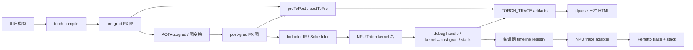
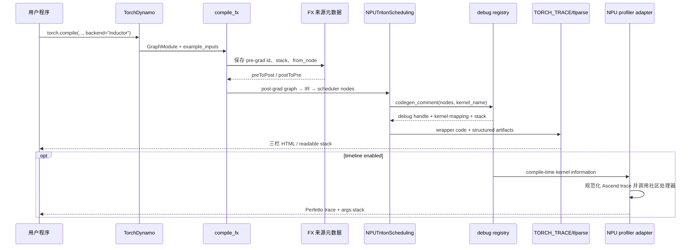

# PyTorch Feature 设计与实现分析

> Feature：TorchInductor / AOTInductor Provenance Tracking 的 NPU
> `triton_experimental` 适配
>
> 交付方式：中文文档主交付，源码与实测产物作为可追溯证据
>
> 最后更新：2026-09-02 00:03 CST（UTC+08:00）

本文以 [PyTorch 2.13 Provenance Tracking 官方文档](https://docs.pytorch.org/docs/2.13/user_guide/torch_compiler/torch.compiler_inductor_provenance.html)
定义公开使用契约，以 PyTorch `release/2.14` 提交
`8e86e0a23e3679c2bf3406cf0837fcb6297a5d9b` 的社区源码核实内部实现，再说明
`torch_npu/_inductor/triton_experimental` 的适配点和验收证据。源码中没有明确证据的
能力不记为支持。

## 模块设计目标与背景

### 目标与问题

`torch.compile` 会把用户模型依次变换为 pre-grad FX 图、post-grad FX 图、Inductor IR
和后端生成代码。分解和融合后，最终 kernel 名通常不能直接回答“它来自模型中的哪个
操作”。Provenance Tracking 保存并展示下列来源链：

```text
输入 GraphModule / pre-grad 节点
  → post-grad 节点
  → Inductor 生成代码中的 kernel 调用
```

官网把它定位为 `tlparse` 中的三栏可视化工具，并明确说明当前社区覆盖 Triton、C++ 和
combo kernel。它还提供 kernel 对应源码栈和 debug handle。公开用法见
`docs/source/user_guide/torch_compiler/torch.compiler_inductor_provenance.md`。

### 官网契约与本交付的对应关系

| PyTorch 官网能力 | 社区依据 | NPU `triton_experimental` 状态 | 本仓证据 |
| --- | --- | --- | --- |
| 输入图、post-grad 图、生成代码三栏联动 | `torch.compiler_inductor_provenance.md` | PASS，forward 完整；backward 遵循社区 `from_node` 边界 | [Llama HTML](./triton_experimental/artifacts/llama_swiglu/) |
| `INDUCTOR_PROVENANCE=1` 打开追踪 | `torch/_inductor/config.py::trace.provenance_tracking_level` | PASS，直接复用社区配置 | [`static_probe.py`](./triton_experimental/scripts/static_probe.py) |
| 直接对日志运行 `tlparse --inductor-provenance` | 官网使用步骤 | PASS，未新增 NPU 专用 tlparse 分支 | [最小三栏页面](./triton_experimental/artifacts/static_smoke/provenance_tracking.html) |
| 不生成高亮时仍可读取 mapping JSON | 官网 artifact 说明 | PASS | [`node_mappings.json`](./triton_experimental/artifacts/static_smoke/node_mappings.json) |
| Triton kernel mapping | `torch/_inductor/codegen/triton.py::TritonScheduling.codegen_comment` | PASS | [Llama](./triton_experimental/artifacts/llama_swiglu/llama_swiglu_node_mappings.json) 与[最小静态 mapping](./triton_experimental/artifacts/static_smoke/node_mappings.json) |
| C++ kernel mapping | 官网当前覆盖范围 | 不适用；不是本轮 NPU 后端 | 不计入 NPU PASS |
| combo kernel mapping | 官网当前覆盖范围 | UNSUPPORTED；level 0/1 均因生成代码缺少 `x0/x0mask` 定义而编译失败 | [level 0](./triton_experimental/artifacts/validation/combo_level0_result.json) / [level 1](./triton_experimental/artifacts/validation/combo_level1_result.json) |
| kernel 源码栈与 debug handle | `torch/_inductor/debug.py::set_kernel_post_grad_provenance_tracing` | PASS | [`llama_swiglu_kernel_stacks.json`](./triton_experimental/artifacts/llama_swiglu/llama_swiglu_kernel_stacks.json) |
| AOTInductor 三栏与 `kernel_information.json` | `torch/_inductor/codecache.py` | BLOCKED，当前 NPU AOTI 设备/ABI 前提不满足 | [交付指南 12.3 节](./triton_experimental/README.md#123-为什么本轮不能把-aotinductor-标为完成) |
| profiler timeline 回填 | PyTorch 2.14 `torch/_inductor/profiler.py` | PASS，通过 Ascend trace adapter 复用社区处理器 | [timeline trace/result](./triton_experimental/artifacts/timeline/) |

因此，“与社区对齐”表示复用相同配置、mapping schema、debug handle、结构化 artifact 和
`tlparse` 交互语义，不表示 NPU 必须把社区 CPU C++ kernel 也实现为 NPU kernel。

### 版本与证据基线

| 对象 | 基线 |
| --- | --- |
| 官网公开契约 | PyTorch 2.13 Provenance Tracking 专页 |
| 社区源码 | PyTorch `release/2.14`，`8e86e0a23e3679c2bf3406cf0837fcb6297a5d9b` |
| NPU 官方基线 | torch_npu `83cc452480c3546fd5cccf853bfe3a360ce9dbfc` |
| 已公开实现提交 | 开发 fork `6ca3af211469b1eea801bf5bbb97c012cfa1b08f` |
| 验证运行时 | PyTorch 2.14 alpha、torch_npu 2.14 alpha、Triton Ascend 3.2.2、CANN 9.0.1 |
| 设备 | Ascend 910B2 |

扩展模块验证提交已经推送到开发 fork；本仓脚本和 JSON/HTML/trace 与该公开源码提交
共同组成可追溯证据。

## 整体设计架构

### 核心组件说明

| 组件 | 职责 | 文件路径 |
| --- | --- | --- |
| 用户配置 | 读取 level、timeline 和事件上限 | `torch/_inductor/config.py::trace`、`effective_provenance_tracking_level` |
| 编译入口 | 进入 Inductor，协调 pre/post-grad 图和生成代码 | `torch/_dynamo/backends/inductor.py::inductor`、`torch/_inductor/compile_fx.py::compile_fx` |
| FX 来源模型 | 用 `NodeSource`、`from_node` 保留图变换来源 | `torch/fx/traceback.py::NodeSource` |
| 图间映射 | 生成 `preToPost`、`postToPre` | `torch/_inductor/debug.py::create_mapping_pre_post_grad_nodes` |
| kernel 登记中心 | 分配 debug handle，保存 post-grad 映射和源码栈 | `torch/_inductor/debug.py::set_kernel_post_grad_provenance_tracing` |
| 社区 Triton 范式 | 在真实 kernel 名确定后登记来源 | `torch/_inductor/codegen/triton.py::TritonScheduling.codegen_comment` |
| NPU 普通发射 | 在 `call_kernel` 前登记 NPU Triton 名称 | `torch_npu/_inductor/triton_experimental/codegen/triton.py::NPUTritonScheduling.codegen_node_schedule` |
| NPU rsplit 发射 | 为 partial/combine 两次 launch 分别登记 | `torch_npu/_inductor/triton_experimental/codegen/triton.py::NPUTritonScheduling._npu_call_rsplit_kernels` |
| 静态 artifact | 输出 mapping 与 kernel stack 的结构化日志 | `torch/_inductor/compile_fx.py::_compile_fx_inner` |
| 社区 timeline 处理器 | 把编译期 kernel 信息写回 Chrome trace | `torch/_inductor/profiler.py::_InductorTraceProcessor` |
| NPU timeline adapter | 规范化 Ascend trace 后复用社区处理器 | `torch_npu/profiler/_inductor_profiler.py::_add_inductor_provenance` |
| NPU profiler 入口 | 导出 trace，按配置触发来源回填 | `torch_npu/profiler/_inductor_profiler.py::inductor_trace_handler` |
| 可视化 | 将结构化日志转换为三栏 HTML | `tlparse::convert_node_mappings_to_line_numbers`、`findCorrespondingLines` |

### 整体执行流程



设计上，社区 PyTorch 负责来源数据模型与关联算法；NPU 只负责在自定义 codegen 的真实
launch 边界提供准确 kernel 名，并把 Ascend trace 临时转换为社区 timeline 处理器能识别
的结构。NPU 不新增 mapping 字段，避免形成无法被社区 `tlparse` 读取的私有协议。

## 入口分析

### 官网用户入口

官网给出的标准命令是：

```bash
cargo install tlparse
TORCH_TRACE=/tmp/my_trace INDUCTOR_PROVENANCE=1 python your_program.py
tlparse /tmp/my_trace/dedicated_log_*.log --inductor-provenance
```

必须把具体 `.log` 文件交给 `tlparse`。官网明确提示，使用
`tlparse parse <folder> --inductor-provenance` 可能不能生成 highlighter。即使不加
`--inductor-provenance`，mapping JSON 仍可从 `tlparse` 输出索引读取。

### 配置入口

`torch/_inductor/config.py::trace.provenance_tracking_level` 读取
`INDUCTOR_PROVENANCE`；未设置时回退到 `TORCH_COMPILE_DEBUG`。本基线中：

| 配置 | 作用 |
| --- | --- |
| `INDUCTOR_PROVENANCE=0` | 关闭 |
| `INDUCTOR_PROVENANCE=1` | normal，主验收模式 |
| `INDUCTOR_PROVENANCE=2` | basic，较轻量；不等同于 level 1 全覆盖 |
| `TORCH_COMPILE_DEBUG_EXTEND=1` | 打开 timeline 回填，并令有效 level 至少为 1 |
| `TORCH_COMPILE_DEBUG_MAX_EVENTS` | 限制 timeline 后处理事件数量 |
| `TORCHINDUCTOR_UNIQUE_KERNEL_NAMES=1` | timeline 稳定匹配 kernel 名的前提 |

修改开关语义应修改 `torch/_inductor/config.py::trace` 和
`effective_provenance_tracking_level()`，不能在 NPU codegen 中私自解释 level。

### NPU 公开接口

静态 provenance 不新增 Python API，继续使用 `torch.compile(..., backend="inductor")`。
timeline 使用：

```python
from torch_npu.profiler import inductor_trace_handler

with torch_npu.profiler.profile(
    on_trace_ready=inductor_trace_handler("/tmp/npu_trace", worker_name="demo")
):
    output = compiled_model(inputs)
```

公开导出位置是 `torch_npu/profiler/__init__.py`，实现是
`torch_npu/profiler/_inductor_profiler.py::inductor_trace_handler`。参数 `dir_name` 指定
输出目录，`worker_name` 控制文件名前缀，`use_gzip` 控制 gzip 输出。

## 完整调用链分析

### 阶段 1：进入 Inductor

函数：`torch._dynamo.backends.inductor.inductor()`

文件：`torch/_dynamo/backends/inductor.py`

输入是 Dynamo 捕获的 `GraphModule` 和示例输入；输出是 Inductor 编译后的 callable。
函数延迟导入并调用 `torch/_inductor/compile_fx.py::compile_fx()`。修改 provenance 不应改
这个 backend 注册入口，因为它不拥有来源数据。

### 阶段 2：记录 pre-grad 来源

函数：`torch/_inductor/compile_fx.py::run_pre_grad_passes()`

输入是 pre-grad `GraphModule`；输出是执行 pre-grad passes 后的图。level 1 时，函数保存
pre-grad graph id 和节点 stack，并发出 `before_pre_grad_graph` 等 artifact。图变换期间，
`torch/fx/traceback.py::NodeSource` 与 `GraphTransformObserver` 把来源写入节点 metadata。

修改图间追踪行为应先检查 `NodeSource` 和 observer，不能靠解析节点名字补关系。

### 阶段 3：建立 pre-grad↔post-grad 映射

函数：`torch/_inductor/debug.py::create_mapping_pre_post_grad_nodes()`

输入是 pre-grad graph id 和 post-grad 节点的 provenance JSON；输出是 `preToPost` 与
`postToPre`。函数递归消费 `from_node`。如果 backward 节点没有足够的 `from_node`，源码
不会凭拓扑推断额外关系；这就是部分 backward 左栏节点不能一路高亮到右栏的社区边界。

### 阶段 4：来源进入 Inductor IR

类：`torch/_inductor/ir.py::IRNode`

FX 节点 lowering 为 IR 时，来源通过 `origins`、`origin_node` 和 stack trace 继续保留。
Scheduler 可以从一个或多个 IR/scheduler node 汇总来源。修改后端时应传递真实 scheduler
nodes，不应只传字符串形式的 source comment。

### 阶段 5：NPU 生成并登记 kernel

类：`torch_npu/_inductor/triton_experimental/codegen/triton.py::NPUTritonScheduling`

普通路径在 `define_kernel()` 得到最终名称后执行：

```python
self.codegen_comment(node_schedule, final_kernel.kernel_name)
final_kernel.call_kernel(final_kernel.kernel_name)
```

`codegen_comment()` 继承社区 scheduler 契约，内部调用
`torch/_inductor/debug.py::set_kernel_post_grad_provenance_tracing()`。该函数生成
`<kernel_name>:<debug_handle>`，更新 kernel↔post-grad 双向关系和 kernel stack，并把
debug handle 写入 wrapper 注释。

rsplit 路径进入 `NPUTritonScheduling._npu_call_rsplit_kernels()`。它分别在 partial 和
combine 的 `wrapper.generate_kernel_call()` 前调用一次 `codegen_comment()`，因此两次
真实 launch 各自拥有 handle。修改多 launch 路径时，登记次数必须与 launch 次数一致。

### 阶段 6：输出静态 artifact

函数：`torch/_inductor/compile_fx.py::_compile_fx_inner()`

编译结束时，`torch/_inductor/debug.py::dump_inductor_provenance_info()` 汇总图间映射和
kernel 映射，结构化日志同时保存 kernel stack。社区 `tlparse` 使用：

- `before_pre_grad_graph.txt`
- `after_post_grad_graph.txt`
- `inductor_output_code.txt` 或 `inductor_aot_wrapper_code.txt`
- `inductor_provenance_tracking_node_mappings.json`
- `inductor_provenance_tracking_kernel_stack_traces.json`

JIT Python wrapper 的页面联动使用 `pyCodeToPost/postToPyCode` 行号表；原始 mapping JSON
中的 `cppCodeToPost/postToCppCode` 是历史 schema 名称，不能因为 JIT 的 AOT C++ 面板为空
就判定 NPU mapping 失败。

### 阶段 7：生成三栏页面

工具：`tlparse`

输入是 `TORCH_TRACE` 日志，输出是导航页、原始 artifact 和
`provenance_tracking_<compile-id>.html`。`convert_node_mappings_to_line_numbers()` 把节点名
映射为面板行号，`findCorrespondingLines()` 驱动点击/悬停高亮。NPU 没有修改该工具，
因此页面交互格式与社区一致。

### 阶段 8：可选的运行时 timeline

函数：`torch_npu/profiler/_inductor_profiler.py::_add_inductor_provenance()`

输入是 Ascend Chrome trace 文件；输出仍是原 NPU trace schema，只在匹配到的事件
`args.stack` 中增加来源。处理步骤为：

1. `_trace_events()` 接受 list 或 `traceEvents` dict 根；
2. `_normalize_trace_for_inductor()` 在副本中调整 flow 顺序、名称和截断 kernel 名；
3. 调用社区 `torch/_inductor/profiler.py::_InductorTraceProcessor.add_to_chrome_trace()`；
4. `_copy_stacks_to_origin()` 只把 stack 写回原 trace；
5. `finally` 清理 `get_kernel_information_jsons()`，避免跨 profile 污染。

这部分是对 PyTorch 2.14 社区源码能力的 NPU trace schema 适配，不是 PyTorch 2.13 官网
三栏高亮步骤的必要条件。

### 完整调用链总结



## 扩展点分析

### 可扩展点

| 扩展目标 | 修改位置 | 推荐方式 |
| --- | --- | --- |
| 新增 NPU Triton 发射分支 | `triton_experimental/codegen/triton.py` 的真实 launch 前 | 调用 `codegen_comment(nodes, final_kernel_name)` |
| 一个 schedule 发射多个 kernel | 对应 multi-launch helper | 每次 `generate_kernel_call/call_kernel` 前分别登记 |
| 新 NPU profiler trace 根结构 | `_trace_events()` | 先转为社区处理器输入，再只回写 stack |
| 新 kernel 名裁剪规则 | `_experimental_kernel_name()`、`_truncated_kernel_name_map()` | 必须处理歧义，不允许随意选第一个候选 |
| 新社区 mapping 字段 | PyTorch `debug.py`、`compile_fx.py` 和 tlparse | 先在社区 schema 统一设计，不在 torch_npu 私有新增 |
| AOTInductor NPU 支持 | NPU C++ wrapper、二进制缓存、AOTI runtime | 先通过默认 NPU AOTI 最小门禁，再验证 provenance |

### 修改已有行为

- 图间关系错误：检查 `NodeSource`、`GraphTransformObserver`、
  `create_mapping_pre_post_grad_nodes()`。
- post-grad→kernel 缺失：检查实际 launch 前是否传入最终 kernel 名，而不是修改 JSON。
- HTML 右栏不高亮：先区分 JIT Python 行号与 AOT C++ 行号，再检查 output code 注释。
- timeline 无 stack：依次检查 unique kernel name、compile key、flow、kernel 名恢复和事件上限。
- backward 左栏链不完整：只有社区产生了新的可靠 `from_node` 证据才可补；不能用名称猜测。

### 常见扩展模式

普通单 kernel 路径使用“一次登记、一次 launch”；rsplit 等多 kernel 路径使用“每次 launch
紧邻登记”；timeline adapter 使用“复制并规范化、复用社区处理器、只回写 stack、清理
状态”。这三种模式覆盖当前交付，不应把 rsplit 称为社区 combo kernel 验收。

### 容易踩坑的地方

1. 官网的 Triton/C++/combo 是 PyTorch 总体范围，不是 NPU 单后端验收清单；当前
   `triton_experimental` ComboKernel 已实测为后端不支持，而不是 provenance PASS。
2. `def forward` 是 FX `GraphModule` 的统一入口；backward 图也会显示该名称。
3. 加粗只说明存在相邻映射，不保证 pre→post→code 三段全部连通。
4. 同一可见 compile id 下的 forward/backward artifact 可能使后出现页面覆盖前者，应分开生成。
5. cache 命中必须携带 mapping/stack；首次诊断建议关闭或隔离 cache。
6. AOTI 的 JIT mapping 成功不能替代 `.pt2` 编译、加载、运行和
   `kernel_information.json` 验收。

## 总结

本功能的核心不是 NPU 专属来源算法，而是让 NPU codegen 遵守社区
`codegen_comment(nodes, kernel_name)` 契约，并让 Ascend profiler trace 能复用社区
`_InductorTraceProcessor`。公开使用方式、mapping schema、debug handle 和 `tlparse`
三栏语义与 PyTorch 官网一致。

当前已完成 `triton_experimental` JIT Triton 的静态 mapping、kernel stack、forward/
backward timeline 和 rsplit 双 launch。ComboKernel 的 level 0/1 A/B 都进入单 kernel
生成，但因缺失索引变量定义而在 Triton 编译阶段失败，因此确认是既有后端边界，尚未
进入 provenance mapping 验收；AOTInductor、NPU C++ 和其他 NPU 后端也不在已通过范围。
backward 的部分 pre-grad→代码链缺失与社区 `from_node` 现状一致，不在 NPU 侧合成关系。

建议按以下顺序继续阅读：

1. PyTorch 官网 Provenance Tracking 专页；
2. `torch/_inductor/config.py`；
3. `torch/_inductor/compile_fx.py`；
4. `torch/_inductor/debug.py`；
5. `torch/_inductor/codegen/triton.py`；
6. `torch_npu/_inductor/triton_experimental/codegen/triton.py`；
7. `torch/_inductor/profiler.py` 与 `torch_npu/profiler/_inductor_profiler.py`；
8. 本仓[交付指南](./triton_experimental/README.md)和[验收产物](./triton_experimental/artifacts/README.md)。

社区参考：

- [PyTorch 2.13 Provenance Tracking 官网](https://docs.pytorch.org/docs/2.13/user_guide/torch_compiler/torch.compiler_inductor_provenance.html)
- [PyTorch 社区文档源码](https://github.com/pytorch/pytorch/blob/release/2.14/docs/source/user_guide/torch_compiler/torch.compiler_inductor_provenance.md)
- [PyTorch `debug.py`](https://github.com/pytorch/pytorch/blob/8e86e0a23e3679c2bf3406cf0837fcb6297a5d9b/torch/_inductor/debug.py)
- [PyTorch `compile_fx.py`](https://github.com/pytorch/pytorch/blob/8e86e0a23e3679c2bf3406cf0837fcb6297a5d9b/torch/_inductor/compile_fx.py)
- [PyTorch `profiler.py`](https://github.com/pytorch/pytorch/blob/8e86e0a23e3679c2bf3406cf0837fcb6297a5d9b/torch/_inductor/profiler.py)
- [PyTorch tlparse](https://github.com/pytorch/tlparse)
