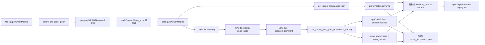
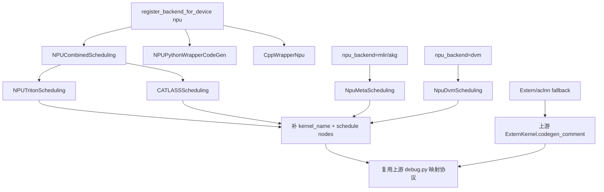
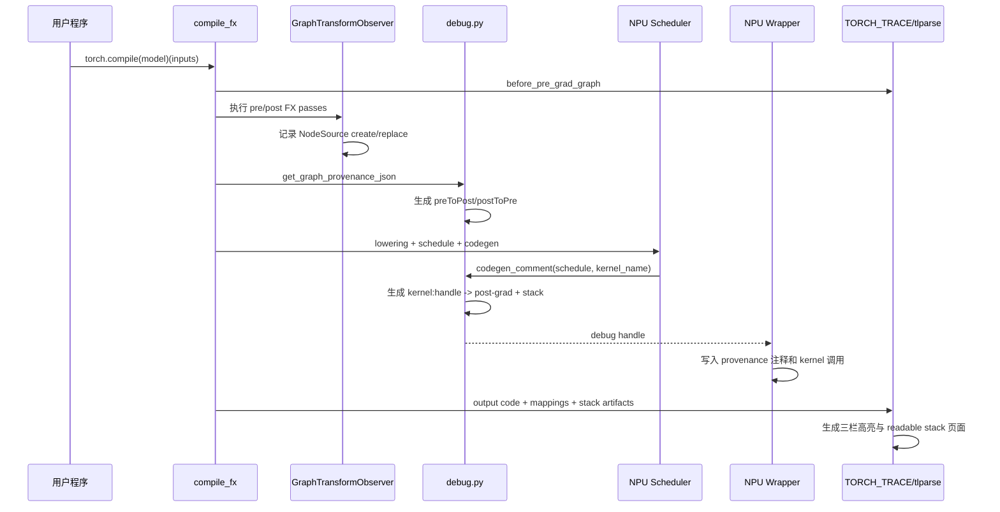

# TorchInductor 来源追踪 NPU 适配技术参考

> 最后更新：2026-08-31 19:51 CST（UTC+08:00）
>
> 第一次接触本项目时，建议先阅读 [NPU 适配新手入门与源码导读](./beginner_guide.md)，
> 再使用本文作为深入源码和设计细节的参考。

> 当前交付范围（2026-08-27）：本文保留需求变更前的多后端研究作为历史背景；正式
> 实现只覆盖 `torch_npu/_inductor/triton_experimental`。官方目标仓为
> `https://gitcode.com/Ascend/pytorch`，开发 fork 为
> `https://gitcode.com/gcw_3ffySSwy/pytorch`。本 GitHub 仓和
> `rmch/npu_inductor_2.13.0` 均不是源码交付目标。

## 模块设计目标与背景

### 1. 调研对象与结论

本文调研 PyTorch 2.13 文档中的 **TorchInductor and AOTInductor Provenance Tracking**。它不是算子性能分析器，也不是 NPU 运行时 dump 工具，而是一条编译期可观测链路：把用户模型中的 FX 节点，经过 pre-grad/post-grad 图变换后，与 TorchInductor 最终生成的 kernel 或 extern 调用建立双向映射，并在 `tlparse` 中进行三栏高亮。

核心结论如下：

1. **上游数据模型与设备无关，可以直接复用。** `NodeSource`、pre-grad/post-grad 映射、IR `origins`、结构化日志、FX graph cache 和 AOTInductor `kernel_information.json` 都不依赖 CUDA。
2. **未适配的 torch_npu 只能获得图级数据；当前工作分支已经补齐普通 NPU Triton kernel 的完整 provenance。** 修改前实机 baseline 的 `preToPost`/`postToPre` 正常而 `cppCodeToPost`/`postToCppCode` 为空；修改后同一个融合 kernel 已与 `add`、`relu`、`mul` 建立双向关系，并在真实 Ascend 910B2 上通过回归测试和 demo。
3. **静态 tlparse 三栏高亮无需修改 tlparse。** `tlparse 0.4.8` 已把 NPU Python wrapper 第 132 行的 Triton `.run()` 调用映射到三个 post-grad 节点。HTML 中应检查 `pyCodeToPost`/`postToPyCode`；`cppCodeToPost`/`postToCppCode` 行号表只用于 AOT C++ wrapper，JIT Python wrapper 下为空是正常结果。
4. **Profiler 时间线回填已经在 `triton_experimental` 完成专项适配。** NPU 侧接受
   Ascend trace 的 list/dict 根结构，把尾置 `torch_to_npu` flow 临时归一化为社区
   处理器需要的关系，再将源码 stack 写回原始 trace；forward、backward 和 rsplit
   partial/combine 已通过真实 NPU 验证。该结论不扩展到其他 NPU 后端。

### 2. 分析基线

| 对象 | 本地基线 | 用途 |
| --- | --- | --- |
| PyTorch 源码 | `/home/z50063656/Tracking/src/pytorch`，`release/2.14`，`8e86e0a23e3679c2bf3406cf0837fcb6297a5d9b` | 当前 PyTorch 2.14 alpha 源码与 editable 安装 |
| torch_npu 源码 | `/home/z50063656/Tracking/src/torch_npu`，`codex/inductor-provenance`，基线 `83cc452480c3546fd5cccf853bfe3a360ce9dbfc` | NPU codegen、wrapper 和测试改动 |
| Python 运行时 | `/home/z50063656/envs/Tracking/bin/python` | Python 3.11.15、`torch 2.14.0a0+git8e86e0a`、editable `torch_npu 2.14.0a0+git83cc452` |
| NPU 运行时 | CANN 9.0.1，8 张 Ascend 910B2，每张 65536 MiB HBM | `npu-smi info` 实测均为 `Health: OK` |
| Triton Ascend | `triton-ascend 3.2.2`，源码提交 `8bd9f380d2786002b84b5248f00838c26f900515` | Tracking 环境已通过 CPU/NPU Inductor 验证；distribution `triton` 元数据版本为 3.5.0 |
| 官方文档 | PyTorch 2.13 Provenance Tracking 文档的本地研究快照（未发布到本仓） | 使用方式与产物清单 |

PyTorch 2.13 文档描述的架构与当前 2.14 alpha 源码一致，但行号和部分 NPU 分支已经演进。本文以当前实际运行环境为主基线，并把文档中的稳定概念作为功能契约。torch_npu 的嵌套子模块存在与本任务无关的未跟踪状态，本任务保留这些状态，只修改 provenance 相关 Python 文件和测试。

2026-08-20 已完成多轮受控实机验证。修改前在物理 NPU 6 建立 baseline：CPU Inductor 和 NPU Inductor 均通过，NPU 输出与 eager 数值一致；未修改的 torch_npu wheel 只有图级双向映射，kernel 级双向映射为空。修改后重新构建并 editable 安装 torch_npu，在真实 Ascend 910B2 上三项回归测试全部通过；随后在物理 NPU 5 重新运行普通 demo，获得 `triton_poi_fused_add_mul_relu_0:1 -> [mul, relu, add]`。P1 又在物理 NPU 5 跑通 FlexAttention forward template，获得 `triton_flex_attention_fwd_mask_in:1 -> [flex_attention, sdpa_score0, sdpa_mask0]`，两条路径都有 stack trace 和可联动的 tlparse 页面。

Tracking 环境使用 `triton-ascend 3.2.2`，同时存在 `triton 3.5.0` distribution 元数据。Ascend backend 会进入同一个顶层 `triton` import package，因此版本判断必须同时检查 distribution、实际 import、backend 发现和真实编译执行，不能只看 `pip show triton`。

### 3. 背景知识：先建立正确的心智模型

#### 从 eager 到 kernel

普通 eager 执行大致是“一条 PyTorch 算子调用一次 dispatcher，再选择 NPU kernel”。`torch.compile` 则先捕获一段 Python 为 FX graph，经过 AOTAutograd 和多轮图优化，再由 Inductor lowering 成内部 IR，最后由 scheduler 把多个节点融合成一个或多个后端 kernel。因此：

- 一个用户算子可能被分解成多个 post-grad 节点；
- 多个用户算子也可能被融合成一个 Triton/CATLASS/MLIR kernel；
- 生成代码中的 kernel 名通常不能直接还原到用户模型行号。

#### provenance 到底记录什么

Provenance 的含义是“来源关系”，不是数值正确性，也不是性能计时。它保存两段关系：第一段把 pre-grad FX 节点追踪到 post-grad FX 节点，第二段把 post-grad 节点追踪到最终 kernel。两段拼起来后，开发者才能从用户模型的一行代码一路定位到生成代码中的具体调用。

#### 静态 provenance 与 profiler timeline 的区别

静态 provenance 在编译时产生，回答“这个 kernel 是由哪些图节点生成的”。Profiler timeline 在运行时采样，回答“这个 kernel 何时执行、耗时多少、由哪个 host event 发射”。前者大体与设备无关；后者依赖 CUDA/Kineto 或 Ascend/CANN 的 trace schema，所以 NPU 的静态适配可以先完成，timeline 必须单独设计。

#### JIT Inductor 与 AOTInductor

`torch.compile` 通常在进程中即时编译并通过 `TORCH_TRACE` 输出结构化日志。AOTInductor 则提前编译和打包模型，provenance 会进入包内的 `kernel_information.json`。两条路径共享映射数据模型，但产物载体不同。

### 4. 工具解决的问题

一次 `torch.compile` 会经历多层图变换和融合。仅查看 `output_code.py` 时，开发者通常只能看到 `triton_poi_fused_*`、`cpp_fused_*` 或 extern 调用，难以回答：

- 这个 kernel 来自用户模型的哪一行？
- 一个原始算子在 post-grad 图中被拆成了哪些节点？
- 多个 post-grad 节点为什么被融合到同一个 kernel？
- AOTInductor 包中的 kernel 与原始算子如何对应？

Provenance Tracking 通过四组双向映射回答这些问题：

| 字段 | 方向 | 含义 |
| --- | --- | --- |
| `preToPost` | pre-grad -> post-grad | 原始/输入图节点经过变换后对应哪些节点 |
| `postToPre` | post-grad -> pre-grad | post-grad 节点追溯到哪些输入图节点 |
| `cppCodeToPost` | kernel key -> post-grad | 某次 kernel 调用覆盖哪些 post-grad 节点 |
| `postToCppCode` | post-grad -> kernel key | 某个 post-grad 节点进入了哪些 kernel 调用 |

这里的 `cppCodeToPost` 是历史命名，实际并不限于 C++ kernel，也可承载 Triton、NPU MLIR、DVM、CATLASS 和 extern kernel。

## 整体设计架构

### 1. 上游架构



这套设计刻意把“图变换来源”和“后端 kernel 来源”分成两段：

1. FX 层使用递归 `NodeSource` 保存图变换历史。
2. Inductor IR/scheduler 层使用 `origins` 把 post-grad 节点聚合到 kernel。
3. `debug.py` 在最终产物阶段把两段映射拼接起来。

因此 NPU 适配的正确位置是 scheduler/codegen 边界，而不是修改 `tlparse` 数据协议或在模型执行时重新猜测算子关系。

### 2. NPU 后端结构与接入位置



默认 NPU backend 在 `torch_npu/_inductor/__init__.py:129-138` 注册 `NPUCombinedScheduling`、`NPUPythonWrapperCodeGen` 和 `CppWrapperNpu`。`NPUCombinedScheduling` 再把节点分派给 NPU Triton 或 CATLASS。MLIR/AKG/DVM 则通过各自 backend 切换到 `NpuMetaScheduling` 或 `NpuDvmScheduling`。

### 3. 能力边界

| 能力 | 当前 NPU 状态 | 判断 |
| --- | --- | --- |
| pre-grad -> post-grad 映射 | 直接走上游 `GraphTransformObserver` 与 `NodeSource` | 可复用 |
| NPU 自定义 FX Pass | level 1 下由上游 observer 自动记录创建/替换 | 可复用 |
| extern/aclnn JIT 映射 | `ExternKernel.codegen_comment()` 为设备无关实现 | 基本可复用 |
| NPU Triton pointwise/reduction | baseline 漏传 kernel 名；工作分支传入 `final_kernel.kernel_name` | 已实现并通过真实 NPU E2E |
| NPU Triton template | 工作分支传入真实 `kernel_name` | FlexAttention forward 已通过真实 NPU E2E 和 tlparse |
| NPU FlexAttention dK/dV template | 四个运行时候选调用分别生成 handle；默认哨兵按真实 tile 数限界 | wrapper/限界契约已通过；真实 backward 卡在 BishengIR 长编译 |
| NPU combo kernel | 工作分支按上游使用 `combo_kernel_node.snodes` 和真实 kernel 名 | 调度契约已通过，待真实执行 |
| CATLASS template | 工作分支在真实调用前执行 provenance hook | 已实现，待依赖环境用例 |
| MLIR/AKG 普通融合 | 工作分支为 `NpuMetaScheduling` 传入 kernel 名 | 已实现，待专项用例 |
| DVM 普通融合/template | 工作分支为 DVM template 传入 kernel 名，普通路径继承 Meta 修复 | 已实现，待专项用例 |
| 多流 extern out | 工作分支已与上游 `stack_traces` 签名及 timeline wrapper 对齐 | 静态契约已覆盖，待多流 E2E |
| FX graph cache 命中 | 上游 cache key 和 artifact 重放已覆盖 level | 真实 NPU miss/hit 已通过，mapping/stack 逐字节一致 |
| AOTI `kernel_information.json` | 上游打包逻辑设备无关 | 机制可复用，需 NPU 实机验证 |
| tlparse 静态三栏高亮 | JSON schema 本身无设备字段；JIT Python wrapper 使用 `pyCodeToPost` 行号表 | tlparse 0.4.8 已通过真实 NPU log 验证 |
| profiler timeline stack 回填 | 上游处理器依赖 CUDA/Kineto trace schema | 不可直接复用 |

### 4. 需要 PyTorch wheel 还是源码编译

结论：**本任务不需要重新源码编译 PyTorch；需要把修改后的 torch_npu 源码构建/安装进隔离环境。** PyTorch 当前精确提交的 editable 构建已经能跑通 NPU Inductor，可以保持不动。未改代码的 wheel 适合建立 baseline，但它不会包含本次 torch_npu Python codegen 修改。

| 工作内容 | PyTorch 形态 | 是否需要完整编译 PyTorch |
| --- | --- | --- |
| 阅读 2.13/2.14 provenance 实现 | Git 源码 checkout | 否 |
| 运行官方功能、复现 NPU 缺口 | 匹配的已安装 `torch` + `torch_npu` wheel | 否，baseline 首选 wheel |
| 修改 `torch_npu/_inductor/*.py` | 保持 PyTorch 不变；对 torch_npu 执行 editable 源码安装 | 不编译 PyTorch，只构建 torch_npu |
| 修改 `torch/_inductor/*.py` 且对应 nightly wheel 已包含基线 | nightly/dev wheel 或基于 wheel 的受控 Python 覆盖 | 通常否 |
| 修改 PyTorch C++、生成头文件或验证精确 commit | 从该 commit 构建并安装 PyTorch wheel | 是 |
| 发布最终兼容包 | 分别构建版本匹配的 torch/torch_npu wheel | 按改动范围决定 |

旧 `Benchmark/env.sh` 曾出现源码 Python、wheel 扩展和 headers 混用，导致 Triton launcher 编译时找不到 `ATen/ATen.h`。当前 `Tracking/activate_tracking.sh` 已消除这个阻塞：相同 PyTorch commit 的 editable 构建、torch_npu wheel 和 Triton Ascend 3.2.2 已共同跑通 launcher 与 NPU kernel。实现验证阶段只需将 torch_npu 从 baseline wheel 切换为当前源码的 editable 安装。

稳定环境后的推荐做法是：

1. 使用独立的 `/home/z50063656/envs/Tracking`，不复用仍可能被其他进程修改的旧环境。
2. 通过 `Tracking/activate_tracking.sh` 固定 CANN、PyTorch、torch_npu 和 Triton Ascend 组合。
3. 用未修改 torch_npu wheel 跑最小脚本，保存“图映射有、kernel 映射空”的 baseline。
4. 按仓库政策执行 `pip install -e . -v --no-build-isolation` 安装 torch_npu 源码，再跑同一脚本做 A/B 对比。
5. 只有修改 `torch/_inductor` 原生代码或现有 PyTorch 构建不能代表目标 commit 时，才重新构建 PyTorch。

## 入口分析

### 1. 环境依赖与 Triton Ascend

torch_npu 源码的部分 CI 脚本仍可见 3.2.1 固定值，但本任务的 PyTorch release/2.14 兼容环境已经固定并验证 `triton-ascend 3.2.2`。不要直接安装随时间变化的 `main` 分支；应使用 release/3.2.2 或其匹配 wheel。aarch64 + Python 3.11 的安装形态是：

```bash
/path/to/clean-env/bin/python -m pip install --no-cache-dir \
  triton-ascend==3.2.2
```

应在隔离环境执行，因为该 wheel 对 `numpy==1.26.4`、`pytest==8.3.2`、`psutil==6.0.0` 等有固定依赖，会调整已有环境。安装后不要只检查 distribution 版本，要做运行时检查：

```python
import torch
import torch_npu
import triton
from torch.utils._triton import has_triton

print(torch.__version__, torch_npu.__version__, triton.__version__)
print(torch.npu.is_available(), has_triton())
```

四者必须同时匹配：PyTorch、torch_npu、Triton Ascend、CANN。`has_triton() == True` 只表示 backend 可发现，不代表 launcher、CANN 编译和设备执行已经成功。

### 2. 用户入口和标准用法

官方专页给出的最小流程是：

```bash
cargo install tlparse
TORCH_TRACE=/tmp/my_trace_log_dir INDUCTOR_PROVENANCE=1 python your_program.py
tlparse log_file_name.log --inductor-provenance
```

注意：专页明确要求把**具体 log 文件**直接交给 `tlparse`；`tlparse parse <folder> --inductor-provenance` 可能无法生成高亮器。通用 troubleshooting 页面还出现过 `pip install tlparse`，但针对本功能应以 provenance 专页的 Rust CLI 和 `--inductor-provenance` 参数为准。

NPU 示例程序可以写成：

```python
import torch
import torch_npu


class Demo(torch.nn.Module):
    def forward(self, x, y):
        a = torch.relu(x + y)
        return a * 2


device = "npu:0"
model = Demo().to(device)
x = torch.randn(1024, device=device)
y = torch.randn(1024, device=device)
compiled = torch.compile(model, backend="inductor")
compiled(x, y)
torch.npu.synchronize()
```

从 `/home/z50063656/tmp` 启动测试，避免在 torch_npu 源码目录中触发源码级联导入：

```bash
cd /home/z50063656/tmp
TRACE_DIR=$(mktemp -d /tmp/npu-prov-trace.XXXXXX)
TORCH_TRACE="$TRACE_DIR" \
INDUCTOR_PROVENANCE=1 \
TORCHINDUCTOR_UNIQUE_KERNEL_NAMES=1 \
python /home/z50063656/Tracking/npu_provenance_demo.py

LOG_FILE=$(find "$TRACE_DIR" -maxdepth 1 -type f -name '*.log' -print -quit)
tlparse "$LOG_FILE" --inductor-provenance
```

建议首次验证时同时隔离 Inductor cache，避免旧的、未携带 provenance 数据的产物干扰判断：

```bash
cd /home/z50063656/tmp
TRACE_DIR=$(mktemp -d /tmp/npu-prov-trace.XXXXXX)
CACHE_DIR=$(mktemp -d /tmp/npu-prov-cache.XXXXXX)
TORCH_TRACE="$TRACE_DIR" \
TORCHINDUCTOR_CACHE_DIR="$CACHE_DIR" \
INDUCTOR_PROVENANCE=1 \
TORCHINDUCTOR_UNIQUE_KERNEL_NAMES=1 \
python /home/z50063656/Tracking/npu_provenance_demo.py
```

### 3. 配置入口

`torch/_inductor/config.py:2968-2998` 定义了三个关键配置：

- `INDUCTOR_PROVENANCE=0`：关闭，默认值。
- `INDUCTOR_PROVENANCE=1`：normal，启用完整图变换观察和 pre-grad stack 缓存。
- `INDUCTOR_PROVENANCE=2`：basic，保留较轻量的映射/stack 能力，但不会让 `GraphTransformObserver` 因 provenance 单独激活。
- `TORCH_COMPILE_DEBUG=1`：兼容入口，未显式设置 `INDUCTOR_PROVENANCE` 时至少启用 level 1。
- `TORCH_COMPILE_DEBUG_EXTEND=1`：启用 profiler timeline 回填，并把有效 level 至少提升到 1。
- `TORCH_COMPILE_DEBUG_MAX_EVENTS`：时间线后处理事件数上限，默认 500000。

level 1 与 level 2 的源码可见差异是：

1. `compile_fx.py:2864-2869` 仅在 level 1 显式缓存 pre-grad 节点的 stack trace。
2. `graph_transform_observer.py:46-49` 仅在 level 1 因 provenance 激活图变换 hook。

上游源码没有给出比 `normal/basic` 更完整的稳定语义说明，因此适配和验收应以 level 1 为主，不能把 level 2 当作完全等价模式。

### 4. 编译入口

`torch/_inductor/compile_fx.py::run_pre_grad_passes()` 是图级追踪入口：

1. 发出 `before_pre_grad_graph` artifact，并附加 `id(model_.graph)`。
2. 保存 `_pre_grad_graph_id`，作为递归追踪的边界标识。
3. level 1 时缓存输入图 stack trace。
4. 执行 pre-grad passes，再发出 `after_pre_grad_graph`。

`torch/_inductor/compile_fx.py::_compile_fx_inner()` 在 post-grad 图稳定后：

1. 发出 `inductor_post_grad_graph`。
2. 调用 `get_graph_provenance_json()` 序列化每个 `call_function` 节点的 `from_node`。
3. 调用 `create_mapping_pre_post_grad_nodes()` 递归展开来源链，生成 `preToPost` 和 `postToPre`。

### 5. 后端代码生成入口

所有后端应在“kernel 名称已确定、scheduler nodes 已确定、kernel 调用即将写入 wrapper”时调用：

```python
self.codegen_comment(node_schedule, kernel_name)
```

上游 `TritonScheduling.codegen_comment()` 和 `BaseScheduling.codegen_comment()` 只有在 `kernel_name` 为真时才调用 `set_kernel_post_grad_provenance_tracing()`。因此只写 `self.codegen_comment(node_schedule)` 会生成普通 source-node 注释，却不会写入 provenance 映射，这是当前 NPU 主要问题的直接原因。

## 完整调用链分析

### 1. 图节点来源链

`torch/fx/traceback.py::NodeSource` 保存：

- 节点名、target 和所属 graph id；
- 发生变换的 pass 名；
- `create`/`replace` 动作；
- 递归的上一层 `from_node`。

`GraphTransformObserver` 在 level 1 下注册 create/erase/replace hook。torch_npu 的 `pre_grad_custom_pass` 和 `post_grad_custom_post_pass` 都由上游 observer 包裹，所以 NPU 自定义 FX Pass 中大量 `graph.call_function()`/`graph.create_node()` 不需要逐个手写 provenance 元数据。发生 `replace_all_uses_with()` 时，replace hook 会把被替换节点作为 `NodeSource` 接到新节点上。

### 2. post-grad 到 kernel 的来源链

Inductor lowering 创建 `IRNode` 时，`torch/_inductor/ir.py::IRNode.__post_init__()` 保存当前 `origins`。scheduler 融合多个 IR node 后，`set_kernel_post_grad_provenance_tracing()`：

1. 为每次调用递增全局 debug handle；
2. 把 key 标准化为 `<kernel_name>:<handle>`；
3. 遍历 scheduler node 对应 IR node 的 `origins`；
4. 写入 kernel -> post-grad 节点集合；
5. 调用 `IRNode.get_stack_traces()` 收集用户代码 stack；
6. 让 wrapper 输出 `[Provenance debug handles] <kernel_name>:<handle>` 注释。

debug handle 很重要：同名 kernel 可能被调用多次，单用函数名无法区分不同调用。tlparse 依赖 mapping key 与 output code 中的 handle 注释精确对应。

### 3. extern kernel 路径

`torch/_inductor/ir.py::ExternKernel.codegen_comment()` 会自动解析 kernel 名，并以 `is_extern=True` 调用统一追踪函数。extern 路径额外记录：

- `origin_node` 或 `origins`；
- `extern_semantic_key`；
- 输入/输出 shape 和 dtype；
- stack traces。

因此普通 NPU aclnn fallback 不需要另建映射逻辑。只要 torch_npu wrapper 继续调用上游 `generate_extern_kernel_alloc/out()`，静态 provenance 就能复用这一段。

### 4. artifact 生成与缓存

`dump_inductor_provenance_info()` 合并四组映射，并写入 `version: 2.0`。`compile_fx.py:1755-1780` 通过 structured trace 发出：

- `inductor_provenance_tracking_node_mappings`；
- `inductor_provenance_tracking_kernel_stack_traces`。

随后它们被保存进 `CompiledFxGraph`。`codecache.py:1597-1604` 把有效 provenance level 和 timeline flag 纳入 cache key；`codecache.py:2145-2190` 在 cache hit 时重新发出 output code、post-grad graph、mapping 和 stack artifacts。因此正确适配后，cache miss 与 cache hit 都应获得一致结果。

AOTInductor 打包时，`codecache.py:3607-3614` 调用 `create_kernel_information_json()`，生成包含 stack、pre/post 节点、extern 语义键和 shape/dtype 的 `kernel_information.json`。

### 5. 结构化日志与 tlparse

官方页面列出的高亮器输入为：

1. `before_pre_grad_graph.txt`
2. `after_post_grad_graph.txt`，当前源码 artifact 名为 `inductor_post_grad_graph`
3. `inductor_aot_wrapper_code.txt`
4. `inductor_output_code.txt`
5. `inductor_provenance_tracking_node_mappings.json`
6. `inductor_provenance_tracking_kernel_stack_traces.json`，用于 readable HTML 源码定位

执行 `tlparse <log> --inductor-provenance` 后，应出现额外的 `Provenance Tracking` 入口。即使不加该参数，mapping JSON 仍应出现在普通 tlparse 产物索引中。

### 6. 端到端时序



### 7. 当前 NPU 断点的源码证据

#### NPU Triton

`torch_npu/_inductor/codegen/scheduling.py` 已经取得真实 kernel 名，但当前有四类路径没有按契约传给 hook：

- 普通 pointwise/reduction：178 行定义 kernel，194 行调用 `self.codegen_comment(node_schedule)`。
- 普通 template：309 行得到 `kernel_name`，311 行仍不传名称。
- FlexAttention dK/dV 复合 template：343-376 行定义 legacy、tasklist、tasklist-no-split、reduce 四个 kernel，393-412 行把四个名字交给运行时分派器，但 422 行只有一次 `self.codegen_comment([template_node])`。
- combo：439 行得到 `kernel_name`，440 行传 `[combo_kernel_node]` 且不传名称；应追踪内部 subkernel/scheduler nodes，而不是 combo wrapper node 本身。

结果是生成代码中可能仍有 `Topologically Sorted Source Nodes` 注释，但 mapping JSON 不包含这些 NPU Triton kernel。FlexAttention 还多一层问题：四个候选 kernel 的调用写在 `NPUPythonWrapperCodeGen.generate_flex_attention_dkdv_dispatch()` 的不同运行时分支中，不能只在 scheduler 末尾补四个连续注释；需要让 wrapper 在每个 `.run()` 前写入对应 handle，或者为分派器提供等价的分支级 provenance 接口。

#### CATLASS

`torch_npu/_inductor/codegen/catlass/catlass_scheduling.py:206-223` 定义并调用 CATLASS kernel，中间没有 `self.codegen_comment(node_schedule, kernel_name)`。上游 CUTLASS 在对应 call 前明确调用该 hook。

#### MLIR/AKG/DVM

`NpuMetaScheduling.codegen_node_schedule()` 在 `meta_kernel.py:503` 得到名称，519 行只调用 `self.codegen_comment(node_schedule)`。AKG/MLIR 继承该实现，因此都会漏映射。

`NpuDvmScheduling.codegen_template()` 在 `dvm/mlir_fusion.py:332` 得到名称，336 行仍只传 schedule。DVM 普通融合继承 `NpuMetaScheduling`，两条路径都需要修复。

#### 多流 extern wrapper

当前上游 `_generate_extern_kernel_out_helper()` 的末参数为 `stack_traces: OrderedSet[str] | None`。NPU override 在 `wrapper.py:455-483` 仍命名并标注为 `debug_handle: Optional[int]`，且多流路径把它传给 `write_provenance_debug_handle()`。实际调用者传入的是 stack trace 集合，不是整数，会生成错误的 handle 注释。

另外，上游在 timeline 模式下会用 `define_extern_kernel_profile_wrapper()` 给 extern 调用生成可关联的 profiler 名称；NPU 多流分支绕过了这段逻辑。

#### profiler timeline

上游 `torch/_inductor/profiler.py` 期望：

- 根对象包含 `traceEvents`；
- flow 类型为 `fwdbwd`/`ac2g`；
- runtime category 包含 `cuda_runtime`、`cuLaunchKernel`、`cuda_driver`；
- device kernel category 为 `kernel`，并可按 `External id` 关联。

torch_npu `TraceViewParser` 输出的是事件 list，并使用：

- `torch_to_npu` flow 名；
- `async_npu` flow category；
- CANN `HostToDevice` flow 来建立 ACL -> NPU kernel 关系。

同时 NPU `_KinetoProfile.export_chrome_trace()` 只接受 `output_path`，而上游 handler 会额外传 `use_python_export`。所以现有 handler 在 API 和数据格式两层都不兼容。

### 8. 当前实机验证进度

最小脚本见
[`static_probe.py`](./triton_experimental/scripts/static_probe.py)，模型为可融合的
`add -> relu -> mul`。测试严格从 `/home/z50063656/tmp` 启动，并把 trace、debug 和
cache 隔离到临时目录。

| 阶段 | 结果 | 证据/含义 |
| --- | --- | --- |
| NPU 发现 | 通过 | 8 张 910B2 健康；本轮使用当时空闲的物理设备 6 |
| Python backend 发现 | 通过 | `torch.npu.is_available() == True`，`has_triton() == True`，`torch_npu._inductor` 可导入 |
| CPU/NPU Inductor 环境基线 | 通过 | `sin(1)+cos(1)` 两端结果均为 `1.3818`，验证脚本输出 `status=pass` |
| FX 捕获和 NPU Inductor codegen | 通过 | 生成并执行 `triton_poi_fused_add_mul_relu_0`，设备属性为 `npu/Ascend910B2` |
| Triton launcher 与 device binary | 通过 | launcher 成功构建，NPU kernel 实际执行并返回结果 |
| 未适配 provenance 图映射 | 通过 | `preToPost`/`postToPre` 分别记录 add、relu、mul |
| 未适配 provenance kernel 映射 | 缺失（符合预期） | `cppCodeToPost == {}` 且 `postToCppCode == {}`，实证 hook 缺失 |
| CPU tlparse 可视化 | 通过 | Cargo 1.97.1、tlparse 0.4.8；三栏页面和四向行号联动映射均非空 |
| torch_npu 源码改造 | 已构建并安装 | 已覆盖普通/template/combo Triton、Flex dK/dV、CATLASS、Meta/MLIR、DVM 和多流 extern 签名 |
| 代码规范与语法检查 | 通过 | `py_compile`、`git diff --check`、定向 lintrunner 均通过 |
| 改造后 NPU 回归 | 通过 | 真实 Ascend 910B2：`Ran 3 tests in 27.289s`，`OK` |
| 改造后 NPU demo | 通过 | checksum `9206.284180`；kernel、mapping 与 stack key 一致 |
| 改造后 NPU tlparse | 通过 | `Stats { ok: 139 }`；`pyCodeToPost = {"132": [10, 7, 4]}` |
| FlexAttention dK/dV wrapper 契约 | 通过 | 四个候选 handle 分别紧邻 tasklist/no-split/reduce/legacy `.run()` |
| P1 完整 provenance 回归 | 通过 | 加入 Flex 与 combo 契约后：`Ran 5 tests in 19.817s`，`OK` |
| FlexAttention forward template | 通过 | `triton_flex_attention_fwd_mask_in:1 -> flex_attention, sdpa_score0, sdpa_mask0` |
| template tlparse | 通过 | `Stats { ok: 282 }`；`pyCodeToPost = {"608": [6, 4, 5]}` |
| 图内默认 BlockMask | 通过 | `strict_sum`、full metadata、scheduler hook、template grid 均已修复；checksum `-37.427276611328125`，tlparse `Stats { ok: 258 }` |
| 默认 BlockMask backward | 部分完成/编译阻塞 | 反向 FX 与 dK/dV 候选已生成；异常 `1073741824`/`8388608` 已从 dK/dV MLIR 消除，但 BishengIR 11 分 48 秒未返回，尚无 backward output code/mapping |
| 最新三组契约回归 | 通过 | provenance 5 + lowering 18 + scheduler 10，共 33 项 `OK` |
| FX Graph cache miss/hit | 通过 | hit 事件明确；两次 mapping/stack `cmp=0`，hit HTML 行号关系完整 |

未适配 trace 中的结构化 artifact 为：

```json
{
  "preToPost": {"added": ["add"], "activated": ["relu"], "mul": ["mul"]},
  "postToPre": {"add": ["added"], "relu": ["activated"], "mul": ["mul"]},
  "cppCodeToPost": {},
  "postToCppCode": {},
  "version": 2.0
}
```

环境基线、CPU 三栏、修改前后普通 NPU、cache 和 template 专项的结论已收束到
[历史研究摘要](./history_summary.md)。未适配 NPU provenance 运行目录为
`/home/z50063656/tmp/tracking-provenance-baseline.bpyBfR`；当前正式产物统一位于
[`triton_experimental/artifacts`](./triton_experimental/artifacts/README.md)。

## 扩展点分析

### 1. 第一阶段：静态 tlparse 高亮的最小改造

建议只沿用上游现有 hook，不新增 NPU 专属 JSON 字段。

#### 改造点 A：NPU Triton

目标文件：`torch_npu/_inductor/codegen/scheduling.py`

```python
# 普通 kernel
self.codegen_comment(node_schedule, final_kernel.kernel_name)

# template
self.codegen_comment(node_schedule, kernel_name)

# combo: match upstream SIMDScheduling
self.codegen_comment(combo_kernel_node.snodes, kernel_name)
```

这里应模仿上游 Triton codegen，使用最终会被 wrapper 调用的 kernel 名。combo 路径应展开 `combo_kernel_node.snodes`，不能把 combo wrapper node 自身装进单元素 list；后者没有统一追踪函数所需的真实 scheduler node 集合。

FlexAttention dK/dV 不能套用上面的一行修复。需要先为 legacy、tasklist、tasklist-no-split、reduce 四个名字分别建立 `[template_node] -> kernel` 映射，再把四个 debug handle 传入 `generate_flex_attention_dkdv_dispatch()`，由 wrapper 在各自 `.run()` 的条件分支内写入对应注释。这样静态 output code 才能区分实际可能执行的候选 kernel。

#### 改造点 B：CATLASS

目标文件：`torch_npu/_inductor/codegen/catlass/catlass_scheduling.py`

在真实 kernel call 之前加入：

```python
self.codegen_comment(node_schedule, kernel_name)
```

位置与上游 `CUTLASSScheduling.codegen_template()` 保持一致，避免 benchmark-only 的 `only_src_code=True` 路径污染全局追踪状态。

#### 改造点 C：MLIR/AKG/DVM

目标文件：

- `torch_npu/_inductor/ascend_npu_ir/ascend_npu_ir/npu/codegen/meta_kernel.py`
- `torch_npu/_inductor/dvm/mlir_fusion.py`

将普通融合和 DVM template 的调用改为：

```python
self.codegen_comment(node_schedule, kernel_name)
self.codegen_comment(snodes, kernel_name)
```

修复基类 `NpuMetaScheduling` 后，MLIR 与 AKG 继承路径可同时生效。

#### 改造点 D：多流 extern wrapper 对齐

目标文件：`torch_npu/_inductor/codegen/wrapper.py`

1. 把 override 参数改为 `stack_traces: OrderedSet[str] | None = None`，与当前 PyTorch 上游签名一致。
2. 删除多流分支中把该参数传给 `write_provenance_debug_handle()` 的逻辑；extern handle 已由 `ExternKernel.codegen_comment()` 生成。
3. timeline 未启用时直接保持当前多流调用。
4. timeline 启用时调用 `define_extern_kernel_profile_wrapper()`，再输出带多流缩进的 wrapper 名称。

建议增加 override 签名一致性单测，防止后续升级 PyTorch 时再次静默漂移。

### 2. tlparse 无需修改：两层 mapping 名称必须分清

真实 NPU log 和 `tlparse 0.4.8` 源码已经证明第一阶段可以零修改复用。容易误判的原因是两层 JSON 使用了不同语义：

1. PyTorch 原始 artifact 中，`cppCodeToPost`/`postToCppCode` 是历史字段名，承载所有后端的 `<kernel_name>:<handle>`，包括 NPU Triton。
2. tlparse 把 node/key 映射转换成页面行号后，会根据展示代码载体拆成两组：
   - `pyCodeToPost`/`postToPyCode`：`inductor_output_code` 的 Python wrapper；
   - `cppCodeToPost`/`postToCppCode`：`inductor_aot_wrapper_code` 的 AOT C++ wrapper。

源码调用链为：

```text
tlparse/src/lib.rs::convert_node_mappings_to_line_numbers
  -> build_python_kernel_to_lines_map(output_code_content, ...)
  -> build_cpp_kernel_to_lines_map(aot_code_content, ...)
  -> process_kernel_to_post_mappings(...)
  -> 生成 pyCodeToPost 与 cppCodeToPost 两组行号表

tlparse/src/provenance.js::findCorrespondingLines
  -> codeData 存在时读取 pyCodeToPost/postToPyCode
  -> 否则读取 cppCodeToPost/postToCppCode
```

本轮 NPU JIT 页面中：

```json
{
  "pyCodeToPost": {"132": [10, 7, 4]},
  "postToPyCode": {"10": [132], "7": [132], "4": [132]},
  "cppCodeToPost": {},
  "postToCppCode": {}
}
```

第 132 行是 `triton_poi_fused_add_mul_relu_0.run(...)`。JavaScript 在该页面存在 Python `codeData`，所以点击右栏第 132 行会使用 `pyCodeToPost` 高亮中栏三个节点；AOT C++ 行号表为空不影响 JIT 三栏联动。CPU JIT 页面也是同样结构，因此这不是 NPU 特例或兼容性缺陷。

后续只有在 `mlir_`、`dvm_`、`catlass_` 等真实专项用例无法被 `build_python_kernel_to_lines_map()` 通过精确 handle 或纯 kernel 名定位时，才需要重新评估 tlparse；当前普通 NPU Triton 路径没有这项阻塞。

### 3. 第二阶段：NPU profiler timeline provenance

> 状态更新：以下内容是早期设计方案。当前交付已按该方向在
> `triton_experimental` 实现 NPU adapter，并完成 forward/backward、rsplit、gzip、
> list/dict root 和事件上限验证；其中对 CATLASS、MLIR/DVM 等其他后端的设想不属于
> 当前范围。

建议在 torch_npu 内新增 NPU 专用 handler/adapter，再评估是否将通用接口上推 PyTorch：

1. 使用 `torch_npu.profiler.profile` 和只接收路径的 `export_chrome_trace(path)`。
2. 同时接受 Ascend trace 的顶层 list 和 Chrome trace 的 `{"traceEvents": [...]}` 形式。
3. 识别 `torch_to_npu`/`async_npu` flow，或直接复用 `FwkCANNRelationParser` 已建立的 torch op -> kernel 关系。
4. 把 CANN kernel event 名与 `get_kernel_information_jsons()` 的 `<kernel_name>:<handle>` 关联。
5. extern 路径使用 `extern_kernels_*` profile wrapper，保证 CPU 侧调用名可定位。
6. 把 stack 写回 CANN kernel event 的 `args.stack`，最后按原格式导出。
7. 保留上游事件数上限、异常不影响模型执行、处理后清理全局状态等防护。

难点不在 JSON 写入，而在“生成 kernel 名”和“CANN timeline 展示名”是否完全一致。必须用 Triton、CATLASS、aclnn、MLIR/DVM 各一条真实 trace 验证；若 CANN 展示的是设备算子名而不是 Inductor kernel 名，则需要使用 `HostToDevice` flow 和 CPU wrapper event 做间接关联，不能只按字符串匹配。

### 4. 测试设计

建议新增 `test/_inductor/test_provenance_tracing.py`，测试均从 `/home/z50063656/tmp` 启动。

| 层级 | 用例 | 关键断言 |
| --- | --- | --- |
| 静态单测 | mock `set_kernel_post_grad_provenance_tracing` | Triton/CATLASS/MLIR/DVM/extern 均传真实 name 与真实 scheduler nodes |
| NPU Triton E2E | add/relu/mul 融合 | `cppCodeToPost` 含 `triton_*:<handle>`，output code 有同 handle |
| template | matmul + epilogue | template kernel 能追溯到 mm 与 epilogue 节点 |
| FlexAttention dK/dV | 构造 legacy/tasklist 分支 | 四个候选调用各有独立 mapping/handle，分支内注释位置正确 |
| combo | 三个独立 pointwise 输出 | 每个 combo kernel 映射到对应 `node_group` |
| extern/aclnn | mm/addmm 或 fallback op | `extern_kernels.*` 含 post/pre 节点、shape、dtype |
| 多流 extern | `ENABLE_PARALLEL_SCHEDULER=true` | 不出现集合形式假 handle，调用缩进与语义不变 |
| CATLASS | 开启 CATLASS 条件下 matmul | CATLASS key 与 stack 存在；依赖缺失时明确 skip |
| MLIR/AKG | `options={"npu_backend": "mlir"}` | `mlir_*:<handle>` 存在 |
| DVM | `options={"npu_backend": "dvm"}` | 普通融合和 template 都有 `dvm_*:<handle>` |
| cache | 同模型编译两次 | cache miss/hit 的 mappings 与 stack 等价 |
| AOTI | compile/package/load | 包内有 `kernel_information.json`，模型结果正确 |
| backward | 带梯度模型 | 前向、反向 kernel 均有 stack 或合法映射 |
| timeline 单测 | 合成 Ascend trace list | `torch_to_npu` flow 对应 kernel 被写入 stack |
| timeline E2E | NPU profiler 导出 | trace 可被 Perfetto 打开且 kernel stack 可见 |

验收不能只检查“文件存在”，至少要满足：

1. 四组 mapping 非空且双向一致。
2. mapping 中每个 kernel key 都能在 output/wrapper code 找到相同 debug handle。
3. stack trace 至少包含模型 forward 中的预期源码行。
4. 开关关闭时不产生 kernel provenance，且执行结果、kernel 数量和调度不变。
5. cache hit、动态 shape 重编译和异常路径不会串用上一次编译的全局状态。

### 5. 风险与约束

- **全局状态隔离：** provenance 当前使用模块级字典和计数器。新增 codegen hook 必须遵循上游 `reset_provenance_globals()` 生命周期，避免并行编译串数据。
- **autotune 路径：** benchmark-only 代码生成不能记录最终 mapping，否则会出现未执行 kernel 或重复 handle。
- **唯一 kernel 名：** profiler timeline 尤其依赖 `TORCHINDUCTOR_UNIQUE_KERNEL_NAMES=1`；静态模式仍应使用 debug handle 区分重复调用。
- **性能开销：** level 1 会复制递归 `NodeSource` 并保存 stack，只应按需开启，不应作为生产默认配置。
- **隐私：** `TORCH_TRACE` 会保存模型图、生成代码和用户源码栈，日志可能包含模型结构、文件路径或业务代码，不应直接上传到不受控位置。
- **版本耦合：** torch_npu override 上游内部类和函数时，要把签名一致性列入 PyTorch 升级检查项。
- **命名误导：** 不要因为字段叫 `cppCodeToPost` 就另增 `npuCodeToPost`；改变 schema 会迫使 tlparse 分叉。

### 6. 推荐实施顺序

1. 已在 Tracking 隔离环境复现普通 NPU Triton 缺口，排除环境不可用和旧 cache 干扰。
2. 已实现 NPU Triton 普通/template/combo hook，完成源码安装、普通 Triton 最小 E2E 和 tlparse 三栏验证。
3. 已完成真实 FlexAttention forward template E2E；FlexAttention dK/dV 四分支 handle
   契约测试已通过；默认 `BlockMask=None` 的 forward、数值和 10 节点 provenance 也已
   跑通。backward 已完成探针、反向 FX 捕获与十亿级哨兵限界，下一步隔离
   `bishengir-compile` 的 dK/dV 长耗时 pass，再继续数值和 provenance E2E。
4. 已补 CATLASS、MLIR/AKG、DVM hook，下一步建立后端参数化测试。
5. 已对齐多流 extern wrapper 签名；cache hit 已完成，下一步补多流和 AOTI 测试。
6. 已收集真实 NPU tlparse 产物并证明普通 NPU Triton 无需修改 tlparse；专项后端发现前端匹配缺口时再单独处理。
7. 最后单独设计 NPU timeline adapter，不把它作为静态高亮功能上线的阻塞项。

## 总结

TorchInductor Provenance Tracking 的主体已经是跨设备设计：FX provenance、IR origins、mapping schema、structured trace 和 AOTI metadata 都可以由 NPU 直接复用。当前 torch_npu 的核心问题不是缺少一套 NPU provenance 算法，而是多个自定义 codegen 分支没有遵循上游 `codegen_comment(schedule, kernel_name)` 契约，以及多流 wrapper 与上游接口发生漂移。

这项工作的首选运行形态是**版本严格匹配的隔离环境**，不是先完整重编 PyTorch。当前 PyTorch 精确提交的 editable 构建已经通过 NPU Inductor 基线；实现阶段只需要按仓库政策构建/安装 torch_npu 源码。只有改动 PyTorch 原生代码或目标提交没有可用构建时，才需要重编 PyTorch。

因此推荐把交付拆成两层：

- **第一层，静态 tlparse 高亮：** 补齐 NPU Triton/CATLASS/MLIR/AKG/DVM hook 和多流 extern 对齐，改动集中、风险可控，预计无需修改 PyTorch 的 mapping schema。
- **第二层，profiler timeline：** 基于 Ascend `torch_to_npu`/`HostToDevice` 关联机制实现 NPU 专用 adapter，不能直接套用 CUDA/Kineto 后处理器。

第一层的普通 NPU Triton 和 FlexAttention forward template 路径已经完成：用户可以用与 CPU/CUDA 相同的命令生成 NPU provenance 报告，并从原始 FX 节点一路高亮到 NPU 生成 kernel。第二层则进一步把相同用户源码 stack 回填到 Ascend profiler 时间线。

### 本次已完成与待完成

已完成：官方文档用法解析、PyTorch 完整调用链、torch_npu 各后端静态差距、8 张 910B2 环境探测、Tracking 隔离环境搭建、CPU/NPU Inductor 实机 baseline、torch_npu editable 构建安装、普通 NPU Triton provenance 改造、最新 33 项契约回归、普通与 FlexAttention forward template 的非空 kernel mapping/stack artifact、显式与默认 BlockMask forward 的 `tlparse 0.4.8` 三栏联动验证、默认 BlockMask 的 PyTorch 2.14 兼容修复、FlexAttention dK/dV 四分支与 combo 调度契约、默认 BlockMask backward 探针/反向 FX/稀疏哨兵限界，以及跨进程 FX Graph cache miss/hit 和可重复演示文档。

当前交付待完成项不再包含默认 BlockMask backward、CATLASS、MLIR/AKG、DVM 或多流
extern；这些内容只保留为历史研究。`triton_experimental` 的 JIT 静态与 runtime
timeline 已完成，AOTInductor `kernel_information.json` 因当前 NPU AOTI 设备支持范围
和共享 lazy/ABI 基线问题尚未验收。

### 参考源码

- PyTorch 文档：`docs/source/user_guide/torch_compiler/torch.compiler_inductor_provenance.md`
- 配置：`torch/_inductor/config.py::trace.provenance_tracking_level`、`effective_provenance_tracking_level()`
- 图编译入口：`torch/_inductor/compile_fx.py::run_pre_grad_passes()`、`_compile_fx_inner()`、`fx_codegen_and_compile()`
- FX 来源模型：`torch/fx/traceback.py:82-190, 517-535, 595-608`
- 图变换 observer：`torch/fx/passes/graph_transform_observer.py:46-60, 188-244`
- kernel 映射：`torch/_inductor/debug.py::create_mapping_pre_post_grad_nodes()`、`set_kernel_post_grad_provenance_tracing()`、`dump_inductor_provenance_info()`
- IR origins/stack：`torch/_inductor/ir.py:671-730, 7246-7261`
- 上游 codegen 范式：`torch/_inductor/codegen/triton.py::TritonScheduling.codegen_comment()`
- cache/AOTI：`torch/_inductor/codecache.py:1597-1604, 2145-2190, 3607-3614`
- 上游 timeline：`torch/_inductor/profiler.py`
- NPU backend 注册：`torch_npu/_inductor/__init__.py:71-199`
- NPU Triton：`torch_npu/_inductor/codegen/scheduling.py:178-194, 240-317, 319-424, 426-507`
- NPU CATLASS：`torch_npu/_inductor/codegen/catlass/catlass_scheduling.py:155-229`
- NPU MLIR/AKG：`torch_npu/_inductor/ascend_npu_ir/ascend_npu_ir/npu/codegen/meta_kernel.py:294-520`
- NPU DVM：`torch_npu/_inductor/dvm/mlir_fusion.py:320-338`
- NPU wrapper：`torch_npu/_inductor/codegen/wrapper.py:222-349, 455-483`
- NPU profiler trace：`torch_npu/profiler/profiler.py:35-85`、`torch_npu/profiler/analysis/prof_view/_trace_view_parser.py:71-104`
- tlparse 行号转换：Cargo registry `tlparse-0.4.8/src/lib.rs::convert_node_mappings_to_line_numbers()`、`build_python_kernel_to_lines_map()`、`build_cpp_kernel_to_lines_map()`
- tlparse 页面联动：Cargo registry `tlparse-0.4.8/src/provenance.js::findCorrespondingLines()`
